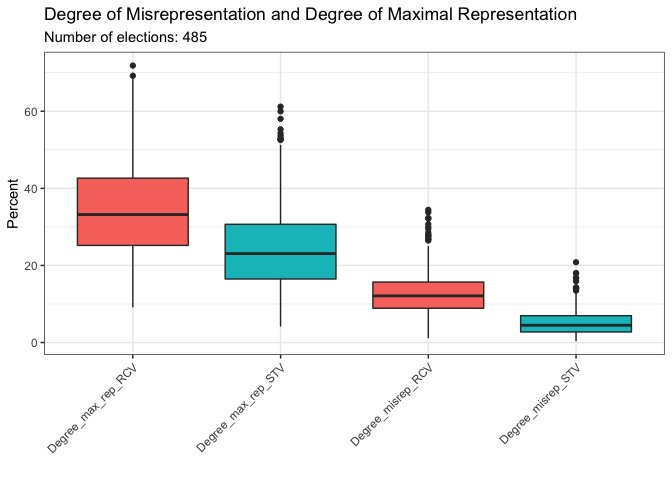
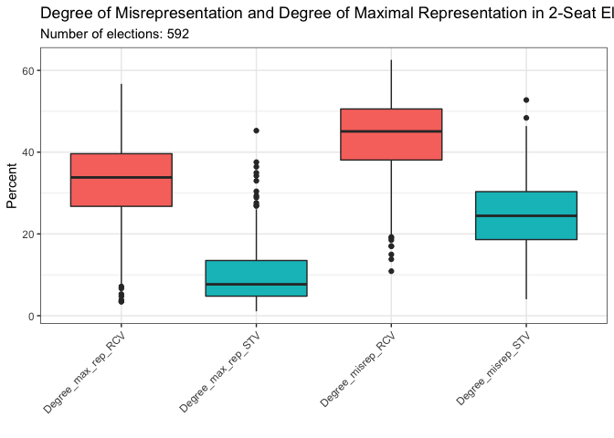
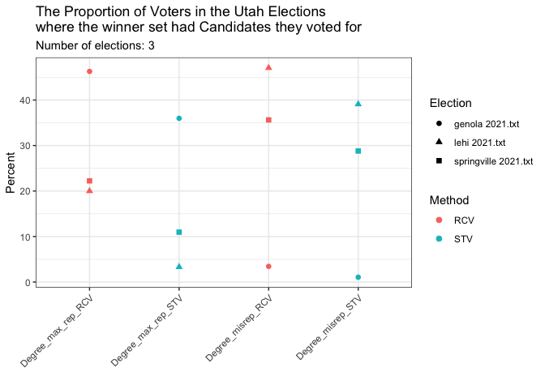

## Background

We have 1070 Scottish elections and 8 Utah elections that we analyzed using STV and sequential RCV.  We wanted to determine which method would result in more voters receiving at least one elected official they voted for.

## The data

This is our Scottish election data.


```r
data <- read_csv("sequential RCV data.csv", skip = 1, 
                 col_names = c("election","Cond_committee","STV_winners","RCV_winners", "prop_get_at_least_one_STV","prop_get_at_least_one_RCV", "Degree_max_rep_STV","Degree_max_rep_RCV","parties_STV","parties_RCV", "num_parties_STV","num_parties_RCV")) %>%
  mutate(Degree_misrep_STV = 1 - prop_get_at_least_one_STV,
         Degree_misrep_RCV = 1 - prop_get_at_least_one_RCV) %>%
  select(-prop_get_at_least_one_STV, -prop_get_at_least_one_RCV)
datatable(data)
```

```{=html}
<div id="htmlwidget-346b88219c7983c96f44" style="width:100%;height:auto;" class="datatables html-widget"></div>
<script type="application/json" data-for="htmlwidget-346b88219c7983c96f44">{"x":{"filter":"none","data":[["1","2","3","4","5","6","7","8","9","10","11","12","13","14","15","16","17","18","19","20","21","22","23","24","25","26","27","28","29","30","31","32","33","34","35","36","37","38","39","40","41","42","43","44","45","46","47","48","49","50","51","52","53","54","55","56","57","58","59","60","61","62","63","64","65","66","67","68","69","70","71","72","73","74","75","76","77","78","79","80","81","82","83","84","85","86","87","88","89","90","91","92","93","94","95","96","97","98","99","100","101","102","103","104","105","106","107","108","109","110","111","112","113","114","115","116","117","118","119","120","121","122","123","124","125","126","127","128","129","130","131","132","133","134","135","136","137","138","139","140","141","142","143","144","145","146","147","148","149","150","151","152","153","154","155","156","157","158","159","160","161","162","163","164","165","166","167","168","169","170","171","172","173","174","175","176","177","178","179","180","181","182","183","184","185","186","187","188","189","190","191","192","193","194","195","196","197","198","199","200","201","202","203","204","205","206","207","208","209","210","211","212","213","214","215","216","217","218","219","220","221","222","223","224","225","226","227","228","229","230","231","232","233","234","235","236","237","238","239","240","241","242","243","244","245","246","247","248","249","250","251","252","253","254","255","256","257","258","259","260","261","262","263","264","265","266","267","268","269","270","271","272","273","274","275","276","277","278","279","280","281","282","283","284","285","286","287","288","289","290","291","292","293","294","295","296","297","298","299","300","301","302","303","304","305","306","307","308","309","310","311","312","313","314","315","316","317","318","319","320","321","322","323","324","325","326","327","328","329","330","331","332","333","334","335","336","337","338","339","340","341","342","343","344","345","346","347","348","349","350","351","352","353","354","355","356","357","358","359","360","361","362","363","364","365","366","367","368","369","370","371","372","373","374","375","376","377","378","379","380","381","382","383","384","385","386","387","388","389","390","391","392","393","394","395","396","397","398","399","400","401","402","403","404","405","406","407","408","409","410","411","412","413","414","415","416","417","418","419","420","421","422","423","424","425","426","427","428","429","430","431","432","433","434","435","436","437","438","439","440","441","442","443","444","445","446","447","448","449","450","451","452","453","454","455","456","457","458","459","460","461","462","463","464","465","466","467","468","469","470","471","472","473","474","475","476","477","478","479","480","481","482","483","484","485","486","487","488","489","490","491","492","493","494","495","496","497","498","499","500","501","502","503","504","505","506","507","508","509","510","511","512","513","514","515","516","517","518","519","520","521","522","523","524","525","526","527","528","529","530","531","532","533","534","535","536","537","538","539","540","541","542","543","544","545","546","547","548","549","550","551","552","553","554","555","556","557","558","559","560","561","562","563","564","565","566","567","568","569","570","571","572","573","574","575","576","577","578","579","580","581","582","583","584","585","586","587","588","589","590","591","592","593","594","595","596","597","598","599","600","601","602","603","604","605","606","607","608","609","610","611","612","613","614","615","616","617","618","619","620","621","622","623","624","625","626","627","628","629","630","631","632","633","634","635","636","637","638","639","640","641","642","643","644","645","646","647","648","649","650","651","652","653","654","655","656","657","658","659","660","661","662","663","664","665","666","667","668","669","670","671","672","673","674","675","676","677","678","679","680","681","682","683","684","685","686","687","688","689","690","691","692","693","694","695","696","697","698","699","700","701","702","703","704","705","706","707","708","709","710","711","712","713","714","715","716","717","718","719","720","721","722","723","724","725","726","727","728","729","730","731","732","733","734","735","736","737","738","739","740","741","742","743","744","745","746","747","748","749","750","751","752","753","754","755","756","757","758","759","760","761","762","763","764","765","766","767","768","769","770","771","772","773","774","775","776","777","778","779","780","781","782","783","784","785","786","787","788","789","790","791","792","793","794","795","796","797","798","799","800","801","802","803","804","805","806","807","808","809","810","811","812","813","814","815","816","817","818","819","820","821","822","823","824","825","826","827","828","829","830","831","832","833","834","835","836","837","838","839","840","841","842","843","844","845","846","847","848","849","850","851","852","853","854","855","856","857","858","859","860","861","862","863","864","865","866","867","868","869","870","871","872","873","874","875","876","877","878","879","880","881","882","883","884","885","886","887","888","889","890","891","892","893","894","895","896","897","898","899","900","901","902","903","904","905","906","907","908","909","910","911","912","913","914","915","916","917","918","919","920","921","922","923","924","925","926","927","928","929","930","931","932","933","934","935","936","937","938","939","940","941","942","943","944","945","946","947","948","949","950","951","952","953","954","955","956","957","958","959","960","961","962","963","964","965","966","967","968","969","970","971","972","973","974","975","976","977","978","979","980","981","982","983","984","985","986","987","988","989","990","991","992","993","994","995","996","997","998","999","1000","1001","1002","1003","1004","1005","1006","1007","1008","1009","1010","1011","1012","1013","1014","1015","1016","1017","1018","1019","1020","1021","1022","1023","1024","1025","1026","1027","1028","1029","1030","1031","1032","1033","1034","1035","1036","1037","1038","1039","1040","1041","1042","1043","1044","1045","1046","1047","1048","1049","1050","1051","1052","1053","1054","1055","1056","1057","1058","1059","1060","1061","1062","1063","1064","1065","1066","1067","1068","1069","1070"],["dumgal17-ballots/dumgal17-03.blt","dumgal17-ballots/dumgal17-02.blt","dumgal17-ballots/dumgal17-01.blt","dumgal17-ballots/dumgal17-11.blt","dumgal17-ballots/dumgal17-05.blt","dumgal17-ballots/dumgal17-04.blt","dumgal17-ballots/dumgal17-10.blt","dumgal17-ballots/dumgal17-06.blt","dumgal17-ballots/dumgal17-12.blt","dumgal17-ballots/dumgal17-07.blt","dumgal17-ballots/dumgal17-09.blt","dumgal17-ballots/dumgal17-08.blt","w-lothian17-ballots/w-lothian17-06.blt","w-lothian17-ballots/w-lothian17-07.blt","w-lothian17-ballots/w-lothian17-05.blt","w-lothian17-ballots/w-lothian17-04.blt","w-lothian17-ballots/w-lothian17-01.blt","w-lothian17-ballots/w-lothian17-03.blt","w-lothian17-ballots/w-lothian17-02.blt","w-lothian17-ballots/w-lothian17-09.blt","w-lothian17-ballots/w-lothian17-08.blt","glasgow12/glasgow12-07-recalc.blt","glasgow12/glasgow12-08.blt","glasgow12/glasgow12-20.blt","glasgow12/glasgow12-21.blt","glasgow12/glasgow12-09.blt","glasgow12/glasgow12-19.blt","glasgow12/glasgow12-18.blt","glasgow12/glasgow12-15.blt","glasgow12/glasgow12-01.blt","glasgow12/glasgow12-14.blt","glasgow12/glasgow12-02.blt","glasgow12/glasgow12-16.blt","glasgow12/glasgow12-17.blt","glasgow12/glasgow12-03.blt","glasgow12/glasgow12-13.blt","glasgow12/glasgow12-12.blt","glasgow12/glasgow12-06.blt","glasgow12/glasgow12-10.blt","glasgow12/glasgow12-04.blt","glasgow12/glasgow12-05.blt","glasgow12/glasgow12-11.blt","w-duns12-ballots/w-duns12-01.blt","w-duns12-ballots/w-duns12-03.blt","w-duns12-ballots/w-duns12-02.blt","w-duns12-ballots/w-duns12-06.blt","w-duns12-ballots/w-duns12-05.blt","w-duns12-ballots/w-duns12-04.blt","stirling12-ballots/stirling12-05.blt","stirling12-ballots/stirling12-04.blt","stirling12-ballots/stirling12-06.blt","stirling12-ballots/stirling12-07.blt","stirling12-ballots/stirling12-03.blt","stirling12-ballots/stirling12-02.blt","stirling12-ballots/stirling12-01.blt","glasgow2007 preflib/greater pollok.txt","glasgow2007 preflib/craigton.txt","glasgow2007 preflib/maryhill.txt","glasgow2007 preflib/baillieston.txt","glasgow2007 preflib/north east.txt","glasgow2007 preflib/linn.txt","glasgow2007 preflib/garscadden.txt","glasgow2007 preflib/govan.txt","glasgow2007 preflib/newlands.txt","glasgow2007 preflib/eastcentre.txt","glasgow2007 preflib/calton.txt","glasgow2007 preflib/langside.txt","glasgow2007 preflib/drumchapel.txt","glasgow2007 preflib/partick.txt","glasgow2007 preflib/hillhead.txt","glasgow2007 preflib/shettleston.txt","glasgow2007 preflib/canal.txt","glasgow2007 preflib/anderston.txt","glasgow2007 preflib/pollokshields.txt","glasgow2007 preflib/southsidecentral.txt","glasgow2007 preflib/springburn.txt","fife12-ballots/fife12-04.blt","fife12-ballots/fife12-10.blt","fife12-ballots/fife12-11.blt","fife12-ballots/fife12-05.blt","fife12-ballots/fife12-13.blt","fife12-ballots/fife12-07.blt","fife12-ballots/fife12-06.blt","fife12-ballots/fife12-12.blt","fife12-ballots/fife12-16.blt","fife12-ballots/fife12-02.blt","fife12-ballots/fife12-03.blt","fife12-ballots/fife12-17.blt","fife12-ballots/fife12-01.blt","fife12-ballots/fife12-15.blt","fife12-ballots/fife12-14.blt","fife12-ballots/fife12-19.blt","fife12-ballots/fife12-18.blt","fife12-ballots/fife12-23.blt","fife12-ballots/fife12-22.blt","fife12-ballots/fife12-20.blt","fife12-ballots/fife12-08.blt","fife12-ballots/fife12-09.blt","fife12-ballots/fife12-21.blt","e-lothian12-ballots/e-lothian12-05.blt","e-lothian12-ballots/e-lothian12-04.blt","e-lothian12-ballots/e-lothian12-06.blt","e-lothian12-ballots/e-lothian12-07.blt","e-lothian12-ballots/e-lothian12-03.blt","e-lothian12-ballots/e-lothian12-02.blt","e-lothian12-ballots/e-lothian12-01.blt","e-renfs17-ballots/e-renfs17-1.blt","e-renfs17-ballots/e-renfs17-2.blt","e-renfs17-ballots/e-renfs17-3.blt","e-renfs17-ballots/e-renfs17-4.blt","e-renfs17-ballots/e-renfs17-5.blt","moray22/file141902.txt","moray22/file141915.txt","moray22/file141913.txt","moray22/file141922.txt","moray22/file141894.txt","moray22/file141896.txt","moray22/file141884.txt","eilean-siar22/ward09_preferenceprofile.txt","eilean-siar22/ward_05_preferenceprofile.txt","eilean-siar22/ward_03_preferenceprofile.txt","eilean-siar22/ward07_preferenceprofile.txt","eilean-siar22/ward08_preferenceprofile.txt","eilean-siar22/ward_04_preferenceprofile.txt","eilean-siar22/ward02_preferenceprofile.txt","eilean-siar22/ward10_preferenceprofile.txt","glasgow22/Ward5.blt","glasgow22/Ward18.blt","glasgow22/Ward19.blt","glasgow22/Ward4.blt","glasgow22/Ward6.blt","glasgow22/Ward7.blt","glasgow22/Ward3.blt","glasgow22/Ward22.blt","glasgow22/Ward23.blt","glasgow22/Ward2.blt","glasgow22/Ward21.blt","glasgow22/Ward20.blt","glasgow22/Ward1.blt","glasgow22/Ward11.blt","glasgow22/Ward10.blt","glasgow22/Ward12.blt","glasgow22/Ward13.blt","glasgow22/Ward17.blt","glasgow22/Ward16.blt","glasgow22/Ward9.blt","glasgow22/Ward14.blt","glasgow22/Ward15.blt","glasgow22/Ward8.blt","aberdeenshire12-ballots/aberdeenshire12-18.blt","aberdeenshire12-ballots/aberdeenshire12-19.blt","aberdeenshire12-ballots/aberdeenshire12-09.blt","aberdeenshire12-ballots/aberdeenshire12-08.blt","aberdeenshire12-ballots/aberdeenshire12-11.blt","aberdeenshire12-ballots/aberdeenshire12-05.blt","aberdeenshire12-ballots/aberdeenshire12-04.blt","aberdeenshire12-ballots/aberdeenshire12-10.blt","aberdeenshire12-ballots/aberdeenshire12-06.blt","aberdeenshire12-ballots/aberdeenshire12-12.blt","aberdeenshire12-ballots/aberdeenshire12-13.blt","aberdeenshire12-ballots/aberdeenshire12-07.blt","aberdeenshire12-ballots/aberdeenshire12-03.blt","aberdeenshire12-ballots/aberdeenshire12-17.blt","aberdeenshire12-ballots/aberdeenshire12-16.blt","aberdeenshire12-ballots/aberdeenshire12-02.blt","aberdeenshire12-ballots/aberdeenshire12-14.blt","aberdeenshire12-ballots/aberdeenshire12-01.blt","aberdeenshire12-ballots/aberdeenshire12-15.blt","sc-borders22/Ward_10___Preference.csv","sc-borders22/Ward_4___Preference.csv","sc-borders22/Ward_11___Preference.csv","sc-borders22/Ward_5___Preference.csv","sc-borders22/Ward_9___Preference.csv","sc-borders22/Ward_1___Tweeddale_West___Preferene.csv","sc-borders22/Ward_2___Tweeddale_East___Preference.csv","sc-borders22/Ward_8___Preference.csv","sc-borders22/Ward_7___Preference.csv","sc-borders22/Ward_6__Preference.csv","sc-borders22/Ward_3___Preferences.csv","inverclyde17-ballots/inverclyde17-06.blt","inverclyde17-ballots/inverclyde17-07.blt","inverclyde17-ballots/inverclyde17-05.blt","inverclyde17-ballots/inverclyde17-04.blt","inverclyde17-ballots/inverclyde17-01.blt","inverclyde17-ballots/inverclyde17-03.blt","inverclyde17-ballots/inverclyde17-02.blt","orkney12-ballots/orkney12-05.blt","orkney12-ballots/orkney12-04.blt","orkney12-ballots/orkney12-06.blt","orkney12-ballots/orkney12-03.blt","orkney12-ballots/orkney12-02.blt","orkney12-ballots/orkney12-01.blt","e-lothian22/Ward5.blt","e-lothian22/Ward4.blt","e-lothian22/Ward6.blt","e-lothian22/Ward3.blt","e-lothian22/Ward2.blt","e-lothian22/Ward1.blt","s-ayrshire12-ballots/s-ayrshire12-08.blt","s-ayrshire12-ballots/s-ayrshire12-07.blt","s-ayrshire12-ballots/s-ayrshire12-06.blt","s-ayrshire12-ballots/s-ayrshire12-04.blt","s-ayrshire12-ballots/s-ayrshire12-05.blt","s-ayrshire12-ballots/s-ayrshire12-01.blt","s-ayrshire12-ballots/s-ayrshire12-02.blt","s-ayrshire12-ballots/s-ayrshire12-03.blt","e-duns17-ballots/e-duns17-03.blt","e-duns17-ballots/e-duns17-02.blt","e-duns17-ballots/e-duns17-01.blt","e-duns17-ballots/e-duns17-05.blt","e-duns17-ballots/e-duns17-04.blt","e-duns17-ballots/e-duns17-06.blt","e-duns17-ballots/e-duns17-07.blt","angus17-ballots/angus17-08.blt","angus17-ballots/angus17-02.blt","angus17-ballots/angus17-03.blt","angus17-ballots/angus17-01.blt","angus17-ballots/angus17-04.blt","angus17-ballots/angus17-05.blt","angus17-ballots/angus17-07.blt","angus17-ballots/angus17-06.blt","midlothian22/ward_5_midlothian_east_preference_profile_open_from_within_ms_word_or_similar.blt","midlothian22/ward_1_penicuik_preference_profile_open_from_within_ms_word_or_similar.blt","midlothian22/ward_3_dalkeith_preference_profile_open_from_within_ms_word_or_similar.blt","midlothian22/ward_2_bonnyrigg_preference_profile_open_from_within_ms_word_or_similar.blt","midlothian22/ward_4_midlothian_west_preference_profile_open_from_within_ms_word_or_similar.blt","midlothian22/ward_6_midlothian_south_dalkeith_preference_profile_open_from_within_ms_word_or_similar.blt","moray12-ballots/moray12-02.blt","moray12-ballots/moray12-03.blt","moray12-ballots/moray12-01.blt","moray12-ballots/moray12-04.blt","moray12-ballots/moray12-05.blt","moray12-ballots/moray12-07.blt","moray12-ballots/moray12-06.blt","moray12-ballots/moray12-08.blt","clackmannanshire12-ballots/clacks12-03.blt","clackmannanshire12-ballots/clacks12-02.blt","clackmannanshire12-ballots/clacks12-01.blt","clackmannanshire12-ballots/clacks12-05.blt","clackmannanshire12-ballots/clacks12-04.blt","n-ayrshire22/Preference-Profile-North-Coast_copy.csv","n-ayrshire22/Preference-Profile-Irvine-West_copy.csv","n-ayrshire22/Preference-Profile-Irvine-East_copy.csv","n-ayrshire22/Preference-Profile-Garnock-Valley_copy.csv","n-ayrshire22/Preference-Profile-Kilwinning_copy.csv","n-ayrshire22/Preference-Profile-Irvine-South_copy.csv","n-ayrshire22/Preference-Profile-Ardrossan_copy.csv","n-ayrshire22/Preference-Profile-Saltcoats-and-Stevenston_copy.csv","highland17-ballots/highland17-18.blt","highland17-ballots/highland17-19.blt","highland17-ballots/highland17-09.blt","highland17-ballots/highland17-21.blt","highland17-ballots/highland17-20.blt","highland17-ballots/highland17-08.blt","highland17-ballots/highland17-12.blt","highland17-ballots/highland17-06.blt","highland17-ballots/highland17-07.blt","highland17-ballots/highland17-13.blt","highland17-ballots/highland17-05.blt","highland17-ballots/highland17-11.blt","highland17-ballots/highland17-10.blt","highland17-ballots/highland17-04.blt","highland17-ballots/highland17-14.blt","highland17-ballots/highland17-15.blt","highland17-ballots/highland17-01.blt","highland17-ballots/highland17-17.blt","highland17-ballots/highland17-03.blt","highland17-ballots/highland17-02.blt","highland17-ballots/highland17-16.blt","s-lanarks17-ballots/s-lanarks17-14.blt","s-lanarks17-ballots/s-lanarks17-15.blt","s-lanarks17-ballots/s-lanarks17-01.blt","s-lanarks17-ballots/s-lanarks17-17.blt","s-lanarks17-ballots/s-lanarks17-03.blt","s-lanarks17-ballots/s-lanarks17-02.blt","s-lanarks17-ballots/s-lanarks17-16.blt","s-lanarks17-ballots/s-lanarks17-12.blt","s-lanarks17-ballots/s-lanarks17-06.blt","s-lanarks17-ballots/s-lanarks17-07.blt","s-lanarks17-ballots/s-lanarks17-13.blt","s-lanarks17-ballots/s-lanarks17-05.blt","s-lanarks17-ballots/s-lanarks17-11.blt","s-lanarks17-ballots/s-lanarks17-10.blt","s-lanarks17-ballots/s-lanarks17-04.blt","s-lanarks17-ballots/s-lanarks17-09.blt","s-lanarks17-ballots/s-lanarks17-08.blt","s-lanarks17-ballots/s-lanarks17-20.blt","s-lanarks17-ballots/s-lanarks17-18.blt","s-lanarks17-ballots/s-lanarks17-19.blt","eilean-siar12-ballots/eilean-siar12-02.blt","eilean-siar12-ballots/eilean-siar12-03.blt","eilean-siar12-ballots/eilean-siar12-01.blt","eilean-siar12-ballots/eilean-siar12-04.blt","eilean-siar12-ballots/eilean-siar12-05.blt","eilean-siar12-ballots/eilean-siar12-07.blt","eilean-siar12-ballots/eilean-siar12-06.blt","eilean-siar12-ballots/eilean-siar12-08.blt","eilean-siar12-ballots/eilean-siar12-09.blt","e-ayrshire17-ballots/e-ayrshire17-09.blt","e-ayrshire17-ballots/e-ayrshire17-08.blt","e-ayrshire17-ballots/e-ayrshire17-01.blt","e-ayrshire17-ballots/e-ayrshire17-03.blt","e-ayrshire17-ballots/e-ayrshire17-02.blt","e-ayrshire17-ballots/e-ayrshire17-06.blt","e-ayrshire17-ballots/e-ayrshire17-07.blt","e-ayrshire17-ballots/e-ayrshire17-05.blt","e-ayrshire17-ballots/e-ayrshire17-04.blt","angus22/ward8.txt","angus22/ward7.txt","angus22/ward6.txt","angus22/ward4.txt","angus22/ward5.txt","angus22/ward1.txt","angus22/ward2.txt","angus22/ward3.txt","w-lothian22/PreferenceProfile_V0001_Ward-6---Fauldhouse-and-the-Breich-Valley_06052022_160234.csv","w-lothian22/PreferenceProfile_V0001_Ward-5---East-Livingston-and-East-Calder_06052022_160233.csv","w-lothian22/PreferenceProfile_V0001_Ward-4---Livingston-South_06052022_160228.csv","w-lothian22/PreferenceProfile_V0001_Ward-9---Armadale-and-Blackridge_06052022_160235.csv","w-lothian22/PreferenceProfile_V0001_Ward-1---Linlithgow_06052022_160231.csv","w-lothian22/PreferenceProfile_V0001_Ward-8---Bathgate_06052022_160235.csv","w-lothian22/PreferenceProfile_V0001_Ward-3---Livingston-North_06052022_160234.csv","w-lothian22/PreferenceProfile_V0001_Ward-7---Whitburn-and-Blackburn_06052022_160234.csv","w-lothian22/PreferenceProfile_V0001_Ward-2---Broxburn-Uphall-and-Winchburgh_06052022_160218.csv","renfs12-ballots/renfs12-02.blt","renfs12-ballots/renfs12-03.blt","renfs12-ballots/renfs12-01.blt","renfs12-ballots/renfs12-10.blt","renfs12-ballots/renfs12-04.blt","renfs12-ballots/renfs12-05.blt","renfs12-ballots/renfs12-11.blt","renfs12-ballots/renfs12-07.blt","renfs12-ballots/renfs12-06.blt","renfs12-ballots/renfs12-08.blt","renfs12-ballots/renfs12-09.blt","perth-kinross12-ballots/perth-kinross12-08.blt","perth-kinross12-ballots/perth-kinross12-09.blt","perth-kinross12-ballots/perth-kinross12-07.blt","perth-kinross12-ballots/perth-kinross12-12.blt","perth-kinross12-ballots/perth-kinross12-06.blt","perth-kinross12-ballots/perth-kinross12-10.blt","perth-kinross12-ballots/perth-kinross12-04.blt","perth-kinross12-ballots/perth-kinross12-05.blt","perth-kinross12-ballots/perth-kinross12-11.blt","perth-kinross12-ballots/perth-kinross12-01.blt","perth-kinross12-ballots/perth-kinross12-02.blt","perth-kinross12-ballots/perth-kinross12-03.blt","renfs22/Preference_profile_for_Ward_2_Renfrew_South_and_Gallowhill_copy.csv","renfs22/Preference_profile_for_Ward_9_Johnstone_North_Kilbarchan_Howwood_and_Lochwinnoch_copy.csv","renfs22/Preference_profile_for_Ward_12_Erskine_and_Inchinnan_copy.csv","renfs22/Preference_profile_for_Ward_11_Bishopton_Bridge_of_Weir_and_Langbank_copy.csv","renfs22/Preference_profile_for_Ward_10_Houston_Crosslee_and_Linwood_copy.csv","renfs22/Preference_profile_for_Ward_6_Paisley_Southeast_copy.csv","renfs22/Preference_profile_for_Ward_5_Paisley_East_and_Central_copy.csv","renfs22/Preference_profile_for_Ward_4_Paisley_Northwest_copy.csv","renfs22/Preference_profile_for_Ward_8_Johnstone_South_and_Elderslie_copy.csv","renfs22/Preference_profile_for_Ward_7_Paisley_Southwest_copy.csv","argyll-bute17-ballots/argyll-bute17-09.blt","argyll-bute17-ballots/argyll-bute17-08.blt","argyll-bute17-ballots/argyll-bute17-03.blt","argyll-bute17-ballots/argyll-bute17-02.blt","argyll-bute17-ballots/argyll-bute17-06.blt","argyll-bute17-ballots/argyll-bute17-07.blt","argyll-bute17-ballots/argyll-bute17-05.blt","argyll-bute17-ballots/argyll-bute17-11.blt","argyll-bute17-ballots/argyll-bute17-10.blt","argyll-bute17-ballots/argyll-bute17-04.blt","shetland17/shetland17-07.blt","shetland17/shetland17-06.blt","shetland17/shetland17-04.blt","shetland17/shetland17-01.blt","shetland17/shetland17-02.blt","shetland17/shetland17-03.blt","n-ayrshire17-ballots/n-ayrshire17-05.blt","n-ayrshire17-ballots/n-ayrshire17-10.blt","n-ayrshire17-ballots/n-ayrshire17-04.blt","n-ayrshire17-ballots/n-ayrshire17-06.blt","n-ayrshire17-ballots/n-ayrshire17-07.blt","n-ayrshire17-ballots/n-ayrshire17-03.blt","n-ayrshire17-ballots/n-ayrshire17-02.blt","n-ayrshire17-ballots/n-ayrshire17-01.blt","n-ayrshire17-ballots/n-ayrshire17-09.blt","n-ayrshire17-ballots/n-ayrshire17-08.blt","aberdeenshire22/preferenceprofile_v0001_ward-11-inverurie-and-district_06052022_172124.csv","aberdeenshire22/preferenceprofile_v0001_ward-3-fraserburgh-and-district_06052022_172124.csv","aberdeenshire22/preferenceprofile_v0001_ward-19-mearns_06052022_172124.csv","aberdeenshire22/preferenceprofile_v0001_ward-8-mid-formartine_06052022_172123.csv","aberdeenshire22/preferenceprofile_v0001_ward-5-peterhead-north-and-rattray_06052022_172118.csv","aberdeenshire22/preferenceprofile_v0001_ward-12-east-garioch_06052022_172124.csv","aberdeenshire22/preferenceprofile_v0001_ward-4-central-buchan_06052022_172124.csv","aberdeenshire22/preferenceprofile_v0001_ward-9-ellon-and-district_06052022_172124.csv","aberdeenshire22/preferenceprofile_v0001_ward-14-huntly-strathbogie-and-howe-of-alford_06052022_172124.csv","aberdeenshire22/ward1.csv","aberdeenshire22/preferenceprofile_v0001_ward-6-peterhead-south-and-cruden_06052022_172115.csv","aberdeenshire22/preferenceprofile_v0001_ward-7-turriff-and-district_06052022_172118.csv","aberdeenshire22/preferenceprofile_v0001_ward-10-west-garioch_06052022_172124.csv","aberdeenshire22/preferenceprofile_v0001_ward-18-stonehaven-and-lower-deeside_06052022_172124.csv","aberdeenshire22/preferenceprofile_v0001_ward-15-aboyne-upper-deeside-and-donside_06052022_172124.csv","aberdeenshire22/preferenceprofile_v0001_ward-13-westhill-and-district_06052022_172124.csv","aberdeenshire22/preferenceprofile_v0001_ward-2-troup_06052022_172123.csv","aberdeenshire22/preferenceprofile_v0001_ward-17-north-kincardine_06052022_172124.csv","aberdeenshire22/preferenceprofile_v0001_ward-16-banchory-and-mid-deeside_06052022_172124.csv","edinburgh22/ward5.blt","edinburgh22/ward4.blt","edinburgh22/ward6.blt","edinburgh22/ward7.blt","edinburgh22/ward3.blt","edinburgh22/ward2.blt","edinburgh22/ward1.blt","edinburgh22/ward11.blt","edinburgh22/ward10.blt","edinburgh22/ward12.blt","edinburgh22/ward13.blt","edinburgh22/ward17.blt","edinburgh22/ward16.blt","edinburgh22/ward9.blt","edinburgh22/ward14.blt","edinburgh22/ward15.blt","edinburgh22/ward8.blt","perth-kinross22/Ward4.csv","perth-kinross22/Ward5.csv","perth-kinross22/Ward7.csv","perth-kinross22/Ward6.csv","perth-kinross22/Ward2.csv","perth-kinross22/Ward3.csv","perth-kinross22/Ward1.csv","perth-kinross22/Ward10.csv","perth-kinross22/Ward11.csv","perth-kinross22/Ward12.csv","perth-kinross22/Ward8.csv","perth-kinross22/Ward9.csv","falkirk17-ballots/falkirk17-01.blt","falkirk17-ballots/falkirk17-02.blt","falkirk17-ballots/falkirk17-03.blt","falkirk17-ballots/falkirk17-07.blt","falkirk17-ballots/falkirk17-06.blt","falkirk17-ballots/falkirk17-04.blt","falkirk17-ballots/falkirk17-05.blt","falkirk17-ballots/falkirk17-08.blt","falkirk17-ballots/falkirk17-09.blt","n-lanarks17-ballots/n-lanarks17-018.blt","n-lanarks17-ballots/n-lanarks17-019.blt","n-lanarks17-ballots/n-lanarks17-009.blt","n-lanarks17-ballots/n-lanarks17-021.blt","n-lanarks17-ballots/n-lanarks17-020.blt","n-lanarks17-ballots/n-lanarks17-008.blt","n-lanarks17-ballots/n-lanarks17-005.blt","n-lanarks17-ballots/n-lanarks17-011.blt","n-lanarks17-ballots/n-lanarks17-010.blt","n-lanarks17-ballots/n-lanarks17-004.blt","n-lanarks17-ballots/n-lanarks17-012.blt","n-lanarks17-ballots/n-lanarks17-006.blt","n-lanarks17-ballots/n-lanarks17-007.blt","n-lanarks17-ballots/n-lanarks17-013.blt","n-lanarks17-ballots/n-lanarks17-017.blt","n-lanarks17-ballots/n-lanarks17-003.blt","n-lanarks17-ballots/n-lanarks17-002.blt","n-lanarks17-ballots/n-lanarks17-016.blt","n-lanarks17-ballots/n-lanarks17-014.blt","n-lanarks17-ballots/n-lanarks17-015.blt","n-lanarks17-ballots/n-lanarks17-001.blt","highland22/PreferenceProfile_V0001_Culloden_and_Ardersier_06052022_161539.blt","highland22/PreferenceProfile_V0001_North_West_and_Central_Sutherland_06052022_161534.blt","highland22/PreferenceProfile_V0001_Black_Isle_06052022_161539.blt","highland22/PreferenceProfile_V0001_Inverness_South_06052022_161540.blt","highland22/PreferenceProfile_V0001_Inverness_West_06052022_161539.blt","highland22/PreferenceProfile_V0001_Fort_William_and_Ardnamurchan_06052022_161540.blt","highland22/PreferenceProfile_V0001_Aird_and_Loch_Ness_06052022_161539.blt","highland22/PreferenceProfile_V0001_Thurso_and_Northwest_Caithness_06052022_161528.blt","highland22/PreferenceProfile_V0001_East_Sutherland_and_Edderton_06052022_161530.blt","highland22/PreferenceProfile_V0001_Badenoch_and_Strathspey_06052022_161540.blt","highland22/PreferenceProfile_V0001_Nairn_and_Cawdor_06052022_161539.blt","highland22/PreferenceProfile_V0001_Wester_Ross_Strathpeffer_and_Lochalsh_06052022_161539.blt","highland22/PreferenceProfile_V0001_Inverness_Millburn_06052022_161539.blt","highland22/PreferenceProfile_V0001_Cromarty_Firth_06052022_161538.blt","highland22/PreferenceProfile_V0001_Inverness_Central_06052022_161539.blt","highland22/PreferenceProfile_V0001_Wick_and_East_Caithness_06052022_161532.blt","highland22/PreferenceProfile_V0001_Dingwall_and_Seaforth_06052022_161539.blt","highland22/PreferenceProfile_V0001_Eilean_a__Che___06052022_161539.blt","highland22/PreferenceProfile_V0001_Tain_and_Easter_Ross_06052022_161537.blt","highland22/PreferenceProfile_V0001_Inverness_Ness_side_06052022_161539.blt","edinburgh12-ballots/edinburgh12-09.blt","edinburgh12-ballots/edinburgh12-08.blt","edinburgh12-ballots/edinburgh12-03.blt","edinburgh12-ballots/edinburgh12-17.blt","edinburgh12-ballots/edinburgh12-16.blt","edinburgh12-ballots/edinburgh12-02.blt","edinburgh12-ballots/edinburgh12-14.blt","edinburgh12-ballots/edinburgh12-01.blt","edinburgh12-ballots/edinburgh12-15.blt","edinburgh12-ballots/edinburgh12-11.blt","edinburgh12-ballots/edinburgh12-05.blt","edinburgh12-ballots/edinburgh12-04.blt","edinburgh12-ballots/edinburgh12-10.blt","edinburgh12-ballots/edinburgh12-06.blt","edinburgh12-ballots/edinburgh12-12.blt","edinburgh12-ballots/edinburgh12-13.blt","edinburgh12-ballots/edinburgh12-07.blt","midlothian12-ballots/midlothian12-05_cleaned.csv","midlothian12-ballots/midlothian12-06_cleaned.csv","midlothian12-ballots/midlothian12-03_cleaned.csv","midlothian12-ballots/midlothian12-04_cleaned.csv","midlothian12-ballots/midlothian12-01_cleaned.csv","midlothian12-ballots/midlothian12-02_cleaned.csv","e-duns22-ballots/ward4.csv","e-duns22-ballots/ward5.csv","e-duns22-ballots/ward7.csv","e-duns22-ballots/ward6.csv","e-duns22-ballots/ward2.csv","e-duns22-ballots/ward3.csv","e-duns22-ballots/ward1.csv","dundee12-ballots/dundee12-05.blt","dundee12-ballots/dundee12-04.blt","dundee12-ballots/dundee12-06.blt","dundee12-ballots/dundee12-07.blt","dundee12-ballots/dundee12-03.blt","dundee12-ballots/dundee12-02.blt","dundee12-ballots/dundee12-01.blt","dundee12-ballots/dundee12-08.blt","dundee22/Ward5.blt","dundee22/Ward4.blt","dundee22/Ward6.blt","dundee22/Ward7.blt","dundee22/Ward3.blt","dundee22/Ward2.blt","dundee22/Ward1.blt","dundee22/Ward8.blt","stirling22/preferenceprofile_v0001_ward-6-stirling-east_06052022_124253.blt","stirling22/preferenceprofile_v0001_ward-3-dunblane-and-bridge-of-allan_06052022_124253.blt","stirling22/preferenceprofile_v0001_ward-4-stirling-north_06052022_124253.blt","stirling22/preferenceprofile_v0001_ward-7-bannockburn_06052022_124254.blt","stirling22/preferenceprofile_v0001_ward-1-trossachs-and-teith_06052022_124254.blt","stirling22/preferenceprofile_v0001_ward-2-forth-and-endrick_06052022_124253.blt","stirling22/preferenceprofile_v0001_ward-5-stirling-west_06052022_124253.blt","s-lanarks22/ward_18_hamilton_west_and_earnock_preference_profile.txt","s-lanarks22/ward_12_rutherglen_central_and_north_preference_profile.txt","s-lanarks22/ward_19_hamilton_south_preference_profile.txt","s-lanarks22/ward_20_larkhall_preference_profile.txt","s-lanarks22/ward_2_clydesdale_north_preference_profile.txt","s-lanarks22/ward_1_clydesdale_west_preference_profile.txt","s-lanarks22/ward_3_clydesdale_east_preference_profile.txt","s-lanarks22/ward_14_cambuslang_east_preference_profile.txt","s-lanarks22/ward_10_east_kilbride_east_preference_profile.txt","s-lanarks22/ward_5_avondale_and_stonehouse_preference_profile.txt","s-lanarks22/ward_13_cambuslang_west_preference_profile.txt","s-lanarks22/ward_11_rutherglen_south_preference_profile.txt","s-lanarks22/ward_16_bothwell_and_uddingston_preference_profile.txt","s-lanarks22/ward_15_blantyre_preference_profile.txt","s-lanarks22/ward_4_clydesdale_south_preference_profile.txt","s-lanarks22/ward_9_east_kilbride_west_preference_profile.txt","s-lanarks22/ward_17_hamilton_north_and_east_preference_profile.txt","s-lanarks22/ward_6_east_kilbride_south_preference_profile.txt","s-lanarks22/ward_8_east_kilbride_central_north_preference_profile.txt","s-lanarks22/ward_7_east_kilbride_central_south_preference_profile.txt","aberdeen2017/aberdeen17-08.blt","aberdeen2017/aberdeen17-09.blt","aberdeen2017/aberdeen17-02.blt","aberdeen2017/aberdeen17-03.blt","aberdeen2017/aberdeen17-01.blt","aberdeen2017/aberdeen17-04.blt","aberdeen2017/aberdeen17-10.blt","aberdeen2017/aberdeen17-11.blt","aberdeen2017/aberdeen17-05.blt","aberdeen2017/aberdeen17-13.blt","aberdeen2017/aberdeen17-07.blt","aberdeen2017/aberdeen17-06.blt","aberdeen2017/aberdeen17-12.blt","sc-borders12-ballots/sc-borders12-09.blt","sc-borders12-ballots/sc-borders12-08.blt","sc-borders12-ballots/sc-borders12-06.blt","sc-borders12-ballots/sc-borders12-07.blt","sc-borders12-ballots/sc-borders12-11.blt","sc-borders12-ballots/sc-borders12-05.blt","sc-borders12-ballots/sc-borders12-04.blt","sc-borders12-ballots/sc-borders12-10.blt","sc-borders12-ballots/sc-borders12-01.blt","sc-borders12-ballots/sc-borders12-03.blt","sc-borders12-ballots/sc-borders12-02.blt","argyll22/ward4.csv","argyll22/ward5.csv","argyll22/ward7.csv","argyll22/ward6.csv","argyll22/ward2.csv","argyll22/ward3.csv","argyll22/ward1.csv","argyll22/ward10.csv","argyll22/ward11.csv","argyll22/ward8.csv","argyll22/ward9.csv","orkney22/ward5.blt","orkney22/ward4.blt","orkney22/ward6.blt","orkney22/ward3.blt","orkney22/ward2.blt","orkney22/ward1.blt","n-lanarks22/Preference Profile Ward 21 Wishaw.csv","n-lanarks22/Preference Profile Ward 11 Coatbridge South.csv","n-lanarks22/Preference Profile Ward 5 Stepps, Chryston and Muirhead.csv","n-lanarks22/Preference Profile WArd 4 Cumbernauld East.csv","n-lanarks22/Preference Profile Ward 3 Cumbernauld South.csv","n-lanarks22/Preference Profile WArd 7 Coatbridge North.csv","n-lanarks22/Preference Profile Ward 17 Motherwell West.csv","n-lanarks22/Preference Profile Ward 8 Airdrie North.csv","n-lanarks22/Preference Profile Ward 18 Motherwell North.csv","n-lanarks22/Preference Profile Ward 1 Kilsyth.csv","n-lanarks22/Preference Profile Ward 13 Fortissat.csv","n-lanarks22/Preference Profile Ward 16 Mossend and Holytown.csv","n-lanarks22/Preference Profile WArd 14 Thorniewood.csv","n-lanarks22/Preference Profile WArd 9 Airdrie Central.csv","n-lanarks22/Preference Profile Ward 6 Gartcosh, Glenboig and Moodiesburn.csv","n-lanarks22/Preference Profile Ward 20 Murdostoun.csv","n-lanarks22/Preference Profile Ward 12 Airdrie South.csv","n-lanarks22/Preference Profile WArd 15 Bellshill.csv","n-lanarks22/Preference Profile Ward 19 Motherwell South East and Ravenscraig.csv","n-lanarks22/Preference Profile Ward 10 Coatbridge West.csv","n-lanarks22/Preference Profile Ward 2 Cumbernauld North.csv","sc-borders17/sc-borders17-03.blt","sc-borders17/sc-borders17-02.blt","sc-borders17/sc-borders17-01.blt","sc-borders17/sc-borders17-05.blt","sc-borders17/sc-borders17-11.blt","sc-borders17/sc-borders17-10.blt","sc-borders17/sc-borders17-04.blt","sc-borders17/sc-borders17-06.blt","sc-borders17/sc-borders17-07.blt","sc-borders17/sc-borders17-09.blt","sc-borders17/sc-borders17-08.blt","dundee17-ballots/dundee17-08.blt","dundee17-ballots/dundee17-01.blt","dundee17-ballots/dundee17-03.blt","dundee17-ballots/dundee17-02.blt","dundee17-ballots/dundee17-06.blt","dundee17-ballots/dundee17-07.blt","dundee17-ballots/dundee17-05.blt","dundee17-ballots/dundee17-04.blt","edinburgh17-ballots/edinburgh17-12.blt","edinburgh17-ballots/edinburgh17-06.blt","edinburgh17-ballots/edinburgh17-07.blt","edinburgh17-ballots/edinburgh17-13.blt","edinburgh17-ballots/edinburgh17-05.blt","edinburgh17-ballots/edinburgh17-11.blt","edinburgh17-ballots/edinburgh17-10.blt","edinburgh17-ballots/edinburgh17-04.blt","edinburgh17-ballots/edinburgh17-14.blt","edinburgh17-ballots/edinburgh17-15.blt","edinburgh17-ballots/edinburgh17-01.blt","edinburgh17-ballots/edinburgh17-17.blt","edinburgh17-ballots/edinburgh17-03.blt","edinburgh17-ballots/edinburgh17-02.blt","edinburgh17-ballots/edinburgh17-16.blt","edinburgh17-ballots/edinburgh17-09.blt","edinburgh17-ballots/edinburgh17-08.blt","midlothian17-ballots/midlothian17-01.blt","midlothian17-ballots/midlothian17-03.blt","midlothian17-ballots/midlothian17-02.blt","midlothian17-ballots/midlothian17-06.blt","midlothian17-ballots/midlothian17-05.blt","midlothian17-ballots/midlothian17-04.blt","n-lanarks12-ballots/n-lanarks12-04.blt","n-lanarks12-ballots/n-lanarks12-10.blt","n-lanarks12-ballots/n-lanarks12-11.blt","n-lanarks12-ballots/n-lanarks12-05.blt","n-lanarks12-ballots/n-lanarks12-13.blt","n-lanarks12-ballots/n-lanarks12-07.blt","n-lanarks12-ballots/n-lanarks12-06.blt","n-lanarks12-ballots/n-lanarks12-12.blt","n-lanarks12-ballots/n-lanarks12-16.blt","n-lanarks12-ballots/n-lanarks12-02.csv","n-lanarks12-ballots/n-lanarks12-03.blt","n-lanarks12-ballots/n-lanarks12-17.blt","n-lanarks12-ballots/n-lanarks12-01.blt","n-lanarks12-ballots/n-lanarks12-15.blt","n-lanarks12-ballots/n-lanarks12-14.blt","n-lanarks12-ballots/n-lanarks12-19.blt","n-lanarks12-ballots/n-lanarks12-18.csv","n-lanarks12-ballots/n-lanarks12-20.blt","n-lanarks12-ballots/n-lanarks12-08.blt","n-lanarks12-ballots/n-lanarks12-09.blt","shetland12-ballots/shetland12-02.blt","shetland12-ballots/shetland12-03.blt","shetland12-ballots/shetland12-01.blt","shetland12-ballots/shetland12-04.blt","shetland12-ballots/shetland12-05.blt","shetland12-ballots/shetland12-07.blt","shetland12-ballots/shetland12-06.blt","falkirk12-ballots/falkirk12-08.blt","falkirk12-ballots/falkirk12-09.blt","falkirk12-ballots/falkirk12-04.blt","falkirk12-ballots/falkirk12-05.blt","falkirk12-ballots/falkirk12-07.blt","falkirk12-ballots/falkirk12-06.blt","falkirk12-ballots/falkirk12-02.blt","falkirk12-ballots/falkirk12-03.blt","falkirk12-ballots/falkirk12-01.blt","glasgow17-ballots/glasgow17-002.blt","glasgow17-ballots/glasgow17-016.blt","glasgow17-ballots/glasgow17-017.blt","glasgow17-ballots/glasgow17-003.blt","glasgow17-ballots/glasgow17-015.blt","glasgow17-ballots/glasgow17-001.blt","glasgow17-ballots/glasgow17-014.blt","glasgow17-ballots/glasgow17-010.blt","glasgow17-ballots/glasgow17-004.blt","glasgow17-ballots/glasgow17-005.blt","glasgow17-ballots/glasgow17-011.blt","glasgow17-ballots/glasgow17-007.blt","glasgow17-ballots/glasgow17-013.blt","glasgow17-ballots/glasgow17-012.blt","glasgow17-ballots/glasgow17-006.blt","glasgow17-ballots/glasgow17-023.blt","glasgow17-ballots/glasgow17-022.blt","glasgow17-ballots/glasgow17-008.blt","glasgow17-ballots/glasgow17-020.blt","glasgow17-ballots/glasgow17-021.blt","glasgow17-ballots/glasgow17-009.blt","glasgow17-ballots/glasgow17-019.blt","glasgow17-ballots/glasgow17-018.blt","n-ayrshire12-ballots/n-ayrshire12-08.blt","n-ayrshire12-ballots/n-ayrshire12-01.blt","n-ayrshire12-ballots/n-ayrshire12-03.blt","n-ayrshire12-ballots/n-ayrshire12-02.blt","n-ayrshire12-ballots/n-ayrshire12-06.blt","n-ayrshire12-ballots/n-ayrshire12-07.blt","n-ayrshire12-ballots/n-ayrshire12-05.blt","n-ayrshire12-ballots/n-ayrshire12-04.blt","perth-kinross17-ballots/perth-kinross17-02.blt","perth-kinross17-ballots/perth-kinross17-03.blt","perth-kinross17-ballots/perth-kinross17-01.blt","perth-kinross17-ballots/perth-kinross17-04.blt","perth-kinross17-ballots/perth-kinross17-10.blt","perth-kinross17-ballots/perth-kinross17-11.blt","perth-kinross17-ballots/perth-kinross17-05.blt","perth-kinross17-ballots/perth-kinross17-07.blt","perth-kinross17-ballots/perth-kinross17-06.blt","perth-kinross17-ballots/perth-kinross17-12.blt","perth-kinross17-ballots/perth-kinross17-08.blt","perth-kinross17-ballots/perth-kinross17-09.blt","clackmannanshire22/ward4.txt","clackmannanshire22/ward5.txt","clackmannanshire22/ward1.txt","clackmannanshire22/ward2.txt","clackmannanshire22/ward3.txt","renfs17-ballots/renfs17-08.blt","renfs17-ballots/renfs17-09.blt","renfs17-ballots/renfs17-07.blt","renfs17-ballots/renfs17-06.blt","renfs17-ballots/renfs17-12.blt","renfs17-ballots/renfs17-04.blt","renfs17-ballots/renfs17-10.blt","renfs17-ballots/renfs17-11.blt","renfs17-ballots/renfs17-05.blt","renfs17-ballots/renfs17-01.blt","renfs17-ballots/renfs17-02.blt","renfs17-ballots/renfs17-03.blt","argyll-bute12-ballots/argyll-bute12-11.blt","argyll-bute12-ballots/argyll-bute12-05.blt","argyll-bute12-ballots/argyll-bute12-04.blt","argyll-bute12-ballots/argyll-bute12-10.blt","argyll-bute12-ballots/argyll-bute12-06.blt","argyll-bute12-ballots/argyll-bute12-07.blt","argyll-bute12-ballots/argyll-bute12-03.blt","argyll-bute12-ballots/argyll-bute12-02.blt","argyll-bute12-ballots/argyll-bute12-01.blt","argyll-bute12-ballots/argyll-bute12-09.blt","argyll-bute12-ballots/argyll-bute12-08.blt","eilean-siar17-ballots/eilean-siar17-08.blt","eilean-siar17-ballots/eilean-siar17-09.blt","eilean-siar17-ballots/eilean-siar17-07.blt","eilean-siar17-ballots/eilean-siar17-06.blt","eilean-siar17-ballots/eilean-siar17-04.blt","eilean-siar17-ballots/eilean-siar17-05.blt","eilean-siar17-ballots/eilean-siar17-01.blt","eilean-siar17-ballots/eilean-siar17-02.blt","eilean-siar17-ballots/eilean-siar17-03.blt","e-ayrshire12-ballots/e-ayrshire12-05.blt","e-ayrshire12-ballots/e-ayrshire12-04.blt","e-ayrshire12-ballots/e-ayrshire12-06.blt","e-ayrshire12-ballots/e-ayrshire12-07.blt","e-ayrshire12-ballots/e-ayrshire12-03.blt","e-ayrshire12-ballots/e-ayrshire12-02.blt","e-ayrshire12-ballots/e-ayrshire12-01.csv","e-ayrshire12-ballots/e-ayrshire12-09.blt","e-ayrshire12-ballots/e-ayrshire12-08.blt","shetland22/ward-7-shetland-south-preference-profile.blt","shetland22/ward-3-shetland-west-preference-profile.blt","shetland22/ward-4-shetland-central-preference-profile.blt","shetland22/ward-6-lerwick-south-preference-profile.blt","shetland22/ward-5-lerwick-north-and-bressay-preference-profile.blt","clackmannanshire17-ballots/clacks17-001.blt","clackmannanshire17-ballots/clacks17-002.blt","clackmannanshire17-ballots/clacks17-003.blt","clackmannanshire17-ballots/clacks17-004.blt","clackmannanshire17-ballots/clacks17-005.blt","highland12-ballots/highland12-03.blt","highland12-ballots/highland12-17.blt","highland12-ballots/highland12-16.blt","highland12-ballots/highland12-02.blt","highland12-ballots/highland12-14.blt","highland12-ballots/highland12-01.blt","highland12-ballots/highland12-15.blt","highland12-ballots/highland12-05.blt","highland12-ballots/highland12-04.blt","highland12-ballots/highland12-10.blt","highland12-ballots/highland12-11.csv","highland12-ballots/highland12-06.blt","highland12-ballots/highland12-12.blt","highland12-ballots/highland12-13.blt","highland12-ballots/highland12-07.blt","highland12-ballots/highland12-22.blt","highland12-ballots/highland12-09.blt","highland12-ballots/highland12-21.blt","highland12-ballots/highland12-20.blt","highland12-ballots/highland12-08.blt","highland12-ballots/highland12-18.blt","highland12-ballots/highland12-19.blt","s-lanarks12-ballots/s-lanarks12-18.blt","s-lanarks12-ballots/s-lanarks12-19.blt","s-lanarks12-ballots/s-lanarks12-09.blt","s-lanarks12-ballots/s-lanarks12-08.blt","s-lanarks12-ballots/s-lanarks12-20.blt","s-lanarks12-ballots/s-lanarks12-11.blt","s-lanarks12-ballots/s-lanarks12-05.blt","s-lanarks12-ballots/s-lanarks12-04.blt","s-lanarks12-ballots/s-lanarks12-10.blt","s-lanarks12-ballots/s-lanarks12-06.blt","s-lanarks12-ballots/s-lanarks12-12.blt","s-lanarks12-ballots/s-lanarks12-13.blt","s-lanarks12-ballots/s-lanarks12-07.blt","s-lanarks12-ballots/s-lanarks12-03.blt","s-lanarks12-ballots/s-lanarks12-17.blt","s-lanarks12-ballots/s-lanarks12-16.blt","s-lanarks12-ballots/s-lanarks12-02.blt","s-lanarks12-ballots/s-lanarks12-14.blt","s-lanarks12-ballots/s-lanarks12-01.blt","s-lanarks12-ballots/s-lanarks12-15.blt","falkirk22/ward4.csv","falkirk22/ward5.csv","falkirk22/ward7.csv","falkirk22/ward6.csv","falkirk22/ward2.csv","falkirk22/ward3.csv","falkirk22/ward1.csv","falkirk22/ward8.csv","falkirk22/ward9.csv","dumgal22/ward1.docx","dumgal22/ward5.blt","dumgal22/ward4.blt","dumgal22/ward6.blt","dumgal22/ward7.blt","dumgal22/ward3.blt","dumgal22/ward2.blt","dumgal22/ward11.blt","dumgal22/ward10.blt","dumgal22/ward12.blt","dumgal22/ward9.blt","dumgal22/ward8.blt","s-ayrshire22/PreferenceProfile_V0009_Ward-3---Ayr-North_10052022_111313.csv","s-ayrshire22/PreferenceProfile_V0001_Ward-6---Kyle_06052022_142627.csv","s-ayrshire22/PreferenceProfile_V0001_Ward-8---Girvan-and-South-Carrick_06052022_142628.csv","s-ayrshire22/PreferenceProfile_V0001_Ward-1---Troon_06052022_142627.csv","s-ayrshire22/PreferenceProfile_V0001_Ward-4---Ayr-East_06052022_142626.csv","s-ayrshire22/PreferenceProfile_V0001_Ward-2---Prestwick_06052022_142624.csv","s-ayrshire22/PreferenceProfile_V0001_Ward-5---Ayr-West_06052022_142628.csv","s-ayrshire22/PreferenceProfile_V0001_Ward-7---Maybole-North-Carrick-and-Coylton_06052022_142628.csv","e-duns12-ballots/e-duns12-08.blt","e-duns12-ballots/e-duns12-06.blt","e-duns12-ballots/e-duns12-07.blt","e-duns12-ballots/e-duns12-05.blt","e-duns12-ballots/e-duns12-04.blt","e-duns12-ballots/e-duns12-01.blt","e-duns12-ballots/e-duns12-03.blt","e-duns12-ballots/e-duns12-02.blt","s-ayrshire17-ballots/s-ayrshire17-02.blt","s-ayrshire17-ballots/s-ayrshire17-03.blt","s-ayrshire17-ballots/s-ayrshire17-01.blt","s-ayrshire17-ballots/s-ayrshire17-04.blt","s-ayrshire17-ballots/s-ayrshire17-05.blt","s-ayrshire17-ballots/s-ayrshire17-07.blt","s-ayrshire17-ballots/s-ayrshire17-06.blt","s-ayrshire17-ballots/s-ayrshire17-08.blt","fife22/PreferenceProfile_V0001_Ward-15-Glenrothes-Central-and-Thornton_06052022_145551.blt","fife22/PreferenceProfile_V0001_Ward-7-Cowdenbeath_06052022_145532.blt","fife22/PreferenceProfile_V0001_Ward-16-Howe-Of-Fife-and-Tay-Coast_06052022_151928.blt","fife22/PreferenceProfile_V0001_Ward-2-Dunfermline-North_06052022_151927.blt","fife22/PreferenceProfile_V0001_Ward-3-Dunfermline-Central_06052022_145551.blt","fife22/PreferenceProfile_V0001_Ward-10-Kirkcaldy-North_06052022_151928.blt","fife22/PreferenceProfile_V0001_Ward-19-East-Neuk-and-Landward_06052022_145551.blt","fife22/PreferenceProfile_V0001_Ward-14-Glenrothes-North-Leslie-and-Markinch_06052022_151925.blt","fife22/PreferenceProfile_V0001_Ward-13-Glenrothes-West-and-Kinglassie_06052022_145551.blt","fife22/PreferenceProfile_V0001_Ward-20-Cupar_06052022_151928.blt","fife22/PreferenceProfile_V0001_Ward-11-Kirkcaldy-Central_06052022_145551.blt","fife22/PreferenceProfile_V0001_Ward-18-St.-Andrews_06052022_151928.blt","fife22/PreferenceProfile_V0001_Ward-17-Tay-Bridgehead_06052022_145551.blt","fife22/PreferenceProfile_V0001_Ward-5-Rosyth_06052022_145544.blt","fife22/PreferenceProfile_V0001_Ward-21-Leven-Kennoway-and-Largo_06052022_145552.blt","fife22/PreferenceProfile_V0001_Ward-4-Dunfermline-South_06052022_151924.blt","fife22/PreferenceProfile_V0001_Ward-9-Burntisland-Kinghorn-and-Western-Kirkcaldy_06052022_145551.blt","fife22/PreferenceProfile_V0001_Ward-6-Inverkeithing-and-Dalgety-Bay_06052022_151927.blt","fife22/PreferenceProfile_V0001_Ward-22-Buckhaven-Methil-and-Wemyss-Villages_06052022_151928.blt","fife22/PreferenceProfile_V0001_Ward-12-Kirkcaldy-East_06052022_151925.blt","fife22/PreferenceProfile_V0001_Ward-1-West-Fife-and-Coastal-Villages_06052022_145537.blt","fife22/PreferenceProfile_V0001_Ward-8-Lochgelly-Cardenden-and-Benarty_06052022_151928.blt","scottish by-elections/edinburgh by-election 2015 Leith Walk.csv","angus12-ballots/angus12-07.blt","angus12-ballots/angus12-06.blt","angus12-ballots/angus12-04.blt","angus12-ballots/angus12-05.blt","angus12-ballots/angus12-01.blt","angus12-ballots/angus12-02.blt","angus12-ballots/angus12-03.blt","angus12-ballots/angus12-08.blt","moray17-ballots/moray17-08.blt","moray17-ballots/moray17-07.blt","moray17-ballots/moray17-06.blt","moray17-ballots/moray17-04.blt","moray17-ballots/moray17-05.blt","moray17-ballots/moray17-01.blt","moray17-ballots/moray17-02.blt","moray17-ballots/moray17-03.blt","orkney17-ballots/orkney17-01.blt","orkney17-ballots/orkney17-02.blt","orkney17-ballots/orkney17-06.blt","orkney17-ballots/orkney17-05.blt","orkney17-ballots/orkney17-04.blt","inverclyde22/PreferenceProfile_Ward-3.blt","inverclyde22/PreferenceProfile_Ward-2.blt","inverclyde22/PreferenceProfile_Ward-5.blt","inverclyde22/PreferenceProfile_Ward-4.blt","inverclyde22/PreferenceProfile_Ward-6.blt","inverclyde22/PreferenceProfile_Ward-7.blt","inverclyde12-ballots/inverclyde12-03.blt","inverclyde12-ballots/inverclyde12-02.blt","inverclyde12-ballots/inverclyde12-01.blt","inverclyde12-ballots/inverclyde12-05.blt","inverclyde12-ballots/inverclyde12-04.blt","inverclyde12-ballots/inverclyde12-06.blt","aberdeenshire17-ballots/aberdeenshire17-14.blt","aberdeenshire17-ballots/aberdeenshire17-15.blt","aberdeenshire17-ballots/aberdeenshire17-01.blt","aberdeenshire17-ballots/aberdeenshire17-17.blt","aberdeenshire17-ballots/aberdeenshire17-03.blt","aberdeenshire17-ballots/aberdeenshire17-02.blt","aberdeenshire17-ballots/aberdeenshire17-16.blt","aberdeenshire17-ballots/aberdeenshire17-12.blt","aberdeenshire17-ballots/aberdeenshire17-06.blt","aberdeenshire17-ballots/aberdeenshire17-07.blt","aberdeenshire17-ballots/aberdeenshire17-13.blt","aberdeenshire17-ballots/aberdeenshire17-05.blt","aberdeenshire17-ballots/aberdeenshire17-11.blt","aberdeenshire17-ballots/aberdeenshire17-10.blt","aberdeenshire17-ballots/aberdeenshire17-04.blt","aberdeenshire17-ballots/aberdeenshire17-09.blt","aberdeenshire17-ballots/aberdeenshire17-08.blt","aberdeenshire17-ballots/aberdeenshire17-18.blt","aberdeenshire17-ballots/aberdeenshire17-19.blt","aberdeen2012/aberdeen12-07.blt","aberdeen2012/aberdeen12-13.blt","aberdeen2012/aberdeen12-12.blt","aberdeen2012/aberdeen12-06.blt","aberdeen2012/aberdeen12-10.blt","aberdeen2012/aberdeen12-04.blt","aberdeen2012/aberdeen12-05.blt","aberdeen2012/aberdeen12-11.blt","aberdeen2012/aberdeen12-01.blt","aberdeen2012/aberdeen12-02.blt","aberdeen2012/aberdeen12-03.blt","aberdeen2012/aberdeen12-08.blt","aberdeen2012/aberdeen12-09.blt","fife17-ballots/fife17-20.blt","fife17-ballots/fife17-08.blt","fife17-ballots/fife17-09.blt","fife17-ballots/fife17-21.blt","fife17-ballots/fife17-22.blt","fife17-ballots/fife17-19.blt","fife17-ballots/fife17-18.blt","fife17-ballots/fife17-15.blt","fife17-ballots/fife17-01.blt","fife17-ballots/fife17-14.blt","fife17-ballots/fife17-02.blt","fife17-ballots/fife17-16.blt","fife17-ballots/fife17-17.blt","fife17-ballots/fife17-03.blt","fife17-ballots/fife17-07.blt","fife17-ballots/fife17-13.blt","fife17-ballots/fife17-12.blt","fife17-ballots/fife17-06.blt","fife17-ballots/fife17-10.blt","fife17-ballots/fife17-04.blt","fife17-ballots/fife17-05.blt","fife17-ballots/fife17-11.blt","e-renfs12-ballots/e-renfs12-06.blt","e-renfs12-ballots/e-renfs12-04.blt","e-renfs12-ballots/e-renfs12-05.blt","e-renfs12-ballots/e-renfs12-01.blt","e-renfs12-ballots/e-renfs12-02.blt","e-renfs12-ballots/e-renfs12-03.blt","e-lothian17-ballots/e-lothian17-01.blt","e-lothian17-ballots/e-lothian17-03.blt","e-lothian17-ballots/e-lothian17-02.blt","e-lothian17-ballots/e-lothian17-06.blt","e-lothian17-ballots/e-lothian17-05.blt","e-lothian17-ballots/e-lothian17-04.blt","w-duns22/preferenceprofile_v0001_ward-4-kilpatrick_06052022_120059.csv","w-duns22/preferenceprofile_v0001_ward-3-dumbarton_06052022_120059.csv","w-duns22/preferenceprofile_v0001_ward-1-lomond_06052022_120102.csv","w-duns22/preferenceprofile_v0001_ward-2-leven_06052022_120059.csv","w-duns22/preferenceprofile_v0001_ward-5-clydebank-central_06052022_120100.csv","w-duns22/preferenceprofile_v0001_ward-6-clydebank-waterfront_06052022_120103.csv","e-renfs22/ward1_copy.csv","e-renfs22/ward4_copy.csv","e-renfs22/ward5_copy.csv","e-renfs22/ward3_copy.csv","e-renfs22/ward2_copy.csv","w-duns17-ballots/w-duns17-05.blt","w-duns17-ballots/w-duns17-04.blt","w-duns17-ballots/w-duns17-06.blt","w-duns17-ballots/w-duns17-03.blt","w-duns17-ballots/w-duns17-02.blt","w-duns17-ballots/w-duns17-01.blt","aberdeen2022/Ward13.txt","aberdeen2022/Ward12.txt","aberdeen2022/Ward10.txt","aberdeen2022/Ward11.txt","aberdeen2022/Ward8.txt","aberdeen2022/Ward9.txt","aberdeen2022/Ward7.txt","aberdeen2022/Ward6.txt","aberdeen2022/Ward4.txt","aberdeen2022/Ward5.txt","aberdeen2022/Ward1.txt","aberdeen2022/Ward2.txt","aberdeen2022/Ward3.txt","stirling17-ballots/stirling17-01.blt","stirling17-ballots/stirling17-03.blt","stirling17-ballots/stirling17-02.blt","stirling17-ballots/stirling17-06.blt","stirling17-ballots/stirling17-07.blt","stirling17-ballots/stirling17-05.blt","stirling17-ballots/stirling17-04.blt","dumgal12-ballots/dumgal12-09.blt","dumgal12-ballots/dumgal12-08.blt","dumgal12-ballots/dumgal12-12.blt","dumgal12-ballots/dumgal12-06.blt","dumgal12-ballots/dumgal12-07.blt","dumgal12-ballots/dumgal12-13.blt","dumgal12-ballots/dumgal12-05.blt","dumgal12-ballots/dumgal12-11.blt","dumgal12-ballots/dumgal12-10.blt","dumgal12-ballots/dumgal12-04.blt","dumgal12-ballots/dumgal12-01.blt","dumgal12-ballots/dumgal12-03.blt","dumgal12-ballots/dumgal12-02.blt","w-lothian12-ballots/w-lothian12-09.blt","w-lothian12-ballots/w-lothian12-08.blt","w-lothian12-ballots/w-lothian12-03.blt","w-lothian12-ballots/w-lothian12-02.blt","w-lothian12-ballots/w-lothian12-01.blt","w-lothian12-ballots/w-lothian12-05.blt","w-lothian12-ballots/w-lothian12-04.blt","w-lothian12-ballots/w-lothian12-06.blt","w-lothian12-ballots/w-lothian12-07.blt","e-ayrshire22/Ward4.csv","e-ayrshire22/Ward5.csv","e-ayrshire22/Ward7.csv","e-ayrshire22/Ward6.csv","e-ayrshire22/Ward2.csv","e-ayrshire22/Ward3.csv","e-ayrshire22/Ward1.csv","e-ayrshire22/Ward8.csv","e-ayrshire22/Ward9.csv"],["BDH","DEGI","CFGH","BCDE","ABG","ABD","ABCF","ADFG","ACF","ABC","AEFG","ABCE","CDG","ABFG","ADEG","ADEG","ADG","BCEG","ABCH","ACD","ABCG","ADF","EFIJ","BCGI","ABFI","FIM","BCGH","CDGJ","CEFG","BCDG","ABDE","CEF","EFIJ","CEI","BDEG","ADFI","BDEJ","CDH","CEHI","ABIJ","AIJM","AIJM","AEF","DFHI","ACDF","ABFH","BDEF","CFG","ACD","ACG","CEF","ACG","CDEF","AEG","BCF","CDEG","DEFJ","ACEH","BDFG","ACFJ","CFGH","BEGI","ACDF","DEG","BEFJ","HIJ","ABD","ADFJ","BCFG","CEIJ","GHIJ","DFGH","ACGH","CEF","BGHI","DHJ","CDEF","BCG","AEG","ABG","ABE","CEF","CDEG","ABD","BEF","BCD","BCEG","BCG","ABGH","ABCE","BCDF","DEGI","ABE","ADFI","ABDE","BCD","ABD","ABC","BDE","ABD","ADEG","DEF","BCD","ACDE","ACD","DEG","CDEH","CFG","DHI","AEGJ","ACEH","ACDE","ACE","BCF","ABCE","BCD","ACD","BCE","BCDJ","BC","BC","CDE","ACE","AB","EFG","CEFG","ABDF","ABEK","BDFH","DEFI","BDFG","ABCD","ABDI","ABE","ACDE","ABC","ABC","DEG","BDFH","ACF","BCGH","BCD","ABDF","ABDH","ABEF","BDFG","ABCE","AFG","AEGJ","ABDF","BCDE","BCDF","CDEG","BFGH","ABDG","ACEH","ABC","ADE","BCD","ABCD","ACD","BEGI","None","ABC","CFH","ACDE","ABE","ACE","ADE","ABF","ACE","ABD","ACF","ABF","CFG","DEG","CDE","BEF","DEGH","ADG","BEH","ADE","ACDG","BCE","BCD","CEF","AEG","BDEG","None","ABF","CGHK","ACGH","AEGI","EFG","DEF","AEFG","CFGH","ADEI","ACD","ACDE","ABD","CDEG","BCDG","BDEF","ABDE","ABDE","CDE","BEF","ABE","CDF","BCDE","ACH","ADE","ACEG","CDE","BCFH","ACE","ABCE","ABC","AEH","ABCD","CDE","DEF","CDF","ABC","CDE","BCF","ABD","BCE","DEF","BCE","CDEF","BCD","BCE","ACDI","DEF","ABFG","CDEG","BCD","ABCD","ABDGJ","FGHI","AEF","BCEGI","ABCF","BCE","BDF","CDEGH","BDEI","BCEH","ABC","ABDE","AEFH","DEFG","BCDE","BEHI","CDF","ADG","None","BCG","BDEF","BDE","AEG","ABE","ACD","ABG","BEFI","ADEG","ACD","ADF","AFH","ABDG","CDG","AEF","CEF","ACE","BCE","ACD","ACF","AFH","ABC","ABE","DGH","CDI","ACG","BCH","None","ABCE","CDFG","ABD","ACD","AEIJ","ACF","CFG","None","ABFG","ABE","BDEF","BDH","CDEG","BCDE","BDEF","ABD","BGH","ABCD","ABE","ABCF","CDHI","BCD","BFHI","BCDH","ABF","ACE","CDE","ABCG","BEG","FGIJ","BGHJ","ADF","BDE","ABGH","CEFG","ABEG","ABDF","BCF","DEFG","ADF","ADE","CEFH","ACEG","BCEF","ABDG","ACDE","BCD","BCDF","CEGI","AEF","ABC","ABCD","ABF","ABFH","ADG","CDE","CDFG","BDE","CDEG","ABD","ACE","ABCG","ACEF","ACD","ABCD","ADG","CEF","DEFJ","ABEF","ABCE","ABF","BCE","BFG","ABD","ACE","BCF","BDHI","BDF","BCDE","BCEF","ABCE","ABC","BDE","CDE","ACD","ABE","BCF","AEF","CDH","ACD","BCE","ABEG","ACD","AEFG","ACE","ABCF","ABCF","ABDE","BCDI","None","None","CDEF","EGHI","ABEF","BCEG","ACF","ABD","BCDE","BGH","ABDE","ABC","BCEF","BCD","ACHI","BDF","AGIJ","CDEF","ACF","ABDG","ACH","ADFG","FGHI","CDGI","ADEG","BFGI","ABF","ADEH","AEFG","CEG","ABDE","ABCD","AFG","CGH","CDE","ABE","ADE","DEFG","AEI","ACD","ABDE","CDF","ABCF","None","BCE","ADF","ABE","ACDG","ACD","ABDE","BCFG","ABC","EFG","CDF","BCEF","CEGJ","CDEF","BCDG","CDGH","ABFH","ADF","CDEG","ABD","ABDE","BCDF","BCE","CEGH","BCEF","CEG","ACDG","ACEF","ADE","ABC","CDFG","BEF","BDF","ACE","ACD","ADEF","AEF","ACDE","ACDF","BCDE","CDE","BEFG","BCFG","ABCD","ABD","BDEF","BEF","ABEF","CDEF","BEFI","CDE","ABD","ABC","ABF","ADF","ABH","ABDG","CDE","BDG","EFG","BDFG","BDF","ACDF","ABCH","ABFG","ABD","ACDE","None","CDFG","ABC","BCD","ACF","BDI","CDF","CEF","AEFH","DEF","ACE","ABC","ACD","AFG","BDE","CEF","ABCI","BFH","BCF","ADEF","DEGH","ABCD","BDEF","AEG","CEGI","ADE","BDG","BCDH","DFGH","ACEG","BCFG","CEG","None","BCFG","ABD","AEG","BCE","ABF","ABEF","BEF","ABDE","BCFG","ACD","CDFG","ACE","BDH","ACF","CDE","AEF","ABD","None","AEG","ABC","DFG","BDF","ABD","CDF","ADH","ACEH","ABD","ACFH","ACD","DEFG","AFG","BCEF","ABD","ABH","CEFG","ADF","DFH","ABCE","None","DEH","ADE","ABC","DEG","CDF","ACD","DFG","BCD","ABEG","ACD","EFHJ","AEFG","BDE","ACF","ACD","CGH","ABC","CDFG","CDE","BDG","ABC","CDE","ACDE","ADE","ACE","BCEG","ABDE","BCDE","ABEG","ACD","ADFG","ACEH","BEFH","ABC","ABCE","BCEF","ACD","CEFG","ACE","ADE","ACDF","BCE","CDEF","ABCD","CEFG","ABDE","ACD","ADEF","ABDE","BCE","BCH","DEF","ABC","CEF","ABD","ACD","DEG","BEF","DFH","BCGH","ABEF","BDFH","DEIJ","BEG","AHI","CEG","BFGJ","AEGH","ABG","ABDE","ACD","AEFG","ABDF","ADEF","ACDE","ABDH","ABCD","BDIJ","ABCD","ACD","ACDF","ABDF","ABF","ABE","DEF","BCD","AFG","BCE","DEF","None","ACD","ACD","ABCD","ABDG","ACD","BDEF","ABCF","ACE","BDE","ABCD","None","ACDE","BCF","ABE","AEF","ADEF","ACFI","BDEF","BDE","BCD","BEF","DEF","ABC","ADF","ABD","AEFG","BEF","ACD","ABE","ABDE","ABC","ABCG","ACDE","ABCE","ADFG","BDE","BCG","BCGI","ABFH","ACEI","DEG","EGHJ","ABEJ","ABGH","BDEJ","ADFI","AGH","ACGI","BDEI","BCF","CEFG","ADFG","ACE","AEFI","ACH","BEG","BCGH","DEIL","ABDG","BCEF","BCFH","ABEI","CDIJ","ACD","ABH","BDFH","BEFH","CDEF","ACF","CEF","ABF","ADEH","CFH","BCD","CEG","AFG","ABCF","ABEF","ABE","ABCE","BDE","ACDG","ABFG","AEF","BCEG","BDIJ","ABEG","ADH","DGHI","DEFJ","ABDF","ADE","CEF","ABDF","DEG","AEH","ABC","BDGI","BCFI","ABDE","AFG","ACF","CDF","BCD","BEG","BDE","CDE","ADF","ACDE","ABCE","BCEH","BCD","BCF","DEFG","CDG","ABC","BDE","ABCD","ABCD","BCEF","BCEF","ACD","CDE","ACF","CEFH","ACDE","AD","ABEF","BDFG","BCD","DEFH","ACDF","ACE","CDEF","BCD","ABC","ABC","ABEF","CEF","ADH","AFG","ADEF","BCD","BDEG","ABFI","BCEF","ABCG","ABC","ACDH","ABGH","ADEG","GHIJ","ADEF","DEFH","CDH","AFHI","CDEF","ACEF","ACDE","BDF","DEGH","ABCE","ADE","BCDG","ABC","BEF","ABC","ADE","BDF","ABC","BCF","AEF","ACD","BCE","ABC","BCDI","BCFH","ABFG","ABD","ACD","BDFG","ADF","ABEG","ABF","BCE","CEG","BCDF","ABD","BEH","ABDE","ABC","BCF","BCDE","BCDF","ABEF","ABF","ABFG","ABCD","ABCD","CDF","ACF","None","CDH","BCFG","BDEG","ABC","DEG","BCD","BCD","BDE","BCE","BCD","DEF","ABH","ABDE","ABCE","None","BCD","BDEG","ABD","ABD","ABC","DGH","ACEG","DFG","AFG","ACEF","EFG","ABD","AFGH","ACF","CEG","ABD","ACEF","CDG","ABI","ABCG","ABCE","AGI","ACFH","ADEG","ABF","BFH","BCEF","FH","CDEF","BCDG","BCEF","BCF","BCD","BDF","BCDE","BCEF","ABCE","ABD","BCD","AEF","ABCG","BCD","BCE","None","BDGH","ABEF","AEH","ABD","ACEF","ACE","BCE","BDE","ACGH","ABE","ACE","ACDE","BCE","ABCE","ACE","ADE","CEF","BCEF","ABC","ACD","BCEF","BDEH","ABD","ACD","ABCD","ACF","ABDE","ADEG","ABCF","ABCF","ABE","ABDE","ABDE","BCDE","ADEG","BDEG","ACG","BFG","ACGK","CFG","BDGH","None","ABD","DEF","ACDE","ABFG","BEH","FGH","BDG","BCE","ACEG","ACE","ABCG","ACFH","DFG","CDGH","EIJ","BCG","ACHI","ACG","CEF","ABG","ABCH","ABCE","CEH","ACE","ACFG","AFG","ACDG","GHI","ACD","DEF","ADE","BCG","ABCE","ABCG","ABC","BCGI","ABFG","CDEG","BCD","ACDE","ACD","BCD","ABCF","BDE","CEFG","ABCD","BCFG","CDEF","CEFH","ACDH","BCF","AFG","ACDF","ACD","BCGH","BCDF","ABDF","AFG","CFGH","BDEJ","BCDG","ACE","CDEF","ABC","ABE","DFJ","BDI","ABG","ACEF","ABDG","BCE","BCF","BCEG","ABC","DEG","ABE","ABE","ABDH","ABDE","ABDF","BCDE","ABCE","BCDE","ABCF","ABD","ABCD","BCFH","CEH","ACD","ABD","ABC","ABC","BCHI","BEFH","ABCD","BDE","ADEG","BCEG","ABE","BCGH","ABCF","BCE","ABCD","ABD","AEF","ACDG","BCDF","ABCD","ABF"],["ABD","CDEG","CFGH","BCDE","ABG","ABF","ABCD","ADFG","ABF","ABE","AEFG","ACEF","CDG","ACFG","ADEH","ACDG","ADG","ACEG","ABCE","ACD","ACDG","ADE","EFIJ","BCGI","ABFI","FIM","BCGH","CDGJ","CEFG","ABCD","ABDE","CEF","EFJL","CEI","BDEG","ADFI","BDEJ","CFH","ACEI","ABIJ","AEIM","AIJM","AEF","ADFH","ACDF","ABGH","ABDF","CFG","ACD","ACG","CEF","ACG","BCDE","AEG","BCF","CDEG","ADEJ","ACEH","BDGH","ACFJ","BCFG","BEGI","ACDF","DEG","BEFJ","HIJ","ABD","ADFJ","BCFG","CGIJ","GHIJ","DFHK","ACGH","CDF","ABGI","DHJ","CDEF","BCE","AEG","ABG","ABE","BCF","BCDG","ABD","BEF","BCD","BCEG","ABC","ABCG","ABCE","BCDF","CDEH","ABE","ADFI","ABDE","BCD","ABD","ABC","BDE","ABD","ADEG","BDF","BDF","ACDE","ABD","DEG","ACDE","BCG","DFI","CDEG","ACEH","ACDE","ACE","BCF","BCEF","BCD","CDE","BCE","BCDJ","BC","BC","CDE","ABC","AB","BFG","CEFG","ABDI","ABEK","BCDF","DEFI","BDFG","ABCD","ABDI","ABG","ACDE","ACD","ABC","ADE","BDFH","ACF","BCGH","BCD","ABDF","ABDH","ABEF","BDFG","ABCE","AFG","AEIJ","ABCD","BCEG","BCDF","BDEG","ABFH","ABFG","ACEH","BCD","BDE","BCD","ABCD","ADF","BGIJ","ABEG","ABC","BCF","ABDE","ABE","ABE","DEF","ABF","AEF","BDE","BCF","BDF","CEG","DEG","ACF","BEF","DEGH","ADG","BGH","ADE","ABCG","BCE","BCD","CDE","ABE","BDEH","ABC","BCF","BGHK","ACGH","AFGI","AEG","CDF","AEFG","BCFH","ADEH","ACD","ABCD","ABC","CDEG","ABCG","BDEF","ABDE","ABCD","BCE","BEF","ABE","BDF","BCDE","ACH","ACE","ACEG","BCD","BCDF","ACE","ABCE","BCD","AEF","ABCD","CEF","DEF","CDF","ACD","CEG","ABF","ABD","BCE","DEF","BDE","CDFG","ABC","BCE","ACFI","DEF","BEFG","CDFG","ABD","ABCD","ABDGJ","CFHI","AFG","BCEGI","ABDF","BEF","ABD","BCEGH","BEFJ","BEGH","ABC","ABEF","ABEF","DEFG","BCDG","BEHI","BDF","ADG","BCGH","BCG","BDEF","BDE","AEG","ABF","BCD","ABG","AEHI","DEGH","ACE","ADF","AFH","ABDG","CFG","AEF","CEF","ACD","BEG","ACD","ACF","ADH","ABC","ABE","DGH","CDF","ACG","BCH","BCDH","ABCD","CEFG","ABD","ABC","AEIJ","ACF","CDG","CEFH","ADFG","ABE","BDEF","ABD","CDGH","BCEF","BDEF","ACD","BEG","ABDG","ABE","ABCD","CDEI","BDF","BCFH","ABDH","ABF","ACE","CDE","BCDG","BEG","BFGI","BEGH","ADF","BDE","ABGH","ACEF","ABEG","ABDE","BCF","DEFG","ADF","ADE","CEFH","ACDE","BCEF","ABDG","ACEF","BCD","BCDF","CEGI","ADE","ABC","ABDG","ABF","AEFH","ADG","CDE","CDEG","BDE","CDEG","ABD","ACE","ABCG","ADEF","ACD","ACDE","ADG","CEF","DEFJ","ABEF","ABCE","BFG","AEF","BFG","ABE","ACE","BCD","BDHJ","DFH","ABCD","BCFG","ABDE","ABC","BDE","CDE","ACD","ABE","BCF","ABE","CDH","ABC","ABE","ABCG","ACE","ADFG","CDE","ABCF","ABCF","ABDE","BCDI","ACDF","BDEG","CDEF","CEHI","ABEF","BCEG","ACF","ACD","BCDE","BGH","ABDH","BCD","BCEF","BCD","ACHI","BEF","AFHI","CDEH","ACG","ABDG","ACH","ADFG","FGHI","DFGH","CDEG","ABFI","ABF","ABDE","ACEF","ACG","ADEF","ABCD","ABF","ACH","ADE","ABE","ADE","AEFG","AEI","ACD","ABDE","CDF","ABCF","BDFH","BCE","AEF","ABF","ACDF","ACD","ABDE","BCDG","ABD","EFG","CDF","BCEF","CGJK","BCEF","ABCD","CDGH","ABCF","ABF","CDEG","ABD","ABDE","BCFH","BCE","CEGH","BCFG","BCG","ACDG","ABCE","ADE","ABC","BCDF","BEF","BDF","ACE","ACD","ADFG","AEF","ACDE","ABDF","CDEF","CDE","ABFG","BCDF","ABDE","ABC","BDEF","BEF","ACEF","CDEF","BEFH","ACD","ABD","ABC","ADF","ADF","ABH","ABDE","CDE","BDG","EFG","BFGH","BEF","ABDF","ABEH","BCFG","ABF","ACDE","ACE","CDFG","ACD","BCD","ACF","BDI","CDF","BCE","ADEH","DEF","ACE","ABC","ADF","CFG","BCD","ACF","ABCI","BFH","BCF","ADEF","DEGH","ABCD","ABDE","AEG","CEGI","ADE","BDG","BCDH","DFGH","ACEG","BCFH","ACE","BCDI","BCEG","ABD","AEH","BEG","ABF","ABEG","BCE","ABDE","BCFG","ACD","BCDF","ABE","BDH","AEF","CDE","ADF","ABD","BCD","AEG","ACD","DEG","BCD","ABD","CDF","ADH","ABCE","ABD","ACFH","ACG","ADEG","ADF","ABCF","ACD","ABD","BEFG","ADF","DFH","ABCE","BDF","DEH","ADE","ABC","DEG","CEF","ACD","BDF","ABC","ABEG","ACD","DEFH","EFGH","BCE","ADF","ACD","CFH","ACD","CDEF","ACE","BDI","ACF","ACE","ACDE","ADE","ADE","BDEG","ABDE","ABCD","ABEG","ADG","ADFG","ACGH","BEFH","ACF","ABCH","BCEF","ACD","CDEG","AEF","ADE","ACDF","BCE","CDEF","ABCE","CEFG","ABDG","ACD","ACDF","ABDF","ABE","ACH","AEF","ABC","CDE","BDI","ABD","DEF","ABE","DFH","BCGH","ABEF","BCDF","DEIJ","BEG","AHI","CEG","BFGJ","AEGH","ABE","ABCI","ACD","BEFG","ABCD","ADEF","ABCD","ABFG","ABDE","BDIJ","BCDE","ABC","ACDF","ABDG","ABC","ABE","CDE","BCD","ADF","BCD","BDF","DFH","ACD","ACD","ABCD","ABDG","ACD","BDEG","ABCF","ABE","BDE","ABCF","ABCH","ACDE","BCF","ABE","AEF","ADEF","ACFI","BCDE","BDE","BCD","BEF","DEF","ABC","ADF","ABD","AEFG","BEF","ACD","ABC","ABDE","ABC","ABCF","ACDE","ABEG","AEFG","BDE","BCF","BCGI","ABFH","ACEI","DEG","AEGJ","ABEH","ABGH","BDIJ","ADFJ","ACG","ACGI","BDEG","ABE","CDEF","ABDF","AEF","AFHI","ABC","BEG","ABCG","DEGI","ADEG","BCDE","BCFH","ABIJ","CDIJ","ACD","ABC","BDFH","BCEF","CDEF","ACF","ACE","ACF","ADEH","BCH","BCE","DEG","ACF","ABCF","AEFH","ABE","ABCE","BDE","ABCD","BCFG","AEF","BCDE","BCDI","ABEG","ACD","ADGI","DEFG","ABEF","ADE","CEF","ABFH","DEG","AFH","ABD","BCDI","BCFI","BDEF","AEF","ACF","CDF","BCD","BEG","ABE","CDE","ADF","ACDE","ABCE","BCEH","ABD","BCF","DEFH","CDG","ABG","BCE","ABCD","BCDE","BDEF","ABCF","ACD","CDF","ACF","CEFH","ACDE","AD","ABEF","BDFG","BCD","CDFH","ABCD","ACD","BCDE","BCD","ABC","ABC","ABEF","CEF","ADH","AFG","ADEF","CDF","BDEF","ABFI","BCEF","ABCG","ABC","ACDH","AEGH","ADGH","GHIJ","ADEF","DEFH","CDH","ABFH","CDEF","ACEF","ACDE","BEF","DEGH","ABCE","ACE","ABCG","ABF","BDF","ABC","ADE","BDF","ABC","ABF","AEF","ABC","ABE","ABC","BCDI","BCFH","ABCG","ABE","ABD","BCFG","AFG","ABEG","ABF","BCD","AEG","BCDF","ABD","BEH","ABDE","ABE","BCD","BCDE","BDFG","ABDE","ABD","ABEF","ABCD","ABCD","CDF","ACF","AEGH","CFH","BCDF","BDGH","ABC","ADG","BCD","BCD","BDE","BCE","BCD","DEF","ABD","ABDE","ABCD","ABEF","BCD","BDEG","ABD","ABD","ACD","DGH","ACGI","DFG","ACG","ACEF","DEF","ABD","AEGH","ACF","CEG","ABD","ADEF","CDG","ABI","ABCG","ABCE","AEG","ACFH","ADEG","ABF","BHJ","BCEF","AH","ACDF","BCDG","ABCF","BCF","BCD","BDF","BCDE","BCEF","ABCE","ABD","BCD","AEF","ABCF","BCD","BCE","ABD","BDGH","ABEF","AEH","ABE","ACEF","ACE","BDE","BDE","ABCG","ABE","ACE","ACDG","BCE","ABCE","ACE","ADE","CEF","BCEF","ABC","ABC","BCEF","BDEH","ABD","ABD","ABCE","ACF","ABDE","ADEG","ABCF","ABCF","ABE","ABDE","ABDE","ABDE","ADEG","BDEG","ABC","BDF","ACDG","CFG","ADGH","ABD","ABD","DEF","ACEH","BFGI","BDE","FGH","BCD","BCE","ACEG","ACD","BCFG","CFHJ","BFG","CGHJ","EIJ","BFG","ACDH","BCG","CEF","ABG","ABCH","ACEG","CEH","ACI","ACFG","AFG","ADFG","EGH","ACD","BDE","CDE","BDG","ABCE","ABCG","ADE","BCEI","AEFG","ACDE","BCE","ACEG","ACD","BCD","ABCF","BDE","BCFG","ABCD","BCDF","CDEF","ACEH","ABCD","BCG","AFG","ACDF","ACD","BCFG","BCDG","ABDF","ABF","BFGH","BDGJ","ACDG","ABE","ACDF","ABC","ABC","DFJ","BDI","ABG","ACEF","ABDG","ABC","BCF","BCEG","ABC","ADE","ABE","ABE","BDEH","BCDE","ABDF","BCEF","ABCE","ABCD","ACFG","ABD","ABCD","BCFH","CEH","ACD","ABD","ABD","ABC","BCHI","BEFG","ABCD","ABD","ADEG","BCEG","ADE","BCGH","ABCF","BCE","ABCF","ABD","AEF","ACDG","BCEF","ABCE","BEF"],["BDH","DEGI","CFGH","BCDE","ABG","ABD","ABCF","ADFG","ACF","ABC","AEFG","ABCE","CDG","ABFG","ADEG","ADEG","ADG","BCEG","ABCH","ACD","ABCG","ADF","EFIJ","BCGI","ABFI","FIM","BCGH","CDGJ","CEFG","BCDG","ABDE","CEF","EFIJ","CEI","BDEG","ADFI","BDEJ","CDH","CEHI","ABIJ","AIJM","AIJM","AEF","DFHI","ACDF","ABFH","BDEF","CFG","ACD","ACG","CEF","ACG","CDEF","AEG","BCF","CDEG","DEFJ","ACEH","BDFG","ACFJ","CFGH","BEGI","ACDF","DEG","BEFJ","HIJ","ABD","ADFJ","BCFG","CEIJ","GHIJ","DFGH","ACGH","CFG","BGHI","DHJ","CDEF","BCG","AEG","ABG","ABE","CEF","CDEG","ABD","BEF","BCD","BCEG","BCG","ABGH","ABCE","BCDF","DEGI","ABE","ADFI","ABDE","BCD","ABD","ABC","BDE","ABD","ADEG","DEF","BCD","ACDE","ACD","DEG","CDEH","CFG","DHI","AEGJ","ACEH","ACDE","ACE","BCF","ABCE","BCD","ACD","BCE","BCDJ","BC","BC","CDE","ACE","AB","EFG","CEFG","ABDF","ABEK","BDFH","DEFI","BDFG","ABCD","ABDI","ABE","ACDE","ABC","ABC","DEG","BDFH","ACF","BCGH","BCD","ABDF","ABDH","ABEF","BDFG","ABCE","AFG","AEGJ","ABDF","BCDE","BCDF","CDEG","BFGH","ABDG","ACEH","ABC","ADE","BCD","ABCD","ACD","BEGI","ABCD","ABC","CFH","ACDE","ABE","ACE","ADE","ABF","ACE","ABD","ACF","ABF","BCG","DEG","CDE","BEF","DEGH","ADG","BEH","ADE","ACDG","BCE","BCD","CEF","AEG","BDEG","ABC","ABF","CGHK","ACGH","AEGI","EFG","DEF","AEFG","CFGH","ADEI","ACD","ACDE","ABD","CDEG","BCDG","BDEF","ABDE","ABDE","CDE","BEF","ABE","CDF","BCDE","ACH","ACD","ACEG","CDE","BCFH","ACE","ABCE","ABC","AEH","ABCD","CDE","DEF","CDF","ABC","CDE","BCF","ABD","BCE","DEF","BCE","CDEF","BCD","BCE","ACDI","DEF","ABFG","CDEG","BCD","ABCD","ABDGJ","FGHI","AEF","BCEGI","ABCF","BCE","BDF","CDEGH","BDEI","BCEG","ABC","ABDE","AEFH","DEFG","BCDE","BEHI","CDF","ADG","BCFH","BCG","BDEF","BDE","AEG","ABE","CDH","ABG","BEFI","ADEG","ACD","ADF","AFH","ABDG","CDG","AEF","CEF","ACE","BCE","ACD","ACF","AFH","ABC","ABE","DGH","CDI","ACG","BCH","BCDH","ABCE","CDFG","ABD","ACD","AEIJ","ACF","CDG","CEFH","ABFG","ABE","BDEF","BDH","CDEG","BCDE","BDEF","ABD","BGH","ABCD","ABE","ABCF","CDHI","BCD","BFHI","ABDH","ABF","ACE","CDE","ABCG","BEG","FGIJ","BGHJ","ADF","BDE","ABGH","CEFG","ABEG","ABDF","BCF","DEFG","ADF","ADE","CEFH","ACEG","BCEF","ABDG","ACDE","BCD","BCDF","CEGI","AEF","ABC","ABCD","ABF","ABFH","ADG","CDE","CDFG","BDE","CDEG","ABD","ACE","ABCG","ACEF","ACD","ABCD","ADG","CEF","DEFJ","ABEF","ABCE","ABF","CEF","BFG","ABD","ACE","BCF","BDHI","BDF","BCDE","BCEF","ABCE","ABC","BDE","CDE","ACD","ABE","BCF","AEF","CDH","ACD","BCE","ABEG","ACD","AEFG","ACE","ABCF","ABCF","ABDE","BCDI","BCDF","BDEG","CDEF","EGHI","ABEF","BCEG","ACF","ABD","BCDE","BGH","ABDE","ABC","BCEF","BCD","ACHI","BDF","AHIJ","CDEF","ACD","ABDG","ACH","ADFG","FGHI","CDGI","ADEG","BFGI","ABF","ADEH","AEFG","CEG","ABDE","ABCD","AFG","CGH","CDE","ABE","ADE","DEFG","AEI","ACD","ABDE","CDF","ABCF","BFGH","BCE","ADF","ABE","ACDG","ACD","ABDE","BCFG","ABC","EFG","CDF","BCEF","CEGJ","CDEF","BCDG","CDGH","ABFH","ADF","CDEG","ABD","ABDE","BCDF","BCE","CEGH","BCEF","CEG","ACDG","ACEF","ADE","ABC","CDFG","BEF","BDF","ACE","ACD","ACDF","AEF","ACDE","ACDF","BCDE","CDE","BEFG","BCFG","ABCD","ABD","BDEF","BEF","ABEF","CDEF","BEFI","CDE","ABD","ABC","ABF","ADF","ABH","ABDG","CDE","BDG","EFG","BDFG","BDF","ACDF","ABCH","ABFG","ABD","ACDE","ACE","CDFG","ABC","BCD","ACF","BDI","CDF","CEF","AEFH","DEF","ACE","ABC","ABD","AFG","BDF","CEF","ABCI","BFH","BCF","ADEF","DEGH","ABCD","BDEF","AEG","CEGI","ADE","BDG","BCDH","DFGH","ACEG","BCFG","CEG","CDEI","BCFG","ABD","AEG","BCE","ABC","ABEF","BEF","ABDE","BCFG","ACD","CDFG","ACE","BDH","ACF","CDE","AEF","ABD","CDE","AEG","ABC","DFG","BDF","ABD","CDF","ADH","ACEH","ABD","ACFH","ACD","BDEG","AFG","BCEF","ABD","ABH","CEFG","ADF","DFH","ABCE","BDF","DEH","ADE","ABC","DEG","CDF","ACD","DFG","BCD","ABEG","ACD","EFHJ","AEFG","ABE","ACF","ACD","CGH","ABC","CDFG","CDE","BDG","ABC","CDE","ACDE","ADE","ACE","BCEG","ABDE","BCDE","ABEG","ACD","ADFG","ACEH","BEFH","ABC","ABCE","BCEF","ACD","CEFG","ACE","ADE","ACDF","BCE","CDEF","ABCD","CEFG","ABDE","ACD","ADEF","ABDE","BCE","BCH","DEF","ABC","CEF","ABD","ACD","DEG","BEF","DFH","BCGH","ABEF","BDFH","DEIJ","BEG","AHI","CEG","BFGJ","AEGH","ABG","ABDE","ACD","AEFG","ABDF","ADEF","ACDE","ABDH","ABCD","BDIJ","ABCD","ACD","ACDF","ABDF","ABF","ABE","DEF","BCD","AFG","BCE","DEF","DFH","ACD","ACD","ABCD","ABDG","ACD","BDEF","ABCF","ACE","BDE","ABCD","ABCH","ACDE","BCF","ABE","AEF","ADEF","ACFI","BDEF","BDE","BCD","BEF","DEF","ABC","ADF","ABD","AEFG","BEF","ACD","ABE","ABDE","ABC","ABCG","ACDE","ABCE","ADFG","BDE","BCG","BCGI","ABFH","ACEI","DEG","EGHJ","ABEJ","ABGH","BDEJ","ADFI","AGH","ACGI","BDEI","BCF","CEFG","ADFG","ACE","AEFI","ACH","BEG","BCGH","DEIL","ABDG","BCEF","BCFH","ABEI","CDIJ","ACD","ABH","BDFH","BEFH","CDEF","ACF","CEF","ABF","ADEH","CFH","BCE","CEG","AFG","ABCF","ABEF","ABE","ABCE","BDE","ACDG","ABFG","AEF","BCEG","BDIJ","ABEG","ADH","DGHI","DEFJ","ABDF","ADE","CEF","ABDF","DEG","AEH","ABC","BDGI","ABCI","ABDE","AFG","ACF","CDF","BCD","BEG","BDE","CDE","ADF","ACDE","ABCE","BCEH","BCD","BCF","DEFG","CDG","ABC","BDE","ABCD","ABCD","BCEF","BCEF","ACD","CDE","ACF","CEFH","ACDE","AD","ABEF","BDFG","BCD","DEFH","ACDF","ACE","CDEF","BCD","ABC","ABC","ABEF","CEF","ADH","AFG","ADEF","BCD","BDEG","ABFI","BCEF","ABCG","ABC","ACDH","ABGH","ABDE","GHIJ","ADEF","DEFH","CDH","AFHI","CDEF","ACEF","ACDE","BDF","DEGH","ABCE","ADE","BCDG","ABC","BEF","ABC","ADE","BDF","ABC","BCF","AEF","ACD","BCE","ABC","BCDI","BCFH","ABFG","ABD","ACD","BDFG","ADF","ABEG","ABF","BCE","CEG","BCDF","ABD","BEH","ABDE","ABC","BCF","BCDE","BCDF","ABEF","ABF","ABFG","ABCD","ABCD","CDF","ACF","AEFG","CDH","BCFG","BDEG","ABC","DEG","BCD","BCD","BDE","BCE","BCD","DEF","ABH","ABDE","ABCE","ABEF","BCD","BDEG","ABD","ABD","ABC","DGH","ACEG","DFG","AFG","ACEF","EFG","ABD","AFGH","ACF","CEG","ABD","ABEF","CDG","ABI","ABCG","ABCE","AGI","ABFH","ADEG","ABF","BFH","BCEF","FH","CDEF","BCDG","BCEF","BCF","BCD","BDF","BCDE","BCEF","ABCE","ABD","BCD","AEF","ABCG","BCD","BCE","BCD","BDGH","ABEF","AEH","ABD","ACEF","ACE","BCE","BDE","ACGH","ABE","ACE","ACDE","BCE","ABCE","ACE","ADE","CEF","BCEF","ABC","ACD","BCEF","BDEH","ABD","ACD","ABCE","ACF","ABDE","ADEG","ABCF","ABCF","ABE","ABDE","ABDE","BCDE","ADEG","BDEG","ACG","BFG","ACGK","CFG","BDGH","BDE","ABD","DEF","ACDE","ABFG","BEH","FGH","BDG","BCE","ACEG","ADE","ABCG","ACFH","DFG","CDGH","EIJ","BCG","ACHI","ACG","CEF","ABG","ABCH","ABCE","CEH","ACE","ACFG","AFG","ACDG","GHI","ACD","DEF","ADE","BCG","ABCE","ABCG","ABE","BCGI","ABFG","CDEG","BCE","ACDE","ACD","BCD","ABCF","BDE","CEFG","ABCD","BCFG","CDEF","CEFH","ACDH","BCG","AFG","ACDF","ACD","BCGH","BCDF","ABDF","AFG","DFGH","BDEJ","BCDG","ACE","CDEF","ABC","ABE","DFJ","BDI","ABG","ACEF","ABDG","BCE","BCF","BCDE","ABC","DEG","ABE","ABE","ABDH","ABDE","ABDF","BCDE","ABCE","BCDE","ABCF","ABD","ABCD","BCFH","CEH","ACD","ABD","ABC","ABC","BCHI","BEFH","ABCD","BDE","ADEG","BCEG","ABE","BCGH","ABCF","BCE","ABCD","ABD","AEF","ACDG","BCDF","ABCD","ABF"],[0.187581134,0.283166109,0.475332068,0.591407678,0.324023669,0.233182664,0.35327248,0.418048318,0.303669725,0.241913124,0.292185955,0.216659992,0.274940509,0.367545076,0.14206166,0.152872444,0.211732229,0.122015219,0.15516004,0.389700231,0.238949558,0.206585082,0.486987779,0.561458464,0.537177768,0.355575066,0.490482955,0.476388094,0.424589086,0.3495671,0.453766617,0.235049093,0.311787072,0.389901478,0.483582507,0.486963938,0.249655465,0.200052924,0.382878645,0.50701305,0.202484113,0.206294311,0.289580514,0.347247539,0.383454225,0.414028695,0.494073749,0.42253915,0.506906759,0.231459927,0.500775996,0.373976342,0.303966368,0.177773001,0.387933066,0.42133149,0.2446616,0.398141602,0.275636083,0.54585675,0.20800669,0.513681102,0.475941423,0.325976427,0.395351399,0.425274091,0.17538033,0.523156682,0.258474576,0.200690116,0.470067023,0.259972171,0.352463768,0.268422703,0.254177157,0.485027726,0.367527292,0.106276151,0.342617754,0.339974127,0.306512379,0.265432099,0.249675144,0.349058852,0.3228444,0.580188679,0.313510694,0.129127234,0.345489139,0.284616826,0.276061776,0.155066878,0.394935119,0.425103612,0.220267298,0.331058883,0.533998921,0.556811594,0.351009541,0.249633815,0.528594335,0.347444615,0.142948855,0.690695725,0.293624587,0.435791948,0.212780998,0.265235343,0.152468729,0.041556405,0.458610457,0.453403566,0.397095027,0.311582382,0.357602774,0.41958042,0.214214214,0.455798622,0.270310192,0.607520564,0.656580938,0.157400722,0.373773417,0.629228687,0.072741194,0.349930844,0.081784387,0.224378324,0.343020098,0.397690154,0.260181432,0.329283325,0.444469501,0.187591508,0.205942723,0.055122274,0.267496112,0.093177119,0.266066266,0.558555957,0.391201354,0.430080074,0.213582107,0.451399116,0.207354972,0.21113307,0.185303072,0.192124316,0.196708566,0.087621359,0.175262655,0.454286393,0.306462508,0.311695739,0.142335766,0.396260246,0.353486884,0.341818182,0.264434889,0.610550227,0.184597296,0.134884825,0.215097198,0.545896657,0.138634764,0.373605046,0.447423923,0.354042111,0.487618465,0.310456701,0.234482759,0.255053763,0.292272598,0.103334024,0.170786517,0.544897959,0.09178858,0.299425562,0.396971692,0.172119141,0.202366864,0.354226804,0.272006191,0.395248869,0.332999332,0.301626016,0.292418773,0.208719346,0.38957346,0.275186567,0.229411765,0.324708926,0.243678161,0.086873996,0.217986164,0.436497326,0.357420962,0.199293094,0.578621908,0.529849013,0.49009498,0.345184606,0.336389879,0.367496589,0.439245686,0.536255163,0.189530686,0.444918266,0.27360026,0.165764879,0.291006552,0.121844952,0.126775568,0.310876623,0.181904536,0.228136882,0.344985799,0.540314136,0.238817734,0.174985657,0.625409299,0.203561311,0.278812573,0.26219229,0.486037234,0.165043817,0.189341946,0.292887029,0.31547619,0.5365068,0.253221456,0.200501882,0.473039216,0.474279034,0.108864697,0.377396981,0.097157052,0.350187266,0.492313605,0.813020673,0.320060945,0.292970424,0.198757764,0.347955707,0.314604718,0.116209774,0.195694716,0.512911159,0.126155007,0.14847591,0.156175125,0.337097549,0.267647607,0.456065055,0.244712394,0.258654315,0.175373134,0.170969593,0.164768683,0.334669957,0.120975805,0.241786015,0.169932729,0.298180924,0.172426078,0.091750397,0.176218991,0.223112128,0.183286908,0.248733108,0.277321895,0.400496826,0.131732777,0.272509667,0.286017989,0.277820122,0.093172535,0.344939736,0.242691671,0.167118828,0.235563703,0.378401653,0.278808208,0.118488628,0.252917061,0.177609292,0.185878963,0.280455904,0.286158631,0.326833798,0.599750623,0.188218391,0.168061367,0.08974359,0.114107884,0.364,0.273265651,0.404371585,0.125820856,0.278126401,0.359715716,0.5876595,0.308638673,0.155858193,0.350372737,0.688534641,0.389810427,0.265993266,0.196945761,0.165308319,0.20822908,0.311053509,0.165227021,0.362318841,0.238701347,0.234227129,0.097009261,0.197858842,0.35064688,0.211887031,0.387697289,0.26711855,0.405801825,0.232307019,0.351996329,0.541302409,0.346097202,0.312975285,0.488505747,0.431195841,0.618747684,0.490018149,0.431840796,0.378332628,0.647140313,0.168783638,0.220656004,0.370204604,0.293229535,0.253456221,0.198563161,0.331206497,0.538871473,0.314777328,0.455900621,0.477036477,0.60244337,0.369316671,0.239305961,0.50412111,0.257578065,0.359422357,0.1625,0.206059023,0.357396945,0.625202229,0.560980243,0.185141159,0.072668551,0.244632598,0.264642857,0.187141217,0.063247863,0.195950832,0.177348254,0.527324527,0.175163399,0.470509383,0.787939698,0.351490236,0.468506723,0.78942953,0.300408163,0.245988176,0.125707477,0.15829904,0.195588522,0.090851468,0.393986792,0.167628607,0.402885683,0.149436316,0.414092664,0.484604548,0.445247714,0.207886544,0.173404677,0.27,0.340450771,0.146231479,0.318695335,0.427329193,0.248487903,0.48718704,0.505426357,0.170167571,0.240690772,0.143152241,0.45916579,0.412052117,0.176373927,0.137003311,0.152280859,0.20672667,0.2221539,0.378626866,0.275738017,0.184720844,0.42871522,0.137405442,0.525356167,0.208439433,0.447761194,0.139497451,0.211372959,0.178998671,0.203419299,0.666016288,0.139828281,0.098316498,0.103508432,0.235527691,0.182489924,0.184210526,0.249249249,0.100065978,0.259037026,0.336129592,0.23701731,0.148631841,0.333585859,0.169846268,0.216095646,0.225439013,0.516425121,0.452865065,0.29998585,0.262437811,0.294727105,0.266169154,0.468832774,0.248997326,0.255371393,0.343706048,0.255229472,0.225795588,0.125904804,0.435980202,0.379538829,0.384926657,0.23730453,0.289467619,0.335657166,0.29109657,0.131885012,0.31491806,0.196348941,0.295778435,0.421648164,0.324928833,0.327325974,0.247317073,0.358490566,0.103418985,0.373443983,0.267770482,0.712465651,0.270681031,0.378478303,0.534536403,0.197865799,0.309348332,0.400665311,0.38340935,0.269509044,0.263542301,0.310047847,0.34137931,0.225470653,0.223354688,0.282328578,0.415254237,0.333368881,0.179911847,0.222099295,0.286943097,0.230904744,0.212393567,0.313322172,0.308012821,0.262295082,0.20864747,0.289366432,0.399866042,0.306989771,0.289842159,0.235867135,0.505741388,0.083433808,0.417815775,0.359442724,0.192156863,0.405955127,0.074434918,0.255203171,0.31630972,0.609760623,0.264620107,0.15450333,0.168759812,0.137301968,0.358765288,0.636117032,0.452066843,0.38190709,0.448598131,0.603089721,0.327111614,0.375461255,0.277711844,0.374843442,0.412245975,0.403692009,0.2585485,0.398596611,0.428307589,0.193451387,0.200052165,0.084260955,0.306724341,0.221255776,0.214072971,0.044164038,0.083378747,0.245749614,0.186761229,0.736244183,0.292426934,0.54414351,0.354118761,0.078464738,0.201998433,0.144279618,0.173242102,0.186748038,0.38017106,0.222077681,0.257779485,0.182319392,0.16008347,0.211057389,0.32480091,0.315687993,0.236063053,0.09387079,0.299368668,0.310116086,0.233789411,0.315526634,0.05979005,0.306073522,0.482995422,0.107780472,0.294435858,0.181913775,0.267640659,0.230082172,0.149783817,0.298765432,0.258546395,0.26796625,0.478951001,0.280379041,0.258584017,0.387307818,0.201561193,0.353568499,0.259269138,0.162124966,0.265072004,0.24918271,0.164479707,0.326064382,0.177040976,0.437659033,0.213326577,0.128294036,0.173316173,0.186366479,0.328869048,0.578832515,0.479105928,0.157391304,0.172391445,0.602715466,0.376392823,0.527325222,0.059405941,0.372175537,0.236303168,0.505649718,0.109442994,0.36819407,0.612456747,0.341122566,0.334503181,0.24341412,0.464413608,0.586236375,0.235017889,0.304447179,0.394181214,0.519974088,0.269833416,0.326142784,0.245229682,0.184866534,0.225375626,0.103036876,0.104061471,0.738941891,0.474341193,0.09633142,0.390442634,0.355860113,0.298305085,0.364539991,0.332590529,0.403445447,0.320965089,0.381075491,0.415577627,0.384182064,0.394871795,0.374421914,0.234106489,0.315775658,0.121511833,0.458689084,0.298444756,0.379473329,0.228514618,0.216366958,0.159830668,0.333276348,0.396705849,0.171412137,0.315917247,0.340167919,0.252408149,0.270938115,0.391774321,0.226134991,0.268222963,0.108805127,0.09678723,0.197983015,0.097351467,0.61849711,0.516120645,0.390011017,0.372145025,0.815547378,0.340544717,0.563313365,0.135949544,0.599080695,0.378041984,0.305403159,0.589784838,0.474533816,0.397989355,0.393272962,0.539842462,0.362992475,0.36155914,0.31097561,0.894778068,0.333565946,0.241486068,0.253081943,0.326848249,0.779177719,0.311724915,0.304455446,0.531840796,0.32092913,0.786982249,0.298147735,0.28367997,0.830001904,0.291966304,0.289419282,0.356702049,0.137133416,0.385028591,0.258064516,0.437089202,0.237347295,0.0775,0.238784178,0.363560732,0.205485369,0.082111437,0.173180191,0.298632431,0.216620626,0.166842785,0.152216174,0.184100418,0.087389381,0.20068918,0.132516222,0.201158749,0.086980306,0.121492853,0.226388497,0.447694038,0.458601208,0.084227576,0.237091052,0.290604181,0.067731773,0.233631485,0.340405558,0.372400756,0.333259374,0.264599366,0.304173544,0.383479134,0.344941047,0.270212766,0.260297984,0.053571429,0.410365967,0.104817708,0.369782768,0.548777281,0.159879336,0.318418886,0.303376365,0.183180683,0.256049115,0.155373257,0.222301389,0.092234066,0.223994995,0.233600658,0.3330373,0.381435952,0.183254344,0.256041321,0.258564641,0.103039134,0.286264442,0.104654365,0.296879643,0.463622527,0.092376374,0.416138572,0.37966805,0.254608295,0.326315789,0.183638246,0.462614779,0.319032761,0.32820154,0.706798867,0.447488584,0.445156695,0.305956679,0.319394376,0.183954619,0.190766551,0.400841346,0.810554804,0.611911827,0.323120434,0.392498997,0.733697301,0.207655502,0.35971223,0.492725031,0.625407166,0.299472296,0.661951909,0.194196429,0.423491379,0.264705882,0.148809524,0.157159488,0.272333514,0.281464531,0.478865084,0.459888801,0.403674683,0.305892186,0.186893204,0.256807708,0.546974764,0.247415805,0.416220783,0.234304667,0.479125806,0.302066018,0.493150685,0.329129575,0.216656423,0.186347926,0.137128435,0.424401368,0.200818474,0.328687196,0.197792623,0.277791846,0.66309163,0.5615727,0.141561181,0.48012853,0.738716435,0.300062775,0.165920955,0.35929432,0.32304038,0.359943316,0.499870231,0.428749481,0.440097259,0.10547619,0.285949248,0.477165354,0.080719456,0.483245638,0.539098912,0.424381703,0.279882976,0.160021265,0.275466754,0.257434944,0.171723181,0.267086614,0.397201292,0.194223687,0.246408438,0.351234301,0.292383292,0.091743119,0.573164557,0.243957704,0.095355069,0.581418783,0.205887476,0.302115987,0.185978578,0.1429998,0.557453999,0.389148547,0.274481328,0.191074951,0.104026365,0.070097245,0.212887684,0.084597921,0.242410089,0.29456278,0.543056633,0.551629285,0.340267176,0.683512634,0.629324895,0.33175453,0.268230587,0.385301993,0.402439024,0.469073648,0.317255957,0.431158977,0.375891419,0.587841945,0.293533436,0.386070507,0.273069964,0.319900498,0.162872154,0.190063982,0.121880441,0.226848394,0.277697842,0.493897123,0.28269073,0.200920245,0.379160063,0.243471338,0.241955446,0.311023022,0.204542538,0.215243592,0.200441386,0.568854065,0.229286608,0.068421935,0.533050334,0.247944339,0.542756946,0.382930169,0.214298842,0.333860045,0.543920884,0.355466337,0.410789299,0.468274112,0.349517848,0.442009357,0.184409053,0.321594522,0.329249319,0.550425941,0.229268293,0.465923567,0.273509527,0.474084312,0.217674419,0.25,0.575013639,0.329561528,0.256894949,0.370967742,0.23348542,0.398916523,0.33037694,0.386679174,0.518193225,0.646743979,0.315419501,0.593109593,0.137971698,0.473823374,0.472368145,0.452169743,0.430844332,0.140588235,0.317478844,0.526359833,0.374204869,0.198806618,0.531936329,0.462141428,0.445919478,0.437941054,0.26450552,0.567010309,0.511151405,0.262326656,0.380952381,0.28024911,0.250324929,0.242937853,0.250699627,0.255847427,0.335995921,0.367654706,0.286056413,0.386530015,0.22028121,0.222080058,0.112959485,0.170428894,0.20934466,0.320665083,0.501567398,0.094599185,0.288114304,0.289868325,0.135980054,0.117963,0.211764706,0.093704717,0.25274223,0.102264291,0.257113992,0.163712687,0.194702348,0.396622547,0.32627829,0.080140245,0.291511014,0.251431957,0.207507675,0.136301236,0.191471915,0.281846838,0.385964912,0.092693111,0.226306247,0.326058201,0.288652222,0.187171399,0.121675426,0.169528187,0.254355968,0.320282413,0.43460925,0.394736842,0.6091355,0.428802589,0.285984198,0.804478898,0.285775128,0.357195901,0.083978801,0.196507007,0.200193557,0.221577726,0.405948553,0.333094213,0.20984456,0.230722341,0.270320719,0.117983963,0.361267459,0.261356814,0.240175801,0.334128065,0.295302013,0.167731629,0.182128386,0.184633028,0.299401198,0.323784304,0.246892998,0.25496835,0.245159933,0.286036884,0.261860398,0.231933044,0.131801373,0.271767057,0.268710722,0.261714532,0.580382775,0.564497586,0.184979138,0.524015248,0.361277445,0.212604404,0.241162373,0.342643501,0.430665705,0.30837878,0.662537764,0.241767764,0.553068837,0.515279946,0.292990419,0.241559289,0.460629205,0.290652003,0.284970613,0.280885781,0.271189736,0.524840983,0.591591592,0.563570487,0.320275506,0.211466165,0.45311695,0.442085598,0.26228978,0.373100983,0.34687015],[0.326049329,0.448532144,0.475332068,0.591407678,0.324023669,0.466099442,0.423771606,0.418048318,0.376834862,0.457948244,0.292185955,0.294953945,0.274940509,0.276159655,0.270949341,0.211295034,0.211732229,0.260430333,0.258504378,0.389700231,0.169396776,0.337995338,0.486987779,0.561458464,0.537177768,0.355575066,0.490482955,0.476388094,0.424589086,0.446834416,0.453766617,0.235049093,0.44486692,0.389901478,0.483582507,0.486963938,0.249655465,0.350224927,0.453621825,0.50701305,0.186019642,0.206294311,0.289580514,0.445315348,0.383454225,0.492370758,0.55904302,0.42253915,0.506906759,0.231459927,0.500775996,0.373976342,0.429720344,0.177773001,0.387933066,0.42133149,0.434672457,0.398141602,0.38887818,0.54585675,0.368663113,0.513681102,0.475941423,0.325976427,0.395351399,0.425274091,0.17538033,0.523156682,0.258474576,0.26769813,0.470067023,0.427643785,0.352463768,0.258492735,0.405355917,0.485027726,0.367527292,0.212761506,0.342617754,0.339974127,0.306512379,0.490874933,0.46649341,0.349058852,0.3228444,0.580188679,0.313510694,0.149737119,0.431266846,0.284616826,0.276061776,0.214010428,0.394935119,0.425103612,0.220267298,0.331058883,0.533998921,0.556811594,0.351009541,0.249633815,0.528594335,0.406887475,0.279905842,0.690695725,0.458724917,0.435791948,0.271454828,0.328654005,0.248057933,0.288542586,0.458610457,0.453403566,0.397095027,0.311582382,0.385504375,0.41958042,0.360860861,0.455798622,0.270310192,0.607520564,0.656580938,0.157400722,0.43175736,0.629228687,0.120980092,0.349930844,0.220724907,0.224378324,0.36922868,0.397690154,0.260181432,0.329283325,0.444469501,0.400988287,0.205942723,0.152544613,0.267496112,0.186078567,0.266066266,0.558555957,0.391201354,0.430080074,0.213582107,0.451399116,0.207354972,0.21113307,0.185303072,0.192124316,0.285732798,0.096116505,0.28199618,0.454286393,0.339563161,0.323706034,0.339416058,0.396260246,0.34868842,0.42677686,0.264434889,0.610550227,0.344209289,0.342436476,0.378692249,0.545896657,0.251935257,0.415817564,0.447423923,0.450480894,0.490369917,0.310456701,0.457799672,0.404086022,0.451668092,0.361358459,0.238610827,0.544897959,0.28315243,0.299425562,0.396971692,0.172119141,0.353550296,0.354226804,0.385567808,0.395248869,0.332999332,0.379945799,0.297472924,0.219618529,0.38957346,0.372201493,0.238562092,0.324708926,0.25146871,0.298729742,0.299923136,0.436497326,0.352748793,0.257612833,0.578621908,0.588850174,0.556309362,0.345184606,0.402105621,0.367496589,0.439245686,0.71844883,0.338598075,0.444918266,0.27360026,0.165109034,0.291006552,0.121844952,0.201171875,0.310876623,0.401092377,0.443780554,0.344985799,0.540314136,0.282561576,0.307802639,0.625409299,0.271145285,0.278812573,0.26219229,0.659574468,0.243427459,0.192773516,0.292887029,0.31547619,0.5365068,0.450104885,0.355834379,0.581932773,0.474279034,0.197511664,0.377396981,0.33480541,0.364856429,0.538431975,0.813020673,0.320060945,0.412773253,0.310062112,0.347955707,0.52602197,0.31466031,0.367067375,0.507531509,0.218555535,0.150639135,0.156175125,0.399567516,0.283851741,0.456065055,0.487250445,0.258654315,0.269230769,0.170969593,0.145907473,0.334669957,0.120975805,0.241786015,0.169932729,0.306784661,0.201282508,0.091750397,0.176860565,0.312356979,0.243175487,0.248733108,0.277321895,0.400496826,0.186847599,0.272509667,0.286017989,0.503810976,0.193736627,0.344939736,0.242691671,0.264604811,0.235563703,0.378401653,0.278808208,0.164159941,0.252917061,0.177609292,0.185878963,0.411248132,0.41227202,0.326833798,0.66084788,0.188218391,0.168061367,0.08974359,0.114107884,0.452666667,0.273265651,0.404371585,0.287102706,0.365755267,0.353739299,0.5876595,0.508157261,0.283830523,0.468370607,0.688534641,0.491706161,0.270944742,0.467087941,0.253882823,0.20822908,0.311053509,0.165227021,0.362318841,0.296070836,0.234227129,0.212539851,0.290113666,0.35064688,0.211887031,0.387697289,0.34914926,0.405801825,0.344958412,0.351996329,0.541302409,0.346097202,0.312975285,0.488505747,0.485788562,0.618747684,0.490018149,0.524776119,0.378332628,0.647140313,0.168783638,0.32366495,0.370204604,0.453172918,0.253456221,0.289363401,0.331206497,0.538871473,0.414979757,0.455900621,0.477036477,0.60244337,0.369316671,0.239305961,0.573423045,0.257578065,0.631663398,0.1625,0.206059023,0.357396945,0.625202229,0.560980243,0.216939079,0.091239403,0.244632598,0.238928571,0.187141217,0.164444444,0.204145577,0.301797219,0.684796685,0.308235294,0.489946381,0.787939698,0.351490236,0.468506723,0.78942953,0.300408163,0.245988176,0.196604111,0.15829904,0.175092719,0.279949292,0.414841849,0.196235885,0.388013319,0.284960422,0.414092664,0.484604548,0.445247714,0.207886544,0.243559255,0.27,0.340450771,0.198410994,0.318695335,0.427329193,0.248487903,0.44005891,0.505426357,0.170167571,0.152905199,0.157198926,0.45916579,0.412052117,0.176373927,0.386175497,0.305828861,0.241117954,0.413475053,0.378626866,0.275738017,0.184720844,0.42871522,0.198825788,0.586476711,0.352855584,0.447761194,0.301081999,0.259390332,0.3634249,0.488071091,0.666016288,0.210355704,0.257239057,0.545066873,0.235527691,0.182489924,0.200916617,0.249249249,0.100065978,0.259037026,0.336129592,0.23701731,0.157960199,0.333585859,0.196517874,0.28283369,0.256446765,0.516425121,0.452865065,0.328569407,0.286780384,0.294727105,0.266169154,0.468832774,0.328877005,0.361571516,0.415084388,0.255229472,0.296177808,0.20903707,0.435980202,0.379538829,0.384926657,0.295663389,0.289467619,0.335657166,0.423557406,0.203423305,0.31491806,0.265746934,0.295778435,0.421648164,0.489223261,0.327325974,0.247317073,0.358490566,0.103418985,0.348006495,0.267770482,0.712465651,0.339168911,0.50749173,0.534536403,0.174172545,0.34678045,0.663832933,0.603192702,0.269509044,0.263542301,0.417942584,0.34137931,0.274640089,0.289458358,0.282328578,0.415254237,0.332409086,0.179911847,0.222099295,0.446846052,0.230904744,0.212393567,0.313322172,0.375747863,0.367766147,0.348987192,0.348030135,0.504257966,0.329761325,0.289842159,0.235867135,0.505741388,0.267181095,0.417815775,0.359442724,0.192156863,0.405955127,0.230904131,0.293235877,0.31630972,0.609760623,0.264620107,0.308282653,0.311459969,0.176348216,0.362842167,0.636117032,0.452066843,0.38190709,0.448598131,0.603089721,0.327111614,0.416842383,0.277711844,0.374843442,0.412245975,0.403692009,0.2585485,0.398596611,0.428307589,0.327319301,0.279603547,0.179935184,0.470900511,0.221255776,0.141474311,0.136974929,0.159854678,0.360810579,0.17356186,0.736244183,0.292426934,0.54414351,0.366292439,0.218377765,0.201998433,0.230237757,0.173242102,0.276896251,0.38017106,0.235458093,0.257779485,0.180038023,0.178118945,0.4389321,0.32480091,0.315687993,0.236063053,0.24765323,0.299368668,0.310116086,0.305968669,0.387711864,0.477407576,0.61707512,0.612818836,0.202997575,0.350656878,0.181913775,0.267640659,0.230082172,0.149783817,0.298765432,0.258546395,0.26796625,0.478951001,0.291248606,0.258584017,0.453058554,0.302759967,0.353568499,0.259269138,0.237819983,0.260922626,0.244823829,0.226121453,0.326064382,0.238035658,0.562765055,0.473270839,0.527739251,0.214929215,0.22670419,0.386160714,0.578832515,0.479105928,0.326086957,0.243681141,0.602715466,0.687063267,0.527325222,0.146658416,0.372175537,0.400140032,0.505649718,0.187989556,0.28427673,0.612456747,0.341122566,0.393068655,0.312961012,0.464413608,0.586236375,0.235017889,0.304447179,0.678969244,0.519974088,0.41481115,0.326142784,0.374416961,0.260092654,0.559474124,0.335140998,0.111525796,0.738941891,0.589736477,0.303968056,0.516406078,0.431238185,0.462581486,0.364539991,0.332590529,0.403445447,0.302504113,0.381075491,0.415577627,0.384182064,0.394871795,0.374421914,0.234106489,0.417446846,0.385964912,0.458689084,0.31606103,0.493135269,0.228514618,0.213193576,0.189651929,0.576288572,0.396705849,0.353561499,0.464640068,0.340167919,0.324354275,0.264159195,0.391774321,0.27878474,0.268222963,0.169235465,0.191351788,0.456298655,0.097351467,0.61849711,0.516120645,0.390011017,0.372145025,0.815547378,0.400231794,0.563313365,0.465779024,0.599080695,0.253018763,0.305403159,0.589784838,0.474533816,0.397989355,0.393272962,0.539842462,0.362992475,0.489439324,0.31097561,0.894778068,0.333565946,0.241486068,0.253081943,0.326848249,0.779177719,0.311724915,0.304455446,0.531840796,0.370940981,0.786982249,0.298147735,0.412591343,0.830001904,0.397780974,0.367036271,0.356702049,0.177750241,0.385028591,0.258064516,0.437089202,0.237347295,0.173181818,0.282187417,0.363560732,0.270921067,0.258064516,0.430190931,0.298632431,0.268186004,0.338382059,0.27974339,0.349087105,0.426438053,0.266850448,0.221629416,0.201158749,0.290116703,0.229883536,0.311671835,0.547485136,0.458601208,0.26807046,0.237091052,0.290604181,0.209045905,0.233631485,0.44573789,0.372400756,0.333259374,0.322996831,0.33199717,0.383479134,0.389086921,0.270212766,0.436678352,0.370590829,0.410365967,0.180826823,0.369782768,0.548777281,0.159879336,0.3713972,0.347318769,0.183180683,0.372336584,0.199343724,0.222301389,0.177942136,0.313780698,0.338679827,0.345115453,0.381435952,0.183254344,0.379265818,0.258564641,0.150499584,0.61317929,0.213990636,0.29717682,0.433181126,0.199519231,0.416138572,0.37966805,0.254608295,0.326315789,0.187435278,0.462614779,0.319032761,0.32820154,0.706798867,0.447488584,0.551994302,0.305956679,0.330930065,0.183954619,0.316202091,0.422475962,0.810554804,0.658965663,0.506009899,0.510429202,0.733697301,0.278229665,0.35971223,0.492725031,0.625407166,0.299472296,0.661951909,0.194196429,0.423491379,0.368839428,0.266617063,0.252619325,0.381970763,0.281464531,0.478865084,0.459888801,0.403674683,0.305892186,0.186893204,0.256807708,0.546974764,0.272090697,0.423542664,0.234304667,0.479125806,0.302066018,0.493150685,0.329129575,0.289797173,0.226382488,0.137128435,0.424401368,0.200818474,0.328687196,0.257043276,0.277791846,0.66309163,0.5615727,0.233122363,0.48012853,0.738716435,0.433145009,0.179157345,0.313898451,0.33993138,0.359943316,0.499870231,0.428749481,0.440097259,0.206428571,0.285949248,0.587401575,0.235358631,0.483245638,0.539098912,0.424381703,0.48202842,0.223639908,0.263838847,0.387856258,0.299821535,0.267086614,0.397201292,0.243264198,0.283869795,0.351234301,0.292383292,0.091743119,0.573164557,0.53121853,0.309513176,0.581418783,0.4610695,0.561912226,0.323271665,0.228480128,0.557453999,0.389148547,0.274481328,0.191074951,0.161484453,0.315032415,0.475158085,0.436611304,0.242410089,0.432735426,0.543056633,0.551629285,0.340267176,0.683512634,0.629324895,0.33175453,0.330241862,0.385301993,0.44796748,0.469073648,0.317255957,0.431158977,0.375891419,0.587841945,0.354005738,0.386070507,0.403045838,0.319900498,0.2441331,0.190063982,0.244921648,0.226848394,0.361790568,0.493897123,0.28269073,0.200920245,0.369255151,0.243471338,0.241955446,0.311023022,0.204542538,0.233746393,0.236790861,0.568854065,0.229286608,0.153613953,0.533050334,0.355787476,0.584030213,0.382930169,0.567358941,0.333860045,0.543920884,0.355466337,0.410789299,0.468274112,0.349517848,0.442009357,0.184409053,0.321594522,0.50369506,0.550425941,0.229268293,0.410191083,0.273509527,0.474084312,0.217674419,0.27247191,0.575013639,0.329561528,0.392934614,0.370967742,0.384249157,0.398916523,0.33037694,0.5,0.518193225,0.646743979,0.315419501,0.593109593,0.137971698,0.473823374,0.472368145,0.612323184,0.430844332,0.140588235,0.317478844,0.664644351,0.374204869,0.198806618,0.531936329,0.462141428,0.445919478,0.437941054,0.26450552,0.567010309,0.511151405,0.461671803,0.380952381,0.28024911,0.357421367,0.439695407,0.378731343,0.255847427,0.472127804,0.354654186,0.286056413,0.386530015,0.240945888,0.349113508,0.202575798,0.170428894,0.19012945,0.320665083,0.501567398,0.131963315,0.383105668,0.345464521,0.485423859,0.282872489,0.211764706,0.195137659,0.315661182,0.141982183,0.257113992,0.163712687,0.194702348,0.478472539,0.32627829,0.166040571,0.291511014,0.251431957,0.197320681,0.228476172,0.191471915,0.349898016,0.443079922,0.531732777,0.226306247,0.326058201,0.33584282,0.238958991,0.389870999,0.299040151,0.254355968,0.506675225,0.43460925,0.394736842,0.6091355,0.428802589,0.308828581,0.804478898,0.405238501,0.357195901,0.159192825,0.521229868,0.200193557,0.221577726,0.405948553,0.333094213,0.35651654,0.389362999,0.270320719,0.177777778,0.380237649,0.316990194,0.466778697,0.308412807,0.44995623,0.167731629,0.219663041,0.184633028,0.299401198,0.323784304,0.246892998,0.25496835,0.297558923,0.286036884,0.300415651,0.231933044,0.215795034,0.271767057,0.268710722,0.273159145,0.592822967,0.564497586,0.313861845,0.524015248,0.692115768,0.235636548,0.241162373,0.342643501,0.430665705,0.30837878,0.662537764,0.241767764,0.625974907,0.515279946,0.292990419,0.348882727,0.460629205,0.377376277,0.284970613,0.280885781,0.27818818,0.524840983,0.591591592,0.563570487,0.509470512,0.211466165,0.45311695,0.442085598,0.345730918,0.569034853,0.270822556],["Con, SNP, Ind","Con, Ind, Con, SNP","Ind, Con, Lab, SNP","Con, Con, SNP, Lab","Con, Lab, SNP","Con, Ind, SNP","Con, LD, Lab, SNP","Con, SNP, Lab, Lab","Con, Lab, Con","Con, Lab, SNP","Con, Lab, SNP, Lab","Con, Con, SNP, Lab","Lab, SNP, Lab","Lab, SNP, Con, Lab","Lab, Con, SNP, SNP","Lab, SNP, Con, SNP","Con, Lab, SNP","Con, Lab, SNP, SNP","SNP, Con, Lab, SNP","Ind, SNP, Lab","Lab, SNP, Lab, Con","Lab, SNP, Grn","Lab, SNP, Lab, SNP","Lab, SNP, Lab, SNP","Lab, SNP, Lab, Lab","Lab, Lab, SNP","Lab, Lab, SNP, Lab","Lab, SNP, Lab, Lab","Lab, SNP, Lab, SNP","Lab, Lab, SNP, LD","Lab, Lab, SNP, Lab","Lab, SNP, Lab","Lab, SNP, Lab, Grn","Lab, Lab, SNP","Lab, Lab, SNP, SNP","Lab, Lab, SNP, Lab","Lab, Grn, SNP, SNP","Lab, SNP, Con","Lab, Lab, SNP, Grn","Lab, Lab, SNP, SNP","Lab, SNP, Glasgow First, Lab","SNP, Grn, Lab, Lab","Lab, Lab, SNP","Lab, Lab, Ind, SNP","Lab, Soc, SNP, Lab","Lab, SNP, Lab, Ind","Lab, SNP, Lab, Ind","Lab, Lab, SNP","SNP, Lab, Con","SNP, Lab, Lab","SNP, Lab, Lab","SNP, Lab, Lab","SNP, Con, Lab, Grn","Con, SNP, SNP","Con, SNP, SNP","SNP, Lab, Lab, Lab","SNP, Lab, Sol, Lab","SNP, Lab, LD, Lab","SNP, Lab, Lab, SNP","Lab, SNP, Lab, Lab","SNP, Lab, LD, Lab","Lab, SNP, Lab, Lab","SNP, Lab, Lab, Lab","SNP, Lab, Lab","SNP, Lab, Lab, Lab","Lab, SNP, Lab","SNP, Lab, LD","Lab, SNP, Lab, Lab","SNP, LD, Grn, Lab","SNP, Grn, LD, Lab","SNP, Lab, Lab, Lab","SNP, Lab, Lab, Grn","SNP, Lab, Grn, Lab","Lab, SNP, Con","SNP, Lab, Lab, Grn","Lab, Lab, SNP","Lab, Lab, LD, SNP","Lab, SNP, LD","Lab, Lab, SNP","SNP, Lab, Lab","Lab, Lab, SNP","Lab, Ind, SNP","SNP, Con, Lab, Lab","Lab, SNP, Lab","SNP, Lab, Lab","SNP, Lab, Lab","Lab, LD, Lab, SNP","LD, SNP, Con","Lab, Lab, SNP, Ind","Lab, SNP, Lab, SNP","Lab, Lab, SNP, SNP","LD, Con, SNP, Lab","SNP, LD, LD","Lab, Ind, Lab, SNP","SNP, Lab, SNP, Lab","LD, SNP, LD","Lab, Lab, SNP","Lab, Lab, SNP","Ind, LD, SNP","Con, Lab, SNP","Lab, Lab, Lab, SNP","Lab, SNP, Con","Lab, SNP, Con","Lab, Lab, SNP, SNP","Ind, SNP, Lab","Lab, SNP, SNP","Ind, Lab, Con, SNP","Con, SNP, Lab","SNP, Con, Lab","SNP, Ind, Lab, Con","Con, Con, Con, SNP","SNP, Con, Ind, Con","SNP, Lab, Con","SNP, Lab, Con","SNP, Con, Con, Grn","SNP, Con, Con","Con, SNP, Lab","SNP, Con, Ind","SNP, Ind, Ind, Ind","Ind, Ind","Ind, Ind","SNP, Ind, Ind","Ind, Ind, SNP","Ind, Ind","Ind, SNP, Ind","Ind, Ind, SNP, SNP","Lab, SNP, SNP, Grn","Lab, SNP, SNP, Lab","SNP, Lab, Con, Lab","SNP, Lab, Lab, SNP","Grn, Lab, SNP, SNP","Grn, SNP, Lab, SNP","Lab, SNP, Lab, SNP","Lab, Grn, SNP","Lab, Grn, SNP, Lab","SNP, Lab, Grn","Lab, SNP, Lab","Lab, SNP, Con","Lab, SNP, SNP, Lab","Grn, SNP, Lab","Grn, Lab, SNP, SNP","Lab, SNP, Grn","Lab, SNP, SNP, Lab","Lab, SNP, SNP, Lab","SNP, Lab, SNP, Lab","SNP, Lab, Lab, SNP","Lab, SNP, SNP, Lab","Lab, SNP, SNP","SNP, Grn, Lab, Lab","Con, SNP, LD, Lab","Con, SNP, LD, Ind","SNP, SNP, LD, Con","SNP, Ind, Con, SNP","SNP, LD, Con, SNP","SNP, SNP, Ind, Ind","SNP, Ind, Con, SNP","SNP, LD, Con","SNP, SNP, Ind","SNP, Grn, LD","Con, LD, SNP, SNP","SNP, Ind, LD","SNP, SNP, Ind, Ind","SNP, Lab, Con, LD","Con, SNP, LD","SNP, Con, Ind","Con, SNP, LD, Ind","SNP, SNP, Con","Con, SNP, LD","Ind, Ind, Con","Ind, Con, SNP","Ind, Con, SNP","Ind, Con, SNP","Con, SNP, Con","SNP, LD, Con","SNP, Ind, Con","LD, Con, Con","Con, SNP, Ind","Con, SNP, Con","SNP, Con, Grn, LD","SNP, LD, Lab","SNP, Lab, Ind","Ind, SNP, Ind","Lab, Con, Lab, SNP","Con, SNP, Lab","SNP, Lab, Lab","Lab, SNP, Ind","Ind, Ind, Ind","Ind, Ind, Ind, Ind","Ind, Ind, Ind","Ind, Ind, Ind","Ind, Ind, Ind, Ind","Ind, Ind, Ind, Ind","Con, Lab, Lab, SNP","Lab, SNP, Con","SNP, Lab, Con","Lab, SNP, Lab, SNP","Lab, Con, Lab, SNP","SNP, Grn, Lab, Lab","Ind, Lab, SNP","Ind, Lab, Con, SNP","Lab, SNP, Con","SNP, Lab, Con, SNP","Con, Con, SNP, Lab","Con, Lab, SNP, Con","Lab, SNP, Con, Con","Lab, SNP, Lab, Con","Con, LD, SNP","Ind, Con, LD","Con, LD, SNP","Con, SNP, Lab","Con, SNP, SNP, LD","Con, SNP, LD","SNP, Lab, LD","Con, SNP, Ind, Ind","Con, SNP, Ind","Con, Ind, Ind, SNP","Con, SNP, Con","Con, SNP, LD, SNP","SNP, Ind, Ind","Con, Ind, SNP","Con, Ind, SNP, LD","Lab, Con, SNP","SNP, Lab, SNP","Lab, SNP, Lab","Lab, SNP, Con","Lab, SNP, Con","Lab, SNP, SNP","SNP, Ind, Ind","SNP, Ind, Ind","Ind, SNP, SNP","Con, SNP, Lab","Ind, SNP, Ind, Con","Lab, Con, SNP","Lab, SNP, SNP","Ind, SNP, Ind, Ind","Lab, SNP, Lab","SNP, Lab, Ind, SNP","Lab, SNP, Lab, SNP","Con, SNP, Lab","SNP, Lab, SNP, Lab","SNP, Ind, Con, SNP, Con","SNP, Con, SNP, Lab","SNP, Lab, Con","Ind, Con, SNP, Lab, SNP","Lab, SNP, Lab, Con","SNP, Lab, Con","SNP, Lab, Con","SNP, Lab, SNP, Lab, Con","Ind, SNP, Ind, Con","SNP, Con, LD, Ind","SNP, LD, Ind","Ind, SNP, Con, SNP","Con, Ind, SNP, Grn","SNP, Ind, LD, Ind","Ind, Con, SNP, Ind","Ind, SNP, Ind, SNP","Ind, SNP, LD","LD, Ind, SNP","SNP, Con, Ind, LD","Ind, Ind, SNP","Ind, SNP, Ind, Ind","Lab, LD, Ind","SNP, Lab, Ind","LD, SNP, Con","SNP, Ind, LD","SNP, Ind, LD","Ind, Ind, SNP, Con","Ind, Con, Ind, SNP","Lab, Con, SNP","Lab, SNP, SNP","Lab, SNP, Lab","Con, SNP, Lab, Lab","Con, SNP, Lab","Con, SNP, Con","Con, SNP, Lab","Con, Lab, SNP","SNP, Lab, Con","SNP, SNP, Lab","SNP, Lab, SNP","Lab, Con, SNP","Con, Lab, SNP","SNP, LD, Lab","SNP, Lab, SNP","SNP, Lab, Con","Con, Lab, SNP","Lab, SNP, SNP","Con, Lab, Lab, SNP","SNP, Con, Lab, SNP","SNP, Lab, Con, SNP","Ind, Lab, Ind","Ind, SNP, Lab","SNP, Lab, Ind, Ind","SNP, Ind, Ind","Ind, Ind, Ind","Ind, Ind, Ind, SNP","Ind, Ind, Ind, SNP","Ind, Ind, Ind","Ind, Ind, SNP, Ind","Lab, SNP, Ind","Lab, Con, SNP, SNP","Con, Ind, SNP, Lab","Con, Lab, SNP, SNP","SNP, Con, Lab","SNP, Rubbish, Lab","SNP, Con, Lab, SNP","SNP, Lab, SNP","SNP, Con, SNP, Lab","Con, SNP, SNP, Ind","Ind, SNP, Con","Con, SNP, SNP, Ind","Con, SNP, SNP, Lab","SNP, Ind, Ind","SNP, SNP, Con","SNP, Con, Ind","SNP, Con, SNP, Ind","SNP, Lab, Lab","SNP, Lab, SNP, Con","SNP, Lab, SNP, Con","Ind, SNP, Lab","SNP, LD, Lab","Lab, SNP, SNP, Lab","SNP, SNP, Lab, Con","SNP, Lab, SNP, Lab","SNP, SNP, Lab, Con","SNP, Lab, Lab","Lab, SNP, Lab, SNP","SNP, Lab, Lab","Lab, Con, SNP","Lab, SNP, Lab, SNP","Lab, SNP, Lab, Ind","Lab, SNP, SNP, Lab","Lab, Lab, Lab, SNP","SNP, Lab, Lab, LD","Lab, Lab, SNP","Lab, Lab, SNP, SNP","Ind, SNP, LD, Ind","Con, SNP, Ind","Con, SNP, LD","SNP, LD, Lab, Con","SNP, Con, Ind","LD, Con, SNP, Lab","SNP, Con, SNP","Con, SNP, SNP","SNP, Lab, SNP, Lab","Con, SNP, SNP","Con, SNP, SNP, LD","SNP, Con, SNP","SNP, Lab, SNP","Ind, SNP, Lab, Lab","Lab, SNP, SNP, Con","SNP, Lab, Con","Lab, Con, SNP, SNP","Lab, SNP, SNP","SNP, Lab, SNP","SNP, SNP, Lab, Lab","SNP, Lab, Lab, SNP","Lab, SNP, SNP, LD","Con, Ind, SNP","SNP, Ind, Ind","Ind, SNP, Ind","SNP, LD, Con","SNP, Con, LD","Con, Ind, SNP","Ind, Ind, SNP, Con","Con, LD, SNP","Con, SNP, LD, LD","Ind, Ind, SNP, Con","Ind, Ind, Ind, Ind","Ind, Ind, Ind","Ind, Ind, Ind","Ind, Ind, Ind","Ind, Ind, Ind","Ind, Ind, Ind","Con, SNP, SNP","Lab, Con, SNP","SNP, Lab, Lab","SNP, Ind, Con","SNP, Ind, Lab","Lab, SNP, Con, Lab","SNP, Con, Lab","Lab, Con, SNP, Lab","Lab, SNP, Ind","Con, Lab, SNP, Ind","Con, SNP, Ind, LD","Con, Ind, SNP, LD","SNP, Con, Con, Ind","SNP, Ind, LD, Con","SNP, Ind, Ind, Con","SNP, Con, Ind, LD","Con, LD, SNP, SNP","LD, SNP, Con, Con","SNP, Con, LD, Con","SNP, Con, Ind","SNP, Con, LD","Con, LD, SNP, Con","SNP, Con, LD","LD, Con, SNP, Con","Con, Ind, SNP","Con, LD, SNP, Con","Con, SNP, Con","SNP, Con, LD, SNP","Con, LD, SNP","LD, SNP, Con, Grn","LD, SNP, Lab, Grn","LD, LD, SNP","Lab, SNP, SNP, Grn","LD, SNP, LD","Con, SNP, Lab, SNP","LD, SNP, LD, LD","Con, Grn, SNP, Lab","Lab, LD, Grn, Con","Grn, SNP, Lab, LD","SNP, Grn, Lab","SNP, Lab, Grn, Con","Lab, SNP, Con, SNP","Con, Lab, SNP","Lab, SNP, Con, Grn","Lab, Grn, SNP, LD","Lab, Con, SNP","Con, Ind, SNP","SNP, Con, LD","Con, Con, SNP","Con, Ind, SNP","SNP, Ind, Con, SNP","Con, SNP, Con","Lab, Con, SNP","LD, SNP, Con, SNP","SNP, SNP, Lab","SNP, LD, SNP, Con","SNP, LD, Ind, Con","SNP, Con, Con","SNP, Con, Lab","SNP, Lab, Ind","SNP, SNP, Lab, Con","SNP, Con, Lab","SNP, SNP, Lab, Lab","Con, SNP, SNP, Lab","SNP, Con, Ind","Con, SNP, Lab","Con, Lab, SNP","Lab, SNP, SNP, Lab","SNP, SNP, Con, Lab","Lab, SNP, SNP, Con","SNP, Lab, Con, SNP","Ind, SNP, Lab, Lab","SNP, Ind, Lab, Con","SNP, Con, Lab","SNP, Lab, SNP, Lab","Lab, SNP, Lab","SNP, SNP, Lab, SNP","SNP, Con, SNP, Lab","Lab, SNP, Lab","SNP, Lab, Lab, SNP","Lab, SNP, Lab, Con","Lab, Con, SNP","SNP, Lab, SNP, SNP","SNP, SNP, Lab, Con","Lab, SNP, Lab","Lab, SNP, Lab","Lab, SNP, Con, Lab","Lab, Lab, SNP","SNP, Ind, LD","SNP, LD, Ind","SNP, Ind, LD","SNP, Ind, LD, Con","LD, SNP, Grn","LD, SNP, Ind, Grn","SNP, Ind, Con, Grn","LD, Ind, Con, SNP","LD, SNP, Ind","Ind, SNP, Ind, Con","SNP, Ind, Ind, Con","Ind, SNP, SNP, Con","SNP, LD, Con","SNP, LD, Ind, Ind","Lab, SNP, SNP","LD, SNP, Con, Ind","SNP, LD, Ind, Ind","Ind, SNP, Ind, Con","SNP, LD, Ind","LD, SNP, Lab","Grn, Lab, SNP","Con, Con, SNP","Lab, SNP, LD","Lab, SNP, Lab","Lab, Lab, SNP, Con","SNP, Lab, Con","SNP, Lab, Lab","SNP, Con, LD","Grn, Lab, SNP, Con","Con, SNP, Lab","Lab, Grn, Con, SNP","Lab, Con, SNP, Lab","Con, Grn, Lab, SNP","Con, SNP, LD","SNP, Lab, Grn, Lab","Lab, Grn, SNP","Lab, SNP, Lab, SNP","SNP, Lab, Ind","Lab, Lab, SNP","Lab, SNP, Lab","SNP, Lab, SNP","SNP, Lab, SNP","Lab, SNP, Grn","SNP, Lab, Con, SNP","SNP, Lab, LD","SNP, Lab, LD","SNP, Lab, LD","Ind, SNP, LD","SNP, LD, Con","SNP, Con, LD","SNP, SNP, Lab","SNP, Lab, SNP, Lab","SNP, Lab, SNP","SNP, SNP, Lab","LD, SNP, Lab, SNP","SNP, Lab, SNP, Lab","SNP, Lab, Ind, SNP","Con, SNP, Lab, SNP","SNP, Lab, SNP","SNP, SNP, Lab, Lab","SNP, Lab, SNP","SNP, Lab, SNP","LD, SNP, SNP, LD","SNP, Lab, SNP, Lab","SNP, Lab, SNP, LD","LD, SNP, Con, Lab","SNP, Lab, Con","Con, SNP, Grn, Lab","SNP, Con, Lab, SNP","Ind, SNP, Lab","Con, SNP, Con","SNP, Con, Lab","Con, Lab, SNP","SNP, Lab, SNP, LD","Lab, SNP, SNP","SNP, Lab, Lab, SNP","Lab, Con, SNP, Lab","Lab, SNP, Con","Lab, Con, SNP, Lab","SNP, Con, Lab","Lab, SNP, SNP","SNP, Lab, Grn","Ind, SNP, Lab","Lab, SNP, LD","SNP, LD, Lab","Lab, Con, SNP","SNP, Lab, Lab","SNP, Lab, Con","Lab, SNP, Ind","Lab, SNP, Con","SNP, Lab, SNP","SNP, Lab, SNP","SNP, Lab, SNP","SNP, SNP, Lab, Con","Con, Ind, Lab","Con, SNP, Ind, SNP","LD, SNP, Con","Con, SNP, Lab, SNP","SNP, SNP, Lab","LD, LD, SNP, Con","LD, Con, SNP","SNP, Lab, Con","SNP, Con, SNP, Lab","Con, SNP, Lab","Lab, SNP, SNP","Con, Lab, SNP, SNP","SNP, Con, Ind","LD, Con, Con","SNP, Con, LD","Ind, Con, SNP","Ind, LD, Con","Ind, Scottish Borders, SNP","Con, LD, Ind","Ind, SNP, Con","LD, Con, SNP","Scottish Borders, SNP, SNP, Ind","SNP, Con, LD","SNP, SNP, Con, Ind","SNP, Con, Ind, Grn","SNP, LD, Con","SNP, Con, LD","SNP, Ind, LD","Ind, SNP, Con","Ind, SNP, Con","Con, SNP, Lab, LD","Con, SNP, LD","SNP, Ind, Con","Con, SNP, Ind","Ind, Ind, Ind","Ind, Ind, Ind, Ind","Ind, Ind, Ind","Ind, Ind, Ind","Ind, Ind, Ind, Grn","Grn, Ind, Ind, Ind","SNP, Lab, SNP, Con","SNP, SNP, Lab, Lab","SNP, Lab, Grn","SNP, SNP, Lab, SNP","Lab, Lab, SNP, SNP","SNP, Lab, SNP, Lab","SNP, Lab, Con","SNP, Ind, Lab, SNP","SNP, Lab, SNP, Lab","SNP, Lab, Lab","Lab, SNP, British Unionist, Lab","Lab, SNP, Lab","SNP, Lab, Lab","SNP, Lab, Lab, SNP","SNP, SNP, Lab","Ind, SNP, Lab, Lab","SNP, Lab, SNP, Con","SNP, Lab, SNP, Lab","SNP, Lab, SNP, Con","SNP, Lab, SNP","SNP, Lab, SNP, Con","Con, SNP, Ind, Ind","Con, SNP, Ind","SNP, LD, Con","Ind, Con, SNP","Ind, Con, Ind","Ind, Con, SNP","Con, SNP, Ind","Con, Con, SNP","Con, Con, SNP","Con, Con, SNP","Con, Con, LD","Con, LD, SNP, Con","SNP, SNP, Lab, Ind","LD, SNP, Con, Lab","SNP, SNP, Lab, Lab","SNP, Lab, SNP","SNP, SNP, Lab","SNP, SNP, Lab","SNP, SNP, Lab, Lab","Grn, Lab, SNP, SNP","Con, LD, SNP","SNP, Con, Lab, SNP","SNP, Grn, Lab","LD, Con, SNP, Con","Con, SNP, Grn, Lab","Con, Grn, LD, Lab","Con, Lab, SNP, SNP","Con, SNP, Lab, Grn","Con, SNP, Grn, Lab","LD, LD, Con, SNP","Lab, Con, SNP, Grn","LD, SNP, Con","Con, SNP, Lab, Con","Lab, Con, SNP, SNP","Con, Grn, SNP","Con, Lab, Con","Con, Lab, SNP","SNP, Lab, Lab","Lab, SNP, Con","Lab, SNP, Con","Con, SNP, Lab","Con, SNP, Lab","Lab, SNP, SNP","Lab, Lab, SNP","Lab, SNP, Lab, SNP","Lab, SNP, Lab, Lab","Lab, Lab, SNP","Lab, SNP, SNP, Lab","Lab, Lab, SNP, SNP","Ind, SNP, Lab","SNP, Lab, Lab","CICA, SNP, Lab, Lab","SNP, Lab, Lab, SNP","Lab, Lab, Lab, SNP","Lab, Lab, SNP","Lab, Lab, SNP","Lab, Lab, SNP","Ind, Lab, Lab, SNP","Lab, SNP, Lab, Lab","Lab, SNP, Lab, SNP","Lab, SNP, Lab","Lab, Lab, SNP","Ind, Ind, Ind","Ind, Ind, Ind","Ind, Ind, Ind","Ind, Ind, Ind","Ind, Ind, Ind","Ind, Ind, Ind, Ind","Ind, Ind, Ind","Con, SNP, Lab","Lab, SNP, Lab","Lab, Lab, SNP, SNP","SNP, Lab, Ind","Lab, SNP, Lab, Con","SNP, Lab, SNP, Lab","Lab, SNP, Ind, Lab","SNP, Lab, Ind, SNP","SNP, Lab, SNP","SNP, Lab, Con","SNP, Lab, SNP, Lab","Lab, SNP, SNP, Lab","SNP, Lab, SNP, Lab","SNP, Lab, SNP","SNP, SNP, Con, Lab","Lab, SNP, SNP, Lab","SNP, Lab, Grn, SNP","SNP, Lab, SNP, Lab","Lab, SNP, SNP, Grn","Grn, Lab, SNP","SNP, SNP, Lab, Grn","Lab, SNP, SNP, Lab","SNP, Con, Lab","SNP, Con, Lab, Grn","SNP, Con, Lab, Grn","Lab, SNP, Grn","SNP, Lab, SNP, Lab","SNP, Lab, Con","Lab, SNP, SNP","SNP, Lab, SNP, Con","Lab, SNP, SNP, Con","Lab, SNP, SNP, Lab","SNP, SNP, Lab, Con","SNP, Lab, Lab, SNP","SNP, Lab, Ind, Lab","SNP, SNP, Lab, Lab","Ind, Ind, SNP","SNP, Lab, Ind","Ind, SNP, SNP, Lab","Lab, SNP, Lab, Ind","Con, Con, LD, SNP","Con, Con, SNP","Con, Lab, SNP","Con, Ind, SNP","LD, Con, SNP, SNP","SNP, Con, SNP","Con, Con, SNP","Con, Con, SNP","Con, Ind, SNP","Con, LD, SNP, SNP","Con, SNP, LD, Ind","Con, Con, SNP","Lab, SNP, Grn, SNP","SNP, Con, Lab","SNP, Con, Lab, SNP","SNP, Con, SNP, Lab","SNP, Lab, SNP","Lab, SNP, Con, SNP","Lab, SNP, Con, Ind","Lab, LD, SNP, SNP","Lab, SNP, Ind","SNP, Con, SNP, Lab","SNP, SNP, Lab, Con","Con, SNP, Lab, Lab","Con, SNP, Lab","SNP, Lab, SNP","SNP, Lab, Con, SNP","SNP, Lab, SNP","Con, Lab, SNP","LD, SNP, Con","Ind, SNP, Ind, Ind","SNP, SNP, SNP, Ind","Ind, SNP, Con, LD","SNP, Ind, Ind","Ind, SNP, Ind","Ind, SNP, Ind","SNP, Ind, LD","Con, SNP, LD","Ind, Con, Ind","Ind, SNP, SNP","Ind, Ind, SNP","Ind, SNP, Ind, Ind","SNP, Ind, Ind, Ind","Ind, SNP, Ind, Ind","Ind, Ind, Con","Ind, Ind, Ind","SNP, SNP, Ind, Ind","Ind, Ind, Ind","Ind, Ind, SNP","Lab, SNP, SNP","SNP, Lab, Lab, SNP","Lab, SNP, SNP, Con","SNP, Lab, Lab, SNP","SNP, SNP, Lab, Con","SNP, Lab, SNP","SNP, Lab, Ind","Lab, SNP, Lab","Lab, SNP, Lab, Lab","Ind, Ind, Grn, SNP","Ind, Ind","Ind, Ind, Ind, Ind","Ind, Ind, Ind, Ind","Ind, Ind, Ind","Con, Lab, SNP, SNP","Con, SNP, SNP, Lab","Lab, SNP, Con","SNP, Con, Lab, SNP","Con, SNP, Lab","SNP, Lab, Ind","Lab, SNP, LD","SNP, LD, Ind, Lab","Ind, Lab, Ind","LD, Ind, SNP","SNP, Ind, LD","Ind, Lab, SNP, SNP","Lab, Ind, SNP","Ind, Ind, Ind, SNP","Ind, Ind, LD, SNP","Ind, SNP, Ind, LD","LD, Ind, Ind, SNP","Ind, Ind, Ind","Ind, SNP, Ind, LD","Ind, SNP, Ind, LD","Ind, SNP, Lab, Ind","Ind, LD, SNP, Ind","Ind, LD, SNP, SNP","SNP, Ind, LD, LD","Ind, Ind, LD","Ind, LD, Lab, SNP","SNP, Ind, Ind, SNP","Lab, SNP, Lab, SNP","Lab, SNP, Lab, SNP","Con, SNP, Lab","SNP, Lab, Lab, SNP","Lab, SNP, Lab, SNP","Lab, LD, SNP","SNP, SNP, Lab, Ind","SNP, Lab, Lab","Lab, SNP, SNP","SNP, Lab, SNP","Lab, Lab, SNP","Lab, SNP, Lab","SNP, Lab, Lab","Con, SNP, Lab","Lab, SNP, Lab","SNP, Lab, Con","Lab, SNP, Ind","Lab, Lab, SNP","Lab, Lab, SNP, SNP","Lab, SNP, Lab, Lab","SNP, Lab, SNP, Con","Ind, SNP, Lab","SNP, Con, Lab","SNP, Lab, SNP, Con","SNP, Lab, Ind","SNP, SNP, Lab, Ind","Ind, SNP, Lab","Lab, Con, SNP","SNP, Lab, Con","Con, SNP, Ind, Con","SNP, Lab, Con","Con, SNP, Ind","SNP, Con, Lab, Lab","SNP, Ind, Con","SNP, Ind, Con","Con, SNP, Con, Lab","SNP, Con, Lab, Con","Con, SNP, Lab, LD","Con, Lab, Ind","SNP, Lab, Con, Ind","SNP, Con, Lab, Con","SNP, Lab, SNP, Con","SNP, Lab, Con","Ind, SNP, Con","SNP, Lab, Con, Con","SNP, Con, Lab","SNP, Ind, Con, Lab","Con, Ind, SNP, Con","SNP, Con, Ind","Lab, EDIA, SNP","Lab, SNP, Lab","Lab, SNP, Con","Lab, SNP, Con","EDIA, Lab, SNP","LD, SNP, Lab","LD, SNP, Lab","Ind, LD, SNP","Con, SNP, Con, Lab","Con, SNP, Lab, SNP","Con, Con, SNP, Lab","Con, Lab, SNP","Con, Con, SNP, Con","Con, SNP, Ind","Con, Lab, SNP","Ind, Con, SNP","SNP, Lab, SNP","Lab, SNP, Con, SNP","SNP, LD, LD","Lab, SNP, Con","LD, SNP, SNP, Lab","Lab, SNP, Con","LD, SNP, LD","SNP, SNP, Con, Lab","SNP, Lab, SNP","LD, SNP, LD","Lab, Lab, SNP","LD, LD, SNP, Con","SNP, LD, LD","Lab, SNP, SNP","SNP, Lab, SNP, LD","LD, Lab, SNP, SNP","SNP, Lab, Con","SNP, Lab, SNP, Con","SNP, Lab, SNP, Lab","Lab, SNP, SNP","Lab, SNP, Con","Lab, SNP, Lab, SNP","SNP, Lab","Ind, SNP, SNP, Con","SNP, Con, Ind, SNP","Con, SNP, SNP, Lab","Ind, SNP, Ind","Con, SNP, SNP","SNP, Ind, SNP","SNP, SNP, Ind, Ind","Ind, SNP, SNP, LD","Con, SNP, Ind, Ind","Con, SNP, Lab","Con, Ind, SNP","Con, SNP, SNP","Con, Ind, SNP, Ind","Con, Ind, SNP","Con, SNP, Ind","Con, Ind, SNP","Ind, Ind, Ind, Ind","Ind, OMG, Ind, Ind","Ind, Ind, Ind","Ind, Grn, Ind","OMG, Ind, Ind, Ind","SNP, Lab, Lab","Lab, SNP, Ind","Ind, SNP, Lab","Lab, SNP, Con, Lab","SNP, Lab, SNP","SNP, Lab, Ind","Lab, Lab, SNP, LD","Lab, Lab, SNP","Lab, Con, SNP, Lab","Ind, Lab, SNP","Lab, SNP, Lab","LD, SNP, Lab","Con, Con, LD, SNP","Con, SNP, LD","Con, Ind, SNP","Con, LD, SNP, Lab","Con, Ind, SNP, SNP","Con, Ind, SNP","Con, LD, SNP","Con, LD, Grn, SNP","Con, Ind, SNP","Con, SNP, LD, Ind","Con, LD, Con, SNP","Con, SNP, Ind, Ind","Con, SNP, Ind, LD","Con, LD, SNP","Con, SNP, Ind, LD","Con, LD, SNP, SNP","Con, Ind, SNP, LD","Con, SNP, Con, LD","Con, Con, LD, SNP","Lab, SNP, Con","SNP, Lab, Ind","Lab, SNP, Con, SNP","Lab, SNP, Lab","LD, LD, Con, SNP","SNP, Lab, Lab","Lab, SNP, Lab","LD, Lab, SNP","Lab, SNP, SNP, Lab","Ind, SNP, Lab, SNP","SNP, LD, Lab","SNP, Lab, Lab","Ind, Lab, LD","LD, Con, SNP","Lab, Lab, SNP, SNP","Con, SNP, Lab","SNP, Con, SNP, Lab","Lab, Lab, SNP, SNP","Con, SNP, LD","LD, Con, SNP, Lab","SNP, Lab, SNP","Lab, Con, SNP","SNP, Con, SNP, Lab","Con, SNP, Lab","LD, Con, SNP","LD, SNP, LD","Con, Lab, SNP, Lab","Lab, SNP, Lab, Con","SNP, Lab, SNP","Lab, SNP, Con","Con, Lab, SNP, SNP","Lab, SNP, Lab","Con, Lab, LD, SNP","Con, SNP, Lab","SNP, Lab, Lab","Lab, SNP, Con","Lab, Ind, Con","Con, Con, Lab","Con, SNP, Lab, Lab","Ind, Lab, Lab, SNP","Lab, Con, SNP","SNP, Con, Lab, SNP","SNP, Lab, Con, Lab","Lab, Con, Lab, SNP","Con, Lab, SNP","Con, Lab, Lab, SNP","Con, Lab, Con","Lab, SNP, Lab","SNP, Lab, Lab, SNP","SNP, Lab, Lab","SNP, Lab, WDuns, Lab","SNP, Lab, SNP, Lab","SNP, Lab, SNP, Lab","Ind, SNP, Lab, SNP","SNP, Con, Lab, Ind","SNP, Con, Lab, Con","SNP, Con, Lab","SNP, Con, Lab","SNP, Lab, SNP, Ind","Lab, Lab, SNP","SNP, Lab, SNP, Lab","Lab, SNP, SNP, Con","SNP, WDuns, SNP, Lab","SNP, Lab, Con","SNP, Con, SNP, Lab","SNP, Con, Lab, SNP","LD, Ind, SNP, Con","LD, SNP, Con","SNP, SNP, Lab, LD","Lab, Con, Ind","SNP, Con, Lab","SNP, Lab, SNP","SNP, SNP, Lab","SNP, Lab, SNP","SNP, Con, SNP, Lab","SNP, Con, SNP, Lab","LD, SNP, Lab","Con, Con, SNP","Con, Con, SNP, Grn","Con, Con, SNP","SNP, Lab, Con","SNP, Lab, SNP","Con, Lab, SNP","Con, SNP, Lab, SNP","SNP, Lab, Lab, Con","Lab, Con, SNP, Lab","Lab, Con, Con, SNP","Lab, Con, SNP, Lab","Lab, Con, Lab, SNP","Lab, Ind, Con, Con","Con, Ind, SNP","LD, Con, Lab, Lab","Lab, Lab, SNP, Con","Ind, Ind, Con","Ind, SNP, Lab","SNP, Ind, Con","Ind, SNP, Con","Ind, Lab, SNP","Lab, SNP, Lab, SNP","SNP, Lab, SNP, Lab","SNP, Lab, Lab, SNP","Con, SNP, Lab","Lab, Lab, SNP, SNP","Lab, SNP, Lab, SNP","Lab, Lab, SNP","Lab, SNP, Lab, SNP","Lab, SNP, Ind, SNP","SNP, Lab, SNP","SNP, Lab, SNP, Con","SNP, Lab, Rubbish","SNP, Lab, SNP","Lab, Con, SNP, SNP","Con, Lab, SNP, Ind","Lab, SNP, Lab, Con","Ind, Lab, SNP"],["Con, Ind, Ind","Con, Ind, Con, Ind","Ind, Con, Lab, SNP","Con, Con, Lab, SNP","Con, Lab, SNP","Ind, Con, Ind","Con, LD, Lab, Lab","Con, Lab, Lab, SNP","Con, Con, Ind","Lab, Lab, Con","Lab, Con, Lab, SNP","Con, Con, Ind, Lab","Lab, Lab, SNP","Lab, Lab, SNP, SNP","Lab, SNP, SNP, SNP","Lab, SNP, SNP, Lab","Con, Lab, SNP","SNP, SNP, SNP, Lab","SNP, SNP, SNP, Lab","Ind, SNP, Lab","Lab, Lab, SNP, SNP","Lab, SNP, SNP","Lab, Lab, SNP, SNP","Lab, Lab, SNP, SNP","Lab, Lab, Lab, SNP","Lab, Lab, SNP","Lab, Lab, Lab, SNP","Lab, Lab, Lab, SNP","Lab, Lab, SNP, SNP","Lab, Lab, SNP, SNP","Lab, Lab, Lab, SNP","Lab, Lab, SNP","Lab, Lab, SNP, SNP","Lab, Lab, SNP","Lab, Lab, SNP, SNP","Lab, Lab, Lab, SNP","Lab, SNP, SNP, Grn","SNP, SNP, Lab","Lab, Lab, SNP, SNP","Lab, Lab, SNP, SNP","Lab, SNP, Lab, SNP","SNP, Lab, Lab, Grn","Lab, Lab, SNP","Lab, Lab, SNP, SNP","Lab, Lab, Soc, SNP","Lab, Lab, SNP, SNP","Lab, Lab, SNP, SNP","Lab, Lab, SNP","SNP, Lab, Con","Lab, SNP, Lab","Lab, Lab, SNP","Lab, SNP, Lab","SNP, Lab, Grn, SNP","SNP, SNP, Con","SNP, SNP, Con","Lab, Lab, Lab, SNP","Lab, Lab, Lab, SNP","SNP, Lab, LD, Lab","Lab, SNP, Lab, Lab","Lab, Lab, Lab, SNP","Lab, Lab, Lab, SNP","Lab, Lab, Lab, SNP","SNP, Lab, Lab, Lab","Lab, Lab, SNP","Lab, Lab, Lab, SNP","Lab, Lab, SNP","Lab, SNP, LD","Lab, Lab, Lab, SNP","SNP, LD, Grn, Lab","Grn, LD, SNP, LD","Lab, Lab, Lab, SNP","Lab, SNP, Lab, Lab","Lab, Lab, SNP, Grn","Lab, SNP, Grn","Lab, SNP, Lab, Lab","Lab, Lab, SNP","Lab, Lab, LD, SNP","Lab, SNP, Lab","Lab, Lab, SNP","Lab, Lab, SNP","Lab, Lab, SNP","Lab, Ind, Lab","SNP, Lab, Lab, SNP","Lab, Lab, SNP","SNP, Lab, Lab","Lab, Lab, SNP","Lab, Lab, LD, SNP","LD, SNP, LD","Lab, Lab, SNP, SNP","SNP, Lab, Lab, SNP","Lab, SNP, SNP, Lab","LD, LD, LD, Con","LD, LD, SNP","Lab, Ind, Lab, SNP","SNP, SNP, Lab, Lab","LD, LD, SNP","Lab, Lab, SNP","Lab, Lab, SNP","Ind, LD, SNP","Con, Lab, SNP","Lab, Lab, Lab, SNP","Lab, SNP, LD","SNP, Lab, SNP","Lab, Lab, SNP, SNP","Lab, Lab, Ind","Lab, SNP, SNP","Ind, SNP, SNP, Lab","Con, Lab, Con","Con, Con, Lab","Con, Con, Ind, Ind","Con, Con, Con, SNP","Con, Con, Ind, SNP","Lab, SNP, Con","Lab, SNP, Con","SNP, Con, Con, Lab","SNP, Con, Con","Con, SNP, SNP","SNP, Ind, Con","Ind, Ind, SNP, Ind","Ind, Ind","Ind, Ind","Ind, SNP, Ind","Ind, Ind, Ind","Ind, Ind","Ind, SNP, Ind","Ind, Ind, SNP, SNP","SNP, SNP, SNP, Lab","Lab, SNP, SNP, Lab","Lab, Lab, SNP, SNP","Lab, Lab, SNP, SNP","Grn, SNP, SNP, Lab","Grn, SNP, SNP, Lab","Lab, Lab, SNP, SNP","SNP, Grn, SNP","Lab, Lab, Grn, SNP","Lab, SNP, Lab","Lab, Lab, SNP","Lab, Lab, SNP","Lab, SNP, SNP, Lab","Grn, SNP, Lab","SNP, Grn, SNP, Lab","Lab, Grn, SNP","Lab, SNP, Lab, SNP","Lab, SNP, SNP, Lab","SNP, Lab, SNP, Lab","SNP, Lab, SNP, Lab","Lab, SNP, Lab, SNP","SNP, SNP, Lab","SNP, SNP, Lab, Grn","Con, SNP, LD, LD","Con, LD, SNP, SNP","SNP, SNP, LD, Con","SNP, Ind, SNP, Ind","SNP, SNP, LD, Lab","SNP, SNP, SNP, Ind","SNP, SNP, Ind, Con","SNP, LD, LD","SNP, SNP, Ind","SNP, Grn, LD","SNP, Con, LD, SNP","SNP, SNP, Ind","SNP, SNP, SNP, Ind","SNP, SNP, Lab, LD","Con, LD, SNP","SNP, SNP, Ind","SNP, Con, LD, SNP","SNP, SNP, Con","Con, LD, LD","Ind, Ind, Ind","Ind, Con, SNP","Ind, Ind, Con","Ind, Con, LD","Con, Con, Ind","LD, SNP, Grn","Ind, SNP, Grn","LD, Con, Con","Con, Con, Ind","Con, Con, SNP","SNP, Grn, LD, Con","SNP, LD, Lab","SNP, Lab, SNP","Ind, Ind, SNP","Lab, Lab, SNP, SNP","Con, Lab, SNP","Lab, SNP, Lab","Lab, SNP, SNP","Ind, Ind, Ind","Ind, Ind, Ind, Ind","Ind, Ind, Ind","Ind, Ind, Ind","Ind, Ind, Ind, Ind","Ind, Ind, Ind, Ind","Lab, Lab, SNP, SNP","Lab, Con, Con","Lab, SNP, Grn","Lab, Lab, SNP, SNP","Lab, Lab, SNP, SNP","SNP, Lab, SNP, Lab","Ind, Lab, SNP","Ind, SNP, Lab, SNP","Lab, SNP, Ind","SNP, Con, SNP, Lab","Con, Con, SNP, SNP","Con, Con, SNP, Lab","Con, Con, SNP, Lab","Lab, SNP, Lab, SNP","LD, Con, Ind","Ind, LD, Con","LD, Con, SNP","Lab, SNP, Lab","SNP, Con, SNP, LD","SNP, Con, LD","SNP, SNP, Lab","Con, Ind, SNP, Ind","Ind, Ind, Con","Ind, Ind, Con, Ind","Con, Con, SNP","Con, LD, SNP, SNP","Ind, Ind, Ind","Ind, SNP, SNP","Con, Ind, LD, SNP","Lab, SNP, SNP","SNP, Lab, SNP","Lab, Lab, SNP","Lab, SNP, Grn","Lab, SNP, SNP","Lab, Lab, SNP","SNP, Ind, Ind","SNP, Ind, Ind","SNP, SNP, Ind","Con, SNP, SNP","Ind, SNP, SNP, Ind","Lab, SNP, SNP","SNP, SNP, Lab","Ind, Ind, Ind, Ind","Lab, SNP, Lab","SNP, SNP, SNP, Lab","Lab, Lab, SNP, SNP","SNP, SNP, Lab","SNP, SNP, Lab, Lab","SNP, SNP, Ind, Con, Con","SNP, Lab, SNP, Lab","SNP, Lab, SNP","Ind, SNP, SNP, Con, Lab","Lab, Lab, SNP, SNP","SNP, SNP, Lab","SNP, Lab, SNP","Lab, SNP, Lab, SNP, Ind","Ind, Ind, Ind, Ind","SNP, LD, Con, Ind","LD, SNP, Ind","Ind, SNP, SNP, Ind","Ind, Grn, Con, LD","LD, Ind, SNP, Ind","Ind, Ind, Con, LD","Ind, SNP, Ind, SNP","Ind, Ind, LD","LD, Ind, SNP","Ind, LD, SNP, SNP","Ind, Ind, SNP","Ind, Ind, Ind, SNP","Lab, LD, Ind","SNP, Ind, Lab","LD, SNP, Ind","LD, Ind, Con","Ind, LD, SNP","Ind, Ind, Ind, Ind","Ind, Ind, Con, Ind","Lab, SNP, SNP","Lab, SNP, SNP","Lab, Lab, SNP","Con, Lab, Lab, SNP","Lab, SNP, SNP","Con, Con, SNP","Lab, Con, SNP","Con, Lab, LD","SNP, Lab, SNP","SNP, SNP, Lab","SNP, Lab, SNP","Lab, SNP, SNP","Con, Lab, SNP","LD, Lab, SNP","SNP, SNP, Lab","Lab, Lab, SNP","Con, Lab, SNP","SNP, SNP, Lab","Lab, SNP, Con, Lab","Lab, SNP, SNP, Lab","Lab, SNP, Lab, SNP","Ind, Lab, Ind","Ind, SNP, SNP","SNP, Lab, Ind, Ind","Ind, SNP, Ind","Ind, Ind, Ind","Ind, Ind, SNP, Ind","Ind, Ind, Ind, Ind","Ind, Ind, Ind","Ind, Ind, Ind, SNP","Lab, Lab, Ind","Lab, Lab, SNP, SNP","Con, SNP, SNP, Ind","SNP, SNP, Lab, Con","SNP, SNP, Lab","SNP, SNP, Rubbish","SNP, SNP, Lab, Lab","SNP, SNP, Lab","SNP, SNP, Lab, Lab","SNP, SNP, Ind, Ind","Ind, SNP, SNP","SNP, SNP, Con, Con","SNP, SNP, Con, Lab","Ind, Ind, SNP","SNP, SNP, Con","SNP, Ind, Con","Ind, SNP, SNP, Ind","Lab, Lab, SNP","SNP, SNP, SNP, Lab","SNP, Lab, SNP, Lab","Ind, Lab, SNP","LD, Lab, SNP","Lab, SNP, SNP, Lab","SNP, SNP, Lab, Lab","Lab, Lab, SNP, SNP","SNP, SNP, Lab, Lab","Lab, Lab, SNP","Lab, SNP, Lab, SNP","SNP, Lab, Lab","SNP, Lab, Con","Lab, Lab, SNP, SNP","Lab, Lab, SNP, SNP","Lab, Lab, SNP, SNP","Lab, Lab, Lab, SNP","Lab, Lab, SNP, SNP","Lab, Lab, SNP","Lab, Lab, SNP, SNP","LD, Ind, Ind, SNP","SNP, SNP, Con","Con, LD, SNP","SNP, SNP, LD, Lab","Con, SNP, Ind","LD, SNP, Con, LD","SNP, SNP, Con","SNP, SNP, Con","SNP, Lab, SNP, SNP","SNP, SNP, Con","SNP, SNP, Con, LD","SNP, SNP, Con","SNP, SNP, Lab","Ind, Lab, Lab, SNP","Lab, SNP, SNP, LD","SNP, Lab, Con","Lab, Lab, SNP, SNP","SNP, SNP, Lab","SNP, SNP, Lab","SNP, SNP, Lab, Lab","Lab, Lab, SNP, SNP","SNP, SNP, Lab, LD","Con, Ind, Ind","Ind, Ind, SNP","Ind, SNP, Ind","LD, SNP, Ind","LD, Con, SNP","SNP, SNP, Ind","Ind, Ind, SNP, SNP","Con, LD, LD","Con, LD, LD, Ind","Ind, Ind, SNP, SNP","Ind, Ind, Ind, Ind","Ind, Ind, Ind","Ind, Ind, Ind","Ind, Ind, Ind","Ind, Ind, Ind","Ind, Ind, Ind","SNP, SNP, Con","SNP, Lab, Lab","Lab, SNP, Lab","Ind, Con, Ind","Ind, SNP, SNP","Lab, Lab, SNP, SNP","SNP, Lab, Lab","Lab, Lab, SNP, SNP","Lab, SNP, SNP","Con, SNP, Lab, Ind","Con, Ind, LD, SNP","Ind, Con, LD, SNP","SNP, Con, Con, Ind","SNP, Con, SNP, Ind","Ind, SNP, Ind, Con","SNP, Con, LD, Ind","Con, SNP, Con, LD","SNP, LD, Con, Con","Con, SNP, LD, Con","SNP, Ind, Con","SNP, Con, Con","Con, Con, LD, SNP","Con, SNP, LD","LD, Con, SNP, SNP","Ind, LD, Con","LD, Con, Con, SNP","Con, SNP, Con","SNP, SNP, LD, Con","LD, Con, Con","LD, LD, SNP, Grn","LD, Lab, SNP, SNP","LD, LD, Con","SNP, SNP, Lab, Grn","LD, LD, SNP","SNP, Con, SNP, Lab","LD, LD, LD, SNP","Grn, SNP, Lab, LD","LD, Lab, Grn, SNP","Grn, SNP, SNP, Lab","SNP, Grn, Lab","SNP, Lab, Grn, SNP","Lab, SNP, SNP, Lab","Lab, Grn, SNP","SNP, SNP, Grn, Lab","Lab, Grn, LD, SNP","Lab, LD, Con","SNP, SNP, Ind","SNP, SNP, LD","Con, Con, SNP","Ind, Con, SNP","SNP, SNP, Ind, Con","Con, Con, SNP","Lab, SNP, Con","LD, SNP, SNP, Con","SNP, SNP, Lab","SNP, SNP, LD, Con","LD, Con, SNP, Ind","Con, Con, SNP","SNP, Lab, SNP","SNP, Lab, SNP","SNP, SNP, Lab, Ind","SNP, Lab, Con","SNP, SNP, Lab, Lab","SNP, SNP, Lab, Lab","SNP, Ind, Lab","Con, SNP, Lab","Con, Lab, SNP","Lab, Lab, SNP, SNP","SNP, SNP, Lab, Lab","Lab, SNP, SNP, Lab","SNP, SNP, Lab, Lab","Ind, SNP, Lab, Lab","Lab, Lab, Ind, SNP","Lab, Lab, SNP","SNP, Lab, SNP, Lab","Lab, SNP, Lab","SNP, SNP, SNP, Lab","SNP, SNP, Lab, Lab","Lab, Lab, SNP","Lab, Lab, SNP, SNP","Lab, Lab, SNP, SNP","Lab, Lab, SNP","SNP, SNP, SNP, Lab","SNP, SNP, Lab, Lab","Lab, Lab, SNP","Lab, Lab, SNP","Lab, Lab, SNP, SNP","Lab, Lab, SNP","SNP, LD, Ind","SNP, LD, Ind","LD, Ind, SNP","SNP, Ind, LD, Grn","LD, SNP, Grn","LD, SNP, Ind, Grn","Ind, SNP, Grn, Ind","LD, Ind, Ind, Con","LD, Ind, SNP","Ind, Ind, SNP, Grn","Ind, Ind, SNP, LD","Ind, SNP, SNP, LD","LD, SNP, Lab","LD, Ind, SNP, Ind","SNP, SNP, Lab","LD, Ind, Ind, SNP","SNP, Ind, LD, Ind","Ind, Ind, SNP, Ind","Ind, Ind, LD","LD, SNP, Lab","Grn, Lab, SNP","Con, Con, Lab","Lab, LD, SNP","Lab, SNP, Lab","Lab, Lab, SNP, SNP","Lab, SNP, Con","SNP, Lab, Lab","SNP, LD, Con","Grn, Lab, LD, SNP","SNP, Grn, Lab","Lab, Grn, Con, Con","Lab, Lab, SNP, SNP","Grn, Con, Lab, LD","LD, Con, Lab","Lab, Lab, Grn, SNP","Lab, Grn, SNP","Lab, Lab, SNP, SNP","SNP, SNP, Lab","Lab, Lab, SNP","Lab, Lab, SNP","SNP, SNP, Lab","SNP, SNP, Lab","Lab, Lab, SNP","SNP, Lab, LD, SNP","Lab, SNP, LD","Lab, SNP, LD","Lab, LD, SNP","Ind, LD, Con","LD, Con, Lab","LD, SNP, Grn","SNP, SNP, Lab","SNP, SNP, Lab, Lab","SNP, SNP, Lab","SNP, SNP, Lab","LD, SNP, Lab, SNP","SNP, Lab, SNP, Lab","SNP, SNP, Ind, Lab","SNP, SNP, Con, Con","SNP, SNP, Lab","SNP, SNP, Lab, Lab","SNP, SNP, Lab","SNP, SNP, Lab","LD, LD, SNP, SNP","SNP, Lab, SNP, Lab","SNP, SNP, Lab, LD","LD, Con, SNP, Con","SNP, SNP, Lab","SNP, Grn, Con, SNP","SNP, SNP, Lab, Grn","Ind, Lab, SNP","Con, SNP, SNP","Con, SNP, SNP","SNP, Con, SNP","SNP, Lab, SNP, Lab","Lab, SNP, Lab","Lab, Lab, SNP, SNP","Lab, Con, Lab, SNP","Lab, SNP, Con","Lab, Lab, SNP, SNP","Con, Con, SNP","Lab, SNP, SNP","SNP, Lab, SNP","Ind, Lab, SNP","Lab, SNP, SNP","LD, Lab, SNP","Lab, Con, SNP","Lab, Lab, SNP","SNP, Lab, Ind","Lab, Ind, SNP","Lab, SNP, SNP","SNP, SNP, Lab","SNP, Lab, SNP","SNP, Lab, SNP","SNP, SNP, SNP, Lab","Con, Ind, Lab","SNP, Con, SNP, Ind","LD, SNP, SNP","SNP, Con, SNP, Ind","SNP, SNP, SNP","LD, LD, Con, Con","LD, Con, Lab","SNP, SNP, Lab","SNP, SNP, Ind, Con","SNP, Con, Lab","SNP, SNP, Lab","SNP, SNP, Lab, Con","SNP, Ind, Con","Con, LD, Con","SNP, Con, LD","Ind, Con, SNP","Ind, LD, Con","Ind, Scottish Borders, LD","LD, Ind, Con","Ind, LD, Con","LD, LD, Con","Scottish Borders, SNP, SNP, Ind","SNP, Con, LD","SNP, SNP, Grn, Ind","SNP, Ind, Grn, Ind","SNP, LD, Ind","SNP, SNP, LD","Ind, SNP, LD","Ind, SNP, Ind","Ind, SNP, LD","Lab, Con, Con, LD","Con, Con, LD","Ind, Ind, SNP","Con, Ind, Ind","Ind, Ind, Ind","Ind, Ind, Ind, Ind","Ind, Ind, Ind","Ind, Ind, Ind","Ind, Ind, Ind, Ind","Ind, Ind, Grn, Ind","SNP, Lab, Lab, SNP","SNP, SNP, Lab, Lab","Lab, SNP, SNP","SNP, SNP, SNP, Lab","SNP, SNP, SNP, Lab","SNP, SNP, Lab, Lab","SNP, SNP, Lab","SNP, Lab, Ind, Lab","SNP, Lab, SNP, Lab","Lab, Lab, SNP","Lab, Lab, SNP, SNP","Lab, SNP, SNP","Lab, Lab, SNP","Lab, Lab, SNP, SNP","SNP, SNP, Lab","Ind, Lab, Lab, SNP","SNP, Lab, SNP, Lab","Lab, SNP, Lab, SNP","SNP, SNP, Lab, Lab","SNP, SNP, Lab","SNP, SNP, Lab, Lab","Con, Ind, SNP, SNP","Con, LD, Ind","Con, Con, LD","Ind, Ind, Con","Ind, Con, Ind","Ind, Con, LD","Con, Con, Ind","Con, Con, LD","Con, Con, LD","Con, Con, Ind","Con, Con, LD","Con, Con, LD, SNP","SNP, SNP, Ind, Lab","LD, SNP, SNP, Lab","SNP, SNP, Lab, Lab","SNP, SNP, Lab","SNP, SNP, Lab","SNP, SNP, Lab","SNP, SNP, Lab, Lab","SNP, SNP, Grn, Lab","LD, Con, Lab","SNP, SNP, SNP, Grn","SNP, Grn, Lab","LD, Con, Con, Grn","Grn, SNP, Lab, LD","Grn, Lab, LD, Con","SNP, SNP, Grn, Lab","SNP, Lab, SNP, SNP","Grn, Lab, SNP, LD","LD, LD, Con, SNP","Lab, SNP, SNP, Grn","LD, Con, Lab","Con, Con, Lab, SNP","Lab, Lab, SNP, SNP","Grn, Con, Lab","Con, Con, Lab","Lab, SNP, SNP","Lab, Lab, SNP","Lab, Lab, SNP","Lab, Lab, SNP","Lab, Con, Ind","SNP, Con, Lab","SNP, SNP, Lab","Lab, Lab, SNP","Lab, SNP, Lab, SNP","Lab, Lab, Lab, SNP","Lab, Lab, SNP","SNP, SNP, Lab, SNP","Lab, Lab, SNP, SNP","Lab, Lab, Ind","Lab, Lab, SNP","SNP, Lab, Lab, SNP","SNP, Lab, Lab, SNP","Lab, Lab, Lab, SNP","Lab, Lab, SNP","Lab, Lab, SNP","Lab, Lab, SNP","Ind, Lab, Lab, SNP","Lab, Lab, Lab, SNP","Lab, Lab, Lab, SNP","Lab, SNP, Lab","Lab, Lab, SNP","Ind, Ind, Ind","Ind, Ind, Ind","Ind, Ind, Ind","Ind, Ind, Ind","Ind, Ind, Ind","Ind, Ind, Ind, Ind","Ind, Ind, Ind","Con, SNP, Lab","Lab, SNP, SNP","Lab, Lab, SNP, SNP","SNP, Lab, Ind","Lab, Lab, SNP, SNP","SNP, SNP, Lab, Lab","Lab, SNP, Lab, SNP","SNP, SNP, Lab, Lab","SNP, Lab, SNP","SNP, Lab, SNP","SNP, Lab, SNP, Lab","Lab, SNP, SNP, Lab","SNP, Lab, Lab, SNP","SNP, SNP, Lab","SNP, SNP, Lab, SNP","SNP, Lab, SNP, SNP","SNP, SNP, Grn, Lab","SNP, Lab, SNP, SNP","SNP, SNP, SNP, Lab","Grn, SNP, SNP","SNP, SNP, Grn, Lab","SNP, SNP, Lab, SNP","SNP, SNP, Grn","SNP, SNP, Grn, Lab","SNP, Grn, SNP, Lab","SNP, SNP, Grn","SNP, SNP, SNP, Lab","SNP, SNP, Lab","Lab, SNP, SNP","SNP, SNP, SNP, Lab","Lab, Lab, SNP, SNP","SNP, Lab, SNP, SNP","SNP, SNP, Ind, Lab","Lab, SNP, Lab, SNP","Lab, SNP, Lab, Lab","SNP, SNP, Lab, Lab","Ind, Ind, SNP","SNP, SNP, Lab","SNP, SNP, Lab, Ind","Lab, Lab, SNP, SNP","Con, Con, LD, SNP","Con, Con, SNP","Con, SNP, SNP","Con, SNP, SNP","LD, Con, SNP, SNP","SNP, SNP, Lab","Con, Con, SNP","Con, Con, LD","Ind, Con, Con","Con, LD, SNP, SNP","LD, Con, Ind, Ind","Con, Con, SNP","SNP, SNP, Grn, Lab","Con, SNP, Lab","SNP, SNP, Lab, Lab","SNP, SNP, Lab, Grn","SNP, SNP, Lab","Lab, SNP, SNP, Lab","Lab, SNP, SNP, Ind","SNP, Lab, SNP, LD","SNP, SNP, Lab","SNP, SNP, Lab, Lab","SNP, SNP, Lab, Lab","SNP, SNP, Lab, Lab","Con, SNP, Lab","SNP, SNP, Lab","Lab, SNP, SNP, Lab","SNP, SNP, Lab","SNP, SNP, Lab","LD, LD, Con","Ind, SNP, SNP, Ind","SNP, SNP, SNP, Ind","Ind, LD, Con, Ind","Ind, SNP, SNP","Ind, Ind, SNP","Ind, SNP, Ind","SNP, Ind, LD","Con, LD, SNP","Ind, Ind, Ind","Ind, SNP, SNP","Ind, Ind, SNP","Ind, Ind, SNP, Ind","Ind, SNP, Ind, Ind","Ind, Ind, SNP, Ind","Ind, Ind, Ind","Ind, Ind, Ind","SNP, SNP, Ind, Ind","Ind, Ind, Ind","Ind, Ind, Ind","Lab, SNP, Lab","SNP, Lab, Lab, SNP","SNP, SNP, Lab, Ind","Lab, Lab, Lab, SNP","SNP, SNP, Lab, Lab","SNP, SNP, Lab","SNP, SNP, Ind","Lab, Lab, SNP","Lab, Lab, Lab, SNP","Ind, Ind, SNP, Grn","Ind, Ind","Ind, Ind, Ind, Ind","Ind, Ind, Ind, Ind","Ind, Ind, Ind","Lab, Lab, SNP, SNP","SNP, SNP, Lab, SNP","Lab, SNP, Lab","SNP, SNP, Grn, Lab","Con, Lab, SNP","SNP, Lab, Ind","Lab, SNP, LD","Ind, LD, Lab, SNP","Ind, Ind, Lab","Ind, LD, SNP","Ind, SNP, LD","Ind, Lab, SNP, SNP","Lab, Ind, Ind","Ind, Ind, Ind, Ind","Ind, Ind, LD, SNP","Ind, Ind, LD, SNP","LD, Ind, Ind, SNP","Ind, Ind, Ind","Ind, Ind, SNP, LD","Ind, SNP, Ind, SNP","Ind, SNP, SNP, Ind","Ind, LD, SNP, Ind","Ind, SNP, SNP, LD","LD, SNP, Ind, LD","Ind, Ind, LD","Ind, SNP, LD, SNP","SNP, Ind, Ind, SNP","Lab, Lab, SNP, SNP","Lab, Lab, SNP, SNP","SNP, Lab, Lab","SNP, Lab, Lab, SNP","Lab, Lab, SNP, SNP","Lab, Lab, LD","SNP, SNP, Ind, Lab","SNP, Lab, SNP","Lab, Lab, SNP","SNP, SNP, Lab","Lab, Lab, SNP","Lab, Lab, SNP","Lab, SNP, Lab","SNP, SNP, Con","Lab, Lab, SNP","SNP, Lab, Lab","Lab, Lab, SNP","Lab, Lab, SNP","Lab, Lab, SNP, SNP","Lab, Lab, Lab, SNP","SNP, SNP, Lab, Grn","Ind, SNP, SNP","SNP, SNP, Lab","SNP, SNP, Lab, Lab","SNP, SNP, Lab","SNP, SNP, Lab, Ind","Ind, Lab, SNP","Lab, SNP, SNP","SNP, Lab, Grn","Con, Ind, Con, SNP","SNP, Lab, Con","Con, SNP, Ind","SNP, Lab, Lab, Con","Ind, SNP, Lab","Con, Con, Ind","Con, Con, SNP, Lab","Con, Con, Con, SNP","Lab, LD, Con, Con","Con, Lab, Con","SNP, Lab, Lab, Con","SNP, Lab, Con, Con","SNP, SNP, Lab, Con","SNP, Lab, Con","Ind, SNP, Con","SNP, Con, Con, SNP","SNP, SNP, Lab","Ind, SNP, SNP, Lab","Con, Ind, Con, Con","SNP, Ind, Con","Lab, Lab, EDIA","Lab, Lab, SNP","Lab, SNP, Con","Lab, SNP, Con","EDIA, Lab, SNP","LD, SNP, Lab","LD, SNP, Lab","Ind, LD, Con","Con, Con, SNP, Lab","SNP, SNP, Lab, Lab","Con, Con, Lab, SNP","Con, Lab, SNP","Con, Con, Con, SNP","Con, Ind, SNP","Con, Lab, SNP","Ind, Con, Ind","SNP, SNP, Lab","Lab, SNP, Lab, SNP","LD, LD, SNP","Lab, SNP, SNP","LD, Lab, SNP, SNP","Lab, SNP, Lab","LD, LD, SNP","SNP, SNP, Lab, Lab","SNP, SNP, Lab","LD, LD, SNP","Lab, Lab, SNP","LD, LD, SNP, Grn","LD, LD, SNP","SNP, Lab, SNP","SNP, SNP, Lab, LD","Lab, SNP, LD, SNP","Lab, SNP, SNP","SNP, SNP, Con, Grn","SNP, Lab, SNP, Lab","Lab, SNP, SNP","Lab, SNP, Lab","Lab, Lab, SNP, SNP","SNP, Grn","SNP, SNP, Ind, Lab","SNP, SNP, Ind, Con","SNP, SNP, SNP, Lab","Ind, SNP, Ind","SNP, Con, SNP","SNP, SNP, Ind","SNP, SNP, Ind, Ind","Ind, SNP, SNP, LD","Con, Ind, Ind, SNP","Con, Lab, SNP","Con, Ind, SNP","Con, SNP, SNP","Con, Ind, Ind, Ind","Con, Ind, SNP","Con, Ind, SNP","SNP, Con, SNP","Ind, Ind, Ind, Ind","Ind, OMG, Ind, Ind","Ind, Ind, Ind","Ind, Ind, Ind","Ind, OMG, Ind, Ind","Lab, Lab, SNP","Lab, SNP, SNP","Ind, Lab, SNP","Lab, Lab, SNP, SNP","SNP, Lab, SNP","SNP, Lab, Ind","Lab, Lab, SNP, SNP","Lab, Lab, SNP","Lab, Lab, SNP, Con","Ind, Lab, SNP","Lab, Lab, SNP","Lab, SNP, LD","Con, Con, LD, SNP","Con, LD, SNP","Con, Ind, LD","LD, Con, Lab, SNP","Con, Ind, SNP, SNP","Con, Ind, SNP","Con, LD, Lab","Con, LD, Grn, SNP","Con, SNP, Ind","Con, LD, Ind, SNP","Con, Con, LD, SNP","Con, SNP, Ind, Ind","Con, Ind, LD, SNP","Con, LD, SNP","Con, Ind, SNP, LD","Con, LD, SNP, SNP","Con, Ind, LD, Ind","Con, LD, Con, SNP","Con, Con, LD, SNP","SNP, Lab, SNP","Lab, SNP, Lab","Lab, SNP, SNP, Lab","Lab, Lab, SNP","LD, LD, Con, Ind","SNP, Lab, SNP","Lab, Lab, SNP","LD, Lab, SNP","SNP, Lab, SNP, Lab","Ind, SNP, SNP, SNP","SNP, Lab, SNP","SNP, Lab, Lab","Ind, LD, Ind","LD, Con, SNP","Lab, Lab, SNP, SNP","SNP, Con, LD","SNP, SNP, Lab, Lab","Lab, SNP, SNP, SNP","LD, LD, Con","LD, LD, Con, Lab","SNP, SNP, Lab","Lab, Lab, SNP","SNP, SNP, Lab, Lab","Lab, Lab, SNP","LD, Con, SNP","LD, LD, SNP","Lab, Con, Lab, SNP","Lab, Lab, SNP, SNP","SNP, SNP, Lab","SNP, SNP, Lab","Con, Lab, SNP, SNP","Lab, Lab, SNP","SNP, SNP, LD, Lab","SNP, SNP, Lab","Lab, Lab, SNP","Lab, Con, Con","Ind, Lab, SNP","Con, Con, Con","Lab, Lab, Con, SNP","Ind, Lab, Lab, SNP","Lab, SNP, LD","SNP, Lab, SNP, Lab","Lab, Lab, Lab, SNP","Lab, Lab, Lab, SNP","Con, Lab, SNP","Lab, Lab, Con, LD","Con, Con, Lab","Lab, Lab, SNP","Lab, Lab, SNP, SNP","Lab, Lab, SNP","Lab, SNP, Lab, SNP","SNP, SNP, Lab, Lab","SNP, SNP, SNP, Lab","Ind, SNP, Lab, SNP","SNP, SNP, Lab, Ind","Con, Con, Con, Lab","SNP, Lab, Con","SNP, Lab, Con","SNP, SNP, Lab, Ind","Lab, Lab, SNP","SNP, SNP, SNP, Lab","Lab, SNP, Lab, SNP","SNP, SNP, WDuns, Lab","Lab, Lab, SNP","SNP, SNP, Lab, Grn","SNP, SNP, Lab, Grn","LD, Ind, Con, Con","LD, SNP, Lab","SNP, SNP, Grn, Lab","Lab, Ind, Con","SNP, Lab, SNP","SNP, SNP, Lab","SNP, SNP, Lab","SNP, SNP, Lab","SNP, SNP, Lab, Con","SNP, SNP, Con, Lab","LD, SNP, SNP","Con, Con, SNP","Con, Con, SNP, SNP","Con, Con, SNP","SNP, SNP, Lab","SNP, SNP, Lab","Con, Lab, SNP","SNP, SNP, Grn, Lab","Lab, Lab, SNP, Con","Lab, Lab, Con, SNP","Con, Con, Con, Lab","Lab, Lab, SNP, Con","Lab, Lab, Lab, SNP","Con, Lab, Con, LD","Con, Ind, SNP","Lab, LD, Lab, Con","Lab, Lab, SNP, Con","Ind, Ind, Con","Ind, Lab, SNP","Ind, SNP, Con","Ind, SNP, Lab","Ind, Lab, SNP","SNP, Lab, SNP, Lab","SNP, SNP, SNP, Lab","SNP, Lab, Lab, SNP","SNP, Con, SNP","Lab, SNP, SNP, Lab","Lab, Lab, SNP, SNP","Lab, Lab, SNP","Lab, Lab, SNP, SNP","Lab, SNP, SNP, Ind","SNP, SNP, Lab","Lab, SNP, SNP, Lab","SNP, Lab, Rubbish","SNP, SNP, Lab","Lab, SNP, SNP, Con","SNP, SNP, Lab, Ind","Lab, Lab, SNP, SNP","Ind, Lab, Ind"],[3,3,4,3,3,3,4,3,2,3,3,3,2,3,3,3,3,3,3,3,3,3,2,2,2,2,2,2,2,3,2,2,3,2,2,2,3,3,3,2,3,3,2,3,3,3,3,2,3,2,2,2,4,2,2,2,3,3,2,2,3,2,2,2,2,2,3,2,4,4,2,3,3,3,3,2,3,3,2,2,2,3,3,2,2,2,3,3,3,2,2,4,2,3,2,2,2,2,3,3,2,3,3,2,3,2,4,3,3,4,2,3,3,3,3,2,3,3,4,2,2,3,3,2,3,3,3,2,3,2,3,3,2,3,3,3,2,3,2,3,3,3,2,2,2,2,2,2,3,4,4,3,3,3,3,3,3,2,3,3,3,3,4,3,3,4,2,3,3,3,3,3,2,3,3,2,3,2,4,3,3,3,3,3,2,3,3,4,3,3,4,4,3,3,3,2,3,3,3,4,3,3,3,3,3,3,3,3,3,3,3,3,3,4,3,4,2,3,3,3,4,3,2,2,3,3,2,3,3,2,3,4,3,2,4,2,3,2,3,2,3,3,3,4,3,3,3,3,4,4,3,3,4,4,4,3,3,3,4,3,4,3,3,3,3,3,4,4,3,2,2,3,3,2,3,3,3,2,2,3,3,3,2,3,3,2,3,3,3,3,3,4,3,3,4,4,3,4,3,3,4,3,3,3,3,2,3,3,3,3,3,3,2,3,3,2,3,3,3,3,2,3,2,3,2,2,2,3,2,3,2,2,3,2,2,4,3,3,4,3,4,2,2,2,2,3,2,2,3,3,3,3,2,2,2,2,3,3,3,3,3,3,3,4,3,3,4,4,3,3,3,3,3,2,3,2,3,3,3,3,3,3,4,4,4,3,4,4,4,3,3,3,3,3,3,3,3,3,3,2,3,3,4,4,2,3,2,3,2,4,4,4,3,4,3,3,4,4,3,3,3,2,3,3,2,3,3,2,3,4,2,3,3,3,3,2,3,3,3,3,2,3,3,3,3,4,3,2,2,2,3,2,2,3,3,2,3,2,2,3,2,3,3,3,4,3,4,4,4,3,4,4,3,3,4,2,4,4,4,3,3,3,2,3,2,3,3,2,3,4,3,4,3,4,3,3,3,2,3,2,2,2,2,3,3,3,3,3,3,3,3,2,2,2,2,3,2,3,3,2,2,2,2,2,2,3,4,3,4,3,3,2,3,3,3,2,2,3,3,3,3,2,3,3,3,3,3,2,3,3,3,2,2,2,3,3,3,3,3,2,3,3,3,3,3,2,3,3,2,3,3,3,3,3,3,3,3,3,3,4,3,3,3,3,3,4,3,3,3,3,4,3,3,4,4,3,2,3,2,2,2,3,3,2,2,3,2,2,2,2,3,3,2,3,2,3,4,3,3,3,3,3,3,2,2,2,2,3,3,4,2,2,2,2,2,3,3,3,3,3,4,4,3,4,4,3,4,3,3,3,3,2,3,2,3,3,3,3,2,2,2,2,2,2,2,3,2,3,2,2,2,2,2,3,2,2,2,2,3,3,3,3,3,4,3,3,2,2,3,3,2,3,3,2,3,2,2,2,2,3,2,3,2,3,3,3,2,3,4,4,3,2,3,2,3,3,2,3,2,3,2,3,3,3,3,3,2,3,3,3,2,2,2,3,3,4,2,3,3,3,3,2,3,4,3,3,3,3,3,3,2,3,2,3,3,4,2,4,3,3,3,3,3,3,2,3,4,4,4,3,3,3,3,3,2,2,3,2,3,2,3,2,2,4,2,4,4,3,3,3,3,3,3,3,3,4,3,3,3,3,3,4,4,4,4,3,4,4,4,4,3,3,3,4,3,2,2,3,2,2,3,3,2,2,2,2,2,2,3,2,3,3,2,2,2,3,3,3,3,3,3,3,3,3,3,3,3,3,3,3,3,3,4,3,4,3,3,3,3,3,3,4,3,3,3,2,3,3,3,3,3,3,3,3,3,3,2,3,3,3,2,3,2,3,3,3,2,3,2,2,2,3,2,2,3,3,3,3,2,2,3,2,2,3,3,3,3,2,2,3,3,4,3,3,2,4,3,3,3,4,4,3,3,4,2,3,3,3,2,3,3,2,3,3,2,3,3,3,3,4,3,3,3,4,3,4,3,4,4,3,4,3,4,3,3,3,3,3,2,3,2,2,3,2,3,3,2,3,3,2,3,3,2,3,4,2,3,3,3,3,2,3,3,2,3,3,2,4,3,2,3,3,2,3,3,3,3,3,3,3,3,2,2,2,2,3,2,2,3,4,3,3,3,3,2,2,3,3,3,3,3,4,3,3,3,3,2,2,2,3,3,3,2,3,2,3,2,3,3,3,3,3,3,3,3,3,3,3,3,3,3,3,3,2,2,2,3,2,2,2,2,3,2,3,3,2,3,4,3,3],[3,3,4,3,3,3,3,3,2,2,3,3,2,2,2,2,3,2,2,3,2,2,2,2,2,2,2,2,2,2,2,2,2,2,2,2,3,2,2,2,2,3,2,2,3,2,2,2,3,2,2,2,3,2,2,2,2,3,2,2,2,2,2,2,2,2,3,2,4,3,2,2,3,3,2,2,3,2,2,2,2,2,2,2,2,2,3,2,2,2,2,2,2,3,2,2,2,2,3,3,2,3,2,2,2,2,3,2,2,3,2,3,3,3,3,2,2,3,4,2,2,3,3,2,3,3,2,2,2,2,3,3,2,2,3,2,2,2,2,3,3,3,2,2,2,2,2,2,3,3,3,3,3,3,2,3,2,2,3,3,2,2,3,3,2,3,2,2,3,3,3,3,2,3,3,2,2,2,4,3,2,3,2,3,2,2,3,4,3,3,4,4,2,2,3,2,2,2,3,3,3,3,2,3,3,2,3,3,3,2,3,3,2,4,3,4,2,3,3,2,4,2,2,2,3,2,2,3,3,2,2,3,2,2,4,2,2,2,2,2,3,2,2,4,2,2,2,3,4,4,3,3,4,4,4,3,3,3,3,3,4,3,3,3,3,3,4,4,2,2,2,3,2,2,3,3,2,2,2,2,3,3,2,2,3,2,3,2,2,3,2,4,3,3,4,4,3,4,2,2,3,3,2,2,2,2,2,3,2,2,3,3,2,3,3,2,2,2,3,3,2,2,2,2,2,2,2,3,2,2,2,2,2,2,2,4,2,3,3,3,3,2,2,2,2,3,2,2,3,3,3,2,2,2,2,2,3,3,3,3,3,3,2,3,2,3,3,4,3,3,3,3,3,2,2,2,3,2,2,2,2,2,4,4,4,3,3,4,4,3,3,3,3,2,3,3,3,3,3,2,3,2,3,3,2,3,2,3,2,4,4,3,3,3,2,3,3,4,3,2,2,2,3,3,2,3,3,2,3,4,2,2,2,3,3,2,2,3,3,3,2,2,2,2,3,3,2,2,2,2,2,2,2,2,2,2,2,2,2,2,2,3,3,3,4,3,4,4,4,3,4,4,3,3,4,2,4,4,4,3,3,3,2,3,2,2,3,2,3,4,3,3,2,4,3,3,3,2,2,2,2,2,2,2,3,3,3,3,3,3,3,2,2,2,2,3,2,3,2,2,2,2,2,2,2,3,3,2,3,3,3,2,2,2,2,2,2,3,3,2,2,2,2,3,2,3,3,2,3,3,2,2,2,2,2,3,3,2,3,1,2,3,2,3,3,2,3,3,2,3,3,3,3,3,3,2,3,3,3,4,3,2,3,3,3,3,2,3,3,3,4,3,3,4,4,2,2,2,2,2,2,2,3,2,2,2,2,2,2,2,3,2,2,2,2,2,3,3,2,3,3,3,2,2,2,2,2,3,3,3,2,2,2,2,2,3,3,2,3,3,4,4,3,2,4,3,3,3,3,2,3,2,2,2,2,2,3,3,2,2,2,2,2,2,2,2,2,2,2,2,2,2,2,3,2,2,2,2,3,3,3,3,3,4,3,3,2,2,3,2,2,2,2,2,2,2,2,2,2,2,2,3,2,2,2,3,2,2,3,3,2,2,2,2,2,2,2,3,2,2,2,3,2,3,2,3,2,2,2,3,2,2,2,2,3,4,2,3,3,2,3,2,2,3,3,2,2,2,2,3,2,2,2,2,2,3,2,4,2,3,3,3,3,3,2,3,4,4,4,3,3,3,3,3,2,2,3,2,2,2,2,2,2,4,2,4,4,3,2,2,2,3,3,3,3,4,3,3,3,3,3,4,4,4,4,3,4,3,3,4,3,3,3,3,3,2,2,2,2,2,2,3,2,2,2,2,2,2,2,2,2,2,2,2,2,3,2,2,2,2,3,3,2,3,3,3,3,3,3,2,3,2,3,2,3,3,3,3,3,2,2,3,2,3,2,2,3,3,3,3,3,3,3,2,3,3,2,3,3,3,2,2,2,2,3,2,2,2,2,2,2,3,2,2,3,3,2,3,2,2,2,2,2,3,3,2,3,2,2,3,3,4,3,3,2,4,3,3,2,4,4,3,3,4,2,2,3,2,2,3,2,2,3,3,2,3,3,3,3,4,3,3,3,4,3,4,3,4,4,3,4,3,4,3,3,2,2,2,2,3,2,2,3,2,2,2,2,3,3,2,3,2,2,2,3,2,2,2,2,3,2,3,2,2,2,3,2,3,2,2,2,3,1,3,3,3,2,2,2,3,3,2,2,2,2,2,2,2,3,3,2,3,3,3,2,2,2,3,2,3,3,3,3,3,3,2,2,2,2,3,3,2,2,2,2,2,2,3,3,3,3,2,3,2,3,3,3,3,3,3,3,3,3,2,2,2,2,2,2,2,2,3,2,2,3,2,3,3,2,3],[0.102769364,0.0505388329999999,0.029032258,0.00676416800000001,0.053727811,0.045200744,0.028743445,0.024159166,0.132798165,0.051062847,0.0743818000000001,0.0696836199999999,0.095002746,0.016951765,0.022001901,0.015822785,0.0394755,0.024665442,0.0242572130000001,0.0368946959999999,0.0328913159999999,0.060168998,0.07620417,0.057636888,0.0379973179999999,0.099429324,0.057670455,0.059673726,0.107034845,0.046266234,0.0518463810000001,0.196965189,0.060202788,0.067980296,0.083834009,0.052022417,0.092229407,0.057290288,0.030291627,0.058421759,0.103697285,0.070897458,0.094993234,0.038096974,0.044501078,0.016624915,0.011633011,0.051174497,0.011100148,0.159960093,0.09053285,0.058538065,0.00749405999999997,0.170464316,0.110063634,0.112992398,0.104053565,0.074234926,0.126638396,0.083702021,0.123445176,0.0936023620000001,0.121966527,0.206956321,0.160387751,0.153491056,0.122026998,0.088479263,0.085922787,0.076914515,0.134953993,0.105171614,0.078985507,0.166614404,0.077019913,0.107763401,0.029111073,0.084518828,0.065896739,0.091591203,0.086921421,0.0276435860000001,0.026545387,0.080533715,0.052279485,0.071802935,0.046774474,0.09022082,0.069605201,0.056023984,0.08030888,0.082294264,0.095228129,0.024274719,0.133987481,0.140763204,0.02590394,0.017391304,0.054803639,0.039338774,0.055050775,0.039921035,0.025679435,0.0620285,0.026670053,0.117543344,0.017390075,0.044921552,0.094404213,0.047044987,0.070909649,0.02410859,0.029049729,0.021207178,0.03929338,0.045454545,0.021771772,0.012885826,0.052437223,0.081081081,0.054462935,0.046209386,0.022301517,0.027063599,0.13093415,0.042185339,0.084727385,0.075607302,0.021863118,0.050863276,0.1089558,0.062334918,0.071146691,0.033125915,0.061382074,0.143027098,0.059542324,0.036526533,0.110295753,0.038555957,0.052115059,0.065335964,0.0640862210000001,0.052282769,0.081146409,0.064888011,0.0805424850000001,0.081758785,0.0699753789999999,0.084708738,0.0396370579999999,0.047494657,0.065075433,0.114669717,0.115103874,0.055327869,0.044465771,0.10677686,0.078931204,0.029278142,0.049676661,0.103063405,0.015400151,0.033738602,0.083743842,0.022804464,0.078336848,0.031713023,0.0324059920000001,0.037684053,0.0413793099999999,0.0600000000000001,0.122326775,0.038310209,0.080081716,0.111479592,0.077394998,0.131641934,0.050032916,0.112792969,0.067455621,0.115257732,0.046237183,0.024886878,0.05744823,0.071815718,0.060649819,0.045231608,0.021800948,0.05130597,0.041176471,0.025226391,0.03844189,0.054314498,0.052113759,0.084725936,0.02600841,0.087275693,0.051236749,0.00720092900000002,0.040162822,0.0373119750000001,0.038716251,0.029331514,0.00836150199999997,0.007801744,0.075511432,0.095238095,0.05094401,0.0321364159999999,0.066349017,0.127403846,0.107954545,0.03612013,0.081928283,0.030418251,0.04107494,0.028272251,0.140689655,0.065978199,0.00769482600000004,0.034803723,0.120100893,0.062703205,0.00947473399999998,0.051119766,0.100928543,0.0328290959999999,0.015079365,0.103435934,0.02457297,0.030112923,0.00350140099999996,0.11847233,0.078871362,0.03631171,0.028429478,0.054619226,0.003458878,0.029929034,0.069984764,0.051864552,0.027080745,0.0177455989999999,0.010084639,0.035756853,0.0371819960000001,0.0184445130000001,0.052423157,0.032448378,0.090829885,0.041326285,0.045818588,0.0408854749999999,0.030045464,0.0901999020000001,0.065154994,0.056511761,0.048754448,0.081122764,0.093981204,0.122156698,0.106171395,0.044493609,0.168507303,0.090428345,0.065012831,0.036613272,0.049303621,0.115076014,0.079074972,0.012420646,0.03256785,0.13662309,0.046606705,0.026676829,0.042793231,0.130667687,0.116565545,0.058419244,0.054384357,0.052015157,0.150749803,0.090975789,0.022075055,0.160671076,0.026897214,0.022047833,0.024883359,0.101207057,0.00623441400000002,0.066091954,0.081589958,0.127350427,0.085753804,0.022666667,0.028764805,0.011612022,0.141843972,0.049753474,0.010983686,0.01136165,0.00561647499999995,0.115218331,0.057082002,0.045984059,0.031398104,0.061002179,0.032385466,0.089958481,0.039894356,0.09479726,0.10675526,0.027459954,0.043718871,0.088919558,0.051768635,0.059740946,0.03348554,0.0635099059999999,0.068528261,0.026421358,0.085397653,0.0372099809999999,0.044974759,0.099910794,0.042464408,0.0180608370000001,0.08377542,0.0376083189999999,0.051871063,0.0558983669999999,0.026069652,0.0787135,0.069265783,0.055758881,0.067226891,0.043158568,0.037980656,0.052317701,0.03312712,0.115719258,0.051410658,0.064018219,0.075776398,0.043470043,0.0358869939999999,0.053177346,0.040714654,0.01059714,0.014927647,0.00623997099999996,0.212745098,0.072342648,0.097509939,0.048894481,0.038943769,0.102228826,0.123536536,0.102509828,0.063928571,0.04075775,0.18017094,0.049650518,0.091217362,0.015281015,0.03869281,0.012064343,0.00502512600000005,0.024665982,0.033970276,0.01090604,0.029387755,0.148859797,0.036937742,0.151165981,0.123170018,0.062539615,0.012339242,0.023588457,0.014428413,0.066442792,0.010341975,0.008452405,0.018498831,0.081286752,0.010107015,0.029761905,0.018505338,0.062057118,0.023323615,0.022360248,0.073336694,0.00883652400000001,0.0146179400000001,0.082841633,0.044792229,0.049783103,0.017174904,0.038436482,0.057330655,0.029594371,0.034436494,0.05542397,0.076862263,0.09719403,0.060734314,0.043474339,0.048529729,0.038726431,0.016756477,0.0432884690000001,0.082089552,0.027362962,0.047132631,0.040319008,0.016903313,0.043349169,0.040564219,0.043995511,0.012599341,0.090909091,0.019032691,0.0445002960000001,0.080866581,0.027490653,0.026489097,0.122649696,0.041468518,0.0230099499999999,0.063131313,0.0242637530000001,0.064596717,0.102040816,0.00595813199999995,0.06284658,0.025753502,0.068941009,0.09213691,0.049040512,0.097474837,0.073863636,0.056271741,0.076828411,0.076802997,0.023572992,0.033559991,0.137723262,0.044261861,0.102849435,0.033854586,0.109933164,0.123436539,0.059290105,0.043888523,0.10035479,0.080546265,0.079322398,0.043125534,0.028873526,0.074566344,0.082195122,0.054063861,0.129963899,0.0212881110000001,0.097345133,0.018735948,0.037514429,0.014399689,0.046048538,0.055525411,0.032583398,0.020698577,0.0316419610000001,0.042894057,0.168594035,0.024401914,0.036853448,0.03986711,0.031158998,0.045098942,0.116626312,0.134371334,0.143982904,0.1099433,0.051720335,0.0593934820000001,0.145104068,0.107868931,0.039102564,0.076041872,0.024525388,0.05952822,0.014735432,0.113248904,0.06759165,0.058288087,0.082750874,0.052085845,0.044953116,0.076160991,0.169550173,0.138184106,0.048129384,0.049058474,0.052718287,0.034143626,0.0733691480000001,0.051549377,0.09010989,0.10337654,0.07862551,0.079248208,0.04192319,0.057701711,0.03894081,0.075064369,0.054864253,0.048102267,0.101352955,0.081230989,0.057271048,0.081612825,0.0605373340000001,0.0818072909999999,0.037273338,0.010580243,0.060511215,0.039030576,0.022807707,0.113346018,0.113924051,0.052797609,0.028519528,0.046367852,0.132781718,0.050095812,0.0350395610000001,0.0145972559999999,0.011903152,0.037436188,0.070141066,0.083926031,0.0738098700000001,0.038012206,0.036655612,0.031964319,0.042451018,0.07661597,0.083768073,0.029430313,0.112438377,0.10324277,0.103421761,0.040309221,0.11466745,0.078358209,0.063255998,0.054328087,0.099954359,0.021976558,0.030739045,0.082874146,0.084041731,0.080546793,0.125582841,0.082886745,0.090796788,0.226851852,0.058316576,0.0931044519999999,0.075914424,0.078037904,0.119416591,0.045469414,0.081962643,0.079026524,0.127500667,0.15882191,0.0566268,0.077006902,0.044858102,0.074766355,0.064122615,0.0127226459999999,0.015201419,0.025658807,0.1003861,0.101938712,0.048363095,0.025641026,0.0116618080000001,0.062608696,0.044718082,0.00354191299999995,0.0113314450000001,0.0420705300000001,0.08890264,0.067600373,0.051636618,0.086158192,0.037423847,0.0476190480000001,0.055363322,0.047880871,0.035753455,0.065331928,0.05080573,0.053216499,0.064177102,0.036034452,0.00997506199999998,0.071258907,0.026224641,0.046995378,0.023321555,0.045444518,0.030050083,0.062039046,0.099451153,0.028620989,0.017475728,0.090092338,0.072671218,0.111058601,0.078226858,0.156495608,0.052924791,0.063330599,0.018278194,0.139607032,0.088081547,0.136097341,0.162393162,0.131447883,0.108179172,0.029923878,0.054279995,0.073689741,0.061620108,0.006302048,0.018410781,0.053851332,0.0144873,0.011710403,0.035545858,0.023775285,0.035465484,0.023508617,0.024550337,0.052809972,0.135600668,0.033661315,0.121962839,0.044712345,0.062840978,0.07891012,0.09234073,0.042907959,0.030941238,0.069592361,0.076505351,0.022309108,0.050415298,0.0609378229999999,0.044615744,0.070735444,0.021177782,0.056857855,0.04082043,0.028666852,0.0541099940000001,0.081241915,0.026744825,0.098494909,0.0414746540000001,0.066135084,0.00887728499999996,0.092812282,0.049535604,0.0282813629999999,0.0418287939999999,0.00596817000000005,0.042277339,0.037128713,0.002487562,0.0644702539999999,0.028440542,0.039723276,0.034288926,0.027984009,0.047873433,0.05844766,0.049370526,0.040616825,0.093917865,0.085514303,0.117018779,0.0912739970000001,0.0898863640000001,0.074462437,0.067054908,0.084116186,0.079178886,0.061306683,0.087356963,0.091620626,0.036984854,0.019342924,0.016356029,0.0534660769999999,0.081598897,0.037635184,0.118887601,0.048140044,0.048305982,0.087256837,0.052868391,0.097993376,0.052844705,0.123571147,0.092809557,0.047029703,0.123792487,0.021592189,0.021666424,0.03039716,0.026256225,0.029709974,0.041875807,0.142034549,0.096711799,0.116345311,0.039241623,0.044213264,0.024902344,0.041249695,0.072048383,0.036199095,0.015646445,0.03897716,0.116153206,0.02997472,0.024938474,0.048984681,0.106808788,0.053965275,0.069710056,0.017761989,0.0122928920000001,0.129805161,0.033573141,0.12228057,0.072231474,0.00727428299999999,0.078215368,0.118573551,0.038356164,0.179258242,0.054499366,0.057053942,0.092549923,0.066801619,0.137728685,0.090948841,0.035881435,0.053184045,0.01203966,0.016307893,0.0227920230000001,0.063176895,0.056236482,0.103727715,0.100174216,0.02734375,0.031574199,0.015260704,0.046429413,0.023866827,0.047012436,0.085645933,0.124892086,0.055733662,0.00597177000000004,0.229551451,0.017680339,0.032738095,0.034482759,0.033916269,0.033482143,0.02677532,0.050081213,0.025457666,0.0451650260000001,0.047656871,0.050526885,0.09653155,0.086165049,0.124423963,0.036485254,0.077692564,0.054914109,0.063492063,0.0305407680000001,0.025884588,0.08074982,0.042532146,0.059926245,0.066532258,0.075154234,0.084378563,0.068693365,0.067747164,0.036305547,0.084325146,0.058988109,0.073998516,0.03628692,0.088956536,0.043229861,0.0370370370000001,0.130686055,0.0789586920000001,0.072578517,0.0666036840000001,0.0641058920000001,0.112796012,0.036251105,0.052380952,0.114191729,0.014173228,0.070410178,0.045970645,0.092698084,0.0739768,0.020618557,0.060074428,0.018015067,0.037329616,0.057307158,0.055590551,0.0523860779999999,0.035471991,0.07146754,0.03118233,0.027027027,0.095958344,0.005822785,0.04959718,0.078606521,0.013099557,0.016199268,0.022531348,0.093232717,0.021370082,0.00638377800000001,0.037390774,0.0234439829999999,0.054980276,0.025648374,0.084886548,0.00918398099999995,0.057951966,0.067725362,0.0218609870000001,0.076803724,0.014176894,0.041030534,0.018764073,0.042405063,0.0978171329999999,0.093107838,0.021868492,0.022560976,0.011219793,0.023251345,0.07722433,0.051299747,0.00749746699999998,0.059368793,0.090713672,0.024276236,0.050912106,0.0451838879999999,0.054823736,0.025149932,0.092793129,0.042366107,0.067567568,0.052502051,0.09092901,0.015055468,0.048566879,0.137376238,0.042689434,0.074554087,0.02902733,0.024925354,0.043486778,0.108385482,0.065571021,0.050333535,0.208254269,0.044780146,0.072797809,0.015070759,0.049435666,0.035776614,0.108091414,0.047534822,0.057614213,0.021485366,0.014035952,0.067057837,0.124235754,0.029949436,0.015388843,0.019241192,0.012738854,0.022126613,0.015894955,0.0930232560000001,0.0358146070000001,0.010911075,0.031471004,0.039355438,0.044407206,0.049990081,0.103176557,0.024390244,0.051219512,0.0787954830000001,0.01088314,0.056235828,0.047520048,0.050117925,0.014630707,0.021222946,0.029729082,0.010305551,0.08254902,0.038809454,0.00815899600000003,0.011844703,0.043666938,0.00725367700000001,0.0166777849999999,0.013710555,0.00788708999999999,0.025369979,0.00865979400000005,0.014324569,0.013867488,0.028064458,0.0441281140000001,0.048869249,0.057971014,0.08255597,0.094278517,0.069680489,0.03900156,0.125066525,0.06463083,0.11269706,0.04240541,0.066541454,0.185854026,0.104773463,0.015100102,0.06289185,0.142153533,0.038467577,0.080833943,0.043920215,0.048736821,0.192156863,0.054902592,0.028945765,0.048069785,0.037211652,0.078513682,0.05324959,0.010041077,0.146479464,0.112446782,0.031173515,0.120679439,0.016745744,0.124338106,0.156211562,0.028555535,0.047563353,0.076617954,0.043019614,0.04348545,0.054535439,0.076892744,0.015766842,0.020008111,0.044129621,0.024518614,0.1261563,0.026057792,0.053188228,0.0864539989999999,0.036413604,0.028854436,0.032793867,0.042328828,0.030370974,0.019556578,0.072722245,0.025024859,0.036575563,0.044237207,0.104025508,0.048003657,0.064483285,0.058648339,0.036064207,0.068641185,0.020682523,0.027247956,0.05748468,0.097589312,0.043292813,0.156345566,0.096352749,0.139383727,0.04637769,0.04460474,0.040614478,0.0782837790000001,0.04328508,0.138741349,0.040940306,0.135312589,0.023995429,0.038220687,0.017703349,0.014026213,0.076726936,0.025158831,0.00748503,0.0840293600000001,0.073397244,0.0732351,0.059120404,0.112791274,0.058912387,0.052281918,0.041709054,0.008030337,0.066229618,0.065731528,0.065102746,0.0136685,0.053904282,0.039481352,0.064152411,0.067216778,0.036786787,0.046113307,0.033146793,0.03806391,0.08449253,0.0217391300000001,0.020213454,0.00983020599999995,0.089239524],[0.185850281,0.173913043,0.029032258,0.00676416800000001,0.053727811,0.128689178,0.088949311,0.024159166,0.17293578,0.117375231,0.0743818000000001,0.163796556,0.095002746,0.117891817,0.134048621,0.099805258,0.0394755,0.167016531,0.174680637,0.0368946959999999,0.120904836,0.112762238,0.07620417,0.057636888,0.0379973179999999,0.099429324,0.057670455,0.059673726,0.107034845,0.108630952,0.0518463810000001,0.196965189,0.09743346,0.067980296,0.083834009,0.052022417,0.092229407,0.188145012,0.067544685,0.058421759,0.167677643,0.070897458,0.094993234,0.131790011,0.044501078,0.06467775,0.062554873,0.051174497,0.011100148,0.159960093,0.09053285,0.058538065,0.106927436,0.170464316,0.110063634,0.112992398,0.116901918,0.074234926,0.116037008,0.083702021,0.188878436,0.0936023620000001,0.121966527,0.206956321,0.160387751,0.153491056,0.122026998,0.088479263,0.085922787,0.173753339,0.134953993,0.141001855,0.078985507,0.188460332,0.130922408,0.107763401,0.029111073,0.173012552,0.065896739,0.091591203,0.086921421,0.107353731,0.123816596,0.080533715,0.052279485,0.071802935,0.046774474,0.143427971,0.156492786,0.056023984,0.08030888,0.248016323,0.095228129,0.024274719,0.133987481,0.140763204,0.02590394,0.017391304,0.054803639,0.039338774,0.055050775,0.092344812,0.15728654,0.0620285,0.099314199,0.117543344,0.080022621,0.172419488,0.240947992,0.232774674,0.070909649,0.02410859,0.029049729,0.021207178,0.0221231629999999,0.045454545,0.055555556,0.012885826,0.052437223,0.081081081,0.054462935,0.046209386,0.049955397,0.027063599,0.153905054,0.042185339,0.11802974,0.075607302,0.082971211,0.050863276,0.1089558,0.062334918,0.071146691,0.230966325,0.061382074,0.145538665,0.059542324,0.090006892,0.110295753,0.038555957,0.052115059,0.065335964,0.0640862210000001,0.052282769,0.081146409,0.064888011,0.0805424850000001,0.081758785,0.089672152,0.124271845,0.068767908,0.047494657,0.113487953,0.120674864,0.161145424,0.055327869,0.114523353,0.16231405,0.078931204,0.029278142,0.100823045,0.17573023,0.100479677,0.033738602,0.190358902,0.057981562,0.078336848,0.152066545,0.057780495,0.037684053,0.132676519,0.101290323,0.205303678,0.15634707,0.168335036,0.111479592,0.264511562,0.131641934,0.050032916,0.112792969,0.178698225,0.115257732,0.176629909,0.024886878,0.05744823,0.143902439,0.0750902530000001,0.065940054,0.021800948,0.055970149,0.050980392,0.025226391,0.138697318,0.180318295,0.126979247,0.084725936,0.121632145,0.116231648,0.051236749,0.073635308,0.082496608,0.0373119750000001,0.130073017,0.029331514,0.00836150199999997,0.076181735,0.136582431,0.095238095,0.05094401,0.142974258,0.066349017,0.127403846,0.250355114,0.03612013,0.166231299,0.144848814,0.04107494,0.028272251,0.249655172,0.228915663,0.00769482600000004,0.132739781,0.120100893,0.062703205,0.057513298,0.133073677,0.0983044,0.0328290959999999,0.015079365,0.103435934,0.075816602,0.081304893,0.101540616,0.11847233,0.176849589,0.03631171,0.104057411,0.062421973,0.150653344,0.029929034,0.069984764,0.160951565,0.127453416,0.0177455989999999,0.071853052,0.133790226,0.156555773,0.040116815,0.164623798,0.036774828,0.090829885,0.091542528,0.062395232,0.0408854749999999,0.105949792,0.0901999020000001,0.12456946,0.056511761,0.115302491,0.081122764,0.093981204,0.122156698,0.106171395,0.064159292,0.171001069,0.090428345,0.128100941,0.085430969,0.162952646,0.115076014,0.079074972,0.012420646,0.209185804,0.13662309,0.046606705,0.187118902,0.161447189,0.130667687,0.116565545,0.199312715,0.054384357,0.052015157,0.150749803,0.200110051,0.022075055,0.160671076,0.026897214,0.122757848,0.12823413,0.101207057,0.011221945,0.066091954,0.081589958,0.127350427,0.085753804,0.042666667,0.028764805,0.011612022,0.280010507,0.164724339,0.057018252,0.01136165,0.113131853,0.228491137,0.173375932,0.045984059,0.141587678,0.140819964,0.124802528,0.166692296,0.039894356,0.09479726,0.10675526,0.027459954,0.107913669,0.088919558,0.15910126,0.117367169,0.03348554,0.0635099059999999,0.068528261,0.103472126,0.085397653,0.110608493,0.044974759,0.099910794,0.042464408,0.0180608370000001,0.08377542,0.09254766,0.051871063,0.0558983669999999,0.088955224,0.0787135,0.069265783,0.055758881,0.121984278,0.043158568,0.106157113,0.052317701,0.088405508,0.115719258,0.051410658,0.080718623,0.075776398,0.043470043,0.0358869939999999,0.053177346,0.040714654,0.056013457,0.014927647,0.07898021,0.212745098,0.072342648,0.097509939,0.048894481,0.038943769,0.169687964,0.114654824,0.102509828,0.1025,0.04075775,0.337777778,0.112316221,0.191251272,0.081844082,0.111111111,0.019436997,0.00502512600000005,0.024665982,0.033970276,0.01090604,0.029387755,0.148859797,0.121834972,0.151165981,0.185633418,0.20409888,0.109662843,0.13902133,0.114539401,0.15087551,0.010341975,0.008452405,0.018498831,0.081286752,0.0364645260000001,0.029761905,0.018505338,0.066351729,0.023323615,0.022360248,0.073336694,0.044182622,0.0146179400000001,0.082841633,0.043173233,0.073331956,0.017174904,0.038436482,0.057330655,0.107822848,0.112104949,0.065466604,0.193165847,0.09719403,0.060734314,0.043474339,0.048529729,0.094275714,0.044659334,0.086576937,0.082089552,0.116158455,0.142604359,0.15684537,0.111272095,0.043349169,0.083493955,0.188552189,0.152936616,0.090909091,0.019032691,0.043169722,0.080866581,0.027490653,0.026489097,0.122649696,0.041468518,0.023631841,0.063131313,0.157992221,0.158458244,0.124031008,0.00595813199999995,0.06284658,0.146596859,0.112651031,0.09213691,0.049040512,0.097474837,0.193014706,0.136279926,0.181610408,0.076802997,0.0700454619999999,0.126782189,0.137723262,0.044261861,0.102849435,0.136224408,0.109933164,0.123436539,0.167360698,0.148343208,0.10035479,0.19342252,0.079322398,0.043125534,0.110004067,0.074566344,0.082195122,0.054063861,0.129963899,0.055745986,0.097345133,0.018735948,0.100038476,0.050982681,0.046048538,0.097305118,0.045771916,0.044354094,0.061288483,0.042894057,0.168594035,0.047129187,0.036853448,0.074197121,0.090273733,0.045098942,0.116626312,0.131918524,0.143982904,0.1099433,0.135862373,0.0593934820000001,0.145104068,0.107868931,0.095299145,0.161959313,0.085384685,0.211065827,0.037508372,0.124573794,0.06759165,0.058288087,0.082750874,0.146129732,0.044953116,0.076160991,0.169550173,0.138184106,0.113016368,0.069251734,0.052718287,0.034143626,0.0733691480000001,0.14016797,0.162794349,0.158905425,0.083284799,0.079248208,0.04192319,0.057701711,0.03894081,0.075064369,0.054864253,0.108856089,0.101352955,0.081230989,0.057271048,0.081612825,0.0605373340000001,0.0818072909999999,0.037273338,0.0407617770000001,0.215701617,0.102860364,0.121903264,0.113346018,0.103127327,0.164203885,0.153678474,0.091361841,0.109535067,0.050095812,0.0350395610000001,0.0145972559999999,0.102664683,0.132728304,0.070141066,0.129648445,0.0738098700000001,0.091020052,0.036655612,0.031220963,0.042451018,0.102851711,0.081383217,0.116459954,0.112438377,0.10324277,0.103421761,0.142738818,0.11466745,0.078358209,0.131072774,0.098365617,0.344363304,0.072988812,0.071288424,0.214679304,0.111476043,0.080546793,0.125582841,0.082886745,0.090796788,0.226851852,0.058316576,0.0931044519999999,0.075914424,0.09754738,0.119416591,0.074255806,0.195427934,0.079026524,0.127500667,0.24002202,0.097144252,0.118053033,0.150137321,0.074766355,0.10322177,0.049618321,0.110210286,0.132801664,0.121407121,0.195747342,0.0476190480000001,0.025641026,0.0116618080000001,0.100869565,0.091380428,0.00354191299999995,0.063078376,0.0420705300000001,0.134694719,0.067600373,0.06248906,0.086158192,0.124238468,0.035759209,0.055363322,0.047880871,0.145865321,0.072181243,0.05080573,0.053216499,0.064177102,0.036034452,0.057689111,0.071258907,0.099785585,0.046995378,0.077597173,0.072137657,0.110601002,0.218221258,0.113501647,0.028620989,0.048266297,0.277264787,0.127504955,0.193289225,0.140547588,0.156495608,0.052924791,0.063330599,0.049168342,0.139607032,0.088081547,0.136097341,0.162393162,0.131447883,0.108179172,0.112870767,0.307311904,0.073689741,0.0766565930000001,0.111861355,0.018410781,0.195691893,0.180338664,0.077527994,0.035545858,0.105742498,0.097635634,0.023508617,0.148665928,0.037721408,0.135600668,0.189884343,0.121962839,0.174118724,0.138209739,0.186836518,0.09234073,0.042907959,0.030941238,0.069592361,0.076505351,0.022309108,0.056403322,0.0609378229999999,0.141322121,0.070735444,0.145086383,0.056857855,0.04082043,0.028666852,0.0541099940000001,0.081241915,0.026744825,0.098494909,0.041282642,0.066135084,0.00887728499999996,0.092812282,0.049535604,0.0282813629999999,0.0418287939999999,0.00596817000000005,0.042277339,0.037128713,0.002487562,0.066129415,0.028440542,0.039723276,0.122353382,0.027984009,0.160262996,0.10994174,0.049370526,0.170039928,0.093917865,0.085514303,0.117018779,0.0912739970000001,0.210681818,0.095434032,0.067054908,0.113918583,0.107732675,0.210918854,0.087356963,0.108655617,0.323353293,0.153674184,0.12276531,0.299963127,0.11026878,0.15371305,0.118887601,0.126549964,0.14372684,0.102621934,0.066688093,0.097993376,0.172707026,0.123571147,0.092809557,0.137938794,0.123792487,0.079984979,0.021666424,0.03039716,0.099139882,0.061542089,0.041875807,0.214971209,0.096711799,0.26993865,0.216269841,0.044213264,0.082519531,0.041249695,0.072048383,0.036199095,0.117760088,0.139523337,0.116153206,0.120440592,0.090401969,0.048984681,0.228409832,0.171124668,0.137158133,0.170515098,0.0122928920000001,0.129805161,0.130049806,0.12228057,0.246253122,0.110397946,0.090057835,0.141456166,0.066971081,0.275412088,0.054499366,0.057053942,0.092549923,0.066801619,0.172247152,0.090948841,0.035881435,0.053184045,0.01203966,0.016307893,0.054843305,0.063176895,0.058399423,0.103727715,0.145470383,0.030048077,0.031574199,0.0765154729999999,0.039594626,0.0968712390000001,0.047012436,0.194497608,0.124892086,0.055733662,0.00597177000000004,0.229551451,0.017680339,0.032738095,0.034482759,0.146263911,0.176339286,0.095071789,0.108554413,0.025457666,0.0451650260000001,0.047656871,0.050526885,0.09653155,0.086165049,0.124423963,0.036485254,0.107702568,0.093776401,0.063492063,0.0305407680000001,0.025884588,0.08074982,0.042532146,0.083896742,0.132488479,0.075154234,0.084378563,0.068693365,0.067747164,0.08887598,0.084325146,0.058988109,0.073998516,0.152953586,0.088956536,0.043229861,0.123875288,0.126211782,0.096600688,0.069147532,0.0666036840000001,0.0641058920000001,0.112796012,0.036251105,0.126190476,0.114191729,0.118372703,0.180302698,0.045970645,0.092698084,0.0739768,0.130816383,0.164628744,0.14084507,0.085966543,0.142970454,0.055590551,0.0523860779999999,0.119596821,0.190034552,0.03118233,0.027027027,0.095958344,0.005822785,0.131923464,0.268200089,0.013099557,0.076467514,0.081896552,0.156037001,0.042740164,0.00638377800000001,0.037390774,0.0234439829999999,0.054980276,0.124516406,0.321515397,0.148750376,0.209463496,0.067725362,0.104540359,0.076803724,0.014176894,0.041030534,0.018764073,0.042405063,0.0978171329999999,0.119112566,0.021868492,0.154268293,0.011219793,0.023251345,0.07722433,0.051299747,0.00749746699999998,0.097329508,0.090713672,0.089414958,0.050912106,0.133975482,0.054823736,0.088411685,0.092793129,0.123101519,0.067567568,0.052502051,0.09092901,0.049524564,0.048566879,0.137376238,0.042689434,0.074554087,0.127652351,0.093470077,0.043486778,0.108385482,0.152943149,0.050333535,0.294750158,0.049096304,0.072797809,0.123690498,0.049435666,0.035776614,0.108091414,0.047534822,0.057614213,0.021485366,0.014035952,0.067057837,0.124235754,0.107740179,0.015388843,0.019241192,0.057006369,0.022126613,0.015894955,0.0930232560000001,0.063202247,0.010911075,0.031471004,0.0802603039999999,0.044407206,0.13965483,0.103176557,0.024390244,0.135459662,0.0787954830000001,0.01088314,0.056235828,0.047520048,0.050117925,0.014630707,0.021222946,0.081275474,0.010305551,0.08254902,0.038809454,0.061924686,0.011844703,0.043666938,0.00725367700000001,0.0166777849999999,0.013710555,0.00788708999999999,0.025369979,0.00865979400000005,0.014324569,0.109399076,0.028064458,0.0441281140000001,0.148427346,0.138049619,0.192863806,0.094278517,0.139191027,0.051222049,0.125066525,0.06463083,0.113123136,0.139279839,0.187281996,0.185854026,0.148462783,0.015100102,0.06289185,0.180197011,0.180248077,0.090709583,0.241465286,0.162323453,0.192156863,0.177266141,0.197592931,0.173533779,0.037211652,0.078513682,0.05324959,0.075916629,0.146479464,0.227397946,0.031173515,0.120679439,0.075634943,0.285350069,0.156211562,0.12423512,0.071150097,0.240709812,0.043019614,0.04348545,0.098420859,0.210304942,0.091893614,0.145058808,0.044129621,0.125160462,0.1261563,0.026057792,0.053188228,0.0864539989999999,0.08656819,0.028854436,0.053662692,0.042328828,0.145943742,0.129679983,0.072722245,0.025024859,0.036575563,0.044237207,0.117776006,0.113684852,0.064483285,0.153722795,0.132999792,0.162497498,0.089451913,0.0590940049999999,0.081412314,0.097589312,0.144380465,0.156345566,0.096352749,0.139383727,0.04637769,0.04460474,0.082912458,0.0782837790000001,0.102622904,0.138741349,0.166138405,0.135312589,0.023995429,0.155258044,0.016746411,0.014026213,0.148585999,0.025158831,0.121007984,0.140217666,0.073397244,0.0732351,0.059120404,0.112791274,0.058912387,0.052281918,0.053238386,0.008030337,0.066229618,0.072418855,0.065102746,0.0961508250000001,0.053904282,0.039481352,0.072122862,0.067216778,0.036786787,0.046113307,0.107619458,0.03806391,0.08449253,0.0217391300000001,0.096216041,0.085567471,0.1438179]],"container":"<table class=\"display\">\n  <thead>\n    <tr>\n      <th> <\/th>\n      <th>election<\/th>\n      <th>Cond_committee<\/th>\n      <th>STV_winners<\/th>\n      <th>RCV_winners<\/th>\n      <th>Degree_max_rep_STV<\/th>\n      <th>Degree_max_rep_RCV<\/th>\n      <th>parties_STV<\/th>\n      <th>parties_RCV<\/th>\n      <th>num_parties_STV<\/th>\n      <th>num_parties_RCV<\/th>\n      <th>Degree_misrep_STV<\/th>\n      <th>Degree_misrep_RCV<\/th>\n    <\/tr>\n  <\/thead>\n<\/table>","options":{"columnDefs":[{"className":"dt-right","targets":[5,6,9,10,11,12]},{"orderable":false,"targets":0}],"order":[],"autoWidth":false,"orderClasses":false}},"evals":[],"jsHooks":[]}</script>
```

We also decided to see the results if all of the elections were just 2-seat elections because the Utah elections were all 2-seat elections.  Notice there is one fewer election here because one of the elections had a three-way tie, so we removed it.


```r
# When we read in the 2-seat elections, we need to remove one of the elections that had a three-way tie.
dataS2 <- read_csv("sequential RCV data S=2 updated.csv", skip = 1, 
                   col_names = c("election","Cond_committee","STV_winners","RCV_winners", "prop_get_at_least_one_STV","prop_get_at_least_one_RCV", "Degree_max_rep_STV","Degree_max_rep_RCV","parties_STV","parties_RCV", "num_parties_STV","num_parties_RCV")) %>%
  mutate(prop_get_at_least_one_RCV = as.double(prop_get_at_least_one_RCV),
         Degree_max_rep_RCV = as.double(Degree_max_rep_RCV),
         num_parties_RCV = as.integer(num_parties_RCV),
         Degree_misrep_STV = 1 - prop_get_at_least_one_STV,
         Degree_misrep_RCV = 1 - prop_get_at_least_one_RCV) %>%
  select(-prop_get_at_least_one_STV, -prop_get_at_least_one_RCV) %>%
  filter(election != "moray17-ballots/moray17-03.blt")
datatable(dataS2)
```

```{=html}
<div id="htmlwidget-0bc4b721dc801c2d6669" style="width:100%;height:auto;" class="datatables html-widget"></div>
<script type="application/json" data-for="htmlwidget-0bc4b721dc801c2d6669">{"x":{"filter":"none","data":[["1","2","3","4","5","6","7","8","9","10","11","12","13","14","15","16","17","18","19","20","21","22","23","24","25","26","27","28","29","30","31","32","33","34","35","36","37","38","39","40","41","42","43","44","45","46","47","48","49","50","51","52","53","54","55","56","57","58","59","60","61","62","63","64","65","66","67","68","69","70","71","72","73","74","75","76","77","78","79","80","81","82","83","84","85","86","87","88","89","90","91","92","93","94","95","96","97","98","99","100","101","102","103","104","105","106","107","108","109","110","111","112","113","114","115","116","117","118","119","120","121","122","123","124","125","126","127","128","129","130","131","132","133","134","135","136","137","138","139","140","141","142","143","144","145","146","147","148","149","150","151","152","153","154","155","156","157","158","159","160","161","162","163","164","165","166","167","168","169","170","171","172","173","174","175","176","177","178","179","180","181","182","183","184","185","186","187","188","189","190","191","192","193","194","195","196","197","198","199","200","201","202","203","204","205","206","207","208","209","210","211","212","213","214","215","216","217","218","219","220","221","222","223","224","225","226","227","228","229","230","231","232","233","234","235","236","237","238","239","240","241","242","243","244","245","246","247","248","249","250","251","252","253","254","255","256","257","258","259","260","261","262","263","264","265","266","267","268","269","270","271","272","273","274","275","276","277","278","279","280","281","282","283","284","285","286","287","288","289","290","291","292","293","294","295","296","297","298","299","300","301","302","303","304","305","306","307","308","309","310","311","312","313","314","315","316","317","318","319","320","321","322","323","324","325","326","327","328","329","330","331","332","333","334","335","336","337","338","339","340","341","342","343","344","345","346","347","348","349","350","351","352","353","354","355","356","357","358","359","360","361","362","363","364","365","366","367","368","369","370","371","372","373","374","375","376","377","378","379","380","381","382","383","384","385","386","387","388","389","390","391","392","393","394","395","396","397","398","399","400","401","402","403","404","405","406","407","408","409","410","411","412","413","414","415","416","417","418","419","420","421","422","423","424","425","426","427","428","429","430","431","432","433","434","435","436","437","438","439","440","441","442","443","444","445","446","447","448","449","450","451","452","453","454","455","456","457","458","459","460","461","462","463","464","465","466","467","468","469","470","471","472","473","474","475","476","477","478","479","480","481","482","483","484","485","486","487","488","489","490","491","492","493","494","495","496","497","498","499","500","501","502","503","504","505","506","507","508","509","510","511","512","513","514","515","516","517","518","519","520","521","522","523","524","525","526","527","528","529","530","531","532","533","534","535","536","537","538","539","540","541","542","543","544","545","546","547","548","549","550","551","552","553","554","555","556","557","558","559","560","561","562","563","564","565","566","567","568","569","570","571","572","573","574","575","576","577","578","579","580","581","582","583","584","585","586","587","588","589","590","591","592","593","594","595","596","597","598","599","600","601","602","603","604","605","606","607","608","609","610","611","612","613","614","615","616","617","618","619","620","621","622","623","624","625","626","627","628","629","630","631","632","633","634","635","636","637","638","639","640","641","642","643","644","645","646","647","648","649","650","651","652","653","654","655","656","657","658","659","660","661","662","663","664","665","666","667","668","669","670","671","672","673","674","675","676","677","678","679","680","681","682","683","684","685","686","687","688","689","690","691","692","693","694","695","696","697","698","699","700","701","702","703","704","705","706","707","708","709","710","711","712","713","714","715","716","717","718","719","720","721","722","723","724","725","726","727","728","729","730","731","732","733","734","735","736","737","738","739","740","741","742","743","744","745","746","747","748","749","750","751","752","753","754","755","756","757","758","759","760","761","762","763","764","765","766","767","768","769","770","771","772","773","774","775","776","777","778","779","780","781","782","783","784","785","786","787","788","789","790","791","792","793","794","795","796","797","798","799","800","801","802","803","804","805","806","807","808","809","810","811","812","813","814","815","816","817","818","819","820","821","822","823","824","825","826","827","828","829","830","831","832","833","834","835","836","837","838","839","840","841","842","843","844","845","846","847","848","849","850","851","852","853","854","855","856","857","858","859","860","861","862","863","864","865","866","867","868","869","870","871","872","873","874","875","876","877","878","879","880","881","882","883","884","885","886","887","888","889","890","891","892","893","894","895","896","897","898","899","900","901","902","903","904","905","906","907","908","909","910","911","912","913","914","915","916","917","918","919","920","921","922","923","924","925","926","927","928","929","930","931","932","933","934","935","936","937","938","939","940","941","942","943","944","945","946","947","948","949","950","951","952","953","954","955","956","957","958","959","960","961","962","963","964","965","966","967","968","969","970","971","972","973","974","975","976","977","978","979","980","981","982","983","984","985","986","987","988","989","990","991","992","993","994","995","996","997","998","999","1000","1001","1002","1003","1004","1005","1006","1007","1008","1009","1010","1011","1012","1013","1014","1015","1016","1017","1018","1019","1020","1021","1022","1023","1024","1025","1026","1027","1028","1029","1030","1031","1032","1033","1034","1035","1036","1037","1038","1039","1040","1041","1042","1043","1044","1045","1046","1047","1048","1049","1050","1051","1052","1053","1054","1055","1056","1057","1058","1059","1060","1061","1062","1063","1064","1065","1066","1067","1068","1069"],["dumgal17-ballots/dumgal17-03.blt","dumgal17-ballots/dumgal17-02.blt","dumgal17-ballots/dumgal17-01.blt","dumgal17-ballots/dumgal17-11.blt","dumgal17-ballots/dumgal17-05.blt","dumgal17-ballots/dumgal17-04.blt","dumgal17-ballots/dumgal17-10.blt","dumgal17-ballots/dumgal17-06.blt","dumgal17-ballots/dumgal17-12.blt","dumgal17-ballots/dumgal17-07.blt","dumgal17-ballots/dumgal17-09.blt","dumgal17-ballots/dumgal17-08.blt","w-lothian17-ballots/w-lothian17-06.blt","w-lothian17-ballots/w-lothian17-07.blt","w-lothian17-ballots/w-lothian17-05.blt","w-lothian17-ballots/w-lothian17-04.blt","w-lothian17-ballots/w-lothian17-01.blt","w-lothian17-ballots/w-lothian17-03.blt","w-lothian17-ballots/w-lothian17-02.blt","w-lothian17-ballots/w-lothian17-09.blt","w-lothian17-ballots/w-lothian17-08.blt","glasgow12/glasgow12-07-recalc.blt","glasgow12/glasgow12-08.blt","glasgow12/glasgow12-20.blt","glasgow12/glasgow12-21.blt","glasgow12/glasgow12-09.blt","glasgow12/glasgow12-19.blt","glasgow12/glasgow12-18.blt","glasgow12/glasgow12-15.blt","glasgow12/glasgow12-01.blt","glasgow12/glasgow12-14.blt","glasgow12/glasgow12-02.blt","glasgow12/glasgow12-16.blt","glasgow12/glasgow12-17.blt","glasgow12/glasgow12-03.blt","glasgow12/glasgow12-13.blt","glasgow12/glasgow12-12.blt","glasgow12/glasgow12-06.blt","glasgow12/glasgow12-10.blt","glasgow12/glasgow12-04.blt","glasgow12/glasgow12-05.blt","glasgow12/glasgow12-11.blt","w-duns12-ballots/w-duns12-01.blt","w-duns12-ballots/w-duns12-03.blt","w-duns12-ballots/w-duns12-02.blt","w-duns12-ballots/w-duns12-06.blt","w-duns12-ballots/w-duns12-05.blt","w-duns12-ballots/w-duns12-04.blt","stirling12-ballots/stirling12-05.blt","stirling12-ballots/stirling12-04.blt","stirling12-ballots/stirling12-06.blt","stirling12-ballots/stirling12-07.blt","stirling12-ballots/stirling12-03.blt","stirling12-ballots/stirling12-02.blt","stirling12-ballots/stirling12-01.blt","glasgow2007 preflib/greater pollok.txt","glasgow2007 preflib/craigton.txt","glasgow2007 preflib/maryhill.txt","glasgow2007 preflib/baillieston.txt","glasgow2007 preflib/north east.txt","glasgow2007 preflib/linn.txt","glasgow2007 preflib/garscadden.txt","glasgow2007 preflib/govan.txt","glasgow2007 preflib/newlands.txt","glasgow2007 preflib/eastcentre.txt","glasgow2007 preflib/calton.txt","glasgow2007 preflib/langside.txt","glasgow2007 preflib/drumchapel.txt","glasgow2007 preflib/partick.txt","glasgow2007 preflib/hillhead.txt","glasgow2007 preflib/shettleston.txt","glasgow2007 preflib/canal.txt","glasgow2007 preflib/anderston.txt","glasgow2007 preflib/pollokshields.txt","glasgow2007 preflib/southsidecentral.txt","glasgow2007 preflib/springburn.txt","fife12-ballots/fife12-04.blt","fife12-ballots/fife12-10.blt","fife12-ballots/fife12-11.blt","fife12-ballots/fife12-05.blt","fife12-ballots/fife12-13.blt","fife12-ballots/fife12-07.blt","fife12-ballots/fife12-06.blt","fife12-ballots/fife12-12.blt","fife12-ballots/fife12-16.blt","fife12-ballots/fife12-02.blt","fife12-ballots/fife12-03.blt","fife12-ballots/fife12-17.blt","fife12-ballots/fife12-01.blt","fife12-ballots/fife12-15.blt","fife12-ballots/fife12-14.blt","fife12-ballots/fife12-19.blt","fife12-ballots/fife12-18.blt","fife12-ballots/fife12-23.blt","fife12-ballots/fife12-22.blt","fife12-ballots/fife12-20.blt","fife12-ballots/fife12-08.blt","fife12-ballots/fife12-09.blt","fife12-ballots/fife12-21.blt","e-lothian12-ballots/e-lothian12-05.blt","e-lothian12-ballots/e-lothian12-04.blt","e-lothian12-ballots/e-lothian12-06.blt","e-lothian12-ballots/e-lothian12-07.blt","e-lothian12-ballots/e-lothian12-03.blt","e-lothian12-ballots/e-lothian12-02.blt","e-lothian12-ballots/e-lothian12-01.blt","e-renfs17-ballots/e-renfs17-1.blt","e-renfs17-ballots/e-renfs17-2.blt","e-renfs17-ballots/e-renfs17-3.blt","e-renfs17-ballots/e-renfs17-4.blt","e-renfs17-ballots/e-renfs17-5.blt","moray22/file141902.txt","moray22/file141915.txt","moray22/file141913.txt","moray22/file141922.txt","moray22/file141894.txt","moray22/file141896.txt","moray22/file141884.txt","eilean-siar22/ward09_preferenceprofile.txt","eilean-siar22/ward_05_preferenceprofile.txt","eilean-siar22/ward_03_preferenceprofile.txt","eilean-siar22/ward07_preferenceprofile.txt","eilean-siar22/ward08_preferenceprofile.txt","eilean-siar22/ward_04_preferenceprofile.txt","eilean-siar22/ward02_preferenceprofile.txt","eilean-siar22/ward10_preferenceprofile.txt","glasgow22/Ward5.blt","glasgow22/Ward18.blt","glasgow22/Ward19.blt","glasgow22/Ward4.blt","glasgow22/Ward6.blt","glasgow22/Ward7.blt","glasgow22/Ward3.blt","glasgow22/Ward22.blt","glasgow22/Ward23.blt","glasgow22/Ward2.blt","glasgow22/Ward21.blt","glasgow22/Ward20.blt","glasgow22/Ward1.blt","glasgow22/Ward11.blt","glasgow22/Ward10.blt","glasgow22/Ward12.blt","glasgow22/Ward13.blt","glasgow22/Ward17.blt","glasgow22/Ward16.blt","glasgow22/Ward9.blt","glasgow22/Ward14.blt","glasgow22/Ward15.blt","glasgow22/Ward8.blt","aberdeenshire12-ballots/aberdeenshire12-18.blt","aberdeenshire12-ballots/aberdeenshire12-19.blt","aberdeenshire12-ballots/aberdeenshire12-09.blt","aberdeenshire12-ballots/aberdeenshire12-08.blt","aberdeenshire12-ballots/aberdeenshire12-11.blt","aberdeenshire12-ballots/aberdeenshire12-05.blt","aberdeenshire12-ballots/aberdeenshire12-04.blt","aberdeenshire12-ballots/aberdeenshire12-10.blt","aberdeenshire12-ballots/aberdeenshire12-06.blt","aberdeenshire12-ballots/aberdeenshire12-12.blt","aberdeenshire12-ballots/aberdeenshire12-13.blt","aberdeenshire12-ballots/aberdeenshire12-07.blt","aberdeenshire12-ballots/aberdeenshire12-03.blt","aberdeenshire12-ballots/aberdeenshire12-17.blt","aberdeenshire12-ballots/aberdeenshire12-16.blt","aberdeenshire12-ballots/aberdeenshire12-02.blt","aberdeenshire12-ballots/aberdeenshire12-14.blt","aberdeenshire12-ballots/aberdeenshire12-01.blt","aberdeenshire12-ballots/aberdeenshire12-15.blt","sc-borders22/Ward_10___Preference.csv","sc-borders22/Ward_4___Preference.csv","sc-borders22/Ward_11___Preference.csv","sc-borders22/Ward_5___Preference.csv","sc-borders22/Ward_9___Preference.csv","sc-borders22/Ward_1___Tweeddale_West___Preferene.csv","sc-borders22/Ward_2___Tweeddale_East___Preference.csv","sc-borders22/Ward_8___Preference.csv","sc-borders22/Ward_7___Preference.csv","sc-borders22/Ward_6__Preference.csv","sc-borders22/Ward_3___Preferences.csv","inverclyde17-ballots/inverclyde17-06.blt","inverclyde17-ballots/inverclyde17-07.blt","inverclyde17-ballots/inverclyde17-05.blt","inverclyde17-ballots/inverclyde17-04.blt","inverclyde17-ballots/inverclyde17-01.blt","inverclyde17-ballots/inverclyde17-03.blt","inverclyde17-ballots/inverclyde17-02.blt","orkney12-ballots/orkney12-05.blt","orkney12-ballots/orkney12-04.blt","orkney12-ballots/orkney12-06.blt","orkney12-ballots/orkney12-03.blt","orkney12-ballots/orkney12-02.blt","orkney12-ballots/orkney12-01.blt","e-lothian22/Ward5.blt","e-lothian22/Ward4.blt","e-lothian22/Ward6.blt","e-lothian22/Ward3.blt","e-lothian22/Ward2.blt","e-lothian22/Ward1.blt","s-ayrshire12-ballots/s-ayrshire12-08.blt","s-ayrshire12-ballots/s-ayrshire12-07.blt","s-ayrshire12-ballots/s-ayrshire12-06.blt","s-ayrshire12-ballots/s-ayrshire12-04.blt","s-ayrshire12-ballots/s-ayrshire12-05.blt","s-ayrshire12-ballots/s-ayrshire12-01.blt","s-ayrshire12-ballots/s-ayrshire12-02.blt","s-ayrshire12-ballots/s-ayrshire12-03.blt","e-duns17-ballots/e-duns17-03.blt","e-duns17-ballots/e-duns17-02.blt","e-duns17-ballots/e-duns17-01.blt","e-duns17-ballots/e-duns17-05.blt","e-duns17-ballots/e-duns17-04.blt","e-duns17-ballots/e-duns17-06.blt","e-duns17-ballots/e-duns17-07.blt","angus17-ballots/angus17-08.blt","angus17-ballots/angus17-02.blt","angus17-ballots/angus17-03.blt","angus17-ballots/angus17-01.blt","angus17-ballots/angus17-04.blt","angus17-ballots/angus17-05.blt","angus17-ballots/angus17-07.blt","angus17-ballots/angus17-06.blt","midlothian22/ward_5_midlothian_east_preference_profile_open_from_within_ms_word_or_similar.blt","midlothian22/ward_1_penicuik_preference_profile_open_from_within_ms_word_or_similar.blt","midlothian22/ward_3_dalkeith_preference_profile_open_from_within_ms_word_or_similar.blt","midlothian22/ward_2_bonnyrigg_preference_profile_open_from_within_ms_word_or_similar.blt","midlothian22/ward_4_midlothian_west_preference_profile_open_from_within_ms_word_or_similar.blt","midlothian22/ward_6_midlothian_south_dalkeith_preference_profile_open_from_within_ms_word_or_similar.blt","moray12-ballots/moray12-02.blt","moray12-ballots/moray12-03.blt","moray12-ballots/moray12-01.blt","moray12-ballots/moray12-04.blt","moray12-ballots/moray12-05.blt","moray12-ballots/moray12-07.blt","moray12-ballots/moray12-06.blt","moray12-ballots/moray12-08.blt","clackmannanshire12-ballots/clacks12-03.blt","clackmannanshire12-ballots/clacks12-02.blt","clackmannanshire12-ballots/clacks12-01.blt","clackmannanshire12-ballots/clacks12-05.blt","clackmannanshire12-ballots/clacks12-04.blt","n-ayrshire22/Preference-Profile-North-Coast_copy.csv","n-ayrshire22/Preference-Profile-Irvine-West_copy.csv","n-ayrshire22/Preference-Profile-Irvine-East_copy.csv","n-ayrshire22/Preference-Profile-Garnock-Valley_copy.csv","n-ayrshire22/Preference-Profile-Kilwinning_copy.csv","n-ayrshire22/Preference-Profile-Irvine-South_copy.csv","n-ayrshire22/Preference-Profile-Ardrossan_copy.csv","n-ayrshire22/Preference-Profile-Saltcoats-and-Stevenston_copy.csv","highland17-ballots/highland17-18.blt","highland17-ballots/highland17-19.blt","highland17-ballots/highland17-09.blt","highland17-ballots/highland17-21.blt","highland17-ballots/highland17-20.blt","highland17-ballots/highland17-08.blt","highland17-ballots/highland17-12.blt","highland17-ballots/highland17-06.blt","highland17-ballots/highland17-07.blt","highland17-ballots/highland17-13.blt","highland17-ballots/highland17-05.blt","highland17-ballots/highland17-11.blt","highland17-ballots/highland17-10.blt","highland17-ballots/highland17-04.blt","highland17-ballots/highland17-14.blt","highland17-ballots/highland17-15.blt","highland17-ballots/highland17-01.blt","highland17-ballots/highland17-17.blt","highland17-ballots/highland17-03.blt","highland17-ballots/highland17-02.blt","highland17-ballots/highland17-16.blt","s-lanarks17-ballots/s-lanarks17-14.blt","s-lanarks17-ballots/s-lanarks17-15.blt","s-lanarks17-ballots/s-lanarks17-01.blt","s-lanarks17-ballots/s-lanarks17-17.blt","s-lanarks17-ballots/s-lanarks17-03.blt","s-lanarks17-ballots/s-lanarks17-02.blt","s-lanarks17-ballots/s-lanarks17-16.blt","s-lanarks17-ballots/s-lanarks17-12.blt","s-lanarks17-ballots/s-lanarks17-06.blt","s-lanarks17-ballots/s-lanarks17-07.blt","s-lanarks17-ballots/s-lanarks17-13.blt","s-lanarks17-ballots/s-lanarks17-05.blt","s-lanarks17-ballots/s-lanarks17-11.blt","s-lanarks17-ballots/s-lanarks17-10.blt","s-lanarks17-ballots/s-lanarks17-04.blt","s-lanarks17-ballots/s-lanarks17-09.blt","s-lanarks17-ballots/s-lanarks17-08.blt","s-lanarks17-ballots/s-lanarks17-20.blt","s-lanarks17-ballots/s-lanarks17-18.blt","s-lanarks17-ballots/s-lanarks17-19.blt","eilean-siar12-ballots/eilean-siar12-02.blt","eilean-siar12-ballots/eilean-siar12-03.blt","eilean-siar12-ballots/eilean-siar12-01.blt","eilean-siar12-ballots/eilean-siar12-04.blt","eilean-siar12-ballots/eilean-siar12-05.blt","eilean-siar12-ballots/eilean-siar12-07.blt","eilean-siar12-ballots/eilean-siar12-06.blt","eilean-siar12-ballots/eilean-siar12-08.blt","eilean-siar12-ballots/eilean-siar12-09.blt","e-ayrshire17-ballots/e-ayrshire17-09.blt","e-ayrshire17-ballots/e-ayrshire17-08.blt","e-ayrshire17-ballots/e-ayrshire17-01.blt","e-ayrshire17-ballots/e-ayrshire17-03.blt","e-ayrshire17-ballots/e-ayrshire17-02.blt","e-ayrshire17-ballots/e-ayrshire17-06.blt","e-ayrshire17-ballots/e-ayrshire17-07.blt","e-ayrshire17-ballots/e-ayrshire17-05.blt","e-ayrshire17-ballots/e-ayrshire17-04.blt","angus22/ward8.txt","angus22/ward7.txt","angus22/ward6.txt","angus22/ward4.txt","angus22/ward5.txt","angus22/ward1.txt","angus22/ward2.txt","angus22/ward3.txt","w-lothian22/PreferenceProfile_V0001_Ward-6---Fauldhouse-and-the-Breich-Valley_06052022_160234.csv","w-lothian22/PreferenceProfile_V0001_Ward-5---East-Livingston-and-East-Calder_06052022_160233.csv","w-lothian22/PreferenceProfile_V0001_Ward-4---Livingston-South_06052022_160228.csv","w-lothian22/PreferenceProfile_V0001_Ward-9---Armadale-and-Blackridge_06052022_160235.csv","w-lothian22/PreferenceProfile_V0001_Ward-1---Linlithgow_06052022_160231.csv","w-lothian22/PreferenceProfile_V0001_Ward-8---Bathgate_06052022_160235.csv","w-lothian22/PreferenceProfile_V0001_Ward-3---Livingston-North_06052022_160234.csv","w-lothian22/PreferenceProfile_V0001_Ward-7---Whitburn-and-Blackburn_06052022_160234.csv","w-lothian22/PreferenceProfile_V0001_Ward-2---Broxburn-Uphall-and-Winchburgh_06052022_160218.csv","renfs12-ballots/renfs12-02.blt","renfs12-ballots/renfs12-03.blt","renfs12-ballots/renfs12-01.blt","renfs12-ballots/renfs12-10.blt","renfs12-ballots/renfs12-04.blt","renfs12-ballots/renfs12-05.blt","renfs12-ballots/renfs12-11.blt","renfs12-ballots/renfs12-07.blt","renfs12-ballots/renfs12-06.blt","renfs12-ballots/renfs12-08.blt","renfs12-ballots/renfs12-09.blt","perth-kinross12-ballots/perth-kinross12-08.blt","perth-kinross12-ballots/perth-kinross12-09.blt","perth-kinross12-ballots/perth-kinross12-07.blt","perth-kinross12-ballots/perth-kinross12-12.blt","perth-kinross12-ballots/perth-kinross12-06.blt","perth-kinross12-ballots/perth-kinross12-10.blt","perth-kinross12-ballots/perth-kinross12-04.blt","perth-kinross12-ballots/perth-kinross12-05.blt","perth-kinross12-ballots/perth-kinross12-11.blt","perth-kinross12-ballots/perth-kinross12-01.blt","perth-kinross12-ballots/perth-kinross12-02.blt","perth-kinross12-ballots/perth-kinross12-03.blt","renfs22/Preference_profile_for_Ward_2_Renfrew_South_and_Gallowhill_copy.csv","renfs22/Preference_profile_for_Ward_9_Johnstone_North_Kilbarchan_Howwood_and_Lochwinnoch_copy.csv","renfs22/Preference_profile_for_Ward_12_Erskine_and_Inchinnan_copy.csv","renfs22/Preference_profile_for_Ward_11_Bishopton_Bridge_of_Weir_and_Langbank_copy.csv","renfs22/Preference_profile_for_Ward_10_Houston_Crosslee_and_Linwood_copy.csv","renfs22/Preference_profile_for_Ward_6_Paisley_Southeast_copy.csv","renfs22/Preference_profile_for_Ward_5_Paisley_East_and_Central_copy.csv","renfs22/Preference_profile_for_Ward_4_Paisley_Northwest_copy.csv","renfs22/Preference_profile_for_Ward_8_Johnstone_South_and_Elderslie_copy.csv","renfs22/Preference_profile_for_Ward_7_Paisley_Southwest_copy.csv","argyll-bute17-ballots/argyll-bute17-09.blt","argyll-bute17-ballots/argyll-bute17-08.blt","argyll-bute17-ballots/argyll-bute17-03.blt","argyll-bute17-ballots/argyll-bute17-02.blt","argyll-bute17-ballots/argyll-bute17-06.blt","argyll-bute17-ballots/argyll-bute17-07.blt","argyll-bute17-ballots/argyll-bute17-05.blt","argyll-bute17-ballots/argyll-bute17-11.blt","argyll-bute17-ballots/argyll-bute17-10.blt","argyll-bute17-ballots/argyll-bute17-04.blt","shetland17/shetland17-07.blt","shetland17/shetland17-06.blt","shetland17/shetland17-04.blt","shetland17/shetland17-01.blt","shetland17/shetland17-02.blt","shetland17/shetland17-03.blt","n-ayrshire17-ballots/n-ayrshire17-05.blt","n-ayrshire17-ballots/n-ayrshire17-10.blt","n-ayrshire17-ballots/n-ayrshire17-04.blt","n-ayrshire17-ballots/n-ayrshire17-06.blt","n-ayrshire17-ballots/n-ayrshire17-07.blt","n-ayrshire17-ballots/n-ayrshire17-03.blt","n-ayrshire17-ballots/n-ayrshire17-02.blt","n-ayrshire17-ballots/n-ayrshire17-01.blt","n-ayrshire17-ballots/n-ayrshire17-09.blt","n-ayrshire17-ballots/n-ayrshire17-08.blt","aberdeenshire22/preferenceprofile_v0001_ward-11-inverurie-and-district_06052022_172124.csv","aberdeenshire22/preferenceprofile_v0001_ward-3-fraserburgh-and-district_06052022_172124.csv","aberdeenshire22/preferenceprofile_v0001_ward-19-mearns_06052022_172124.csv","aberdeenshire22/preferenceprofile_v0001_ward-8-mid-formartine_06052022_172123.csv","aberdeenshire22/preferenceprofile_v0001_ward-5-peterhead-north-and-rattray_06052022_172118.csv","aberdeenshire22/preferenceprofile_v0001_ward-12-east-garioch_06052022_172124.csv","aberdeenshire22/preferenceprofile_v0001_ward-4-central-buchan_06052022_172124.csv","aberdeenshire22/preferenceprofile_v0001_ward-9-ellon-and-district_06052022_172124.csv","aberdeenshire22/preferenceprofile_v0001_ward-14-huntly-strathbogie-and-howe-of-alford_06052022_172124.csv","aberdeenshire22/ward1.csv","aberdeenshire22/preferenceprofile_v0001_ward-6-peterhead-south-and-cruden_06052022_172115.csv","aberdeenshire22/preferenceprofile_v0001_ward-7-turriff-and-district_06052022_172118.csv","aberdeenshire22/preferenceprofile_v0001_ward-10-west-garioch_06052022_172124.csv","aberdeenshire22/preferenceprofile_v0001_ward-18-stonehaven-and-lower-deeside_06052022_172124.csv","aberdeenshire22/preferenceprofile_v0001_ward-15-aboyne-upper-deeside-and-donside_06052022_172124.csv","aberdeenshire22/preferenceprofile_v0001_ward-13-westhill-and-district_06052022_172124.csv","aberdeenshire22/preferenceprofile_v0001_ward-2-troup_06052022_172123.csv","aberdeenshire22/preferenceprofile_v0001_ward-17-north-kincardine_06052022_172124.csv","aberdeenshire22/preferenceprofile_v0001_ward-16-banchory-and-mid-deeside_06052022_172124.csv","edinburgh22/ward5.blt","edinburgh22/ward4.blt","edinburgh22/ward6.blt","edinburgh22/ward7.blt","edinburgh22/ward3.blt","edinburgh22/ward2.blt","edinburgh22/ward1.blt","edinburgh22/ward11.blt","edinburgh22/ward10.blt","edinburgh22/ward12.blt","edinburgh22/ward13.blt","edinburgh22/ward17.blt","edinburgh22/ward16.blt","edinburgh22/ward9.blt","edinburgh22/ward14.blt","edinburgh22/ward15.blt","edinburgh22/ward8.blt","perth-kinross22/Ward4.csv","perth-kinross22/Ward5.csv","perth-kinross22/Ward7.csv","perth-kinross22/Ward6.csv","perth-kinross22/Ward2.csv","perth-kinross22/Ward3.csv","perth-kinross22/Ward1.csv","perth-kinross22/Ward10.csv","perth-kinross22/Ward11.csv","perth-kinross22/Ward12.csv","perth-kinross22/Ward8.csv","perth-kinross22/Ward9.csv","falkirk17-ballots/falkirk17-01.blt","falkirk17-ballots/falkirk17-02.blt","falkirk17-ballots/falkirk17-03.blt","falkirk17-ballots/falkirk17-07.blt","falkirk17-ballots/falkirk17-06.blt","falkirk17-ballots/falkirk17-04.blt","falkirk17-ballots/falkirk17-05.blt","falkirk17-ballots/falkirk17-08.blt","falkirk17-ballots/falkirk17-09.blt","n-lanarks17-ballots/n-lanarks17-018.blt","n-lanarks17-ballots/n-lanarks17-019.blt","n-lanarks17-ballots/n-lanarks17-009.blt","n-lanarks17-ballots/n-lanarks17-021.blt","n-lanarks17-ballots/n-lanarks17-020.blt","n-lanarks17-ballots/n-lanarks17-008.blt","n-lanarks17-ballots/n-lanarks17-005.blt","n-lanarks17-ballots/n-lanarks17-011.blt","n-lanarks17-ballots/n-lanarks17-010.blt","n-lanarks17-ballots/n-lanarks17-004.blt","n-lanarks17-ballots/n-lanarks17-012.blt","n-lanarks17-ballots/n-lanarks17-006.blt","n-lanarks17-ballots/n-lanarks17-007.blt","n-lanarks17-ballots/n-lanarks17-013.blt","n-lanarks17-ballots/n-lanarks17-017.blt","n-lanarks17-ballots/n-lanarks17-003.blt","n-lanarks17-ballots/n-lanarks17-002.blt","n-lanarks17-ballots/n-lanarks17-016.blt","n-lanarks17-ballots/n-lanarks17-014.blt","n-lanarks17-ballots/n-lanarks17-015.blt","n-lanarks17-ballots/n-lanarks17-001.blt","highland22/PreferenceProfile_V0001_Culloden_and_Ardersier_06052022_161539.blt","highland22/PreferenceProfile_V0001_North_West_and_Central_Sutherland_06052022_161534.blt","highland22/PreferenceProfile_V0001_Black_Isle_06052022_161539.blt","highland22/PreferenceProfile_V0001_Inverness_South_06052022_161540.blt","highland22/PreferenceProfile_V0001_Inverness_West_06052022_161539.blt","highland22/PreferenceProfile_V0001_Fort_William_and_Ardnamurchan_06052022_161540.blt","highland22/PreferenceProfile_V0001_Aird_and_Loch_Ness_06052022_161539.blt","highland22/PreferenceProfile_V0001_Thurso_and_Northwest_Caithness_06052022_161528.blt","highland22/PreferenceProfile_V0001_East_Sutherland_and_Edderton_06052022_161530.blt","highland22/PreferenceProfile_V0001_Badenoch_and_Strathspey_06052022_161540.blt","highland22/PreferenceProfile_V0001_Nairn_and_Cawdor_06052022_161539.blt","highland22/PreferenceProfile_V0001_Wester_Ross_Strathpeffer_and_Lochalsh_06052022_161539.blt","highland22/PreferenceProfile_V0001_Inverness_Millburn_06052022_161539.blt","highland22/PreferenceProfile_V0001_Cromarty_Firth_06052022_161538.blt","highland22/PreferenceProfile_V0001_Inverness_Central_06052022_161539.blt","highland22/PreferenceProfile_V0001_Wick_and_East_Caithness_06052022_161532.blt","highland22/PreferenceProfile_V0001_Dingwall_and_Seaforth_06052022_161539.blt","highland22/PreferenceProfile_V0001_Eilean_a__Che___06052022_161539.blt","highland22/PreferenceProfile_V0001_Tain_and_Easter_Ross_06052022_161537.blt","highland22/PreferenceProfile_V0001_Inverness_Ness_side_06052022_161539.blt","edinburgh12-ballots/edinburgh12-09.blt","edinburgh12-ballots/edinburgh12-08.blt","edinburgh12-ballots/edinburgh12-03.blt","edinburgh12-ballots/edinburgh12-17.blt","edinburgh12-ballots/edinburgh12-16.blt","edinburgh12-ballots/edinburgh12-02.blt","edinburgh12-ballots/edinburgh12-14.blt","edinburgh12-ballots/edinburgh12-01.blt","edinburgh12-ballots/edinburgh12-15.blt","edinburgh12-ballots/edinburgh12-11.blt","edinburgh12-ballots/edinburgh12-05.blt","edinburgh12-ballots/edinburgh12-04.blt","edinburgh12-ballots/edinburgh12-10.blt","edinburgh12-ballots/edinburgh12-06.blt","edinburgh12-ballots/edinburgh12-12.blt","edinburgh12-ballots/edinburgh12-13.blt","edinburgh12-ballots/edinburgh12-07.blt","midlothian12-ballots/midlothian12-05_cleaned.csv","midlothian12-ballots/midlothian12-06_cleaned.csv","midlothian12-ballots/midlothian12-03_cleaned.csv","midlothian12-ballots/midlothian12-04_cleaned.csv","midlothian12-ballots/midlothian12-01_cleaned.csv","midlothian12-ballots/midlothian12-02_cleaned.csv","e-duns22-ballots/ward4.csv","e-duns22-ballots/ward5.csv","e-duns22-ballots/ward7.csv","e-duns22-ballots/ward6.csv","e-duns22-ballots/ward2.csv","e-duns22-ballots/ward3.csv","e-duns22-ballots/ward1.csv","dundee12-ballots/dundee12-05.blt","dundee12-ballots/dundee12-04.blt","dundee12-ballots/dundee12-06.blt","dundee12-ballots/dundee12-07.blt","dundee12-ballots/dundee12-03.blt","dundee12-ballots/dundee12-02.blt","dundee12-ballots/dundee12-01.blt","dundee12-ballots/dundee12-08.blt","dundee22/Ward5.blt","dundee22/Ward4.blt","dundee22/Ward6.blt","dundee22/Ward7.blt","dundee22/Ward3.blt","dundee22/Ward2.blt","dundee22/Ward1.blt","dundee22/Ward8.blt","stirling22/preferenceprofile_v0001_ward-6-stirling-east_06052022_124253.blt","stirling22/preferenceprofile_v0001_ward-3-dunblane-and-bridge-of-allan_06052022_124253.blt","stirling22/preferenceprofile_v0001_ward-4-stirling-north_06052022_124253.blt","stirling22/preferenceprofile_v0001_ward-7-bannockburn_06052022_124254.blt","stirling22/preferenceprofile_v0001_ward-1-trossachs-and-teith_06052022_124254.blt","stirling22/preferenceprofile_v0001_ward-2-forth-and-endrick_06052022_124253.blt","stirling22/preferenceprofile_v0001_ward-5-stirling-west_06052022_124253.blt","s-lanarks22/ward_18_hamilton_west_and_earnock_preference_profile.txt","s-lanarks22/ward_12_rutherglen_central_and_north_preference_profile.txt","s-lanarks22/ward_19_hamilton_south_preference_profile.txt","s-lanarks22/ward_20_larkhall_preference_profile.txt","s-lanarks22/ward_2_clydesdale_north_preference_profile.txt","s-lanarks22/ward_1_clydesdale_west_preference_profile.txt","s-lanarks22/ward_3_clydesdale_east_preference_profile.txt","s-lanarks22/ward_14_cambuslang_east_preference_profile.txt","s-lanarks22/ward_10_east_kilbride_east_preference_profile.txt","s-lanarks22/ward_5_avondale_and_stonehouse_preference_profile.txt","s-lanarks22/ward_13_cambuslang_west_preference_profile.txt","s-lanarks22/ward_11_rutherglen_south_preference_profile.txt","s-lanarks22/ward_16_bothwell_and_uddingston_preference_profile.txt","s-lanarks22/ward_15_blantyre_preference_profile.txt","s-lanarks22/ward_4_clydesdale_south_preference_profile.txt","s-lanarks22/ward_9_east_kilbride_west_preference_profile.txt","s-lanarks22/ward_17_hamilton_north_and_east_preference_profile.txt","s-lanarks22/ward_6_east_kilbride_south_preference_profile.txt","s-lanarks22/ward_8_east_kilbride_central_north_preference_profile.txt","s-lanarks22/ward_7_east_kilbride_central_south_preference_profile.txt","aberdeen2017/aberdeen17-08.blt","aberdeen2017/aberdeen17-09.blt","aberdeen2017/aberdeen17-02.blt","aberdeen2017/aberdeen17-03.blt","aberdeen2017/aberdeen17-01.blt","aberdeen2017/aberdeen17-04.blt","aberdeen2017/aberdeen17-10.blt","aberdeen2017/aberdeen17-11.blt","aberdeen2017/aberdeen17-05.blt","aberdeen2017/aberdeen17-13.blt","aberdeen2017/aberdeen17-07.blt","aberdeen2017/aberdeen17-06.blt","aberdeen2017/aberdeen17-12.blt","sc-borders12-ballots/sc-borders12-09.blt","sc-borders12-ballots/sc-borders12-08.blt","sc-borders12-ballots/sc-borders12-06.blt","sc-borders12-ballots/sc-borders12-07.blt","sc-borders12-ballots/sc-borders12-11.blt","sc-borders12-ballots/sc-borders12-05.blt","sc-borders12-ballots/sc-borders12-04.blt","sc-borders12-ballots/sc-borders12-10.blt","sc-borders12-ballots/sc-borders12-01.blt","sc-borders12-ballots/sc-borders12-03.blt","sc-borders12-ballots/sc-borders12-02.blt","argyll22/ward4.csv","argyll22/ward5.csv","argyll22/ward7.csv","argyll22/ward6.csv","argyll22/ward2.csv","argyll22/ward3.csv","argyll22/ward1.csv","argyll22/ward10.csv","argyll22/ward11.csv","argyll22/ward8.csv","argyll22/ward9.csv","orkney22/ward5.blt","orkney22/ward4.blt","orkney22/ward6.blt","orkney22/ward3.blt","orkney22/ward2.blt","orkney22/ward1.blt","n-lanarks22/Preference Profile Ward 21 Wishaw.csv","n-lanarks22/Preference Profile Ward 11 Coatbridge South.csv","n-lanarks22/Preference Profile Ward 5 Stepps, Chryston and Muirhead.csv","n-lanarks22/Preference Profile WArd 4 Cumbernauld East.csv","n-lanarks22/Preference Profile Ward 3 Cumbernauld South.csv","n-lanarks22/Preference Profile WArd 7 Coatbridge North.csv","n-lanarks22/Preference Profile Ward 17 Motherwell West.csv","n-lanarks22/Preference Profile Ward 8 Airdrie North.csv","n-lanarks22/Preference Profile Ward 18 Motherwell North.csv","n-lanarks22/Preference Profile Ward 1 Kilsyth.csv","n-lanarks22/Preference Profile Ward 13 Fortissat.csv","n-lanarks22/Preference Profile Ward 16 Mossend and Holytown.csv","n-lanarks22/Preference Profile WArd 14 Thorniewood.csv","n-lanarks22/Preference Profile WArd 9 Airdrie Central.csv","n-lanarks22/Preference Profile Ward 6 Gartcosh, Glenboig and Moodiesburn.csv","n-lanarks22/Preference Profile Ward 20 Murdostoun.csv","n-lanarks22/Preference Profile Ward 12 Airdrie South.csv","n-lanarks22/Preference Profile WArd 15 Bellshill.csv","n-lanarks22/Preference Profile Ward 19 Motherwell South East and Ravenscraig.csv","n-lanarks22/Preference Profile Ward 10 Coatbridge West.csv","n-lanarks22/Preference Profile Ward 2 Cumbernauld North.csv","sc-borders17/sc-borders17-03.blt","sc-borders17/sc-borders17-02.blt","sc-borders17/sc-borders17-01.blt","sc-borders17/sc-borders17-05.blt","sc-borders17/sc-borders17-11.blt","sc-borders17/sc-borders17-10.blt","sc-borders17/sc-borders17-04.blt","sc-borders17/sc-borders17-06.blt","sc-borders17/sc-borders17-07.blt","sc-borders17/sc-borders17-09.blt","sc-borders17/sc-borders17-08.blt","dundee17-ballots/dundee17-08.blt","dundee17-ballots/dundee17-01.blt","dundee17-ballots/dundee17-03.blt","dundee17-ballots/dundee17-02.blt","dundee17-ballots/dundee17-06.blt","dundee17-ballots/dundee17-07.blt","dundee17-ballots/dundee17-05.blt","dundee17-ballots/dundee17-04.blt","edinburgh17-ballots/edinburgh17-12.blt","edinburgh17-ballots/edinburgh17-06.blt","edinburgh17-ballots/edinburgh17-07.blt","edinburgh17-ballots/edinburgh17-13.blt","edinburgh17-ballots/edinburgh17-05.blt","edinburgh17-ballots/edinburgh17-11.blt","edinburgh17-ballots/edinburgh17-10.blt","edinburgh17-ballots/edinburgh17-04.blt","edinburgh17-ballots/edinburgh17-14.blt","edinburgh17-ballots/edinburgh17-15.blt","edinburgh17-ballots/edinburgh17-01.blt","edinburgh17-ballots/edinburgh17-17.blt","edinburgh17-ballots/edinburgh17-03.blt","edinburgh17-ballots/edinburgh17-02.blt","edinburgh17-ballots/edinburgh17-16.blt","edinburgh17-ballots/edinburgh17-09.blt","edinburgh17-ballots/edinburgh17-08.blt","midlothian17-ballots/midlothian17-01.blt","midlothian17-ballots/midlothian17-03.blt","midlothian17-ballots/midlothian17-02.blt","midlothian17-ballots/midlothian17-06.blt","midlothian17-ballots/midlothian17-05.blt","midlothian17-ballots/midlothian17-04.blt","n-lanarks12-ballots/n-lanarks12-04.blt","n-lanarks12-ballots/n-lanarks12-10.blt","n-lanarks12-ballots/n-lanarks12-11.blt","n-lanarks12-ballots/n-lanarks12-05.blt","n-lanarks12-ballots/n-lanarks12-13.blt","n-lanarks12-ballots/n-lanarks12-07.blt","n-lanarks12-ballots/n-lanarks12-06.blt","n-lanarks12-ballots/n-lanarks12-12.blt","n-lanarks12-ballots/n-lanarks12-16.blt","n-lanarks12-ballots/n-lanarks12-02.csv","n-lanarks12-ballots/n-lanarks12-03.blt","n-lanarks12-ballots/n-lanarks12-17.blt","n-lanarks12-ballots/n-lanarks12-01.blt","n-lanarks12-ballots/n-lanarks12-15.blt","n-lanarks12-ballots/n-lanarks12-14.blt","n-lanarks12-ballots/n-lanarks12-19.blt","n-lanarks12-ballots/n-lanarks12-18.csv","n-lanarks12-ballots/n-lanarks12-20.blt","n-lanarks12-ballots/n-lanarks12-08.blt","n-lanarks12-ballots/n-lanarks12-09.blt","shetland12-ballots/shetland12-02.blt","shetland12-ballots/shetland12-03.blt","shetland12-ballots/shetland12-01.blt","shetland12-ballots/shetland12-04.blt","shetland12-ballots/shetland12-05.blt","shetland12-ballots/shetland12-07.blt","shetland12-ballots/shetland12-06.blt","falkirk12-ballots/falkirk12-08.blt","falkirk12-ballots/falkirk12-09.blt","falkirk12-ballots/falkirk12-04.blt","falkirk12-ballots/falkirk12-05.blt","falkirk12-ballots/falkirk12-07.blt","falkirk12-ballots/falkirk12-06.blt","falkirk12-ballots/falkirk12-02.blt","falkirk12-ballots/falkirk12-03.blt","falkirk12-ballots/falkirk12-01.blt","glasgow17-ballots/glasgow17-002.blt","glasgow17-ballots/glasgow17-016.blt","glasgow17-ballots/glasgow17-017.blt","glasgow17-ballots/glasgow17-003.blt","glasgow17-ballots/glasgow17-015.blt","glasgow17-ballots/glasgow17-001.blt","glasgow17-ballots/glasgow17-014.blt","glasgow17-ballots/glasgow17-010.blt","glasgow17-ballots/glasgow17-004.blt","glasgow17-ballots/glasgow17-005.blt","glasgow17-ballots/glasgow17-011.blt","glasgow17-ballots/glasgow17-007.blt","glasgow17-ballots/glasgow17-013.blt","glasgow17-ballots/glasgow17-012.blt","glasgow17-ballots/glasgow17-006.blt","glasgow17-ballots/glasgow17-023.blt","glasgow17-ballots/glasgow17-022.blt","glasgow17-ballots/glasgow17-008.blt","glasgow17-ballots/glasgow17-020.blt","glasgow17-ballots/glasgow17-021.blt","glasgow17-ballots/glasgow17-009.blt","glasgow17-ballots/glasgow17-019.blt","glasgow17-ballots/glasgow17-018.blt","n-ayrshire12-ballots/n-ayrshire12-08.blt","n-ayrshire12-ballots/n-ayrshire12-01.blt","n-ayrshire12-ballots/n-ayrshire12-03.blt","n-ayrshire12-ballots/n-ayrshire12-02.blt","n-ayrshire12-ballots/n-ayrshire12-06.blt","n-ayrshire12-ballots/n-ayrshire12-07.blt","n-ayrshire12-ballots/n-ayrshire12-05.blt","n-ayrshire12-ballots/n-ayrshire12-04.blt","perth-kinross17-ballots/perth-kinross17-02.blt","perth-kinross17-ballots/perth-kinross17-03.blt","perth-kinross17-ballots/perth-kinross17-01.blt","perth-kinross17-ballots/perth-kinross17-04.blt","perth-kinross17-ballots/perth-kinross17-10.blt","perth-kinross17-ballots/perth-kinross17-11.blt","perth-kinross17-ballots/perth-kinross17-05.blt","perth-kinross17-ballots/perth-kinross17-07.blt","perth-kinross17-ballots/perth-kinross17-06.blt","perth-kinross17-ballots/perth-kinross17-12.blt","perth-kinross17-ballots/perth-kinross17-08.blt","perth-kinross17-ballots/perth-kinross17-09.blt","clackmannanshire22/ward4.txt","clackmannanshire22/ward5.txt","clackmannanshire22/ward1.txt","clackmannanshire22/ward2.txt","clackmannanshire22/ward3.txt","renfs17-ballots/renfs17-08.blt","renfs17-ballots/renfs17-09.blt","renfs17-ballots/renfs17-07.blt","renfs17-ballots/renfs17-06.blt","renfs17-ballots/renfs17-12.blt","renfs17-ballots/renfs17-04.blt","renfs17-ballots/renfs17-10.blt","renfs17-ballots/renfs17-11.blt","renfs17-ballots/renfs17-05.blt","renfs17-ballots/renfs17-01.blt","renfs17-ballots/renfs17-02.blt","renfs17-ballots/renfs17-03.blt","argyll-bute12-ballots/argyll-bute12-11.blt","argyll-bute12-ballots/argyll-bute12-05.blt","argyll-bute12-ballots/argyll-bute12-04.blt","argyll-bute12-ballots/argyll-bute12-10.blt","argyll-bute12-ballots/argyll-bute12-06.blt","argyll-bute12-ballots/argyll-bute12-07.blt","argyll-bute12-ballots/argyll-bute12-03.blt","argyll-bute12-ballots/argyll-bute12-02.blt","argyll-bute12-ballots/argyll-bute12-01.blt","argyll-bute12-ballots/argyll-bute12-09.blt","argyll-bute12-ballots/argyll-bute12-08.blt","eilean-siar17-ballots/eilean-siar17-08.blt","eilean-siar17-ballots/eilean-siar17-09.blt","eilean-siar17-ballots/eilean-siar17-07.blt","eilean-siar17-ballots/eilean-siar17-06.blt","eilean-siar17-ballots/eilean-siar17-04.blt","eilean-siar17-ballots/eilean-siar17-05.blt","eilean-siar17-ballots/eilean-siar17-01.blt","eilean-siar17-ballots/eilean-siar17-02.blt","eilean-siar17-ballots/eilean-siar17-03.blt","e-ayrshire12-ballots/e-ayrshire12-05.blt","e-ayrshire12-ballots/e-ayrshire12-04.blt","e-ayrshire12-ballots/e-ayrshire12-06.blt","e-ayrshire12-ballots/e-ayrshire12-07.blt","e-ayrshire12-ballots/e-ayrshire12-03.blt","e-ayrshire12-ballots/e-ayrshire12-02.blt","e-ayrshire12-ballots/e-ayrshire12-01.csv","e-ayrshire12-ballots/e-ayrshire12-09.blt","e-ayrshire12-ballots/e-ayrshire12-08.blt","shetland22/ward-7-shetland-south-preference-profile.blt","shetland22/ward-3-shetland-west-preference-profile.blt","shetland22/ward-4-shetland-central-preference-profile.blt","shetland22/ward-6-lerwick-south-preference-profile.blt","shetland22/ward-5-lerwick-north-and-bressay-preference-profile.blt","clackmannanshire17-ballots/clacks17-001.blt","clackmannanshire17-ballots/clacks17-002.blt","clackmannanshire17-ballots/clacks17-003.blt","clackmannanshire17-ballots/clacks17-004.blt","clackmannanshire17-ballots/clacks17-005.blt","highland12-ballots/highland12-03.blt","highland12-ballots/highland12-17.blt","highland12-ballots/highland12-16.blt","highland12-ballots/highland12-02.blt","highland12-ballots/highland12-14.blt","highland12-ballots/highland12-01.blt","highland12-ballots/highland12-15.blt","highland12-ballots/highland12-05.blt","highland12-ballots/highland12-04.blt","highland12-ballots/highland12-10.blt","highland12-ballots/highland12-11.csv","highland12-ballots/highland12-06.blt","highland12-ballots/highland12-12.blt","highland12-ballots/highland12-13.blt","highland12-ballots/highland12-07.blt","highland12-ballots/highland12-22.blt","highland12-ballots/highland12-09.blt","highland12-ballots/highland12-21.blt","highland12-ballots/highland12-20.blt","highland12-ballots/highland12-08.blt","highland12-ballots/highland12-18.blt","highland12-ballots/highland12-19.blt","s-lanarks12-ballots/s-lanarks12-18.blt","s-lanarks12-ballots/s-lanarks12-19.blt","s-lanarks12-ballots/s-lanarks12-09.blt","s-lanarks12-ballots/s-lanarks12-08.blt","s-lanarks12-ballots/s-lanarks12-20.blt","s-lanarks12-ballots/s-lanarks12-11.blt","s-lanarks12-ballots/s-lanarks12-05.blt","s-lanarks12-ballots/s-lanarks12-04.blt","s-lanarks12-ballots/s-lanarks12-10.blt","s-lanarks12-ballots/s-lanarks12-06.blt","s-lanarks12-ballots/s-lanarks12-12.blt","s-lanarks12-ballots/s-lanarks12-13.blt","s-lanarks12-ballots/s-lanarks12-07.blt","s-lanarks12-ballots/s-lanarks12-03.blt","s-lanarks12-ballots/s-lanarks12-17.blt","s-lanarks12-ballots/s-lanarks12-16.blt","s-lanarks12-ballots/s-lanarks12-02.blt","s-lanarks12-ballots/s-lanarks12-14.blt","s-lanarks12-ballots/s-lanarks12-01.blt","s-lanarks12-ballots/s-lanarks12-15.blt","falkirk22/ward4.csv","falkirk22/ward5.csv","falkirk22/ward7.csv","falkirk22/ward6.csv","falkirk22/ward2.csv","falkirk22/ward3.csv","falkirk22/ward1.csv","falkirk22/ward8.csv","falkirk22/ward9.csv","dumgal22/ward1.docx","dumgal22/ward5.blt","dumgal22/ward4.blt","dumgal22/ward6.blt","dumgal22/ward7.blt","dumgal22/ward3.blt","dumgal22/ward2.blt","dumgal22/ward11.blt","dumgal22/ward10.blt","dumgal22/ward12.blt","dumgal22/ward9.blt","dumgal22/ward8.blt","s-ayrshire22/PreferenceProfile_V0009_Ward-3---Ayr-North_10052022_111313.csv","s-ayrshire22/PreferenceProfile_V0001_Ward-6---Kyle_06052022_142627.csv","s-ayrshire22/PreferenceProfile_V0001_Ward-8---Girvan-and-South-Carrick_06052022_142628.csv","s-ayrshire22/PreferenceProfile_V0001_Ward-1---Troon_06052022_142627.csv","s-ayrshire22/PreferenceProfile_V0001_Ward-4---Ayr-East_06052022_142626.csv","s-ayrshire22/PreferenceProfile_V0001_Ward-2---Prestwick_06052022_142624.csv","s-ayrshire22/PreferenceProfile_V0001_Ward-5---Ayr-West_06052022_142628.csv","s-ayrshire22/PreferenceProfile_V0001_Ward-7---Maybole-North-Carrick-and-Coylton_06052022_142628.csv","e-duns12-ballots/e-duns12-08.blt","e-duns12-ballots/e-duns12-06.blt","e-duns12-ballots/e-duns12-07.blt","e-duns12-ballots/e-duns12-05.blt","e-duns12-ballots/e-duns12-04.blt","e-duns12-ballots/e-duns12-01.blt","e-duns12-ballots/e-duns12-03.blt","e-duns12-ballots/e-duns12-02.blt","s-ayrshire17-ballots/s-ayrshire17-02.blt","s-ayrshire17-ballots/s-ayrshire17-03.blt","s-ayrshire17-ballots/s-ayrshire17-01.blt","s-ayrshire17-ballots/s-ayrshire17-04.blt","s-ayrshire17-ballots/s-ayrshire17-05.blt","s-ayrshire17-ballots/s-ayrshire17-07.blt","s-ayrshire17-ballots/s-ayrshire17-06.blt","s-ayrshire17-ballots/s-ayrshire17-08.blt","fife22/PreferenceProfile_V0001_Ward-15-Glenrothes-Central-and-Thornton_06052022_145551.blt","fife22/PreferenceProfile_V0001_Ward-7-Cowdenbeath_06052022_145532.blt","fife22/PreferenceProfile_V0001_Ward-16-Howe-Of-Fife-and-Tay-Coast_06052022_151928.blt","fife22/PreferenceProfile_V0001_Ward-2-Dunfermline-North_06052022_151927.blt","fife22/PreferenceProfile_V0001_Ward-3-Dunfermline-Central_06052022_145551.blt","fife22/PreferenceProfile_V0001_Ward-10-Kirkcaldy-North_06052022_151928.blt","fife22/PreferenceProfile_V0001_Ward-19-East-Neuk-and-Landward_06052022_145551.blt","fife22/PreferenceProfile_V0001_Ward-14-Glenrothes-North-Leslie-and-Markinch_06052022_151925.blt","fife22/PreferenceProfile_V0001_Ward-13-Glenrothes-West-and-Kinglassie_06052022_145551.blt","fife22/PreferenceProfile_V0001_Ward-20-Cupar_06052022_151928.blt","fife22/PreferenceProfile_V0001_Ward-11-Kirkcaldy-Central_06052022_145551.blt","fife22/PreferenceProfile_V0001_Ward-18-St.-Andrews_06052022_151928.blt","fife22/PreferenceProfile_V0001_Ward-17-Tay-Bridgehead_06052022_145551.blt","fife22/PreferenceProfile_V0001_Ward-5-Rosyth_06052022_145544.blt","fife22/PreferenceProfile_V0001_Ward-21-Leven-Kennoway-and-Largo_06052022_145552.blt","fife22/PreferenceProfile_V0001_Ward-4-Dunfermline-South_06052022_151924.blt","fife22/PreferenceProfile_V0001_Ward-9-Burntisland-Kinghorn-and-Western-Kirkcaldy_06052022_145551.blt","fife22/PreferenceProfile_V0001_Ward-6-Inverkeithing-and-Dalgety-Bay_06052022_151927.blt","fife22/PreferenceProfile_V0001_Ward-22-Buckhaven-Methil-and-Wemyss-Villages_06052022_151928.blt","fife22/PreferenceProfile_V0001_Ward-12-Kirkcaldy-East_06052022_151925.blt","fife22/PreferenceProfile_V0001_Ward-1-West-Fife-and-Coastal-Villages_06052022_145537.blt","fife22/PreferenceProfile_V0001_Ward-8-Lochgelly-Cardenden-and-Benarty_06052022_151928.blt","scottish by-elections/edinburgh by-election 2015 Leith Walk.csv","angus12-ballots/angus12-07.blt","angus12-ballots/angus12-06.blt","angus12-ballots/angus12-04.blt","angus12-ballots/angus12-05.blt","angus12-ballots/angus12-01.blt","angus12-ballots/angus12-02.blt","angus12-ballots/angus12-03.blt","angus12-ballots/angus12-08.blt","moray17-ballots/moray17-08.blt","moray17-ballots/moray17-07.blt","moray17-ballots/moray17-06.blt","moray17-ballots/moray17-04.blt","moray17-ballots/moray17-05.blt","moray17-ballots/moray17-01.blt","moray17-ballots/moray17-02.blt","orkney17-ballots/orkney17-01.blt","orkney17-ballots/orkney17-02.blt","orkney17-ballots/orkney17-06.blt","orkney17-ballots/orkney17-05.blt","orkney17-ballots/orkney17-04.blt","inverclyde22/PreferenceProfile_Ward-3.blt","inverclyde22/PreferenceProfile_Ward-2.blt","inverclyde22/PreferenceProfile_Ward-5.blt","inverclyde22/PreferenceProfile_Ward-4.blt","inverclyde22/PreferenceProfile_Ward-6.blt","inverclyde22/PreferenceProfile_Ward-7.blt","inverclyde12-ballots/inverclyde12-03.blt","inverclyde12-ballots/inverclyde12-02.blt","inverclyde12-ballots/inverclyde12-01.blt","inverclyde12-ballots/inverclyde12-05.blt","inverclyde12-ballots/inverclyde12-04.blt","inverclyde12-ballots/inverclyde12-06.blt","aberdeenshire17-ballots/aberdeenshire17-14.blt","aberdeenshire17-ballots/aberdeenshire17-15.blt","aberdeenshire17-ballots/aberdeenshire17-01.blt","aberdeenshire17-ballots/aberdeenshire17-17.blt","aberdeenshire17-ballots/aberdeenshire17-03.blt","aberdeenshire17-ballots/aberdeenshire17-02.blt","aberdeenshire17-ballots/aberdeenshire17-16.blt","aberdeenshire17-ballots/aberdeenshire17-12.blt","aberdeenshire17-ballots/aberdeenshire17-06.blt","aberdeenshire17-ballots/aberdeenshire17-07.blt","aberdeenshire17-ballots/aberdeenshire17-13.blt","aberdeenshire17-ballots/aberdeenshire17-05.blt","aberdeenshire17-ballots/aberdeenshire17-11.blt","aberdeenshire17-ballots/aberdeenshire17-10.blt","aberdeenshire17-ballots/aberdeenshire17-04.blt","aberdeenshire17-ballots/aberdeenshire17-09.blt","aberdeenshire17-ballots/aberdeenshire17-08.blt","aberdeenshire17-ballots/aberdeenshire17-18.blt","aberdeenshire17-ballots/aberdeenshire17-19.blt","aberdeen2012/aberdeen12-07.blt","aberdeen2012/aberdeen12-13.blt","aberdeen2012/aberdeen12-12.blt","aberdeen2012/aberdeen12-06.blt","aberdeen2012/aberdeen12-10.blt","aberdeen2012/aberdeen12-04.blt","aberdeen2012/aberdeen12-05.blt","aberdeen2012/aberdeen12-11.blt","aberdeen2012/aberdeen12-01.blt","aberdeen2012/aberdeen12-02.blt","aberdeen2012/aberdeen12-03.blt","aberdeen2012/aberdeen12-08.blt","aberdeen2012/aberdeen12-09.blt","fife17-ballots/fife17-20.blt","fife17-ballots/fife17-08.blt","fife17-ballots/fife17-09.blt","fife17-ballots/fife17-21.blt","fife17-ballots/fife17-22.blt","fife17-ballots/fife17-19.blt","fife17-ballots/fife17-18.blt","fife17-ballots/fife17-15.blt","fife17-ballots/fife17-01.blt","fife17-ballots/fife17-14.blt","fife17-ballots/fife17-02.blt","fife17-ballots/fife17-16.blt","fife17-ballots/fife17-17.blt","fife17-ballots/fife17-03.blt","fife17-ballots/fife17-07.blt","fife17-ballots/fife17-13.blt","fife17-ballots/fife17-12.blt","fife17-ballots/fife17-06.blt","fife17-ballots/fife17-10.blt","fife17-ballots/fife17-04.blt","fife17-ballots/fife17-05.blt","fife17-ballots/fife17-11.blt","e-renfs12-ballots/e-renfs12-06.blt","e-renfs12-ballots/e-renfs12-04.blt","e-renfs12-ballots/e-renfs12-05.blt","e-renfs12-ballots/e-renfs12-01.blt","e-renfs12-ballots/e-renfs12-02.blt","e-renfs12-ballots/e-renfs12-03.blt","e-lothian17-ballots/e-lothian17-01.blt","e-lothian17-ballots/e-lothian17-03.blt","e-lothian17-ballots/e-lothian17-02.blt","e-lothian17-ballots/e-lothian17-06.blt","e-lothian17-ballots/e-lothian17-05.blt","e-lothian17-ballots/e-lothian17-04.blt","w-duns22/preferenceprofile_v0001_ward-4-kilpatrick_06052022_120059.csv","w-duns22/preferenceprofile_v0001_ward-3-dumbarton_06052022_120059.csv","w-duns22/preferenceprofile_v0001_ward-1-lomond_06052022_120102.csv","w-duns22/preferenceprofile_v0001_ward-2-leven_06052022_120059.csv","w-duns22/preferenceprofile_v0001_ward-5-clydebank-central_06052022_120100.csv","w-duns22/preferenceprofile_v0001_ward-6-clydebank-waterfront_06052022_120103.csv","e-renfs22/ward1_copy.csv","e-renfs22/ward4_copy.csv","e-renfs22/ward5_copy.csv","e-renfs22/ward3_copy.csv","e-renfs22/ward2_copy.csv","w-duns17-ballots/w-duns17-05.blt","w-duns17-ballots/w-duns17-04.blt","w-duns17-ballots/w-duns17-06.blt","w-duns17-ballots/w-duns17-03.blt","w-duns17-ballots/w-duns17-02.blt","w-duns17-ballots/w-duns17-01.blt","aberdeen2022/Ward13.txt","aberdeen2022/Ward12.txt","aberdeen2022/Ward10.txt","aberdeen2022/Ward11.txt","aberdeen2022/Ward8.txt","aberdeen2022/Ward9.txt","aberdeen2022/Ward7.txt","aberdeen2022/Ward6.txt","aberdeen2022/Ward4.txt","aberdeen2022/Ward5.txt","aberdeen2022/Ward1.txt","aberdeen2022/Ward2.txt","aberdeen2022/Ward3.txt","stirling17-ballots/stirling17-01.blt","stirling17-ballots/stirling17-03.blt","stirling17-ballots/stirling17-02.blt","stirling17-ballots/stirling17-06.blt","stirling17-ballots/stirling17-07.blt","stirling17-ballots/stirling17-05.blt","stirling17-ballots/stirling17-04.blt","dumgal12-ballots/dumgal12-09.blt","dumgal12-ballots/dumgal12-08.blt","dumgal12-ballots/dumgal12-12.blt","dumgal12-ballots/dumgal12-06.blt","dumgal12-ballots/dumgal12-07.blt","dumgal12-ballots/dumgal12-13.blt","dumgal12-ballots/dumgal12-05.blt","dumgal12-ballots/dumgal12-11.blt","dumgal12-ballots/dumgal12-10.blt","dumgal12-ballots/dumgal12-04.blt","dumgal12-ballots/dumgal12-01.blt","dumgal12-ballots/dumgal12-03.blt","dumgal12-ballots/dumgal12-02.blt","w-lothian12-ballots/w-lothian12-09.blt","w-lothian12-ballots/w-lothian12-08.blt","w-lothian12-ballots/w-lothian12-03.blt","w-lothian12-ballots/w-lothian12-02.blt","w-lothian12-ballots/w-lothian12-01.blt","w-lothian12-ballots/w-lothian12-05.blt","w-lothian12-ballots/w-lothian12-04.blt","w-lothian12-ballots/w-lothian12-06.blt","w-lothian12-ballots/w-lothian12-07.blt","e-ayrshire22/Ward4.csv","e-ayrshire22/Ward5.csv","e-ayrshire22/Ward7.csv","e-ayrshire22/Ward6.csv","e-ayrshire22/Ward2.csv","e-ayrshire22/Ward3.csv","e-ayrshire22/Ward1.csv","e-ayrshire22/Ward8.csv","e-ayrshire22/Ward9.csv"],["BD","DE","CF","BC","AG","AB","AB","FG","AF","AC","EG","AC","DG","FG","AE","AD","AD","BC","AB","AC","CG","AD","IJ","BC","BF","FI","BG","CG","EF","BC","BD","CF","EJ","CI","BD","AI","DE","CD","CI","BJ","AI","AM","EF","DH","CF","AH","DF","FG","CD","CG","CE","AC","CE","EG","CF","DE","EF","AH","BG","AC","CF","BG","None","DG","BE","HI","BD","AJ","FG","CJ","GI","DH","CH","CF","BG","HJ","DF","BC","AG","AG","AB","CF","DG","AD","None","BC","CG","BC","AB","BC","CF","DG","AE","AF","BE","CD","BD","BC","BE","BD","DE","DF","BD","CD","CD","DE","CE","CG","DI","EG","CH","AD","CE","CF","BE","CD","CD","CE","BD","BC","BC","CD","AC","AB","EF","EG","BD","BE","DF","DE","BF","AB","AD","AB","AC","AC","AB","EG","BD","AF","BG","CD","AB","AD","AB","BD","AE","AG","AG","AD","BE","CF","DE","FH","AD","CE","BC","DE","CD","BD","AC","BI","AC","AC","FH","AE","AB","AE","DE","AB","CE","AD","CF","AB","CG","EG","CD","BF","EG","DG","BH","AE","AC","CE","CD","CE","AE","DE","None","BF","GH","AC","AG","EG","DF","AE","FH","DE","AC","AD","AB","CD","CG","BE","BE","AB","CE","BF","BE","DF","BD","AC","AD","CG","CE","BF","CE","AC","BC","AE","AC","CE","DE","DF","AC","CE","BC","AD","CE","DF","BE","CD","BC","BE","AC","DF","AB","CG","BC","CD","AJ","None","AF","CG","AF","CE","BD","CG","BE","BE","AC","AB","EF","FG","BD","EI","CD","DG","BH","BG","BD","BD","AE","AB","CD","AG","EI","AG","AC","AF","FH","BD","CG","AE","CF","AC","BE","AD","AC","FH","AB","AB","DH","CI","AC","CH","None","AB","CF","BD","AC","EI","AF","CF","EF","FG","BE","BE","BH","CE","CE","EF","AB","GH","AD","BE","AB","CD","BD","BH","DH","AB","AC","CD","None","EG","FI","BG","AF","BE","AB","CF","EG","AB","BC","DF","AF","AD","CH","AC","BE","None","CE","BD","BD","CI","AF","AC","BC","BF","AH","DG","CD","None","BE","CE","AB","CE","AB","EF","AD","AB","DG","EF","DE","BE","AB","BF","CE","FG","AB","CE","CF","BH","DF","CD","BF","BE","AC","BD","CE","AD","AE","CF","AE","CH","AD","BE","AG","AC","AG","CE","BC","BF","AE","CI","AC","BG","DF","EH","BF","CE","CF","AD","DE","None","AD","AB","CF","BC","AI","BF","IJ","CD","AC","AB","AH","DG","FH","DG","EG","FI","AF","AE","AE","EG","AB","AD","AG","CH","CD","AE","AE","EF","AI","AD","AD","DF","CF","BF","CE","AF","AB","CD","AD","AE","BG","AB","EF","DF","BE","GJ","CE","CD","None","AF","DF","CD","AD","None","BC","BE","EG","CF","CE","CG","AE","DE","BC","CD","BF","BF","AC","AD","DF","AE","AC","DF","CE","CD","FG","BC","BD","AB","EF","BE","EF","DF","BF","DE","AB","AB","AF","AF","AB","AD","CD","BG","FG","BG","BD","AD","BH","FG","BD","AD","None","FG","AB","CD","AF","BI","DF","EF","AE","DE","AC","AB","AD","AF","DE","CF","BC","FH","CF","AD","DE","AC","BD","EG","CE","DE","BG","CH","DG","AE","CF","EG","DI","CG","AD","AE","BE","BF","AB","BE","AB","BF","CD","CD","AC","BD","AF","CE","AF","AB","None","EG","AC","DG","BD","AD","CD","AD","AC","AB","AC","AC","DE","AF","BF","AD","AH","EF","AD","FH","BE","None","EH","AD","BC","DE","CF","CD","FG","BD","AB","AD","EH","EG","BE","AF","None","CH","AC","DF","DE","DG","BC","CE","AD","DE","AE","EG","BE","BD","BE","AD","AD","AC","BH","AB","BC","BC","AD","EG","AE","AD","AD","BC","CE","AC","CE","BD","CD","AF","AD","BE","BH","DF","AC","CE","AB","AD","DE","BE","DH","GH","AE","BD","IJ","EG","AI","EG","BG","EG","AB","AB","AC","EF","BD","DE","AC","AB","AD","DJ","BD","AD","AF","AF","AF","BE","DE","CD","FG","CE","DE","DF","CD","AC","BC","AD","AC","BD","CF","CE","BD","AB","AB","DE","BC","BE","AF","DE","AC","DE","BD","BC","BE","EF","BC","DF","AD","EG","BE","AC","AB","DE","BC","BC","AD","AB","FG","BD","BC","BC","BF","AE","DG","None","AB","AH","BD","AD","AG","AG","DE","BC","CG","AD","AC","AF","AH","BE","BC","IL","AD","CE","BC","AB","CJ","AC","BH","BD","EF","CF","AF","CE","AF","DH","CH","BC","EG","AF","AB","EF","BE","BC","BD","AC","BG","AE","BC","BI","BG","DH","DI","EF","BF","AD","EF","AF","EG","AE","BC","BI","BI","BD","AF","CF","DF","CD","BE","BD","CD","AF","CE","CE","EH","BD","BC","DF","DG","AB","BE","BC","BD","BC","CF","AC","CD","CF","EH","CE","AD","BE","BD","BC","DE","AD","AC","DE","CD","BC","AB","AB","CE","DH","AF","AF","CD","DE","BI","BC","AC","AB","AC","GH","None","IJ","AD","DF","CD","AF","CF","AE","DE","BF","DE","AB","DE","CG","AB","BE","AC","DE","BF","AB","BC","EF","AC","BC","AB","BD","BC","BG","AB","AD","FG","AD","AB","AF","BC","EG","CF","BD","BE","BD","AB","None","CD","BD","AE","AB","AF","AD","AD","CF","AC","None","CD","BC","BG","BC","DE","CD","BD","DE","BC","BC","DF","AB","BE","AB","AE","CD","DE","AB","AD","AC","GH","AC","DF","AG","AF","EF","AB","AG","CF","CG","BD","AE","DG","AI","AG","BE","AG","AH","DE","AB","BH","BC","FH","CF","CG","CE","CF","BD","BD","None","BE","AC","AD","BC","EF","AB","CD","CE","DH","EF","EH","AB","AC","CE","CE","BD","AC","AB","AC","AD","CE","BC","AC","DE","CE","BF","AC","AC","EF","DE","BD","AD","BC","CF","DE","DE","None","BF","BE","AE","AD","BE","AD","BE","AC","BF","AC","CF","DG","None","AD","DF","AE","BF","BE","FG","BD","BE","AC","AE","BG","CF","DG","CD","IJ","BC","AC","AG","CE","AG","BH","CE","EH","CE","CF","AG","AD","GI","AC","DE","DE","BG","CE","AB","AB","BC","AB","DE","BC","AC","AD","BC","BC","DE","None","AD","CF","CE","CH","CD","BC","AG","CD","CD","CG","BC","AB","FG","FG","BD","CG","AE","CD","AB","AB","FJ","BI","AB","AE","BG","BC","BC","BE","AB","EG","AE","AE","DH","DE","AD","None","CE","CD","CF","AD","AC","CF","EH","CD","AB","AB","AB","HI","BF","BD","BD","AE","BE","AE","GH","AC","CE","AB","AD","AF","CD","CF","AB","BF"],["BD","DE","CF","BD","AG","AB","AB","AD","AC","AB","EG","AF","CD","AF","AE","AD","DG","AC","AE","AC","AC","AD","EI","BI","BF","IM","BC","CD","CF","BD","AB","CE","EF","CE","BG","AI","DE","CH","CE","AB","AI","AI","AE","DF","CD","AB","BD","CF","CD","AG","CF","AC","CD","AG","BC","CD","DE","AH","BG","AJ","CG","BE","CF","DE","BF","HJ","BD","AF","CG","IJ","GH","DH","CG","CF","BG","DH","CF","BC","AE","AB","AE","CF","DG","AB","BF","CD","CE","BC","BG","BC","CF","DE","AB","AF","BD","BD","BD","BC","BE","BD","DE","DF","BD","AC","AD","DE","CE","CG","FI","CG","CH","AC","CE","CF","BE","CD","CD","BC","DJ","BC","BC","CD","AC","AB","FG","CG","AB","AE","BD","DF","BF","AB","AB","BG","CE","AC","AC","DE","BD","AF","BC","BC","AB","AD","AB","BD","AE","FG","AJ","AD","BC","BC","DE","BF","AB","CH","BC","BE","BD","BC","AF","BI","AB","BC","BF","AE","AE","BE","DE","AB","AE","BD","BC","BF","CG","EG","CF","BE","DG","DG","BH","AD","AG","BE","CD","CE","AE","BD","AB","BF","GH","AC","AI","EG","DF","AF","CH","DE","AD","AD","AB","CD","BC","BD","AB","AB","CE","BF","AB","DF","BD","CH","AE","AG","CD","BD","AE","AB","BD","AE","AC","CE","DE","CD","AC","CE","BF","AD","CE","EF","BE","CD","BC","CE","AC","DF","BG","CD","AB","AD","AB","FH","AF","CG","AB","BE","BD","CG","BE","BE","AC","AB","AF","DF","CD","EI","DF","AD","BC","BG","BE","BD","AE","AB","CD","AB","EI","DG","AC","AF","AF","AG","CG","AF","CF","AC","BE","AC","AC","AH","AC","AE","DG","CD","AG","BC","CD","AB","CF","BD","AC","EI","AF","CG","EF","FG","AE","BE","AB","CG","CE","BE","AD","BG","AB","AE","AC","CI","BD","BF","BD","BF","AE","CE","BG","BG","FG","BG","AD","DE","AB","CE","AE","AD","CF","DF","AF","AD","CE","AE","BF","AG","AE","BC","BF","EI","AE","BC","AB","BF","AH","AD","CE","CD","BD","CD","AD","AC","AG","EF","AC","AC","AD","CE","DF","AB","AE","BF","AE","FG","AB","AE","CD","DH","DF","CD","CF","BE","AC","BD","DE","AD","AE","BC","AE","CH","AB","BE","AB","AC","AF","CE","BC","AC","AE","CI","DF","BG","DF","EH","AE","CE","AF","AD","BE","BG","AD","BC","CF","BC","AC","BF","HI","DE","AC","BG","AC","AD","FH","GH","DE","FI","AF","AD","AE","CG","AD","AD","AF","AH","AD","AB","AD","AF","EI","AD","AD","DF","BC","FH","BC","AF","AB","AD","AC","AD","BD","BD","EF","CD","BC","CG","CE","BC","CD","BF","AF","CD","AD","AE","BF","BC","CE","BC","CG","CD","CE","AD","AB","DF","BE","BF","AC","CD","DF","AE","AC","DF","CE","CD","BF","BF","BD","AB","BF","BF","AF","DE","BE","AD","AB","AB","DF","AF","AB","AB","CD","BG","EG","BG","EF","DF","AB","FG","BF","AC","CE","DF","AC","BC","AC","BD","CD","CE","AE","DE","AC","AC","AD","CF","BD","CE","AB","BF","BC","AD","DE","AD","DE","AG","CG","AD","BD","DH","DG","AG","BC","CE","CD","BC","BD","AE","BE","AB","AB","BE","BD","BC","CD","DF","AE","BD","AF","CD","AF","AD","BC","AE","AC","DF","BD","AB","CD","AD","AE","AB","AC","AC","DE","AD","CF","AD","AB","EG","AF","DF","BC","BD","EH","AD","BC","DE","CF","AC","DF","BC","AB","AD","EH","EG","BE","AD","CD","CH","AC","DF","AE","BD","AF","CE","AD","AE","AE","EG","BD","BD","AB","AD","AF","AH","BE","AC","BC","BC","AC","CE","AE","DE","AC","CE","CD","AC","CE","AB","AC","DF","BD","AB","AH","EF","AC","CE","BI","AD","DE","BE","FH","BG","AF","BD","DI","BE","AH","CE","BF","AH","AB","BI","CD","EF","BC","AD","AB","AB","AD","DJ","BD","AB","AC","AB","AB","AE","DE","BC","AF","BC","DF","FH","AC","AD","BC","AB","AC","DE","BC","AE","BE","BC","AB","DE","BC","BE","AE","DE","AI","BD","BD","BC","BE","EF","BC","DF","AD","EG","BE","AC","AB","AD","BC","AB","AC","AB","AF","BD","BC","BC","AF","AE","DE","EG","AB","AB","BD","DF","AG","AC","BD","BE","CF","DF","AF","FI","AC","BE","BG","DI","AD","BC","BC","AB","IJ","AD","AB","BH","BE","CD","CF","CE","AF","DH","BC","CE","DE","AF","AC","EF","AB","AB","BD","AD","BF","AF","BC","BI","BG","AD","GI","DE","AE","AD","CE","AF","DE","AH","AB","BI","BI","BD","AF","AF","DF","BC","EG","BE","CD","AF","CD","CE","CH","BD","BC","EF","DG","AB","BE","BC","BC","BE","BC","AD","DF","AC","EH","CE","AD","BE","BD","BC","DF","CD","AC","CE","BD","BC","AB","AB","CF","DH","AF","AF","CD","BE","BI","BC","AC","AB","CD","GH","AD","IJ","AE","DF","CD","AF","CF","AC","AD","BF","DE","AC","AE","BC","AB","BF","AB","DE","BD","AB","BF","AF","AC","BE","AC","DI","BH","AB","AB","AB","BF","AF","BE","AF","BC","EG","CF","AB","BH","BD","AB","CD","BC","DF","BE","AB","AB","BD","AB","CD","AF","EG","CF","BC","BG","AC","DG","BC","BD","DE","BC","BC","DF","AB","AB","AC","AB","BC","DE","AD","AD","AC","DG","AC","FG","AG","AC","EF","AD","AH","AC","EG","AB","AE","CG","AI","AC","BE","AG","AF","DE","AB","BH","BE","AH","DF","BC","AC","CF","BD","BF","BC","BE","CE","BD","BD","EF","AB","BD","BC","DH","EF","EH","AB","AC","AE","BE","BD","AG","AB","AC","AC","BC","BE","AC","AE","CE","BE","BC","AC","EF","BD","AB","AD","CE","CF","BE","DG","AB","AB","AB","AB","DE","BE","AD","BG","AC","BF","AC","CG","DG","BD","AB","DF","AE","BF","BE","FG","BD","BE","AE","AD","BC","CF","FG","CG","EI","BG","CD","CG","EF","AB","CH","AC","CE","AC","CG","AF","FG","EG","AD","DE","DE","BG","BC","AB","AD","BC","AG","CD","CE","CE","AC","BD","AC","BD","CG","AB","BC","CE","AC","BC","BG","AF","CF","AC","BC","BC","BF","AF","FH","BJ","CG","AE","DF","BC","AB","DF","BD","AG","AF","BD","BC","BF","CE","AC","DE","BE","AB","DE","BD","AB","BE","AC","CD","CF","AB","AC","CH","EH","AD","AB","AB","AC","HI","BE","AB","BD","AE","BC","AD","BG","AC","BE","AB","AD","AE","CD","BE","AC","BF"],["BD","DE","CF","BC","AG","AB","AB","AF","AF","AC","EG","AC","DG","FG","AE","AD","AD","BC","AB","AC","CG","AD","IJ","BC","BF","FI","BG","CG","EF","BC","BD","CF","EJ","CI","BD","AI","DE","CD","CI","BJ","AI","AI","EF","DH","CF","AH","DF","FG","CD","CG","CE","AC","CD","EG","CF","DE","EF","AH","BG","AC","CF","BG","CF","DG","BE","HI","BD","AJ","FG","CJ","GI","DH","CH","CF","BG","HJ","DF","BC","AG","AG","AB","CF","CD","AD","BF","BC","CG","BC","AB","BC","CF","DG","AE","AF","BE","CD","BD","BC","BE","BD","DE","DF","BD","CD","CD","DE","CE","CG","HI","AG","CH","AE","CE","CF","BE","CD","CD","CE","BD","BC","BC","CD","AC","AB","FG","EG","BD","AE","DF","DE","BF","AB","AD","AB","CD","AC","AB","EG","BD","AF","BG","CD","AB","AD","AB","BD","AE","AG","AG","AD","BE","CF","DE","FH","AD","CE","BC","DE","CD","BC","AC","BI","AC","AC","FH","AE","AB","AE","DE","AB","CE","BD","CF","BF","CG","EG","CD","BF","EG","DG","BH","AE","AC","CE","CD","CE","AE","DE","AB","BF","GH","AC","AG","EG","DF","AE","FH","DE","AC","AD","AB","CD","CG","BE","BE","AB","CE","BF","BE","DF","BD","CH","AD","CG","CE","BF","CE","AC","BC","AE","AC","CE","DE","DF","AC","CE","BC","AD","CE","DF","BE","CD","BC","BE","AC","DF","AB","CG","BC","CD","AD","FH","AF","CG","AF","CE","BD","CG","BE","BE","AC","AB","EF","FG","BD","EI","CD","DG","BH","BG","BE","BD","AE","AB","CD","AG","EI","AG","AC","AF","FH","AD","CG","AE","CF","AC","BE","AD","AC","AH","AB","AB","DH","CI","AC","CH","CD","AB","CF","BD","AC","EI","AF","CG","EF","FG","BE","BE","BH","CE","CE","EF","AB","GH","AD","BE","AB","CD","BD","BH","DH","AB","AC","CD","BG","EG","FI","BG","AF","BE","AB","CF","EG","AB","BC","DF","AF","AD","CH","AC","BE","AG","CE","BD","BD","CI","AF","AC","BC","BF","AH","DG","CD","CD","BE","CE","AB","CE","AB","EF","AD","AB","DG","EF","DE","BE","AB","BF","EF","FG","AB","CE","CF","BH","DF","CD","BF","BE","AC","BD","CE","AD","AE","CF","AE","CH","AC","BE","AG","AC","AG","CE","BC","CF","AE","CI","DF","BG","DF","EH","BE","CE","CF","AD","CE","BG","AD","AB","CF","BC","AI","BF","IJ","CD","AC","AB","AH","AD","FH","GI","EG","FI","AF","AD","AE","EG","AB","AD","AG","GH","CD","AE","AE","FG","AI","AD","AD","DF","CF","FG","CE","AF","AB","CD","AD","AE","BG","AB","EF","DF","BE","GJ","CE","CD","CD","FH","DF","CD","AD","AE","BC","BE","EG","CF","CE","CG","AE","DE","BC","CD","BF","BF","AC","AD","DF","AE","AC","DF","CE","CD","FG","BC","BD","AB","EF","BE","EF","DF","BF","DE","AB","AB","AF","AF","AB","AD","CD","BG","FG","BG","DF","AD","BH","FG","AB","AE","AE","FG","AB","CD","AF","BI","DF","EF","AE","DE","AC","AB","AD","FG","BD","CF","BC","FH","CF","AD","DE","AC","BD","EG","CE","DE","BG","CH","DG","AE","CF","EG","DI","CG","AD","AE","BE","AB","AB","BE","AB","BG","CD","CD","AC","BD","AF","CE","AF","AB","CD","EG","AC","DG","BD","AD","CD","AD","AC","AB","AC","AC","DE","AF","BF","AD","AH","EF","AF","FH","BE","BF","EH","AD","BC","DE","CF","CD","FG","BD","AB","AD","EH","EG","BE","AC","CD","CH","AC","DF","DE","DG","AB","CE","AD","DE","AE","EG","BE","BD","BE","AD","AD","AC","BH","AB","BC","BC","AD","EG","AE","AD","AD","BC","CE","AC","CE","BD","CD","AF","AD","BC","BH","DF","AC","CE","AB","AD","DE","BE","DH","GH","AE","BD","IJ","EG","AI","EG","BG","EH","AB","AB","AC","EF","BD","DF","AD","AB","AD","DJ","BD","AC","AF","AF","AB","BE","DE","CD","FG","CE","DF","FH","CD","AC","BC","AD","AC","BD","CF","CE","BD","AB","AB","DE","BC","BE","AF","DE","AC","DE","BD","BC","BE","EF","BC","DF","AD","EG","BE","AC","AB","DE","BC","BC","AD","AB","FG","BD","BC","BC","AF","AE","DG","GJ","AB","AH","BD","AD","AG","AG","DE","BF","CG","AD","AC","AF","AH","BE","BC","IL","AD","CE","BC","AB","CJ","AC","BH","BD","EF","CF","AF","CE","AF","DH","CH","BC","EG","AF","AB","EF","BE","BC","BD","AC","BG","AE","BC","BI","BG","DH","DI","EF","AD","AD","EF","AF","EG","AE","BC","BI","BI","BD","AF","CF","DF","CD","BE","BD","CD","AF","CE","CE","EH","BD","BC","DF","DG","AB","BE","BC","BD","BC","CF","AC","DE","CF","EH","CE","AD","BE","BD","BC","DE","AD","AC","DE","CD","BC","AB","AB","CE","DH","AF","AF","CD","DE","BI","BC","AC","AB","AC","GH","AD","IJ","AE","DF","CD","AF","CF","AE","DE","DF","DE","AB","DE","CG","AB","BE","AC","DE","BF","AB","BC","EF","AC","BC","AB","BD","BC","BG","AB","AC","FG","AD","AB","AF","BC","EG","CF","BD","BH","BD","AB","CF","CD","BD","AE","AB","AF","AD","AD","CF","AC","EG","CD","BC","BG","BC","DE","CD","BD","DE","BC","BC","DF","AB","BE","AB","AE","CD","DE","AB","AD","AC","GH","AC","DF","AG","AF","EF","AB","AG","CF","CG","BD","AE","DG","AI","AG","BE","AG","AH","DE","AB","BH","BC","FH","CF","CG","CE","CF","BD","BD","CE","BE","AC","AD","BC","EF","AB","CD","CE","DH","EF","EH","AB","AC","CE","BE","BD","AC","AB","AC","AD","CE","BC","AC","DE","CE","BF","AC","AC","EF","DE","BD","AD","BC","CF","DE","DE","AB","BF","BE","AE","AD","BE","AD","BE","AC","BF","AC","CF","DG","BD","AD","DF","AE","BF","BE","FG","BD","BE","AC","AD","BG","CF","DG","CD","IJ","BC","AC","AG","CE","AG","AH","CE","EH","CE","CF","AG","CG","GI","AC","DE","DE","BG","CE","AB","AE","BC","AB","DE","BC","AC","AD","BC","BC","DE","CG","AD","CF","CE","CF","CD","BC","AG","CD","CD","CG","BC","BD","FG","FG","BD","CG","AE","CD","AB","AB","FJ","BI","AB","AE","BG","BC","BC","BE","AB","EG","AE","AE","DH","DE","AD","CE","CE","CD","CF","AD","AC","CF","EH","CD","AB","AB","AB","HI","BF","BD","BD","AE","BE","AE","GH","AC","CE","AB","AD","AF","CD","BD","AB","BF"],[0.266551277,0.098290598,0.355787476,0.118647166,0.355502959,0.313746344,0.276752768,0.1684036,0.093577982,0.222273567,0.167556874,0.023828594,0.053999634,0.046386192,0.041151704,0.048685492,0.142028986,0.100892154,0.109659825,0.314757879,0.039911596,0.201194639,0.052911574,0.059265756,0.313962152,0.071334504,0.050284091,0.059387521,0.042209073,0.035308442,0.068980798,0.049390062,0.056875792,0.080049261,0.075031438,0.236111111,0.041026185,0.112198994,0.080338664,0.080375656,0.046649336,0.03579457,0.040866035,0.047211083,0.052146638,0.08836256,0.059920983,0.06795302,0.44597928,0.031260392,0.169425763,0.107370337,0.103271797,0.028589854,0.156021683,0.149043999,0.13961274,0.148671851,0.128373169,0.159272988,0.114037838,0.180314961,0.167887029,0.145019644,0.121392377,0.193306405,0.145489608,0.170391705,0.098399247,0.177983081,0.143019425,0.190282931,0.139710145,0.241873105,0.154726482,0.19038817,0.039161324,0.070083682,0.05638587,0.071668823,0.037944026,0.251207729,0.034713198,0.081010245,0.049306244,0.221960168,0.123109025,0.075920084,0.043443793,0.049653363,0.035135135,0.099977329,0.161992465,0.155318729,0.034850279,0.165529441,0.604425256,0.624347826,0.283558908,0.239171375,0.35097096,0.327703444,0.068906484,0.0620285,0.1498603,0.230091096,0.088929733,0.150784476,0.070836076,0.011663236,0.235956206,0.128444084,0.397341211,0.262642741,0.103351494,0.226689977,0.177177177,0.23164519,0.124815362,0.607520564,0.656580938,0.149458484,0.360392507,0.629228687,0.101071975,0.122406639,0.046468401,0.046859278,0.079033134,0.062062529,0.1119475,0.201267829,0.076784305,0.135248902,0.026683609,0.049966953,0.069984448,0.056788422,0.053480098,0.452129964,0.058037225,0.155042358,0.066288098,0.060677467,0.057493094,0.057476943,0.043730971,0.065336394,0.042114811,0.059223301,0.046800382,0.118499169,0.095924341,0.058049757,0.052779337,0.088627049,0.267754319,0.064793388,0.190724816,0.141847552,0.114638448,0.164806459,0.130775057,0.270212766,0.114356087,0.144832606,0.159987948,0.304133091,0.563436258,0.353880709,0.288998358,0.297419355,0.080980895,0.120107683,0.123595506,0.18494898,0.054742803,0.100765917,0.152512618,0.081298828,0.14556213,0.230103093,0.047204488,0.24638009,0.11756847,0.225745257,0.252707581,0.124250681,0.2492891,0.324626866,0.154901961,0.274256145,0.026819923,0.071251278,0.165872406,0.042947861,0.030992057,0.043501903,0.364252061,0.130778165,0.414382632,0.040046884,0.043640686,0.041098226,0.03860523,0.13285911,0.288357401,0.226297086,0.089518229,0.040662404,0.103633115,0.077073317,0.052024148,0.095576299,0.26027072,0.042368278,0.055931833,0.205833957,0.151527094,0.106712565,0.443844139,0.120396601,0.127473807,0.069902462,0.385472074,0.097695553,0.032095277,0.161570647,0.124603175,0.192197566,0.19029068,0.083312422,0.261904762,0.178487919,0.157742724,0.075071399,0.029533536,0.088014981,0.233282091,0.065720457,0.022346369,0.044149164,0.131428571,0.076519023,0.058526922,0.049463647,0.139222812,0.056870581,0.128229304,0.054277286,0.120670878,0.135511773,0.158688769,0.163767789,0.162482704,0.091662604,0.134902411,0.081468732,0.044661922,0.294262801,0.173365327,0.188430216,0.119040655,0.263028515,0.15033844,0.068217874,0.134302823,0.130816171,0.139275766,0.063555743,0.065087654,0.139387248,0.037578288,0.091327564,0.25690924,0.352515244,0.041626143,0.155347236,0.080713366,0.10255019,0.108921479,0.228039959,0.124112076,0.057960382,0.149479659,0.038877238,0.043868076,0.055119581,0.064187756,0.271123491,0.549875312,0.144396552,0.091352859,0.107692308,0.133471646,0.260666667,0.186971235,0.211748634,0.067507224,0.05289108,0.1570021,0.164306939,0.145493447,0.084954604,0.054952077,0.293378296,0.03771722,0.043771044,0.163243813,0.025065354,0.025437865,0.157748565,0.028571429,0.20950928,0.031359528,0.043178233,0.031577349,0.047713455,0.27587519,0.121680483,0.106704438,0.044819477,0.039765319,0.033270101,0.064020193,0.062622658,0.058664703,0.181796578,0.062555261,0.060831889,0.042793627,0.152450091,0.059900498,0.072154041,0.047100732,0.101399354,0.139062076,0.17870844,0.09294645,0.143128219,0.052284973,0.137180974,0.169278997,0.061740891,0.168012422,0.1001701,0.226520743,0.048391385,0.085724102,0.17039529,0.149581112,0.055446604,0.064215686,0.060067903,0.031178071,0.072622686,0.118731003,0.168796434,0.070246266,0.213788933,0.205357143,0.082950631,0.04991453,0.048927452,0.221770092,0.359492359,0.066143791,0.171581769,0.582914573,0.385405961,0.215852795,0.55033557,0.235918367,0.100506757,0.052427763,0.031001372,0.154011321,0.072047327,0.088460202,0.062986198,0.059045505,0.081314464,0.167264203,0.090561481,0.350414629,0.066585956,0.024772097,0.212380952,0.222064057,0.024479279,0.022412536,0.172315883,0.163306452,0.25095729,0.03255814,0.124616474,0.111350962,0.095228259,0.15702769,0.210749186,0.023005295,0.079677152,0.070140131,0.042065372,0.442375264,0.090268657,0.120622156,0.031027329,0.4973758,0.074517331,0.099431608,0.148781375,0.400023691,0.061253689,0.063138422,0.11818786,0.076982517,0.174923651,0.127913089,0.027609428,0.024423338,0.025496343,0.107254814,0.012862212,0.029386529,0.109302837,0.10361481,0.49927683,0.073425908,0.122356965,0.107070707,0.052787553,0.138115632,0.045562411,0.233333333,0.068545903,0.135559643,0.17395167,0.203145236,0.111051883,0.050326682,0.02690508,0.062615101,0.057489451,0.110053075,0.072739518,0.058346129,0.064988164,0.109992049,0.196088349,0.033693374,0.075593455,0.047775272,0.079119572,0.043230195,0.028045278,0.028149387,0.058617908,0.10354398,0.050833672,0.049560712,0.185853659,0.248548621,0.102994266,0.251849179,0.231801313,0.2667999,0.131011928,0.194590387,0.345052894,0.070898897,0.164662529,0.108297912,0.350057013,0.14496124,0.089166159,0.192822967,0.132758621,0.175636766,0.201514269,0.273354809,0.260694108,0.110269809,0.199412315,0.112432582,0.046316718,0.298980747,0.049077578,0.201985171,0.181944444,0.193166107,0.106185848,0.061010251,0.167448091,0.174744277,0.04811609,0.13382306,0.044183724,0.065830721,0.075289575,0.073065015,0.037370242,0.172363179,0.053780203,0.112859267,0.27693575,0.426053071,0.186185725,0.212713582,0.094505495,0.08737398,0.043389633,0.074985468,0.059513339,0.043765281,0.128615932,0.073479897,0.035067873,0.054691618,0.090197009,0.04401503,0.125890736,0.161768278,0.041172366,0.092760568,0.117192747,0.138100011,0.12780386,0.024517402,0.099882029,0.139983691,0.043745346,0.016769052,0.024523161,0.077451485,0.044129236,0.042020257,0.077183917,0.441786845,0.059109969,0.031007752,0.051528213,0.107295265,0.099868977,0.124324324,0.201082213,0.124883851,0.060122935,0.164448669,0.100163959,0.174900147,0.149981039,0.075197195,0.105728566,0.027332965,0.298194098,0.102542841,0.163791394,0.126664649,0.077590141,0.039690996,0.451602354,0.054661671,0.090224111,0.107465825,0.072116879,0.084494462,0.09697344,0.19691358,0.169778799,0.294442828,0.322291235,0.224080268,0.204800972,0.375531567,0.173682743,0.092152037,0.184849293,0.279658684,0.128386624,0.252451871,0.090936832,0.24056767,0.254300907,0.408821035,0.10818343,0.065533981,0.173316173,0.140712946,0.325892857,0.178396072,0.342079689,0.242608696,0.114063513,0.18772137,0.050991501,0.068467725,0.046410891,0.040336134,0.021179765,0.05488297,0.042645779,0.06361186,0.096501346,0.04696449,0.048256197,0.051633298,0.24820949,0.061551614,0.058810376,0.122165583,0.054696592,0.07169078,0.078344054,0.055983564,0.03745583,0.098830796,0.13418197,0.064425163,0.075301866,0.464006938,0.504854369,0.056151734,0.506496366,0.527173913,0.452151239,0.117660656,0.023398329,0.090730107,0.139097057,0.038090314,0.156560376,0.131590807,0.124786325,0.066346496,0.018968917,0.436958614,0.038266808,0.194667017,0.060956733,0.158113887,0.023418514,0.102413694,0.040075259,0.160013676,0.408953333,0.044962132,0.187671522,0.02792753,0.048162987,0.208178439,0.110115124,0.11997238,0.064078132,0.04013429,0.054354415,0.263800425,0.085361489,0.22854602,0.073842954,0.052699229,0.042964383,0.634314627,0.065481939,0.054327618,0.161177295,0.18845761,0.027493962,0.059850374,0.329579731,0.584748121,0.51655825,0.055109961,0.227147829,0.048694112,0.065092166,0.085365854,0.71227154,0.226099093,0.374613003,0.222625091,0.258754864,0.457559682,0.211950395,0.374587459,0.295771144,0.109978668,0.055735827,0.191251953,0.040284804,0.073672187,0.048489829,0.064085698,0.098987904,0.066363762,0.079189049,0.043517955,0.06314554,0.052356021,0.032159091,0.080833555,0.074043261,0.040168448,0.061892267,0.115155131,0.056377337,0.053522099,0.081131854,0.043351477,0.061430202,0.062315634,0.040799449,0.075126172,0.065353418,0.046316557,0.045262043,0.043416972,0.11441427,0.112799532,0.050212594,0.039219551,0.239145417,0.045679568,0.023971377,0.101577169,0.039115894,0.040381629,0.201674966,0.20466871,0.366126488,0.129421442,0.028239845,0.027388256,0.103835979,0.118521271,0.081217448,0.043934586,0.102287668,0.090799397,0.039253363,0.085402185,0.026644463,0.0657277,0.030516817,0.116316352,0.065695018,0.036602534,0.045239564,0.123978686,0.284518083,0.04028436,0.035233352,0.061765441,0.021440466,0.228070175,0.066923712,0.139970282,0.182039574,0.06353022,0.25686523,0.300138313,0.183179724,0.227530364,0.125992406,0.179274158,0.34399376,0.137858642,0.290368272,0.258969341,0.352564103,0.290613718,0.136265321,0.162074554,0.234320557,0.091346154,0.062471809,0.220220432,0.068347867,0.048937024,0.349408553,0.116028708,0.195395683,0.218742293,0.449511401,0.299472296,0.187411598,0.125744048,0.400862069,0.043720191,0.032242063,0.101668607,0.062804548,0.165045767,0.414012739,0.426926132,0.141583356,0.164646887,0.256877023,0.188521156,0.314077227,0.220406802,0.192058575,0.190713101,0.183244606,0.199477559,0.273972603,0.072700297,0.094345421,0.070852535,0.150028043,0.094412771,0.044723765,0.307293355,0.109207087,0.076728286,0.077640476,0.072329377,0.026160338,0.064265178,0.079223005,0.155471856,0.034862043,0.090791738,0.040116126,0.104865376,0.558266286,0.186954715,0.112732095,0.051190476,0.042528195,0.286351706,0.035972801,0.067848241,0.052131883,0.041365726,0.133184731,0.106503633,0.12708811,0.053748451,0.130874479,0.033228346,0.299964119,0.114944757,0.222767776,0.119532265,0.135872236,0.063972229,0.205316456,0.300352467,0.061857972,0.113260782,0.089008883,0.097962382,0.131937683,0.078290393,0.100262861,0.176793335,0.140248963,0.105276134,0.017337727,0.02350081,0.101475459,0.124268132,0.133348902,0.186098655,0.213860874,0.469741854,0.301717557,0.483362522,0.38649789,0.225906096,0.226950355,0.0419518,0.058333333,0.031933257,0.186010761,0.328723534,0.21900161,0.595744681,0.325535202,0.157136715,0.100271411,0.13747927,0.101576182,0.066616485,0.076610563,0.086071695,0.0372502,0.177855275,0.123543888,0.047765118,0.365491284,0.085031847,0.094471947,0.073029425,0.031566791,0.142760143,0.033103985,0.084622919,0.071589487,0.029179943,0.036992116,0.247944339,0.138117076,0.059105431,0.103289836,0.165011287,0.214368819,0.062075355,0.043776255,0.080964467,0.173913043,0.234917508,0.110924839,0.174370262,0.26915597,0.150865622,0.149322493,0.182544561,0.374568072,0.183255814,0.246488764,0.251500273,0.076732673,0.16764797,0.272308337,0.044038881,0.165968973,0.177383592,0.070731707,0.189962359,0.1514719,0.351020408,0.241164241,0.043042453,0.062929667,0.268333684,0.405658116,0.324172844,0.079803922,0.194922673,0.588912134,0.103750823,0.145375644,0.209953657,0.159106071,0.179542982,0.126608551,0.165609584,0.159381443,0.1524932,0.237095532,0.141046533,0.036476868,0.252664414,0.22672562,0.056203358,0.046059734,0.381373215,0.063442538,0.085417775,0.270027191,0.065189604,0.127216231,0.040246847,0.044018059,0.172127832,0.459619952,0.057601881,0.080842391,0.038938609,0.052121434,0.235519755,0.114382335,0.032404541,0.052648527,0.081809872,0.024498886,0.115170904,0.050217662,0.021436374,0.066179827,0.131601006,0.033558728,0.106015716,0.053130555,0.069355289,0.064522455,0.039360394,0.164472464,0.303703704,0.176200418,0.049283006,0.163029101,0.204921043,0.04232387,0.028985507,0.034743815,0.117407588,0.185879332,0.102392344,0.097265222,0.089055794,0.213592233,0.036241841,0.080749354,0.073892675,0.110797564,0.010701182,0.047688768,0.10438269,0.087172688,0.048834405,0.076279292,0.062176166,0.056690034,0.032581028,0.037342497,0.094850949,0.094456674,0.245087901,0.25613079,0.098920338,0.098896311,0.123053956,0.095948012,0.12547632,0.137939336,0.024098212,0.031797439,0.197180135,0.037824614,0.013616167,0.016900048,0.049128368,0.064230659,0.175014283,0.107968041,0.218660287,0.093584732,0.088317107,0.053367217,0.241516966,0.110858011,0.11204314,0.127556631,0.093246816,0.195587506,0.452567976,0.256210283,0.426585283,0.329913005,0.07026391,0.037351166,0.033278778,0.183189317,0.040134341,0.060460373,0.034797823,0.037820182,0.232357357,0.204874835,0.058760224,0.115131579,0.187274601,0.138247283,0.079883571,0.055183199,0.273409208],[0.266551277,0.098290598,0.355787476,0.495612431,0.355502959,0.313746344,0.276752768,0.219090478,0.360091743,0.359750462,0.167556874,0.34060873,0.410214168,0.329018339,0.041151704,0.048685492,0.309178744,0.190107583,0.212573561,0.314757879,0.282111284,0.201194639,0.372681524,0.451948377,0.313962152,0.465759438,0.270596591,0.284344591,0.339250493,0.405979437,0.240324963,0.342903898,0.379277567,0.494581281,0.375716082,0.236111111,0.041026185,0.335538502,0.407902164,0.437980241,0.046649336,0.03579457,0.419215156,0.38005833,0.315624387,0.348895468,0.428446005,0.542505593,0.44597928,0.052876621,0.392653906,0.107370337,0.103271797,0.316208083,0.365307565,0.205252246,0.199782845,0.148671851,0.128373169,0.293674519,0.193268527,0.238484252,0.167887029,0.297781373,0.201586252,0.415656857,0.145489608,0.235599078,0.147284997,0.095614426,0.218221061,0.190282931,0.257681159,0.241873105,0.154726482,0.456746765,0.362848726,0.070083682,0.494791667,0.40698577,0.452637244,0.251207729,0.047150548,0.432690017,0.049306244,0.43370021,0.312119631,0.075920084,0.39083558,0.049653363,0.035135135,0.103604625,0.358518208,0.155318729,0.200812045,0.307050796,0.604425256,0.624347826,0.283558908,0.239171375,0.35097096,0.327703444,0.068906484,0.494719195,0.359410719,0.230091096,0.088929733,0.150784476,0.305990783,0.255807116,0.235956206,0.306523501,0.397341211,0.262642741,0.103351494,0.226689977,0.177177177,0.241833983,0.143279173,0.607520564,0.656580938,0.149458484,0.360392507,0.629228687,0.101071975,0.173582296,0.190210657,0.046859278,0.3301195,0.364675688,0.1119475,0.201267829,0.379524185,0.168923865,0.270354804,0.049966953,0.388802488,0.327911785,0.053480098,0.452129964,0.159221658,0.199025183,0.066288098,0.060677467,0.057493094,0.057476943,0.043730971,0.333921949,0.255021381,0.059223301,0.142550143,0.405366896,0.095924341,0.315127252,0.162829871,0.337090164,0.267754319,0.460165289,0.233415233,0.141847552,0.373603762,0.164806459,0.306235799,0.396960486,0.328993666,0.144832606,0.463995179,0.249805043,0.563436258,0.353880709,0.360591133,0.297419355,0.422013117,0.120107683,0.123595506,0.18494898,0.356772062,0.387266635,0.303269695,0.081298828,0.14556213,0.295876289,0.278583865,0.363348416,0.11756847,0.225745257,0.252707581,0.143324251,0.2492891,0.324626866,0.154901961,0.274256145,0.255683269,0.071251278,0.165872406,0.387700535,0.349322535,0.043501903,0.381625442,0.130778165,0.414382632,0.040046884,0.40753948,0.345668486,0.339263476,0.13285911,0.288357401,0.226297086,0.387207031,0.040662404,0.103633115,0.077073317,0.290482955,0.193587662,0.217288055,0.207858048,0.490714442,0.4131638,0.216157635,0.106712565,0.443844139,0.120396601,0.127473807,0.381328379,0.385472074,0.097695553,0.32478805,0.161570647,0.124603175,0.396921976,0.19029068,0.083312422,0.261904762,0.380358535,0.157742724,0.075071399,0.209494894,0.410736579,0.355495772,0.479173095,0.250584053,0.044149164,0.131428571,0.076519023,0.368809652,0.404946365,0.139222812,0.056870581,0.128229304,0.054277286,0.120670878,0.135511773,0.11622276,0.166252541,0.257165448,0.091662604,0.16934558,0.260183592,0.095729537,0.294262801,0.173365327,0.188430216,0.119040655,0.263028515,0.15033844,0.127710206,0.134302823,0.17238749,0.139275766,0.063555743,0.377284595,0.224399669,0.037578288,0.38188179,0.25690924,0.352515244,0.041626143,0.433900899,0.080713366,0.10255019,0.295447602,0.292800551,0.35023678,0.242479824,0.326395459,0.364090982,0.043868076,0.055119581,0.064187756,0.271123491,0.549875312,0.144396552,0.091352859,0.107692308,0.133471646,0.260666667,0.176818951,0.211748634,0.244549514,0.288435679,0.1570021,0.369865408,0.464027815,0.319498487,0.322257721,0.480380135,0.418443918,0.352743117,0.163243813,0.306473935,0.346121768,0.281059063,0.358139535,0.302822273,0.031359528,0.348974763,0.228935783,0.047713455,0.312214612,0.189827174,0.106704438,0.422465071,0.315026076,0.370932438,0.436438733,0.062622658,0.058664703,0.181796578,0.382625995,0.417677643,0.396257873,0.152450091,0.402587065,0.461912823,0.476152781,0.099246502,0.328273245,0.387468031,0.322481717,0.143128219,0.052284973,0.387180974,0.485266458,0.061740891,0.411801242,0.346059346,0.485365233,0.488433927,0.096890569,0.17039529,0.339375476,0.332679622,0.29754902,0.396970488,0.402594685,0.394211756,0.414323708,0.168796434,0.120306823,0.213788933,0.205357143,0.281859931,0.294358974,0.161484695,0.221770092,0.359492359,0.138039216,0.171581769,0.582914573,0.385405961,0.288039632,0.55033557,0.235918367,0.311233108,0.052427763,0.031001372,0.173335936,0.072047327,0.323427181,0.062986198,0.279245283,0.081314464,0.167264203,0.230831153,0.350414629,0.066585956,0.024772097,0.212380952,0.222064057,0.024479279,0.081450437,0.172315883,0.190020161,0.25095729,0.331782946,0.124616474,0.111350962,0.179921504,0.15702769,0.210749186,0.309110827,0.079677152,0.265205725,0.182851729,0.442375264,0.30638806,0.408951434,0.031027329,0.4973758,0.104550073,0.232892891,0.148781375,0.400023691,0.061253689,0.063138422,0.156956136,0.316140249,0.174923651,0.224899247,0.307744108,0.427989921,0.423197492,0.28929691,0.331756357,0.394465894,0.109302837,0.10361481,0.49927683,0.346395282,0.066697761,0.438131313,0.052787553,0.138115632,0.343458314,0.28099839,0.452248922,0.341446158,0.222992182,0.203145236,0.313610519,0.282359174,0.36046123,0.062615101,0.357946554,0.110053075,0.24145479,0.29787234,0.064988164,0.109992049,0.196088349,0.289376108,0.362064992,0.285421366,0.306761848,0.285494843,0.19665484,0.330406912,0.378596397,0.447480786,0.323912159,0.454832169,0.185853659,0.248548621,0.076236993,0.251849179,0.231801313,0.2667999,0.131011928,0.194590387,0.345052894,0.175257732,0.223429015,0.108297912,0.350057013,0.131782946,0.34814364,0.161961722,0.179310345,0.195570321,0.233255679,0.273354809,0.260694108,0.399914685,0.199412315,0.112432582,0.34925011,0.298980747,0.049077578,0.193733557,0.181944444,0.234248469,0.218820965,0.267629986,0.167448091,0.275572333,0.261201629,0.274832322,0.375187219,0.353990837,0.461665747,0.43126935,0.310034602,0.401551688,0.336515978,0.112859267,0.27693575,0.426053071,0.224251727,0.212713582,0.270643642,0.08737398,0.457775189,0.420073629,0.537085899,0.487041565,0.128615932,0.073479897,0.332767722,0.309831313,0.408734868,0.393093577,0.527843758,0.456400291,0.281926029,0.092760568,0.377770316,0.188216951,0.344027126,0.071438636,0.312819505,0.241369937,0.043745346,0.016769052,0.024523161,0.077451485,0.044129236,0.415822612,0.174874859,0.441786845,0.299878263,0.358479864,0.051528213,0.107295265,0.207599359,0.124324324,0.322045732,0.326705073,0.381867076,0.164448669,0.206588165,0.174900147,0.403109594,0.075197195,0.105728566,0.267807841,0.298194098,0.102542841,0.163791394,0.126664649,0.267001369,0.349493873,0.451602354,0.349570201,0.376738794,0.107465825,0.379546161,0.272240086,0.168931439,0.19691358,0.169778799,0.294442828,0.322291235,0.224080268,0.164387724,0.379456984,0.230275997,0.092152037,0.184849293,0.279658684,0.128386624,0.252451871,0.364967958,0.24056767,0.254300907,0.408821035,0.10818343,0.42926491,0.175032175,0.181363352,0.325892857,0.178396072,0.31292517,0.242608696,0.114063513,0.196576151,0.050991501,0.469375129,0.046410891,0.305322129,0.221074742,0.400726392,0.363359443,0.06361186,0.096501346,0.471935853,0.306865541,0.051633298,0.35340197,0.351570848,0.401610018,0.127614695,0.054696592,0.07169078,0.368134587,0.447868516,0.422756184,0.170527245,0.319490818,0.35856833,0.166849616,0.464006938,0.504854369,0.332667831,0.506496366,0.527173913,0.452151239,0.414701803,0.347632312,0.366694011,0.139097057,0.397276801,0.489806587,0.465525011,0.454700855,0.38224831,0.276176167,0.436958614,0.223124926,0.40864311,0.060956733,0.301935629,0.141910303,0.261371286,0.040075259,0.160013676,0.408953333,0.044962132,0.36320456,0.36447194,0.260335862,0.208178439,0.414887073,0.11997238,0.359218676,0.302304288,0.271367953,0.263800425,0.085361489,0.499777679,0.567082683,0.052699229,0.237981153,0.634314627,0.269847402,0.454864697,0.369539827,0.458886619,0.034738993,0.059850374,0.329579731,0.584748121,0.51655825,0.490297542,0.227147829,0.204515272,0.348502304,0.085365854,0.71227154,0.226099093,0.374613003,0.222625091,0.258754864,0.457559682,0.211950395,0.374587459,0.295771144,0.109978668,0.461920214,0.191251953,0.34701143,0.462783172,0.048489829,0.295621124,0.098987904,0.066363762,0.079189049,0.043517955,0.06314554,0.411692845,0.087613636,0.080833555,0.321963394,0.040168448,0.167155425,0.115155131,0.349148758,0.239410681,0.281789362,0.282367807,0.100988969,0.335361357,0.132460372,0.373035328,0.065353418,0.231582786,0.316834304,0.043416972,0.382291499,0.112799532,0.050212594,0.314347655,0.217551114,0.340459046,0.253667263,0.364063087,0.366438854,0.510982915,0.201674966,0.20466871,0.366126488,0.43378119,0.42417795,0.462751972,0.103835979,0.342374141,0.081217448,0.549182329,0.324743623,0.090799397,0.39143563,0.343843098,0.378434638,0.0657277,0.030516817,0.116316352,0.301718512,0.303613327,0.391733498,0.30071048,0.284518083,0.387835703,0.035233352,0.40060015,0.314113239,0.439880188,0.066923712,0.139970282,0.182039574,0.06353022,0.301647655,0.300138313,0.210829493,0.335222672,0.165688643,0.179274158,0.34399376,0.21973408,0.290368272,0.268754077,0.352564103,0.290613718,0.328767123,0.162074554,0.234320557,0.091346154,0.062471809,0.364561255,0.2356823,0.384877657,0.462541705,0.279904306,0.343021583,0.218742293,0.449511401,0.299472296,0.187411598,0.125744048,0.400862069,0.272390037,0.152777778,0.101668607,0.336491608,0.357265446,0.414012739,0.426926132,0.141583356,0.267028834,0.256877023,0.188521156,0.314077227,0.220406802,0.252323289,0.190713101,0.183244606,0.199477559,0.273972603,0.301434224,0.094345421,0.070852535,0.150028043,0.094412771,0.044723765,0.307293355,0.109207087,0.076728286,0.415714619,0.445660237,0.034177215,0.064265178,0.448486003,0.377903327,0.292319165,0.090791738,0.406175772,0.439537081,0.558266286,0.377648525,0.112732095,0.319285714,0.383693609,0.286351706,0.325071288,0.548324564,0.365958916,0.33530313,0.386597938,0.106503633,0.35718965,0.425650558,0.369621257,0.406771654,0.299964119,0.114944757,0.222767776,0.119532265,0.364373464,0.063972229,0.205316456,0.300352467,0.322018758,0.459290609,0.148232015,0.2080721,0.131937683,0.133013781,0.294404807,0.406827881,0.334024896,0.28229783,0.017337727,0.350081037,0.101475459,0.124268132,0.291686128,0.367713004,0.451512801,0.469741854,0.301717557,0.483362522,0.38649789,0.225906096,0.226950355,0.407765546,0.393292683,0.466915995,0.378170638,0.328723534,0.346675868,0.595744681,0.325535202,0.434866724,0.100271411,0.369651741,0.101576182,0.120687492,0.076610563,0.381628081,0.380495604,0.452266783,0.404429861,0.34312007,0.365491284,0.402547771,0.094471947,0.355542003,0.031566791,0.142760143,0.304037388,0.084622919,0.071589487,0.029179943,0.365474025,0.355787476,0.377394119,0.317891374,0.244072781,0.165011287,0.214368819,0.445954293,0.35949591,0.080964467,0.255286754,0.32799803,0.252584521,0.174370262,0.26915597,0.536136301,0.286449864,0.182544561,0.374568072,0.183255814,0.246488764,0.251500273,0.404526167,0.16764797,0.272308337,0.278119421,0.165968973,0.177383592,0.433771107,0.501380176,0.383407672,0.351020408,0.520938521,0.043042453,0.431517715,0.441479302,0.405658116,0.324172844,0.149215686,0.369711118,0.588912134,0.323755209,0.145375644,0.362885352,0.426617745,0.179542982,0.297426318,0.410147992,0.327010309,0.450770626,0.237095532,0.141046533,0.35658363,0.252664414,0.22672562,0.056203358,0.375314861,0.381373215,0.063442538,0.372006386,0.270027191,0.065189604,0.127216231,0.040246847,0.044018059,0.172127832,0.459619952,0.380094044,0.080842391,0.346679228,0.052121434,0.29976985,0.232544261,0.410113519,0.296248591,0.376294942,0.234038604,0.396194646,0.360074627,0.108001092,0.395557584,0.396689019,0.320560982,0.245137189,0.36677859,0.298074239,0.336732693,0.298687987,0.164472464,0.303703704,0.176200418,0.291082908,0.163029101,0.294528094,0.04232387,0.222646918,0.251318102,0.326331216,0.254043646,0.431738437,0.5,0.396535868,0.325473879,0.036241841,0.467484927,0.314948893,0.110797564,0.223196086,0.268981385,0.194663349,0.275107723,0.439509646,0.427785748,0.267038661,0.056690034,0.303071441,0.274684994,0.420679591,0.323193916,0.245087901,0.25613079,0.368543916,0.220592507,0.123053956,0.33295107,0.4363092,0.397929706,0.352682631,0.357573973,0.197180135,0.449002635,0.394438871,0.417672622,0.379820391,0.391378818,0.349838126,0.334269056,0.36722488,0.407909864,0.096430227,0.323506989,0.241516966,0.110858011,0.213900539,0.127556631,0.405671714,0.195587506,0.499697885,0.256210283,0.426585283,0.488512157,0.07026391,0.287065732,0.038370613,0.183189317,0.040134341,0.38738345,0.427099533,0.410864707,0.232357357,0.477602108,0.058760224,0.115131579,0.414219474,0.138247283,0.29576326,0.386729223,0.273409208],["Con, Ind","Con, Ind","Ind, Con","Con, SNP","Con, Lab","Con, Ind","Con, LD","Con, SNP","Con, Ind","Lab, Con","Con, Lab","Con, SNP","Lab, SNP","Lab, SNP","SNP, Lab","Lab, SNP","Con, SNP","SNP, Con","SNP, Con","Ind, SNP","SNP, Lab","Lab, SNP","Lab, SNP","Lab, SNP","Lab, Lab","Lab, SNP","Lab, SNP","Lab, SNP","SNP, Lab","Lab, SNP","Lab, SNP","Lab, SNP","Lab, SNP","Lab, SNP","Lab, SNP","Lab, Lab","SNP, Lab","SNP, Lab","Lab, SNP","SNP, Lab","SNP, Lab","SNP, Lab","Lab, SNP","Lab, SNP","Lab, SNP","Lab, SNP","Lab, SNP","Lab, SNP","SNP, Lab","SNP, Lab","SNP, Lab","SNP, Lab","SNP, Lab","Con, SNP","Con, SNP","SNP, Lab","SNP, Lab","SNP, Lab","SNP, Lab","Lab, SNP","Lab, SNP","Lab, SNP","SNP, Lab","Lab, SNP","Lab, SNP","Lab, SNP","Lab, SNP","Lab, SNP","Lab, SNP","SNP, Grn","Lab, SNP","SNP, Lab","Lab, SNP","Lab, SNP","SNP, Lab","Lab, SNP","Lab, SNP","Lab, SNP","Lab, SNP","SNP, Lab","SNP, Lab","Lab, Ind","SNP, Lab","Lab, SNP","SNP, Lab","SNP, Lab","Lab, LD","LD, SNP","Lab, SNP","Lab, SNP","Lab, SNP","LD, Con","LD, SNP","Lab, Ind","SNP, Lab","LD, SNP","Lab, Lab","Lab, Lab","Ind, LD","Con, Lab","Lab, Lab","Lab, SNP","Lab, SNP","Lab, SNP","Lab, Ind","Lab, SNP","Ind, SNP","Con, Lab","Con, SNP","Con, SNP","Con, Con","Con, SNP","SNP, Lab","SNP, Lab","SNP, Con","SNP, Con","Con, SNP","SNP, Con","Ind, SNP","Ind, Ind","Ind, Ind","Ind, SNP","Ind, Ind","Ind, Ind","Ind, SNP","Ind, SNP","Lab, SNP","Lab, SNP","SNP, Lab","SNP, Lab","SNP, Grn","SNP, Grn","Lab, SNP","Lab, SNP","Lab, SNP","SNP, Lab","Lab, SNP","Lab, SNP","Lab, SNP","Grn, SNP","Lab, SNP","Lab, SNP","SNP, Lab","Lab, SNP","SNP, Lab","SNP, Lab","Lab, SNP","Lab, SNP","SNP, Lab","Con, SNP","SNP, Con","SNP, LD","SNP, Ind","SNP, LD","SNP, Ind","SNP, Ind","SNP, LD","SNP, Ind","SNP, LD","SNP, Con","SNP, LD","SNP, SNP","SNP, Lab","Con, SNP","SNP, Con","SNP, Con","SNP, Con","Con, SNP","Ind, Ind","Ind, Con","Ind, Con","Ind, Con","Con, SNP","SNP, LD","SNP, Ind","LD, Con","Con, SNP","SNP, Con","SNP, Con","SNP, LD","SNP, Lab","Ind, SNP","Lab, SNP","Con, SNP","SNP, Lab","SNP, Lab","Ind, Ind","Ind, Ind","Ind, Ind","Ind, Ind","Ind, Ind","Ind, Ind","Lab, SNP","Con, Lab","SNP, Lab","SNP, Lab","Lab, SNP","SNP, Lab","Ind, SNP","Ind, SNP","Lab, SNP","SNP, Con","Con, SNP","Con, SNP","Con, SNP","Lab, SNP","LD, Con","Ind, LD","LD, SNP","SNP, Lab","Con, SNP","SNP, Con","SNP, LD","SNP, Con","Con, Ind","Ind, SNP","SNP, Con","Con, SNP","Ind, SNP","SNP, Ind","Con, Ind","Lab, SNP","SNP, Lab","SNP, Lab","Lab, SNP","Lab, SNP","Lab, SNP","SNP, Ind","SNP, Ind","Ind, SNP","Con, SNP","SNP, Ind","Lab, SNP","Lab, SNP","Ind, Ind","Lab, SNP","SNP, Lab","Lab, SNP","SNP, Con","Lab, SNP","SNP, Con","SNP, Lab","SNP, Lab","SNP, Ind","SNP, Lab","SNP, Lab","SNP, Lab","SNP, Lab","Ind, Ind","SNP, LD","SNP, LD","Ind, SNP","Ind, Con","SNP, LD","Ind, Con","Ind, SNP","Ind, LD","LD, SNP","Ind, SNP","Ind, Ind","Ind, Ind","LD, Lab","SNP, Ind","LD, SNP","Ind, LD","SNP, Ind","Ind, Ind","Ind, Ind","Lab, SNP","Lab, SNP","Lab, SNP","Con, SNP","SNP, Lab","Con, SNP","Con, Lab","Con, Lab","Lab, SNP","SNP, Lab","SNP, Lab","SNP, Lab","Con, SNP","LD, SNP","SNP, Lab","Lab, SNP","Con, SNP","Lab, SNP","Lab, SNP","SNP, Lab","SNP, Lab","Ind, Lab","Ind, SNP","SNP, Lab","SNP, Ind","Ind, Ind","Ind, Ind","Ind, Ind","Ind, Ind","Ind, Ind","Lab, SNP","Lab, SNP","Con, SNP","SNP, Con","SNP, Lab","SNP, Rubbish","SNP, Lab","SNP, Lab","SNP, Lab","SNP, Ind","Ind, SNP","Con, SNP","Con, SNP","SNP, Ind","SNP, Con","SNP, Con","SNP, Ind","SNP, Lab","SNP, Lab","Lab, SNP","Ind, SNP","SNP, LD","Lab, SNP","Lab, SNP","SNP, Lab","SNP, Lab","SNP, Lab","Lab, SNP","SNP, Lab","SNP, Lab","Lab, SNP","Lab, SNP","Lab, SNP","Lab, Lab","SNP, Lab","Lab, SNP","Lab, SNP","Ind, LD","Con, SNP","Con, SNP","SNP, LD","SNP, Con","LD, SNP","SNP, Con","Con, SNP","SNP, Lab","Con, SNP","SNP, Con","SNP, Con","Lab, SNP","Ind, SNP","Lab, SNP","SNP, Con","Lab, SNP","Lab, SNP","SNP, Lab","Lab, SNP","SNP, Lab","Lab, SNP","Con, Ind","Ind, SNP","Ind, SNP","SNP, LD","SNP, LD","SNP, Con","Ind, SNP","Con, LD","Con, LD","SNP, Ind","Ind, Ind","Ind, Ind","Ind, Ind","Ind, Ind","Ind, Ind","Ind, Ind","Con, SNP","SNP, Lab","SNP, Lab","Ind, SNP","SNP, Ind","Lab, SNP","SNP, Lab","Lab, SNP","Lab, SNP","Con, SNP","SNP, Con","Ind, Con","SNP, Con","SNP, Con","Ind, SNP","SNP, Con","Con, SNP","SNP, Con","SNP, Con","SNP, Con","SNP, Con","Con, SNP","SNP, Con","Con, LD","Con, Ind","Con, LD","Con, SNP","SNP, Con","Con, LD","LD, SNP","SNP, LD","LD, LD","Lab, SNP","LD, SNP","Con, SNP","LD, LD","Grn, Con","Grn, LD","SNP, Grn","SNP, Grn","SNP, Lab","Lab, SNP","SNP, Lab","SNP, Lab","Grn, Lab","Lab, Con","SNP, Con","Con, SNP","SNP, Con","SNP, Ind","SNP, Con","SNP, Con","Lab, SNP","LD, SNP","SNP, SNP","SNP, LD","LD, SNP","SNP, Con","SNP, Lab","SNP, Lab","SNP, Lab","SNP, Con","SNP, Lab","SNP, Con","SNP, Con","Con, SNP","SNP, Con","SNP, Lab","SNP, Lab","Lab, SNP","SNP, Lab","Ind, SNP","Lab, SNP","SNP, Lab","Lab, SNP","Lab, SNP","SNP, SNP","SNP, Lab","SNP, Lab","SNP, Lab","Lab, SNP","SNP, Lab","Lab, SNP","SNP, Lab","Lab, SNP","Lab, SNP","Lab, SNP","Lab, SNP","SNP, LD","SNP, LD","SNP, LD","SNP, Ind","LD, SNP","LD, SNP","SNP, Ind","LD, Ind","LD, Ind","Ind, SNP","Ind, SNP","Ind, SNP","SNP, LD","LD, SNP","Lab, SNP","LD, SNP","SNP, LD","Ind, SNP","Ind, SNP","LD, SNP","Grn, Lab","SNP, Con","LD, Lab","Lab, SNP","SNP, Lab","Lab, SNP","Lab, SNP","SNP, Con","Grn, Lab","Con, SNP","Lab, Con","Lab, SNP","Con, Grn","LD, SNP","Lab, SNP","Lab, SNP","Lab, SNP","SNP, Lab","Lab, SNP","Lab, SNP","Lab, SNP","SNP, Lab","Lab, SNP","SNP, Lab","SNP, Lab","SNP, Lab","SNP, Lab","Ind, LD","LD, SNP","SNP, LD","SNP, Lab","SNP, Lab","SNP, Lab","SNP, Lab","LD, SNP","SNP, Lab","SNP, Lab","Con, SNP","Lab, SNP","SNP, Lab","Lab, SNP","SNP, Lab","LD, SNP","SNP, Lab","SNP, Lab","LD, SNP","SNP, Lab","Con, SNP","SNP, Lab","SNP, Ind","Con, SNP","SNP, Con","Con, SNP","SNP, Lab","Lab, SNP","SNP, Lab","Lab, SNP","Lab, SNP","SNP, Lab","SNP, Con","Lab, SNP","SNP, Lab","Ind, SNP","Lab, SNP","SNP, LD","Lab, SNP","Lab, SNP","SNP, Lab","SNP, Lab","Lab, SNP","SNP, Lab","SNP, Lab","Lab, SNP","Lab, SNP","Con, Ind","SNP, Con","LD, SNP","Con, SNP","SNP, Lab","Con, LD","LD, Con","SNP, Lab","SNP, Con","SNP, Con","Lab, SNP","SNP, Con","SNP, Con","LD, Con","SNP, Con","Ind, Con","Ind, LD","Ind, Scottish Borders","Con, LD","Ind, Con","LD, Con","SNP, Scottish Borders","SNP, Con","SNP, SNP","SNP, Ind","SNP, LD","SNP, Con","SNP, Ind","Ind, SNP","Ind, SNP","Con, Lab","Con, SNP","Ind, SNP","Con, SNP","Ind, Ind","Ind, Ind","Ind, Ind","Ind, Ind","Ind, Ind","Ind, Grn","SNP, Lab","Lab, SNP","SNP, Lab","SNP, Lab","Lab, SNP","SNP, Lab","SNP, Lab","SNP, Lab","Lab, SNP","SNP, Lab","Lab, SNP","Lab, SNP","SNP, Lab","SNP, Lab","SNP, Lab","Ind, SNP","SNP, Lab","SNP, Lab","SNP, Lab","SNP, Lab","Lab, SNP","Con, SNP","Con, SNP","SNP, Con","Con, Ind","Ind, Con","Ind, Con","Con, SNP","Con, Con","Con, Con","Con, Con","LD, Con","Con, SNP","SNP, Lab","LD, SNP","SNP, Lab","SNP, Lab","SNP, Lab","Lab, SNP","SNP, Lab","Lab, SNP","Con, LD","SNP, Lab","SNP, Lab","Con, LD","Con, Grn","Grn, Con","SNP, Con","SNP, Lab","Grn, Lab","LD, LD","SNP, Lab","LD, SNP","Con, SNP","Lab, SNP","Con, Grn","Con, Lab","SNP, Lab","SNP, Lab","Lab, SNP","Lab, SNP","Lab, Con","SNP, Con","Lab, SNP","Lab, SNP","Lab, SNP","SNP, Lab","Lab, Lab","Lab, SNP","Lab, SNP","Lab, Ind","SNP, Lab","SNP, Lab","SNP, Lab","Lab, Lab","Lab, Lab","Lab, Lab","Lab, SNP","Ind, Lab","SNP, Lab","Lab, SNP","Lab, SNP","Lab, Lab","Ind, Ind","Ind, Ind","Ind, Ind","Ind, Ind","Ind, Ind","Ind, Ind","Ind, Ind","Con, SNP","Lab, SNP","SNP, Lab","SNP, Lab","SNP, Lab","SNP, Lab","Lab, SNP","SNP, Lab","SNP, Lab","SNP, Lab","SNP, Lab","Lab, SNP","SNP, Lab","Lab, SNP","SNP, Lab","Lab, SNP","SNP, Lab","SNP, Lab","Lab, SNP","SNP, Grn","Lab, SNP","Lab, SNP","SNP, Lab","SNP, Lab","SNP, Lab","Lab, SNP","Lab, SNP","SNP, Lab","Lab, SNP","SNP, Lab","Lab, SNP","Lab, SNP","SNP, Lab","SNP, Lab","SNP, Lab","Lab, SNP","Ind, SNP","SNP, Lab","SNP, Lab","Lab, SNP","Con, SNP","Con, SNP","Con, SNP","Con, SNP","LD, Con","SNP, Con","SNP, Con","SNP, Con","Con, Ind","Con, SNP","Con, LD","Con, SNP","SNP, Lab","Con, SNP","SNP, Lab","SNP, Lab","SNP, Lab","Lab, SNP","SNP, Lab","SNP, Lab","SNP, Lab","SNP, Lab","Lab, SNP","SNP, Con","Con, SNP","Lab, SNP","SNP, Lab","SNP, Lab","SNP, Lab","LD, Con","Ind, SNP","SNP, SNP","Ind, LD","SNP, Ind","Ind, SNP","Ind, SNP","LD, SNP","Con, SNP","Ind, Ind","Ind, SNP","Ind, Ind","Ind, SNP","SNP, Ind","Ind, SNP","Ind, Ind","Ind, Ind","SNP, Ind","Ind, Ind","Ind, Ind","Lab, SNP","SNP, Lab","SNP, Lab","SNP, Lab","Lab, SNP","SNP, Lab","SNP, Lab","Lab, SNP","Lab, Lab","Ind, Ind","Ind, Ind","Ind, Ind","Ind, Ind","Ind, Ind","SNP, Lab","SNP, Lab","Lab, SNP","SNP, Lab","Con, SNP","SNP, Lab","Lab, SNP","LD, Ind","Ind, Lab","LD, Ind","SNP, Ind","Ind, Lab","Lab, Ind","Ind, Ind","Ind, Ind","Ind, Ind","LD, Ind","Ind, Ind","Ind, SNP","SNP, Ind","Ind, SNP","Ind, LD","Ind, SNP","LD, SNP","Ind, Ind","Ind, SNP","SNP, Ind","SNP, Lab","Lab, SNP","SNP, Lab","SNP, Lab","Lab, SNP","Lab, LD","Lab, SNP","SNP, Lab","Lab, SNP","SNP, Lab","Lab, Lab","Lab, SNP","SNP, Lab","Con, SNP","SNP, Lab","SNP, Lab","Lab, SNP","Lab, SNP","Lab, SNP","Lab, SNP","SNP, Lab","SNP, Ind","SNP, Con","SNP, Lab","SNP, Lab","SNP, Lab","Ind, Lab","SNP, Lab","SNP, Lab","Con, Ind","Con, SNP","Con, SNP","SNP, Lab","Ind, SNP","Con, SNP","SNP, Con","SNP, Con","Con, Lab","Con, Lab","SNP, Con","SNP, Con","SNP, Lab","SNP, Con","Ind, Con","SNP, Con","SNP, Con","SNP, Ind","Con, Ind","SNP, Con","Lab, EDIA","Lab, SNP","Lab, SNP","Lab, SNP","EDIA, Lab","LD, SNP","LD, SNP","Ind, LD","SNP, Con","SNP, Lab","Con, SNP","Con, SNP","Con, Con","Con, SNP","Con, Lab","Ind, Con","SNP, Lab","Lab, SNP","SNP, LD","Lab, SNP","SNP, LD","Lab, SNP","LD, SNP","SNP, Lab","SNP, Lab","LD, SNP","SNP, Lab","LD, LD","SNP, LD","Lab, SNP","SNP, Lab","SNP, Lab","SNP, Lab","SNP, Con","SNP, Lab","Lab, SNP","Lab, SNP","SNP, Lab","SNP, Lab","Ind, SNP","SNP, Ind","SNP, Con","Ind, SNP","Con, SNP","SNP, Ind","SNP, Ind","SNP, Ind","Con, SNP","Con, SNP","Con, SNP","Con, SNP","Con, Ind","Con, SNP","Con, SNP","Ind, Ind","Ind, OMG","Ind, Ind","Ind, Ind","OMG, Ind","SNP, Lab","Lab, SNP","Ind, Lab","Lab, SNP","Lab, SNP","SNP, Lab","Lab, SNP","Lab, SNP","Lab, Con","Ind, Lab","Lab, SNP","Lab, SNP","Con, SNP","Con, SNP","Con, Ind","LD, Con","SNP, Con","Con, SNP","Con, LD","Con, SNP","Con, SNP","Con, SNP","Con, LD","Con, SNP","Con, SNP","Con, SNP","Con, SNP","Con, SNP","Con, Ind","Con, LD","Con, SNP","Lab, SNP","SNP, Lab","Lab, SNP","Lab, SNP","LD, LD","SNP, Lab","Lab, SNP","LD, Lab","Lab, SNP","Ind, SNP","SNP, Lab","SNP, Lab","Ind, LD","LD, Con","SNP, Lab","SNP, Con","SNP, Lab","Lab, SNP","LD, Con","LD, Con","Lab, SNP","Lab, SNP","SNP, Con","SNP, Lab","LD, SNP","LD, SNP","SNP, Lab","SNP, Lab","SNP, Lab","SNP, Lab","Con, SNP","Lab, SNP","SNP, Con","SNP, Con","SNP, Lab","Lab, Con","Lab, Ind","Con, Con","Con, Lab","Ind, Lab","Lab, Con","SNP, Lab","Lab, SNP","Lab, SNP","Con, SNP","Lab, Con","Lab, Con","Lab, SNP","SNP, Lab","SNP, Lab","SNP, Lab","SNP, Lab","Lab, SNP","SNP, Ind","SNP, Con","SNP, Con","SNP, Con","SNP, Con","SNP, Lab","Lab, SNP","SNP, Lab","Lab, SNP","SNP, Lab","SNP, Lab","SNP, Lab","SNP, Lab","LD, Ind","LD, SNP","Lab, SNP","Lab, Con","SNP, Lab","SNP, Lab","SNP, Lab","SNP, Lab","SNP, Con","SNP, Con","LD, SNP","Con, SNP","SNP, Con","SNP, Con","SNP, Lab","Lab, SNP","Con, SNP","SNP, Con","Lab, SNP","Lab, Con","Lab, Con","Lab, Con","Lab, Lab","Con, Lab","Con, SNP","Lab, LD","Lab, SNP","Ind, Ind","Ind, SNP","SNP, Ind","Ind, SNP","Ind, SNP","Lab, SNP","Lab, SNP","SNP, Lab","Con, SNP","Lab, SNP","Lab, SNP","Lab, SNP","Lab, SNP","Lab, SNP","SNP, Lab","Lab, SNP","SNP, Lab","SNP, Lab","SNP, Lab","SNP, Con","Lab, SNP","Ind, Lab"],["Con, Ind","Con, Ind","Ind, Con","Con, Con","Con, Lab","Ind, Con","Con, LD","Con, Lab","Con, Con","Lab, Lab","Lab, Con","Con, Con","Lab, Lab","Lab, Lab","Lab, SNP","Lab, SNP","Con, Lab","SNP, SNP","SNP, SNP","Ind, SNP","Lab, Lab","Lab, SNP","Lab, Lab","Lab, Lab","Lab, Lab","Lab, Lab","Lab, Lab","Lab, Lab","Lab, Lab","Lab, Lab","Lab, Lab","Lab, Lab","Lab, Lab","Lab, Lab","Lab, Lab","Lab, Lab","Lab, SNP","SNP, SNP","Lab, Lab","Lab, Lab","Lab, SNP","SNP, Lab","Lab, Lab","Lab, Lab","Lab, Lab","Lab, Lab","Lab, Lab","Lab, Lab","SNP, Lab","Lab, SNP","Lab, Lab","Lab, SNP","SNP, Lab","SNP, SNP","SNP, SNP","Lab, Lab","Lab, Lab","SNP, Lab","Lab, SNP","Lab, Lab","Lab, Lab","Lab, Lab","SNP, Lab","Lab, Lab","Lab, Lab","Lab, Lab","Lab, SNP","Lab, Lab","SNP, LD","Grn, LD","Lab, Lab","Lab, SNP","Lab, Lab","Lab, SNP","Lab, SNP","Lab, Lab","Lab, Lab","Lab, SNP","Lab, Lab","Lab, Lab","Lab, Lab","Lab, Ind","SNP, Lab","Lab, Lab","SNP, Lab","Lab, Lab","Lab, Lab","LD, SNP","Lab, Lab","SNP, Lab","Lab, SNP","LD, LD","LD, LD","Lab, Ind","SNP, SNP","LD, LD","Lab, Lab","Lab, Lab","Ind, LD","Con, Lab","Lab, Lab","Lab, SNP","SNP, Lab","Lab, Lab","Lab, Lab","Lab, SNP","Ind, SNP","Con, Lab","Con, Con","Con, Con","Con, Con","Con, Con","Lab, SNP","Lab, SNP","SNP, Con","SNP, Con","Con, SNP","SNP, Ind","Ind, Ind","Ind, Ind","Ind, Ind","Ind, SNP","Ind, Ind","Ind, Ind","Ind, SNP","Ind, Ind","SNP, SNP","Lab, SNP","Lab, Lab","Lab, Lab","Grn, SNP","Grn, SNP","Lab, Lab","SNP, Grn","Lab, Lab","Lab, SNP","Lab, Lab","Lab, Lab","Lab, SNP","Grn, SNP","SNP, Grn","Lab, Grn","Lab, SNP","Lab, SNP","SNP, Lab","SNP, Lab","Lab, SNP","SNP, SNP","SNP, SNP","Con, SNP","Con, LD","SNP, SNP","SNP, Ind","SNP, SNP","SNP, SNP","SNP, SNP","SNP, LD","SNP, SNP","SNP, Grn","SNP, Con","SNP, SNP","SNP, SNP","SNP, SNP","Con, LD","SNP, SNP","SNP, Con","SNP, SNP","Con, LD","Ind, Ind","Ind, Con","Ind, Ind","Ind, Con","Con, Con","LD, SNP","Ind, SNP","LD, Con","Con, Con","Con, Con","SNP, Grn","SNP, LD","SNP, Lab","Ind, Ind","Lab, Lab","Con, Lab","Lab, SNP","Lab, SNP","Ind, Ind","Ind, Ind","Ind, Ind","Ind, Ind","Ind, Ind","Ind, Ind","Lab, Lab","Lab, Con","Lab, SNP","Lab, Lab","Lab, Lab","SNP, Lab","Ind, Lab","Ind, SNP","Lab, SNP","SNP, Con","Con, Con","Con, Con","Con, Con","Lab, SNP","LD, Con","Ind, LD","LD, Con","Lab, SNP","SNP, Con","SNP, Con","SNP, SNP","Con, Ind","Ind, Ind","Ind, Ind","Con, Con","Con, LD","Ind, Ind","Ind, SNP","Con, Ind","Lab, SNP","SNP, Lab","Lab, Lab","Lab, SNP","Lab, SNP","Lab, Lab","SNP, Ind","SNP, Ind","SNP, SNP","Con, SNP","Ind, SNP","Lab, SNP","SNP, SNP","Ind, Ind","Lab, SNP","SNP, SNP","Lab, Lab","SNP, SNP","SNP, SNP","SNP, SNP","SNP, Lab","SNP, Lab","Ind, SNP","Lab, Lab","SNP, SNP","SNP, Lab","Lab, SNP","Ind, Ind","SNP, LD","LD, SNP","Ind, SNP","Ind, Grn","LD, Ind","Ind, Ind","Ind, SNP","Ind, Ind","LD, Ind","Ind, LD","Ind, Ind","Ind, Ind","Lab, LD","SNP, Ind","LD, SNP","LD, Ind","Ind, LD","Ind, Ind","Ind, Ind","Lab, SNP","Lab, SNP","Lab, Lab","Con, Lab","Lab, SNP","Con, Con","Lab, Con","Con, Lab","SNP, Lab","SNP, SNP","SNP, Lab","Lab, SNP","Con, Lab","LD, Lab","SNP, SNP","Lab, Lab","Con, Lab","SNP, SNP","Lab, SNP","Lab, SNP","Lab, SNP","Ind, Lab","Ind, SNP","SNP, Lab","Ind, SNP","Ind, Ind","Ind, Ind","Ind, Ind","Ind, Ind","Ind, Ind","Lab, Lab","Lab, Lab","Con, SNP","SNP, SNP","SNP, SNP","SNP, SNP","SNP, SNP","SNP, SNP","SNP, SNP","SNP, SNP","Ind, SNP","SNP, SNP","SNP, SNP","Ind, Ind","SNP, SNP","SNP, Ind","Ind, SNP","Lab, Lab","SNP, SNP","SNP, Lab","Ind, Lab","LD, Lab","Lab, SNP","SNP, SNP","Lab, Lab","SNP, SNP","Lab, Lab","Lab, SNP","SNP, Lab","SNP, Lab","Lab, Lab","Lab, Lab","Lab, Lab","Lab, Lab","Lab, Lab","Lab, Lab","Lab, Lab","LD, Ind","SNP, SNP","Con, LD","SNP, SNP","Con, SNP","LD, SNP","SNP, SNP","SNP, SNP","SNP, Lab","SNP, SNP","SNP, SNP","SNP, SNP","SNP, SNP","Ind, Lab","Lab, SNP","SNP, Lab","Lab, Lab","SNP, SNP","SNP, SNP","SNP, SNP","Lab, Lab","SNP, SNP","Con, Ind","Ind, Ind","Ind, SNP","LD, SNP","LD, Con","SNP, SNP","Ind, Ind","Con, LD","Con, LD","Ind, Ind","Ind, Ind","Ind, Ind","Ind, Ind","Ind, Ind","Ind, Ind","Ind, Ind","SNP, SNP","SNP, Lab","Lab, SNP","Ind, Con","Ind, SNP","Lab, Lab","SNP, Lab","Lab, Lab","Lab, SNP","Con, SNP","Con, Ind","Ind, Con","SNP, Con","SNP, Con","Ind, SNP","SNP, Con","Con, SNP","SNP, LD","Con, SNP","SNP, Ind","SNP, Con","Con, Con","Con, SNP","LD, Con","Ind, LD","LD, Con","Con, SNP","SNP, SNP","LD, Con","LD, LD","LD, Lab","LD, LD","SNP, SNP","LD, LD","SNP, Con","LD, LD","Grn, SNP","LD, Lab","Grn, SNP","SNP, Grn","SNP, Lab","Lab, SNP","Lab, Grn","SNP, SNP","Lab, Grn","Lab, LD","SNP, SNP","SNP, SNP","Con, Con","Ind, Con","SNP, SNP","Con, Con","Lab, SNP","LD, SNP","SNP, SNP","SNP, SNP","LD, Con","Con, Con","SNP, Lab","SNP, Lab","SNP, SNP","SNP, Lab","SNP, SNP","SNP, SNP","SNP, Ind","Con, SNP","Con, Lab","Lab, Lab","SNP, SNP","Lab, SNP","SNP, SNP","Ind, SNP","Lab, Lab","Lab, Lab","SNP, Lab","Lab, SNP","SNP, SNP","SNP, SNP","Lab, Lab","Lab, Lab","Lab, Lab","Lab, Lab","SNP, SNP","SNP, SNP","Lab, Lab","Lab, Lab","Lab, Lab","Lab, Lab","SNP, LD","SNP, LD","LD, Ind","SNP, Ind","LD, SNP","LD, SNP","Ind, SNP","LD, Ind","LD, Ind","Ind, Ind","Ind, Ind","Ind, SNP","LD, SNP","LD, Ind","SNP, SNP","LD, Ind","SNP, Ind","Ind, Ind","Ind, Ind","LD, SNP","Grn, Lab","Con, Con","Lab, LD","Lab, SNP","Lab, Lab","Lab, SNP","SNP, Lab","SNP, LD","Grn, Lab","SNP, Grn","Lab, Grn","Lab, Lab","Grn, Con","LD, Con","Lab, Lab","Lab, Grn","Lab, Lab","SNP, SNP","Lab, Lab","Lab, Lab","SNP, SNP","SNP, SNP","Lab, Lab","SNP, Lab","Lab, SNP","Lab, SNP","Lab, LD","Ind, LD","LD, Con","LD, SNP","SNP, SNP","SNP, SNP","SNP, SNP","SNP, SNP","LD, SNP","SNP, Lab","SNP, SNP","SNP, SNP","SNP, SNP","SNP, SNP","SNP, SNP","SNP, SNP","LD, LD","SNP, Lab","SNP, SNP","LD, Con","SNP, SNP","SNP, Grn","SNP, SNP","Ind, Lab","Con, SNP","Con, SNP","SNP, Con","SNP, Lab","Lab, SNP","Lab, Lab","Lab, Con","Lab, SNP","Lab, Lab","Con, Con","Lab, SNP","SNP, Lab","Ind, Lab","Lab, SNP","LD, Lab","Lab, Con","Lab, Lab","SNP, Lab","Lab, Ind","Lab, SNP","SNP, SNP","SNP, Lab","SNP, Lab","SNP, SNP","Con, Ind","SNP, Con","LD, SNP","SNP, Con","SNP, SNP","LD, LD","LD, Con","SNP, SNP","SNP, SNP","SNP, Con","SNP, SNP","SNP, SNP","SNP, Ind","Con, LD","SNP, Con","Ind, Con","Ind, LD","Ind, Scottish Borders","LD, Ind","Ind, LD","LD, LD","Scottish Borders, SNP","SNP, Con","SNP, SNP","SNP, Ind","SNP, LD","SNP, SNP","Ind, SNP","Ind, SNP","Ind, SNP","Lab, Con","Con, Con","Ind, Ind","Con, Ind","Ind, Ind","Ind, Ind","Ind, Ind","Ind, Ind","Ind, Ind","Ind, Ind","SNP, Lab","SNP, SNP","Lab, SNP","SNP, SNP","SNP, SNP","SNP, SNP","SNP, SNP","SNP, Lab","SNP, Lab","Lab, Lab","Lab, Lab","Lab, SNP","Lab, Lab","Lab, Lab","SNP, SNP","Ind, Lab","SNP, Lab","Lab, SNP","SNP, SNP","SNP, SNP","SNP, SNP","Con, Ind","Con, LD","Con, Con","Ind, Ind","Ind, Con","Ind, Con","Con, Con","Con, Con","Con, Con","Con, Con","Con, Con","Con, Con","SNP, SNP","LD, SNP","SNP, SNP","SNP, SNP","SNP, SNP","SNP, SNP","SNP, SNP","SNP, SNP","LD, Con","SNP, SNP","SNP, Grn","LD, Con","Grn, SNP","Grn, Lab","SNP, SNP","SNP, Lab","Grn, Lab","LD, LD","Lab, SNP","LD, Con","Con, Con","Lab, Lab","Grn, Con","Con, Con","Lab, SNP","Lab, Lab","Lab, Lab","Lab, Lab","Lab, Con","SNP, Con","SNP, SNP","Lab, Lab","Lab, SNP","Lab, Lab","Lab, Lab","SNP, SNP","Lab, Lab","Lab, Lab","Lab, Lab","SNP, Lab","SNP, Lab","Lab, Lab","Lab, Lab","Lab, Lab","Lab, Lab","Ind, Lab","Lab, Lab","Lab, Lab","Lab, SNP","Lab, Lab","Ind, Ind","Ind, Ind","Ind, Ind","Ind, Ind","Ind, Ind","Ind, Ind","Ind, Ind","Con, SNP","Lab, SNP","Lab, Lab","SNP, Lab","Lab, Lab","SNP, SNP","Lab, SNP","SNP, SNP","SNP, Lab","SNP, Lab","SNP, Lab","Lab, SNP","SNP, Lab","SNP, SNP","SNP, SNP","SNP, Lab","SNP, SNP","SNP, Lab","SNP, SNP","Grn, SNP","SNP, SNP","SNP, SNP","SNP, SNP","SNP, SNP","SNP, Grn","SNP, SNP","SNP, SNP","SNP, SNP","Lab, SNP","SNP, SNP","Lab, Lab","SNP, Lab","SNP, SNP","Lab, SNP","Lab, SNP","SNP, SNP","Ind, Ind","SNP, SNP","SNP, SNP","Lab, Lab","Con, Con","Con, Con","Con, SNP","Con, SNP","LD, Con","SNP, SNP","Con, Con","Con, Con","Ind, Con","Con, LD","LD, Con","Con, Con","SNP, SNP","Con, SNP","SNP, SNP","SNP, SNP","SNP, SNP","Lab, SNP","Lab, SNP","SNP, Lab","SNP, SNP","SNP, SNP","SNP, SNP","SNP, SNP","Con, SNP","SNP, SNP","Lab, SNP","SNP, SNP","SNP, SNP","LD, LD","Ind, SNP","SNP, SNP","Ind, LD","Ind, SNP","Ind, Ind","Ind, SNP","SNP, Ind","Con, LD","Ind, Ind","Ind, SNP","Ind, Ind","Ind, Ind","Ind, SNP","Ind, Ind","Ind, Ind","Ind, Ind","SNP, SNP","Ind, Ind","Ind, Ind","Lab, SNP","SNP, Lab","SNP, SNP","Lab, Lab","SNP, SNP","SNP, SNP","SNP, SNP","Lab, Lab","Lab, Lab","Ind, Ind","Ind, Ind","Ind, Ind","Ind, Ind","Ind, Ind","Lab, Lab","SNP, SNP","Lab, SNP","SNP, SNP","Con, Lab","SNP, Lab","Lab, SNP","Ind, LD","Ind, Ind","Ind, LD","Ind, SNP","Ind, Lab","Lab, Ind","Ind, Ind","Ind, Ind","Ind, Ind","LD, Ind","Ind, Ind","Ind, Ind","Ind, SNP","Ind, SNP","Ind, LD","Ind, SNP","LD, SNP","Ind, Ind","Ind, SNP","SNP, Ind","Lab, Lab","Lab, Lab","SNP, Lab","SNP, Lab","Lab, Lab","Lab, Lab","SNP, SNP","SNP, Lab","Lab, Lab","SNP, SNP","Lab, Lab","Lab, Lab","Lab, SNP","SNP, SNP","Lab, Lab","SNP, Lab","Lab, Lab","Lab, Lab","Lab, Lab","Lab, Lab","SNP, SNP","Ind, SNP","SNP, SNP","SNP, SNP","SNP, SNP","SNP, SNP","Ind, Lab","Lab, SNP","SNP, Lab","Con, Ind","SNP, Lab","Con, SNP","SNP, Lab","Ind, SNP","Con, Con","Con, Con","Con, Con","Lab, LD","Con, Lab","SNP, Lab","SNP, Lab","SNP, SNP","SNP, Lab","Ind, SNP","SNP, Con","SNP, SNP","Ind, SNP","Con, Ind","SNP, Ind","Lab, Lab","Lab, Lab","Lab, SNP","Lab, SNP","EDIA, Lab","LD, SNP","LD, SNP","Ind, LD","Con, Con","SNP, SNP","Con, Con","Con, Lab","Con, Con","Con, Ind","Con, Lab","Ind, Con","SNP, SNP","Lab, SNP","LD, LD","Lab, SNP","LD, Lab","Lab, SNP","LD, LD","SNP, SNP","SNP, SNP","LD, LD","Lab, Lab","LD, LD","LD, LD","SNP, Lab","SNP, SNP","Lab, SNP","Lab, SNP","SNP, SNP","SNP, Lab","Lab, SNP","Lab, SNP","Lab, Lab","SNP, Grn","SNP, SNP","SNP, SNP","SNP, SNP","Ind, SNP","SNP, Con","SNP, SNP","SNP, SNP","Ind, SNP","Con, Ind","Con, Lab","Con, Ind","Con, SNP","Con, Ind","Con, Ind","Con, Ind","Ind, Ind","Ind, OMG","Ind, Ind","Ind, Ind","Ind, OMG","Lab, Lab","Lab, SNP","Ind, Lab","Lab, Lab","SNP, Lab","SNP, Lab","Lab, Lab","Lab, Lab","Lab, Lab","Ind, Lab","Lab, Lab","Lab, SNP","Con, Con","Con, LD","Con, Ind","LD, Con","Con, Ind","Con, Ind","Con, LD","Con, LD","Con, SNP","Con, LD","Con, Con","Con, SNP","Con, Ind","Con, LD","Con, Ind","Con, LD","Con, Ind","Con, LD","Con, Con","SNP, Lab","Lab, SNP","Lab, SNP","Lab, Lab","LD, LD","SNP, Lab","Lab, Lab","LD, Lab","SNP, Lab","Ind, SNP","SNP, Lab","SNP, Lab","Ind, LD","LD, Con","Lab, Lab","SNP, Con","SNP, SNP","Lab, SNP","LD, LD","LD, LD","SNP, SNP","Lab, Lab","SNP, SNP","Lab, Lab","LD, Con","LD, LD","Lab, Con","Lab, Lab","SNP, SNP","SNP, SNP","Con, Lab","Lab, Lab","SNP, SNP","SNP, SNP","Lab, Lab","Lab, Con","Ind, Lab","Con, Con","Lab, Lab","Ind, Lab","Lab, SNP","SNP, Lab","Lab, Lab","Lab, Lab","Con, Lab","Lab, Lab","Con, Con","Lab, Lab","Lab, Lab","Lab, Lab","Lab, SNP","SNP, SNP","SNP, SNP","Ind, SNP","SNP, SNP","Con, Con","SNP, Lab","SNP, Lab","SNP, SNP","Lab, Lab","SNP, SNP","Lab, SNP","SNP, SNP","Lab, Lab","SNP, SNP","SNP, SNP","LD, Ind","LD, SNP","SNP, SNP","Lab, Ind","SNP, Lab","SNP, SNP","SNP, SNP","SNP, SNP","SNP, SNP","SNP, SNP","LD, SNP","Con, Con","Con, Con","Con, Con","SNP, SNP","SNP, SNP","Con, Lab","SNP, SNP","Lab, Lab","Lab, Lab","Con, Con","Lab, Lab","Lab, Lab","Con, Lab","Con, Ind","Lab, LD","Lab, Lab","Ind, Ind","Ind, Lab","Ind, SNP","Ind, SNP","Ind, Lab","SNP, Lab","SNP, SNP","SNP, Lab","SNP, Con","Lab, SNP","Lab, Lab","Lab, Lab","Lab, Lab","Lab, SNP","SNP, SNP","Lab, SNP","SNP, Lab","SNP, SNP","Lab, SNP","SNP, SNP","Lab, Lab","Ind, Lab"],[2,2,2,2,2,2,2,2,2,2,2,2,2,2,2,2,2,2,2,2,2,2,2,2,1,2,2,2,2,2,2,2,2,2,2,1,2,2,2,2,2,2,2,2,2,2,2,2,2,2,2,2,2,2,2,2,2,2,2,2,2,2,2,2,2,2,2,2,2,2,2,2,2,2,2,2,2,2,2,2,2,2,2,2,2,2,2,2,2,2,2,2,2,2,2,2,1,1,2,2,1,2,2,2,2,2,2,2,2,2,1,2,2,2,2,2,2,2,2,2,2,2,2,2,2,2,2,2,2,2,2,2,2,2,2,2,2,2,2,2,2,2,2,2,2,2,2,2,2,2,2,2,2,2,2,2,2,2,2,2,2,1,2,2,2,2,2,2,2,2,2,2,2,2,2,2,2,2,2,2,2,2,2,2,2,2,2,2,2,2,2,2,2,2,2,2,2,2,2,2,2,2,2,2,2,2,2,2,2,2,2,2,2,2,2,2,2,2,2,2,2,2,2,2,2,2,2,2,2,2,2,2,2,2,2,2,2,2,2,2,2,2,2,2,2,2,2,2,2,2,2,2,2,2,2,2,2,2,2,2,2,2,2,2,2,2,2,2,2,2,2,2,2,2,2,2,2,2,2,2,2,2,2,2,2,2,2,2,2,2,2,2,2,2,2,2,2,2,2,2,2,2,2,2,2,2,2,2,2,2,2,2,2,2,2,2,2,2,2,2,2,2,2,2,2,2,2,2,2,2,2,1,2,2,2,2,2,2,2,2,2,2,2,2,2,2,2,2,2,2,2,2,2,2,2,2,2,2,2,2,2,2,2,2,2,2,2,2,2,2,2,2,2,2,2,2,2,2,2,2,2,2,2,2,2,2,2,2,2,2,2,2,2,2,2,2,2,2,2,2,2,2,2,2,1,2,2,2,1,2,2,2,2,2,2,2,2,2,2,2,2,2,2,2,2,2,2,1,2,2,2,2,2,2,2,2,2,2,2,2,2,2,2,2,2,2,2,2,2,1,2,2,2,2,2,2,2,2,2,2,2,2,2,2,2,2,2,2,2,2,2,2,2,2,2,2,2,2,2,2,2,2,2,2,2,2,2,2,2,2,2,2,2,2,2,2,2,2,2,2,2,2,2,2,2,2,2,2,2,2,2,2,2,2,2,2,2,2,2,2,2,2,2,2,2,2,2,2,2,2,2,2,2,2,2,2,2,2,2,2,2,2,2,2,2,2,2,2,2,2,2,2,2,2,2,2,2,2,2,2,2,2,2,2,2,2,2,2,2,2,2,2,2,2,2,2,2,2,1,2,2,2,2,2,2,2,2,2,2,2,2,2,2,2,2,2,2,2,2,2,2,2,2,2,2,2,2,2,2,2,2,2,2,2,2,2,2,2,2,2,2,2,2,1,1,1,2,2,2,2,2,2,2,2,2,2,2,2,2,2,2,2,2,2,2,1,2,2,2,2,2,2,2,2,2,2,2,2,2,2,2,2,1,2,2,2,2,2,2,1,1,1,2,2,2,2,2,1,2,2,2,2,2,2,2,2,2,2,2,2,2,2,2,2,2,2,2,2,2,2,2,2,2,2,2,2,2,2,2,2,2,2,2,2,2,2,2,2,2,2,2,2,2,2,2,2,2,2,2,2,2,2,2,2,2,2,2,2,2,2,2,2,2,2,2,2,2,2,2,2,2,2,2,2,2,2,1,2,2,2,2,2,2,2,2,2,2,2,2,2,2,2,2,2,2,2,2,2,2,2,2,2,1,2,2,2,2,2,2,2,2,2,2,2,2,2,2,2,2,2,2,2,2,2,2,2,2,2,2,2,2,2,2,2,2,2,2,2,2,2,2,2,2,2,2,1,2,2,2,2,2,2,2,2,2,2,2,2,2,2,2,2,2,2,2,2,2,2,2,2,2,2,2,2,2,2,2,2,2,2,2,2,2,2,2,2,2,2,2,2,2,2,2,2,2,2,1,2,2,2,2,2,2,2,2,2,2,2,2,2,2,1,2,2,2,2,2,2,2,2,2,2,2,2,2,2,2,2,2,2,2,2,2,2,2,2,2,2,2,2,2,2,2,2,2,2,2,2,2,2,2,2,2,2,2,2,2,2,2,2,2,2,2,2,2,2,2,2,2,2,2,2,2,2,2,2,2,2,1,2,2,2,2,2,2,2,2,2,2,2,2,2,2,2,2,2,2,2,2,2,2,2,2,2,2,2,2,2,2,2,2,1,2,2,2,2,2,2,2,2,2,2,2,2,2,2,2,2,2,2,2,2,2,2,2,2,2,2,2,2,2,2,2,2,2,2,2,2,2,2,2,2,2,2,2,2,2,2,2,2,2,2,1,2,2,2,2,2,2,2,2,2,2,2,2,2,2,2,2,2,2,2,2,2,2,2,2,2,2],[2,2,2,1,2,2,2,2,1,1,2,1,1,1,2,2,2,1,1,2,1,2,1,1,1,1,1,1,1,1,1,1,1,1,1,1,2,1,1,1,2,2,1,1,1,1,1,1,2,2,1,2,2,1,1,1,1,2,2,1,1,1,2,1,1,1,2,1,2,2,1,2,1,2,2,1,1,2,1,1,1,2,2,1,2,1,1,2,1,2,2,1,1,2,1,1,1,1,2,2,1,2,2,1,1,2,2,2,1,1,1,1,2,2,2,2,2,2,2,2,2,2,2,2,2,2,1,2,1,1,2,2,1,2,1,2,1,1,2,2,2,2,2,2,2,2,2,1,1,2,2,1,2,1,1,1,2,1,2,2,1,1,1,2,1,2,1,2,2,2,2,2,1,2,2,2,1,1,2,2,2,2,1,2,2,2,2,2,2,2,2,2,1,2,2,1,1,2,2,2,2,2,1,1,1,2,2,2,2,2,2,2,1,2,2,2,1,2,2,2,2,2,2,1,2,2,1,2,2,1,2,2,2,1,2,2,1,1,1,1,1,2,2,2,1,1,2,2,2,2,2,2,2,2,2,2,2,2,2,2,2,2,2,2,2,2,2,2,2,2,1,2,2,1,2,2,2,1,2,2,2,2,1,1,2,1,2,2,2,2,2,2,2,2,2,2,2,2,1,1,2,1,1,1,1,1,1,1,2,1,1,2,1,2,2,1,1,2,2,2,2,1,1,1,1,2,2,2,1,1,1,1,1,1,1,2,1,2,1,2,2,1,1,2,1,1,1,1,2,2,2,1,1,1,1,1,1,2,2,2,2,2,1,2,2,2,2,2,2,2,2,2,2,1,2,2,2,2,1,2,1,2,2,2,2,2,2,2,2,2,2,2,2,2,1,2,2,2,2,2,1,2,1,2,1,1,1,2,1,2,2,2,2,2,2,2,1,2,2,1,1,1,2,1,1,2,2,1,1,2,1,2,2,1,2,1,1,2,2,2,1,1,2,1,2,1,1,2,2,1,1,1,1,1,1,1,1,1,1,1,1,2,2,2,2,2,2,2,2,2,2,2,2,2,2,1,2,2,2,2,2,2,1,2,2,1,2,2,2,2,2,2,1,2,2,1,2,1,1,1,1,1,1,1,2,2,2,2,2,2,2,1,1,1,1,2,2,1,1,1,1,1,1,1,2,1,2,1,2,1,2,2,2,2,2,2,1,2,2,1,1,2,2,2,2,2,2,1,2,2,2,1,2,2,1,2,2,2,2,1,1,2,1,1,2,1,1,2,2,2,2,2,2,2,2,1,2,2,1,2,2,1,2,2,2,2,1,2,2,2,2,2,2,2,2,2,1,2,1,1,1,1,2,2,1,1,2,1,1,1,2,2,2,1,1,1,2,2,1,2,2,2,1,1,1,1,1,1,1,2,1,1,1,1,1,1,2,1,2,2,2,2,1,2,2,1,2,2,1,1,2,1,2,1,1,1,2,2,1,1,2,1,1,1,1,1,1,2,2,1,1,1,1,2,1,1,2,1,2,2,2,2,2,2,2,2,2,1,2,1,1,2,1,2,2,2,2,2,1,1,2,1,2,1,2,1,1,1,1,2,1,1,1,2,1,1,2,1,2,2,1,2,1,1,1,1,1,2,2,2,1,1,1,2,2,2,1,1,2,1,1,1,2,2,2,1,1,1,1,2,1,2,1,1,1,2,1,2,2,2,2,2,2,2,2,2,2,2,2,2,2,1,2,2,2,2,1,1,1,1,1,1,1,2,2,2,2,2,1,1,2,1,2,2,2,2,2,2,2,2,2,2,2,2,2,2,2,2,2,2,2,2,2,2,2,1,1,2,2,1,1,1,2,1,1,1,1,2,1,1,2,1,1,1,1,1,2,1,1,1,1,2,2,2,2,2,2,2,2,1,1,1,2,2,2,2,1,2,2,2,1,2,2,2,1,1,2,2,2,2,2,2,1,1,1,2,1,2,2,2,1,2,1,2,2,2,1,1,1,1,1,1,1,2,1,2,2,1,2,2,2,1,2,1,1,1,2,2,1,1,2,2,2,2,2,2,2,2,2,2,2,2,2,1,2,2,1,2,2,1,1,1,2,1,2,1,2,2,2,2,2,2,2,2,2,1,2,2,2,2,2,2,2,1,2,2,2,1,1,2,1,2,2,2,2,2,2,2,1,2,1,2,1,1,1,1,1,1,2,1,2,1,1,1,2,1,1,1,1,2,2,1,1,2,2,2,1,1,2,1,1,1,1,1,2,1,1,2,1,1,2,2,1,1,1,2,1,1,1,1,2,2,1,2,2,1,1,1,1,1,2,1,1,1,1,1,2,1,1,1,1,1,1,2,2,2,1,2,2,2,2,2,2,1,2,2,2,1,1,1,2,1,2,2,1,2,1,1,2],[0.373215058,0.352285396,0.183681214,0.184460695,0.289467456,0.255251263,0.364731016,0.351255329,0.286238532,0.253696858,0.390504451,0.362434922,0.200622369,0.252118971,0.353660193,0.314143135,0.206901311,0.38743112,0.321228649,0.151421983,0.326443058,0.180652681,0.191516894,0.141210375,0.345105051,0.191615452,0.277272727,0.26101889,0.247468771,0.233901515,0.287149188,0.2726867,0.223067174,0.131527094,0.22160123,0.332358674,0.318774515,0.276925112,0.176293509,0.173557751,0.334777585,0.337368148,0.18105548,0.248632884,0.24054107,0.167615577,0.147058824,0.083612975,0.204736063,0.275024942,0.184169684,0.092508341,0.328276366,0.280094583,0.20598633,0.369960839,0.39160333,0.352994647,0.283249807,0.322013631,0.442040347,0.33257874,0.346338912,0.357984747,0.432914739,0.251202154,0.320762803,0.34516129,0.417765223,0.483860196,0.423037601,0.349141929,0.393768116,0.382042438,0.329594873,0.231608133,0.288511523,0.267782427,0.122961957,0.172315653,0.163347686,0.179012346,0.262669389,0.157016917,0.10827552,0.166928721,0.326725787,0.238906414,0.258601554,0.24095934,0.235907336,0.527544774,0.212013395,0.288336294,0.331754356,0.260803639,0.297625472,0.27942029,0.168848458,0.291902072,0.350614645,0.282737442,0.243312647,0.156915339,0.185420371,0.183073758,0.324897498,0.243435178,0.324687294,0.437028325,0.368873427,0.22143436,0.240029542,0.248232735,0.157999009,0.103729604,0.128628629,0.139946059,0.338257016,0.081081081,0.054462935,0.285920578,0.164139161,0.027063599,0.39050536,0.295988935,0.377942999,0.282880552,0.176534492,0.154106393,0.430322332,0.36300405,0.162588792,0.189421669,0.238979572,0.270984798,0.112641635,0.19145417,0.278407827,0.239711191,0.243147208,0.163630034,0.246494379,0.151104566,0.283494475,0.31884058,0.238029338,0.209253046,0.303097058,0.378398058,0.318767908,0.199952505,0.292276514,0.346010866,0.417181359,0.275614754,0.222008957,0.177520661,0.261977887,0.216304897,0.21340388,0.417478034,0.391820247,0.167173252,0.320548909,0.295972829,0.206387466,0.285157265,0.114949557,0.273271774,0.21543514,0.279354839,0.19617907,0.320770346,0.309908069,0.177295918,0.266871166,0.229056965,0.254114549,0.305175781,0.246449704,0.17628866,0.306248791,0.2,0.128256513,0.212466125,0.170397112,0.358038147,0.090047393,0.168843284,0.275816993,0.188227684,0.36091954,0.31435246,0.268562644,0.196022727,0.280485906,0.299619358,0.13368669,0.243205575,0.263500678,0.296932995,0.231788079,0.271657572,0.246931151,0.134465351,0.343862816,0.246908316,0.213867187,0.284308903,0.251816557,0.334885817,0.348544034,0.285105519,0.359772026,0.339127286,0.0926370989999999,0.14315632,0.345812808,0.320998279,0.276686313,0.230271145,0.196352348,0.179284719,0.086103723,0.229470951,0.192369802,0.103958803,0.098015873,0.174302076,0.167815403,0.332496863,0.120798319,0.20771629,0.468562542,0.070175439,0.358818659,0.24906367,0.174096849,0.081456341,0.402742509,0.293399057,0.175403727,0.377058489,0.180983252,0.227056019,0.215823316,0.172456194,0.453328305,0.372468043,0.321716402,0.204709274,0.379400261,0.307431669,0.358173552,0.301072647,0.28673938,0.247274814,0.456405694,0.240592227,0.406118776,0.352990733,0.32992103,0.165437561,0.410402565,0.348492861,0.351154833,0.31006865,0.260724234,0.181376689,0.15460649,0.320038642,0.27473904,0.203461609,0.314636141,0.314596037,0.240031122,0.202027932,0.168597169,0.301862905,0.260769936,0.193420599,0.227111287,0.351247249,0.208924629,0.250685594,0.366794749,0.252428999,0.226070974,0.30362117,0.03117207,0.327586207,0.355648536,0.423931624,0.434301521,0.205333333,0.273265651,0.258879781,0.369057,0.304796056,0.237279922,0.197343122,0.145225996,0.320363165,0.335889244,0.079705702,0.261650869,0.351554763,0.177988415,0.296478548,0.266194051,0.210701722,0.170985604,0.200355962,0.293857222,0.206427445,0.360558676,0.213983611,0.153348554,0.270619643,0.153109402,0.223820722,0.219035202,0.230410039,0.089720055,0.169134701,0.088119784,0.247385932,0.187223696,0.19202773,0.15413116,0.343375681,0.186268657,0.131189166,0.164456758,0.414208827,0.223366766,0.189897698,0.307383817,0.216860938,0.333665935,0.22737819,0.118808777,0.214574899,0.167391304,0.271215271,0.088826673,0.102898165,0.369352345,0.144995795,0.209596344,0.15903013,0.328676471,0.133716375,0.22431471,0.14955959,0.204597264,0.347399703,0.378683892,0.261868763,0.291428571,0.240815155,0.416410256,0.32923596,0.318413021,0.221186221,0.380130719,0.194369973,0.03919598,0.216855087,0.167728238,0.08557047,0.177142857,0.260135135,0.225498957,0.275994513,0.416552801,0.315233467,0.190649983,0.268757842,0.213096559,0.214679779,0.208218423,0.301066613,0.220922815,0.302663438,0.295085216,0.375952381,0.213048636,0.320807387,0.304846939,0.2108252,0.269405242,0.078939617,0.213289037,0.299740382,0.37362835,0.25883082,0.220820189,0.085016287,0.341245207,0.218956954,0.307319618,0.336049266,0.317902319,0.265552239,0.116601418,0.316045819,0.280753469,0.402506492,0.215324426,0.337213532,0.300639659,0.252347313,0.278532937,0.28610988,0.306094852,0.226756023,0.242246364,0.251178451,0.157394844,0.172204807,0.223466189,0.298048492,0.167739168,0.326369035,0.256110054,0.37865201,0.317101008,0.37733209,0.135606061,0.24837933,0.248572448,0.323999367,0.140901771,0.169131238,0.28102448,0.254086709,0.229972248,0.266702203,0.259049974,0.345755348,0.250460405,0.315576653,0.368560724,0.339619465,0.258828691,0.231332042,0.082427776,0.38711853,0.289698533,0.207882,0.268607751,0.302399365,0.259600614,0.309004899,0.355629877,0.126378059,0.093509821,0.233428223,0.139445821,0.274634146,0.209361393,0.40433213,0.237236154,0.180416786,0.109168124,0.319545979,0.220665499,0.163036714,0.386145777,0.280837859,0.176307522,0.158494869,0.303359173,0.286366403,0.283014354,0.28362069,0.285271318,0.258008154,0.116658997,0.292171106,0.252959369,0.425003339,0.183653713,0.283524482,0.339373348,0.221263009,0.26859603,0.382478632,0.345249852,0.364883277,0.355934297,0.240455459,0.310521189,0.309826884,0.251996167,0.183724413,0.212683868,0.078047435,0.146749226,0.279123414,0.207171315,0.202844895,0.30388999,0.189785832,0.168676934,0.281504221,0.283521575,0.273940345,0.329012642,0.141525917,0.176516179,0.07299912,0.108801956,0.215398309,0.139829669,0.279223228,0.280574591,0.204367434,0.22454822,0.110583267,0.155695895,0.180914166,0.157453363,0.197783747,0.302483573,0.27856025,0.370297309,0.28214707,0.332970916,0.178332092,0.248381205,0.253224342,0.216726773,0.225965327,0.117027101,0.292265461,0.196095674,0.235222508,0.216865192,0.160854232,0.215606584,0.306303683,0.198605057,0.189561878,0.245307564,0.113522858,0.301520913,0.290356238,0.161236073,0.19434964,0.151971954,0.165897732,0.356985091,0.298634562,0.315367606,0.210192346,0.259987893,0.234139662,0.225093234,0.172988882,0.315847476,0.322063369,0.283911672,0.195834629,0.397999285,0.358245831,0.32037037,0.238724504,0.275530986,0.175293306,0.25,0.380735339,0.161596336,0.319208252,0.299972655,0.326220325,0.51224883,0.361239932,0.263349074,0.240463839,0.300103842,0.202377229,0.116624258,0.295414239,0.208044383,0.328185328,0.361163227,0.127232143,0.163666121,0.108843537,0.257391304,0.395333765,0.210743802,0.128800755,0.131367292,0.228547855,0.290569561,0.274986872,0.196327684,0.235422106,0.241329739,0.124183007,0.12416953,0.302917306,0.125395153,0.133393017,0.162214148,0.140652952,0.346282299,0.182709892,0.159576765,0.203859476,0.103492553,0.18459364,0.328480035,0.214524207,0.275921909,0.310428101,0.140213935,0.125658807,0.278762166,0.333186523,0.361531191,0.342633638,0.272769302,0.233760446,0.260049221,0.18552367,0.259393313,0.132253006,0.193330329,0.225641026,0.276947705,0.369706076,0.259252778,0.39350053,0.20031525,0.375985848,0.193900518,0.25281685,0.354457159,0.382784572,0.275408155,0.34884212,0.257789282,0.165927802,0.255059655,0.286250107,0.176579926,0.216363477,0.280683584,0.244878514,0.269189684,0.264295817,0.3982661,0.37115247,0.100711427,0.072802912,0.193720162,0.302507587,0.15800368,0.180992853,0.160504028,0.310207895,0.129979571,0.351848412,0.202327515,0.3072592,0.302811021,0.332347723,0.158602846,0.266715516,0.306772908,0.190668203,0.135553471,0.126631854,0.207257502,0.171052632,0.197969543,0.179961089,0.052387268,0.268883878,0.117161716,0.135074627,0.118748519,0.091811414,0.208435617,0.271688214,0.096135542,0.299157592,0.211802293,0.079733399,0.264353573,0.197019581,0.27449787,0.200117371,0.201396161,0.435568182,0.292407752,0.222462562,0.3308498,0.30282451,0.27103222,0.267838869,0.343462247,0.284842081,0.355948678,0.340148345,0.213864307,0.328463129,0.205623648,0.199304751,0.36086798,0.365934357,0.303636876,0.28394665,0.203779466,0.347843693,0.401458415,0.283482656,0.263051305,0.415742397,0.171986481,0.264214047,0.086753938,0.161158895,0.145956142,0.337444429,0.201535509,0.165183752,0.210560911,0.30335097,0.229054431,0.369954427,0.096412009,0.24375493,0.229260935,0.227559704,0.294438928,0.210241465,0.213434453,0.319278097,0.293551835,0.31324777,0.343500704,0.271848653,0.33357016,0.131480492,0.218536072,0.263973437,0.194298575,0.340133222,0.169875909,0.345910218,0.338484398,0.297108067,0.403502747,0.185889311,0.192600277,0.318356375,0.182186235,0.341732827,0.158285964,0.204368175,0.289713086,0.17776204,0.157860404,0.146011396,0.195848375,0.294881038,0.326580227,0.298780488,0.069711538,0.088182228,0.213861806,0.235446618,0.205575612,0.061267819,0.304545455,0.228776978,0.367200986,0.136264929,0.229551451,0.177510608,0.311011905,0.181034483,0.295442501,0.371775794,0.170353124,0.314293449,0.206521739,0.166763173,0.134233519,0.369089435,0.206853322,0.389967638,0.348135735,0.346001824,0.252084028,0.267530273,0.371949775,0.30708882,0.341724056,0.198630137,0.240108803,0.321450522,0.440092166,0.442512619,0.309236032,0.337912891,0.2,0.326749927,0.304634085,0.133597575,0.15597181,0.256751055,0.191780822,0.118644068,0.20862105,0.43064877,0.150387263,0.128793877,0.097071327,0.343109266,0.188616535,0.070070734,0.23952381,0.18068609,0.153018373,0.279447247,0.090833564,0.198688072,0.231560517,0.285873502,0.288499025,0.214543072,0.168215613,0.209399167,0.255905512,0.204700395,0.224462105,0.265320967,0.25162408,0.222850123,0.286387305,0.216455696,0.324521652,0.301250558,0.151350262,0.309179585,0.308777429,0.268257059,0.332734172,0.172737514,0.260516155,0.234854772,0.260108481,0.34575154,0.282414911,0.341162301,0.359421675,0.228164409,0.164237668,0.144297905,0.188108337,0.284732824,0.126594946,0.1407173,0.259678748,0.254773595,0.186254091,0.275813008,0.160960875,0.173904689,0.374250398,0.211870255,0.283282675,0.231516222,0.150687876,0.189987937,0.157545605,0.217162872,0.339856982,0.128845038,0.196975355,0.272102318,0.10374891,0.134700574,0.217572305,0.309429477,0.161942675,0.23700495,0.25369721,0.341716925,0.19640129,0.265610801,0.137512243,0.176720901,0.274693946,0.155043461,0.208254269,0.196924737,0.349840256,0.272560191,0.106772009,0.057300756,0.185299568,0.289409684,0.242639594,0.286584334,0.158827875,0.253702151,0.198826119,0.327304551,0.117614729,0.197560976,0.268592502,0.149274361,0.28,0.205758427,0.168576105,0.122347949,0.179733499,0.21679933,0.25788534,0.179019946,0.175166297,0.253283302,0.138017566,0.19500446,0.25170068,0.090585091,0.256191038,0.214172396,0.133641521,0.193718533,0.354727897,0.458823529,0.171870441,0.129916318,0.294362799,0.196636832,0.23010276,0.262508339,0.177366703,0.221668742,0.204604181,0.160824742,0.17080689,0.332241911,0.296396886,0.213345196,0.199896023,0.212232867,0.327425373,0.169125585,0.358259687,0.093083723,0.177754125,0.230286551,0.217724755,0.278011332,0.276361685,0.319789315,0.272046926,0.278588395,0.19572884,0.398607337,0.313235987,0.211960497,0.330840046,0.417147404,0.253457172,0.279021092,0.304235222,0.3359317,0.186563395,0.160914179,0.386264336,0.187585577,0.209346186,0.315301778,0.2555713,0.216669959,0.38040748,0.336144342,0.291512915,0.196365659,0.199805068,0.302505219,0.309213779,0.298941799,0.253764231,0.365799159,0.285714286,0.322968771,0.302068067,0.344415918,0.210845295,0.040247678,0.106836297,0.198566805,0.234111989,0.07881137,0.227853492,0.243427892,0.40470852,0.309244928,0.330291719,0.23549884,0.18187299,0.093256815,0.264049422,0.23544651,0.295265569,0.276059565,0.240150094,0.303782269,0.405894519,0.153440054,0.248030347,0.297560267,0.265515035,0.246559633,0.149972782,0.212325469,0.282661413,0.253496246,0.155092593,0.135114791,0.271750036,0.239336874,0.24088748,0.196117613,0.212150067,0.308356726,0.273684211,0.175902506,0.463838665,0.275730623,0.326347305,0.397873956,0.267225884,0.337585221,0.313386205,0.242935052,0.097583082,0.228191797,0.119362496,0.0695962530000001,0.301227097,0.247920405,0.199308965,0.153495679,0.224517212,0.214889277,0.142107309,0.136840296,0.150900901,0.088274045,0.22018941,0.217105263,0.136527563,0.214164402,0.334411384,0.193699732,0.262803932],[0.373215058,0.352285396,0.183681214,0.374040219,0.289467456,0.255251263,0.364731016,0.352439602,0.40940367,0.400415896,0.390504451,0.522026432,0.430532674,0.531206657,0.353660193,0.314143135,0.357902001,0.532537392,0.550308598,0.151421983,0.507800312,0.180652681,0.482961898,0.439669214,0.345105051,0.385645303,0.380397727,0.37149399,0.523734385,0.461580087,0.367651403,0.516959238,0.47243346,0.357881773,0.451446137,0.332358674,0.318774515,0.444694364,0.41505174,0.38150994,0.334777585,0.337368148,0.445737483,0.479948961,0.48951186,0.443634707,0.430201932,0.347035794,0.204736063,0.268041237,0.397827212,0.092508341,0.328276366,0.524290628,0.429413151,0.489518544,0.533116178,0.352994647,0.283249807,0.410737774,0.535277516,0.433464567,0.346338912,0.51155535,0.517074245,0.415079823,0.320762803,0.388133641,0.457470182,0.484305432,0.479495626,0.349141929,0.543333333,0.382042438,0.329594873,0.358225508,0.467683244,0.267782427,0.35303442,0.451228978,0.448331539,0.179012346,0.276963059,0.407910412,0.10827552,0.349842767,0.470700748,0.238906414,0.476613287,0.24095934,0.235907336,0.583087735,0.325031394,0.288336294,0.538149213,0.395248926,0.297625472,0.27942029,0.168848458,0.291902072,0.350614645,0.282737442,0.243312647,0.39782062,0.396748793,0.183073758,0.324897498,0.243435178,0.565766952,0.612368911,0.368873427,0.494327391,0.240029542,0.248232735,0.157999009,0.103729604,0.128628629,0.184896614,0.380354505,0.081081081,0.054462935,0.285920578,0.164139161,0.027063599,0.39050536,0.353388658,0.55669145,0.282880552,0.469989136,0.480284648,0.430322332,0.36300405,0.464877664,0.314787701,0.527905386,0.270984798,0.465896467,0.499931082,0.278407827,0.239711191,0.371235195,0.170244865,0.246494379,0.151104566,0.283494475,0.31884058,0.238029338,0.465301077,0.506673578,0.378398058,0.441977077,0.396105438,0.292276514,0.533600229,0.530600786,0.488217213,0.222008957,0.397024793,0.284090909,0.216304897,0.394473839,0.417478034,0.544811916,0.218844985,0.492258973,0.295972829,0.346791202,0.272420068,0.114949557,0.273271774,0.282101806,0.279354839,0.424579413,0.320770346,0.309908069,0.177295918,0.518168948,0.467687889,0.475312706,0.305175781,0.246449704,0.285154639,0.554652737,0.262217195,0.128256513,0.212466125,0.170397112,0.38147139,0.090047393,0.168843284,0.275816993,0.188227684,0.482375479,0.31435246,0.268562644,0.451871658,0.485126927,0.299619358,0.138103651,0.243205575,0.263500678,0.296932995,0.452029207,0.506480218,0.544920833,0.134465351,0.343862816,0.246908316,0.365722656,0.284308903,0.251816557,0.334885817,0.565340909,0.452922078,0.385181667,0.449031324,0.405287306,0.373672401,0.400788177,0.320998279,0.276686313,0.230271145,0.196352348,0.421504877,0.086103723,0.229470951,0.517965281,0.103958803,0.098015873,0.375089477,0.167815403,0.332496863,0.120798319,0.459469992,0.468562542,0.070175439,0.481645046,0.464731586,0.448116833,0.405430423,0.61361097,0.293399057,0.175403727,0.377058489,0.433459391,0.512812872,0.215823316,0.172456194,0.453328305,0.372468043,0.321716402,0.204709274,0.373998882,0.305624576,0.418066812,0.301072647,0.326061998,0.370051635,0.523487544,0.240592227,0.406118776,0.352990733,0.32992103,0.165437561,0.410402565,0.452934955,0.351154833,0.342295957,0.260724234,0.181376689,0.474822827,0.347778084,0.27473904,0.477996686,0.314636141,0.314596037,0.240031122,0.396977234,0.168597169,0.301862905,0.364344638,0.288322425,0.485793212,0.52732942,0.368180385,0.520890466,0.366794749,0.252428999,0.226070974,0.30362117,0.03117207,0.327586207,0.355648536,0.423931624,0.434301521,0.205333333,0.242808799,0.258879781,0.526924087,0.533841327,0.237279922,0.502534522,0.421503076,0.552961522,0.56656017,0.341508277,0.505134281,0.539512775,0.177988415,0.586806089,0.5382263,0.424365858,0.517386489,0.277650648,0.293857222,0.492705047,0.512069227,0.213983611,0.194634703,0.335675144,0.153109402,0.456494674,0.511571056,0.518167226,0.458237724,0.169134701,0.088119784,0.247385932,0.481432361,0.440554593,0.453130789,0.343375681,0.457910448,0.400761744,0.389669503,0.412271259,0.495798319,0.37915601,0.521349375,0.216860938,0.333665935,0.407772622,0.365203762,0.214574899,0.42484472,0.476091476,0.339272079,0.442169636,0.409895207,0.144995795,0.330845392,0.445712248,0.532352941,0.474797597,0.490269931,0.427646953,0.458016717,0.347399703,0.454178442,0.261868763,0.291428571,0.389494834,0.607179487,0.496023138,0.318413021,0.221186221,0.445228758,0.194369973,0.03919598,0.216855087,0.196744515,0.08557047,0.177142857,0.521326014,0.225498957,0.275994513,0.425336717,0.315233467,0.469412583,0.268757842,0.487902331,0.214679779,0.208218423,0.399275508,0.220922815,0.302663438,0.295085216,0.375952381,0.213048636,0.320807387,0.354409621,0.2108252,0.336189516,0.078939617,0.506976744,0.299740382,0.37362835,0.39847139,0.220820189,0.085016287,0.574767208,0.218956954,0.528398927,0.452676457,0.317902319,0.508059701,0.32493916,0.316045819,0.280753469,0.474652817,0.301247509,0.337213532,0.300639659,0.252347313,0.278532937,0.284116083,0.494832416,0.226756023,0.409847556,0.530415264,0.472378368,0.492789969,0.339901478,0.575399172,0.505362505,0.326369035,0.256110054,0.37865201,0.517215142,0.377487562,0.461363636,0.24837933,0.248572448,0.51067869,0.169726248,0.411737523,0.543653601,0.3148543,0.229972248,0.392146411,0.511036553,0.534258021,0.250460405,0.56592827,0.368560724,0.547903687,0.499012941,0.231332042,0.082427776,0.38711853,0.531355796,0.458170085,0.541316383,0.511203649,0.543559359,0.473897618,0.533305463,0.46571659,0.377668659,0.512200081,0.398287903,0.274634146,0.209361393,0.476959015,0.237236154,0.180416786,0.109168124,0.319545979,0.220665499,0.163036714,0.462651474,0.364041893,0.176307522,0.158494869,0.334625323,0.489957395,0.311483254,0.314224138,0.32358804,0.311298777,0.116658997,0.292171106,0.391169884,0.425003339,0.183653713,0.517423908,0.339373348,0.221263009,0.316431476,0.382478632,0.372506419,0.499409574,0.569964184,0.240455459,0.380784218,0.551171079,0.386777387,0.510359461,0.495056667,0.427192499,0.444891641,0.534948097,0.427343259,0.483047545,0.30388999,0.189785832,0.168676934,0.357636224,0.283521575,0.410989011,0.329012642,0.436808387,0.475876768,0.377895045,0.41809291,0.215398309,0.139829669,0.543363499,0.529388508,0.403512936,0.468420111,0.34969649,0.382074326,0.463363573,0.157453363,0.453156481,0.342465753,0.521648409,0.505565732,0.484270547,0.402283229,0.178332092,0.248381205,0.253224342,0.216726773,0.225965327,0.442923624,0.359599548,0.196095674,0.465440281,0.532425789,0.160854232,0.215606584,0.371378658,0.198605057,0.279280852,0.334324475,0.469458317,0.301520913,0.389327769,0.161236073,0.413727721,0.151971954,0.165897732,0.507178355,0.298634562,0.315367606,0.210192346,0.259987893,0.412368781,0.417421417,0.172988882,0.536698259,0.545208655,0.283911672,0.503574759,0.606823866,0.433909821,0.32037037,0.238724504,0.275530986,0.175293306,0.25,0.364326952,0.194635263,0.418176749,0.299972655,0.326220325,0.51224883,0.361239932,0.263349074,0.526701251,0.300103842,0.202377229,0.116624258,0.295414239,0.447295423,0.385671386,0.429018136,0.127232143,0.163666121,0.108843537,0.257391304,0.395333765,0.213105077,0.128800755,0.408537843,0.228547855,0.377591036,0.471381061,0.5,0.528067885,0.241329739,0.124183007,0.402061856,0.522263654,0.125395153,0.343106535,0.453088267,0.463998211,0.370891194,0.182709892,0.159576765,0.483753917,0.455315871,0.44819788,0.476064417,0.361227045,0.491106291,0.473984632,0.140213935,0.125658807,0.491889194,0.333186523,0.361531191,0.342633638,0.36962552,0.529359331,0.481870386,0.18552367,0.528610824,0.381860951,0.396575034,0.430769231,0.494663821,0.538923843,0.259252778,0.533262687,0.28228031,0.375985848,0.418636057,0.383017895,0.611116454,0.382784572,0.275408155,0.34884212,0.257789282,0.312117374,0.517454706,0.558434916,0.176579926,0.41321733,0.280683584,0.461648404,0.520372349,0.520913316,0.3982661,0.37115247,0.286794131,0.328393136,0.193720162,0.470531864,0.15800368,0.480394051,0.403222475,0.411586078,0.335291113,0.355192272,0.202327515,0.3072592,0.302811021,0.332347723,0.371021992,0.266715516,0.482514387,0.397081413,0.135553471,0.126631854,0.207257502,0.171052632,0.197969543,0.179961089,0.052387268,0.268883878,0.117161716,0.135074627,0.118748519,0.417255201,0.208435617,0.531197302,0.401294498,0.299157592,0.478105619,0.079733399,0.264353573,0.197019581,0.27449787,0.200117371,0.439267016,0.586704545,0.292407752,0.463560732,0.3308498,0.519987652,0.27103222,0.467299284,0.520948435,0.527885406,0.511178072,0.402909852,0.468657817,0.513990351,0.507426099,0.199304751,0.482129832,0.551217575,0.303636876,0.43323156,0.203779466,0.347843693,0.533701222,0.295658167,0.481323132,0.566547406,0.439354112,0.496728225,0.405591302,0.161158895,0.145956142,0.337444429,0.455991226,0.503288201,0.426380368,0.30335097,0.421512168,0.369954427,0.363680742,0.474362346,0.229260935,0.515509196,0.502482622,0.516652789,0.213434453,0.319278097,0.293551835,0.549271264,0.56624433,0.506477483,0.594138544,0.131480492,0.520273828,0.263973437,0.495623906,0.59367194,0.220795892,0.345910218,0.338484398,0.297108067,0.403502747,0.285171103,0.192600277,0.329109063,0.281376518,0.355195029,0.158285964,0.204368175,0.33869839,0.17776204,0.204827136,0.146011396,0.195848375,0.398702235,0.326580227,0.298780488,0.069711538,0.088182228,0.399109792,0.452745699,0.445246691,0.287837428,0.524401914,0.372661871,0.367200986,0.136264929,0.229551451,0.177510608,0.311011905,0.181034483,0.572866985,0.550347222,0.170353124,0.509204115,0.33409611,0.166763173,0.134233519,0.369089435,0.351023819,0.389967638,0.348135735,0.346001824,0.252084028,0.30780062,0.371949775,0.30708882,0.341724056,0.198630137,0.394411474,0.321450522,0.440092166,0.442512619,0.309236032,0.337912891,0.2,0.326749927,0.304634085,0.464210772,0.414502967,0.248945148,0.191780822,0.427537612,0.394015484,0.534675615,0.150387263,0.493269992,0.402928673,0.343109266,0.376817615,0.070070734,0.491666667,0.502819549,0.153018373,0.545295021,0.354749377,0.478335923,0.440358941,0.480774589,0.288499025,0.504749427,0.458643123,0.467975411,0.460944882,0.204700395,0.224462105,0.265320967,0.25162408,0.352579853,0.286387305,0.216455696,0.324521652,0.554041983,0.433293027,0.460198572,0.471786834,0.268257059,0.365488316,0.382275629,0.460881935,0.373858921,0.336538462,0.34575154,0.549635332,0.341162301,0.359421675,0.410555815,0.388172646,0.336695112,0.188108337,0.284732824,0.126594946,0.1407173,0.259678748,0.254773595,0.466379054,0.509756098,0.42476985,0.361644889,0.374250398,0.263170002,0.283282675,0.231516222,0.424978504,0.189987937,0.351575456,0.217162872,0.437711705,0.128845038,0.390589993,0.504556355,0.425239756,0.302050861,0.471297108,0.309429477,0.361624204,0.23700495,0.510596127,0.341716925,0.19640129,0.524081527,0.137512243,0.176720901,0.274693946,0.48433394,0.294750158,0.432155382,0.52464628,0.401580592,0.106772009,0.057300756,0.434218653,0.495025426,0.242639594,0.353747251,0.19010096,0.422743783,0.198826119,0.327304551,0.360263809,0.373170732,0.268592502,0.149274361,0.28,0.205758427,0.168576105,0.435997171,0.179733499,0.21679933,0.538781988,0.179019946,0.175166297,0.432270169,0.281053952,0.425691347,0.25170068,0.272052272,0.256191038,0.390093425,0.230090355,0.193718533,0.354727897,0.484117647,0.341990079,0.129916318,0.363895591,0.196636832,0.293975418,0.401267512,0.177366703,0.342465753,0.344139065,0.363092784,0.313145966,0.332241911,0.296396886,0.469217082,0.199896023,0.212232867,0.327425373,0.472472112,0.358259687,0.093083723,0.469398616,0.230286551,0.217724755,0.278011332,0.276361685,0.319789315,0.272046926,0.278588395,0.462774295,0.398607337,0.55299105,0.211960497,0.415228232,0.536303959,0.508978328,0.538721623,0.532906764,0.581477357,0.337430544,0.393034826,0.436510104,0.443328769,0.484911987,0.59103431,0.380780626,0.450325894,0.608149595,0.573641891,0.529520295,0.196365659,0.199805068,0.302505219,0.578209988,0.298941799,0.321704003,0.365799159,0.469660774,0.476138975,0.372903436,0.525032092,0.426634769,0.37874097,0.443133047,0.372861766,0.234111989,0.442937123,0.447189097,0.243427892,0.62576437,0.464547166,0.36582331,0.344381836,0.460209003,0.417742707,0.470506178,0.23544651,0.564059053,0.5534937,0.462789243,0.507704623,0.405894519,0.153440054,0.438576014,0.415335463,0.265515035,0.477828746,0.39602613,0.464853154,0.515610791,0.52642426,0.155092593,0.462739932,0.505948115,0.492998551,0.533016376,0.492720525,0.375547515,0.535089613,0.456220096,0.406070361,0.543579045,0.421092757,0.326347305,0.397873956,0.325044937,0.337585221,0.441480413,0.242935052,0.149848943,0.228191797,0.119362496,0.199196966,0.301227097,0.446419834,0.192580469,0.153495679,0.224517212,0.453088578,0.42807154,0.480832044,0.150900901,0.34914361,0.22018941,0.217105263,0.439464194,0.214164402,0.585866753,0.466041108,0.262803932]],"container":"<table class=\"display\">\n  <thead>\n    <tr>\n      <th> <\/th>\n      <th>election<\/th>\n      <th>Cond_committee<\/th>\n      <th>STV_winners<\/th>\n      <th>RCV_winners<\/th>\n      <th>Degree_max_rep_STV<\/th>\n      <th>Degree_max_rep_RCV<\/th>\n      <th>parties_STV<\/th>\n      <th>parties_RCV<\/th>\n      <th>num_parties_STV<\/th>\n      <th>num_parties_RCV<\/th>\n      <th>Degree_misrep_STV<\/th>\n      <th>Degree_misrep_RCV<\/th>\n    <\/tr>\n  <\/thead>\n<\/table>","options":{"columnDefs":[{"className":"dt-right","targets":[5,6,9,10,11,12]},{"orderable":false,"targets":0}],"order":[],"autoWidth":false,"orderClasses":false}},"evals":[],"jsHooks":[]}</script>
```

And here is the Utah election data.


```r
dataU <- read_csv("Cond committee Utah.csv", skip = 1, 
                  col_names = c("election","Cond_committee","STV_winners","RCV_winners",
                                "prop_get_at_least_one_STV","prop_get_at_least_one_RCV",
                                "Degree_max_rep_STV","Degree_max_rep_RCV")) %>%
  mutate(Degree_misrep_STV = 1 - prop_get_at_least_one_STV,
         Degree_misrep_RCV = 1 - prop_get_at_least_one_RCV) %>%
  select(-prop_get_at_least_one_STV, -prop_get_at_least_one_RCV)
datatable(dataU)
```

```{=html}
<div id="htmlwidget-2191c081ae484fd739c5" style="width:100%;height:auto;" class="datatables html-widget"></div>
<script type="application/json" data-for="htmlwidget-2191c081ae484fd739c5">{"x":{"filter":"none","data":[["1","2","3","4","5","6","7","8"],["springville 2021.txt","payson 2019.txt","genola 2021.txt","woodland hills 2021.txt","lehi 2021.txt","moab 2021.txt","vineyard 2021.txt","vineyard 2019.txt"],["DF","ABE","BC","CD","BE","EF","CD","AG"],["BF","ABE","AC","CD","BH","EF","CD","AG"],["DF","ABE","BC","CD","BE","EF","CD","AG"],[0.109620798,0.441869021,0.35978836,0.35503876,0.033070722,0.174585635,0.363456464,0.231119199],[0.222387813,0.441869021,0.462962963,0.35503876,0.199981678,0.174585635,0.363456464,0.231119199],[0.287961583,0.014348786,0.010582011,0.162790698,0.3908941,0.057458564,0.039577836,0.183803458],[0.356350389,0.014348786,0.0343915339999999,0.162790698,0.470776841,0.057458564,0.039577836,0.183803458]],"container":"<table class=\"display\">\n  <thead>\n    <tr>\n      <th> <\/th>\n      <th>election<\/th>\n      <th>Cond_committee<\/th>\n      <th>STV_winners<\/th>\n      <th>RCV_winners<\/th>\n      <th>Degree_max_rep_STV<\/th>\n      <th>Degree_max_rep_RCV<\/th>\n      <th>Degree_misrep_STV<\/th>\n      <th>Degree_misrep_RCV<\/th>\n    <\/tr>\n  <\/thead>\n<\/table>","options":{"columnDefs":[{"className":"dt-right","targets":[5,6,7,8]},{"orderable":false,"targets":0}],"order":[],"autoWidth":false,"orderClasses":false}},"evals":[],"jsHooks":[]}</script>
```


## Results

We removed all of the elections where the STV winner set was the same as the RCV winner set since those are not interesting for this analysis.  Then we formatted the data and analyzed our results.


```r
data <- data %>%
  filter(STV_winners != RCV_winners) %>%
  select(election, Degree_max_rep_STV, Degree_max_rep_RCV, Degree_misrep_STV, Degree_misrep_RCV)

dataS2 <- dataS2 %>%
  filter(STV_winners != RCV_winners) %>%
  select(election, Degree_max_rep_STV, Degree_max_rep_RCV, Degree_misrep_STV, Degree_misrep_RCV)

dataU <- dataU %>%
  filter(STV_winners != RCV_winners) %>%
  select(election, Degree_max_rep_STV, Degree_max_rep_RCV, Degree_misrep_STV, Degree_misrep_RCV)
```


```r
sample_size <- nrow(data)

data1a <- data %>%
  mutate(row_num = row_number()) %>%
  pivot_longer(cols = 2:5, names_to = "type", values_to = "percent") %>%
  mutate(RCVvsSTV = case_when(str_detect(type, "RCV") == TRUE ~ "RCV", 
                              str_detect(type, "STV") == TRUE ~ "STV"))

ggplot(data1a, aes(x = type, y = percent*100, fill = RCVvsSTV)) +
  geom_boxplot() +
  labs(x = "", y = "Percent",
       title = "Degree of Misrepresentation and Degree of Maximal Representation", 
       subtitle = paste0("Number of elections: ", sample_size), fill = "Method") +
#  coord_flip() +
  theme_bw() +
  theme(legend.position = "none") +
  theme(axis.text.x = element_text(angle = 45, hjust = 1))
```

<!-- -->


```r
sample_sizeS2 <- nrow(dataS2)

dataS2a <- dataS2 %>%
  mutate(row_num = row_number()) %>%
  pivot_longer(cols = 2:5, names_to = "type", values_to = "percent") %>%
  mutate(RCVvsSTV = case_when(str_detect(type, "RCV") == TRUE ~ "RCV", 
                              str_detect(type, "STV") == TRUE ~ "STV"))

ggplot(dataS2a, aes(x = type, y = percent*100, fill = RCVvsSTV)) +
  geom_boxplot() +
  labs(x = "", y = "Percent",
       title = "Degree of Misrepresentation and Degree of Maximal Representation in 2-Seat Elections", 
       subtitle = paste0("Number of elections: ", sample_sizeS2), fill = "Method") +
#  coord_flip() +
  theme_bw() +
  theme(legend.position = "none") +
  theme(axis.text.x = element_text(angle = 45, hjust = 1))
```

<!-- -->


```r
sample_sizeU <- nrow(dataU)

dataU1 <- dataU %>%
  mutate(row_num = row_number()) %>%
  pivot_longer(cols = 2:5, names_to = "type", values_to = "percent") %>%
  mutate(RCVvsSTV = case_when(str_detect(type, "RCV") == TRUE ~ "RCV", 
                              str_detect(type, "STV") == TRUE ~ "STV"))

ggplot(dataU1, aes(x = type, y = percent*100, color = RCVvsSTV)) +
  geom_point(aes(shape = election), size = 2) +
  labs(x = "", y = "Percent",
       title = "The Proportion of Voters in the Utah Elections \nwhere the winner set had Candidates they voted for", 
       subtitle = paste0("Number of elections: ", sample_sizeU), color = "Method",
       shape = "Election") +
  theme_bw() +
  theme(axis.text.x = element_text(angle = 45, hjust = 1))
```

<!-- -->


